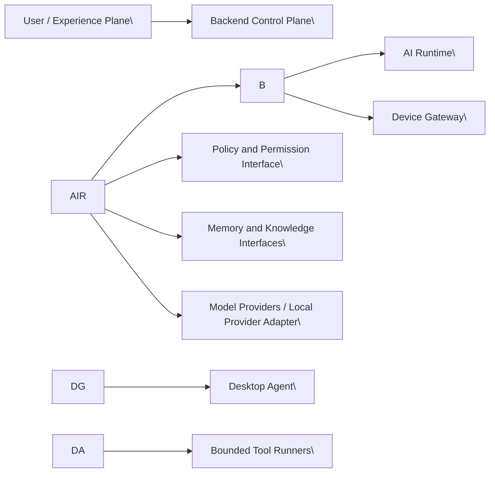
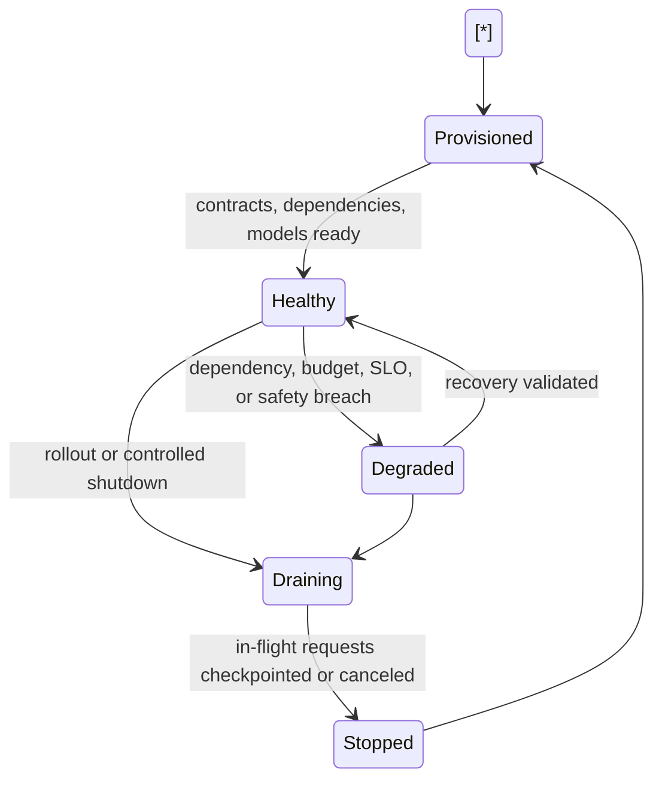
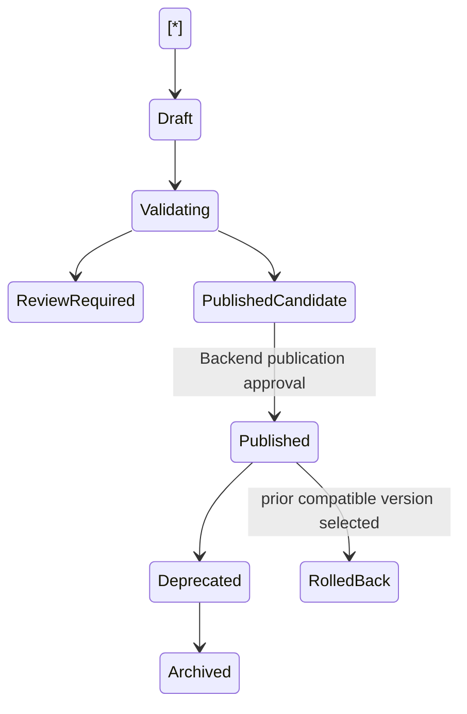
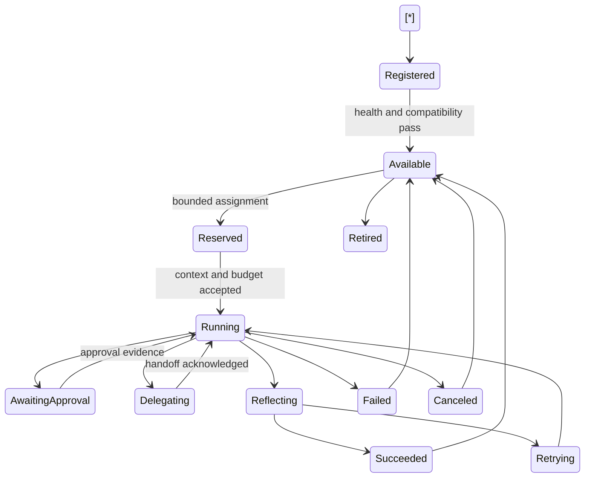
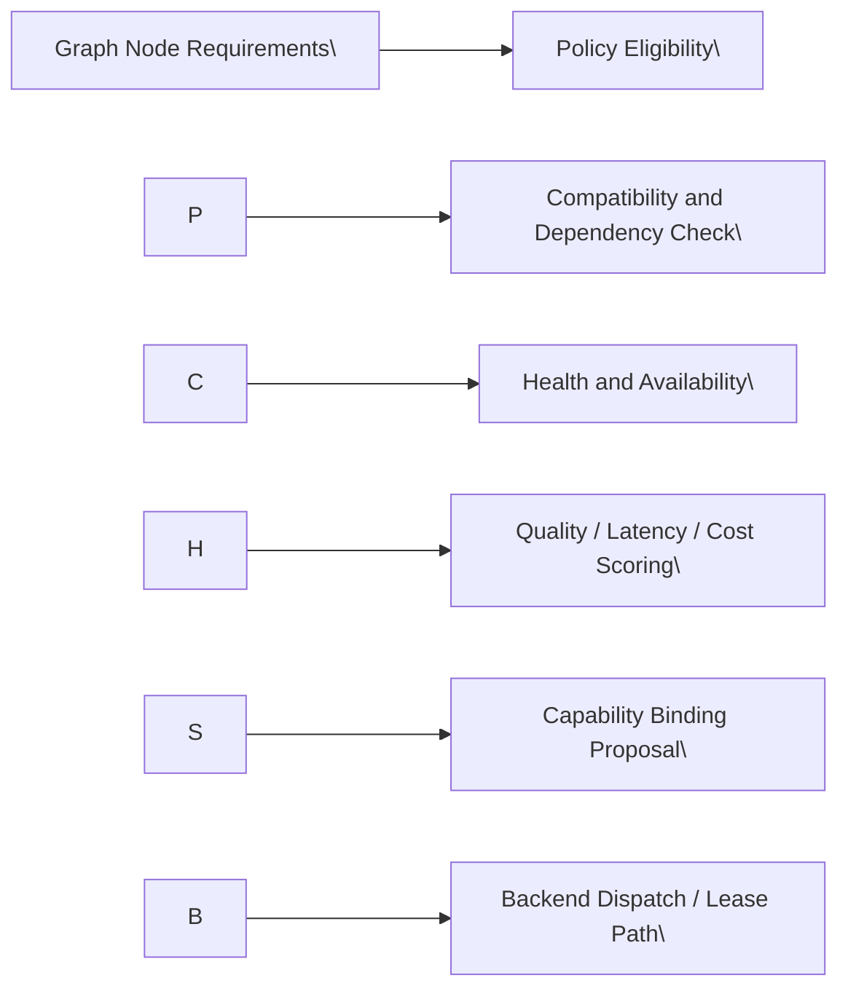
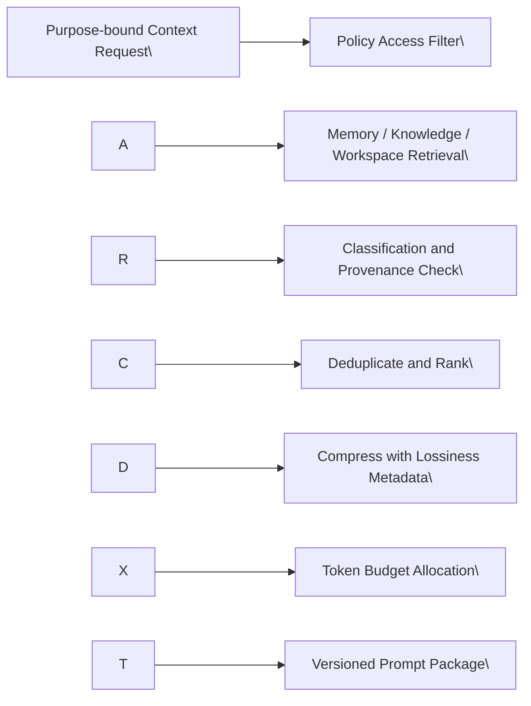
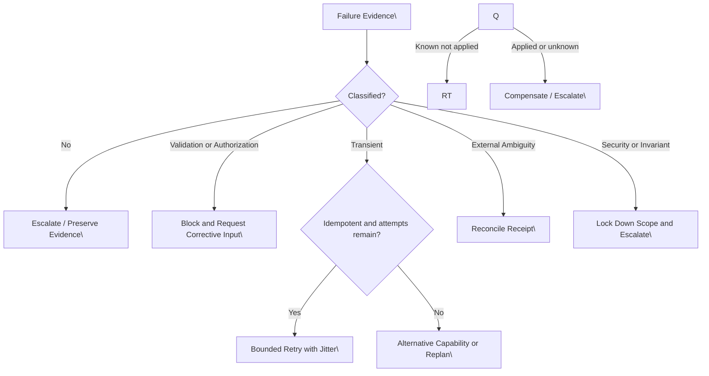

# NexusOS AI Runtime Engineering Design Document (EDD)

## Document Control

| Field | Value |
| --- | --- |
| Status | Implementation-ready engineering design |
| Scope | AI Runtime intelligence layer only |
| Authority | Inherits NexusOS Enterprise PRD v3, Architecture Bible, approved Desktop Agent EDD, and approved Backend EDD |
| Architecture changes | Prohibited; exceptions require an accepted ADR |
| Non-scope | Desktop tool execution, direct backend-state mutation, OS access, plugin execution, implementation code |

## Authority and Conformance

This EDD incorporates the authoritative NexusOS Enterprise PRD v3, Architecture Bible, Desktop Agent EDD, and Backend EDD by reference. The Architecture Bible remains normative for service ownership, event-driven integration, ACP, signed expiring leases, policy enforcement, data classification, observability, deployment, compatibility, and ADR governance.

The AI Runtime is the intelligence layer of the control plane. It owns planning, reasoning, workflow planning, execution-graph generation, agent orchestration, capability selection, context construction, model routing, reflection, recovery planning, and optimization. It MUST NOT execute desktop tools, directly access operating-system resources, execute plugins, mutate another service’s canonical datastore, bypass Desktop Agent, bypass Backend policies, or bypass the Permission Engine.

The Backend owns canonical task, approval, policy, grant, device, workflow-publication, audit, and control-plane coordination state. The Desktop Agent remains the sole local runtime-plane executor. The AI Runtime produces bounded, policy-aware decisions and requests; it does not grant authority. Any ambiguity that would alter a parent contract, trust boundary, service boundary, or invariant requires an ADR.

# 1\. AI Runtime Philosophy

## 1.1 Purpose

The AI Runtime converts an authorized objective into an evidence-driven, policy-constrained execution strategy. It reasons over minimal permitted context, produces immutable execution-graph proposals, selects eligible capabilities and models, evaluates results, and requests recovery or replanning when evidence does not satisfy the goal.

## 1.2 Responsibilities

* Analyze goals, constraints, ambiguity, risk, dependencies, and success evidence.
* Produce versioned execution-graph drafts and replan requests.
* Select policy-eligible agent roles, capabilities, workflows, and models.
* Build minimal cited prompt and context bundles.
* Forecast and reserve AI-runtime budgets through the Budget Engine contract.
* Evaluate execution evidence through reflection and critic stages.
* Generate recovery, compensation, or escalation recommendations.
* Publish decision receipts, rationale summaries, and normalized events.

## 1.3 Non-responsibilities

* Grant permissions, approve actions, or interpret model output as authority.
* Issue device-targeted leases directly; it requests dispatch through Backend contracts.
* Execute terminal, filesystem, browser, application, plugin, MCP, or OS operations.
* Persist directly into Task, Policy, Memory, Registry, Artifact, Audit, or Backend-owned stores.
* Expose secrets to models, prompts, traces, or broad events.
* Perform unbounded autonomous loops, recursive delegation, or non-reconcilable retries.

## 1.4 Architectural, trust, and execution boundaries

Model providers, retrieved external content, plugin/MCP output, browser content, workspace artifacts, and agent-produced text are untrusted inputs. Policy eligibility is a hard gate before capability binding, model invocation, context disclosure, or dispatch recommendation. The AI Runtime may recommend an approval checkpoint; only Backend policy and approval services determine whether it exists and whether it is satisfied.

## 1.5 Runtime invariants

1. Policy eligibility precedes all scoring and routing.
2. Every graph and replan is immutable, versioned, traceable, and linked to assumptions and evidence.
3. Every agent action is represented as a request for a bounded leased node; agents have no ambient tool authority.
4. Context is purpose-bound, access-filtered, minimally sufficient, cited, classified, and token-budgeted.
5. Reflection, critic, and recovery are bounded by time, token, recursion, and attempt budgets.
6. Sensitive payloads use protected references; secrets never enter prompts, model calls, events, or logs.
7. No cross-service direct datastore write is permitted.

# 2\. Runtime Architecture

## 2.1 Component architecture

```mermaid
flowchart TB
  GOAL\[Authorized Task Goal\] --> CB\[Context Builder\]
  CB --> PB\[Prompt Builder\]
  PB --> RE\[Reasoning Engine\]
  RE --> PL\[Planner\]
  PL --> EGB\[Execution Graph Builder\]
  EGB --> GV\[Graph Validator\]
  GV --> DE\[Decision Engine\]
  DE --> CE\[Capability Engine\]
  DE --> MR\[Model Router\]
  DE --> BE\[Budget Engine\]
  DE --> WE\[Workflow Engine\]
  WE --> AR\[Agent Runtime\]
  AR --> ACP\[ACP Gateway / Agent Directory\]
  AR --> EB\[Event Bus\]
  EB --> REF\[Reflection Engine\]
  REF --> CR\[Critic Engine\]
  CR --> REC\[Recovery Engine\]
  REC --> EGB
  CB --> ME\[Memory Engine Interface\]
  CB --> KE\[Knowledge Engine\]
  DE --> PI\[Policy Interface\]
  REF --> TO\[Task Optimizer\]
  MR --> PROVIDERS\[Cloud and Local Provider Adapters\]

```

## 2.2 Component responsibilities and boundaries

| Component | Responsibility | Must not own |
| --- | --- | --- |
| Planner | Goal decomposition and graph proposal | policy decisions or execution |
| Workflow Engine | Reusable workflow lifecycle and composition | task-state truth or publication authority |
| Execution Graph Builder | Immutable graph manifests and validation | lease issuance or tool calls |
| Agent Runtime | Agent lifecycle, scheduling, ACP delegation | direct tool execution or global policy |
| Capability Engine | Eligible capability matching | grants or plugin execution |
| Model Router | provider/model selection and invocation mediation | provider-specific business logic in callers |
| Budget Engine | forecast, reserve, settle AI-runtime budgets | override policy or financial truth |
| Reflection/Critic | evidence evaluation and quality gates | self-authorize remediation |
| Recovery Engine | recovery proposals and bounded retry plans | direct rollback execution |
| Memory/Knowledge | retrieval orchestration and knowledge reasoning | canonical memory ownership |
| Prompt/Context Builder | minimized structured context packages | unrestricted data aggregation |

## 2.3 Runtime lifecycle

Runtime requests have independent lifecycles: Accepted → ContextBuilding → Planning → PolicyValidationRequested → AwaitingApproval or DispatchRequested → Observing → Reflecting → Completed, Failed, Blocked, or Canceled. Canonical task transitions remain owned by Task Service.

## 2.4 Dependencies

Required: Backend orchestration contracts, Policy/Permission Engine, Memory Service, Artifact Service, Event Bus, ACP Gateway/Agent Directory, Model Router provider adapters, Benchmark Engine, Configuration Service, Secrets Vault references, and Observability platform. Optional dependencies fail to constrained behavior; absence of a compliant model, context source, capability, or budget produces a blocked outcome rather than unsafe substitution.

# 3\. Planner

## 3.1 Responsibilities

Planner transforms a goal into one or more policy-constrained graph candidates. It performs goal analysis, task decomposition, dependency analysis, risk and evidence identification, priority assignment, sequential/parallel planning, incremental planning, and adaptive replanning.

## 3.2 Internal modules

* Goal Normalizer: creates typed objective, constraints, deliverables, and ambiguity records.
* Decomposer: proposes bounded subgoals and dependency candidates.
* Dependency Analyzer: identifies data, ordering, capability, approval, and compensation dependencies.
* Plan Synthesizer: creates candidate graph manifests.
* Graph Validator: checks structural, contract, policy-input, budget, and lifecycle invariants.
* Replan Coordinator: produces successor graph versions from evidence or changed constraints.

## 3.3 Public and internal interfaces

| Interface | Input | Output | Failure behavior |
| --- | --- | --- | --- |
| PlanTask | authorized task reference, goal, constraints, context refs | graph draft, assumptions, evidence requirements | Block with ambiguity or unavailable dependency |
| ReplanTask | prior graph, observed evidence, failure class, constraints | successor graph draft and migration rationale | Preserve prior graph; escalate if unsafe |
| ValidateGraph | graph manifest and policy/budget constraints | validation report | Reject invalid graph without dispatch |
| ExplainPlan | graph reference and audience role | bounded rationale | Redact protected inputs |

Internal contracts use typed node descriptors, artifact references, correlation and causation IDs, schema versions, idempotency semantics, classification, deadline, and cancellation context.

## 3.4 Graph planning rules

Every node includes stable ID, graph version, objective, input/output contracts, capability requirements, risk tier, approval condition, timeout, retry policy, idempotency key, budget allocation, expected evidence, compensation/reconciliation strategy, and trace context. Planner cannot create a node that lacks a capable policy-governed execution target or explicit blocked fallback.

Parallel planning is permitted only when nodes have no conflicting resource or causality dependency. Sequential planning is required for state-dependent or externally non-idempotent operations. Incremental planning reserves future branches as conditional placeholders. Adaptive replanning creates a successor immutable graph version; it never edits an active version in place.

## 3.5 Failure and recovery

| Failure mode | Response |
| --- | --- |
| Ambiguous or contradictory objective | return clarification requirement or constrained alternatives |
| Missing required capability | blocked plan with capability gap |
| Policy-ineligible path | remove path; do not suggest bypass |
| Budget insufficiency | optimize, reduce scope, or request budget decision |
| Cyclic/invalid graph | reject and emit validator evidence |
| Low-confidence decomposition | request review, use critic, or produce plan-only result |

## 3.6 Performance, security, scale, and observability

Planning is latency-budgeted and uses staged retrieval, cached safe metadata, bounded candidate count, and parallel evaluation where inputs are independent. It must not cache sensitive context beyond its classification/TTL. Metrics include planning p50/p95, graph size, invalid-plan rate, replan rate, blocked reason, node fan-out, token consumption, and evidence completeness. Traces link task, graph version, model invocations, policy requests, and downstream outcomes.

## 3.7 Quality gate

Definition of Done: deterministic graph validation, policy-input enforcement, immutable version lineage, bounded replan behavior, explanation/redaction coverage, and full correlation propagation. Acceptance requires supported PRD journeys to produce valid graphs with explicit approvals, evidence, retries, and compensation declarations. Tests include unit decomposition fixtures, contract tests with Backend/Policy, graph property tests, load tests for concurrent plans, injection tests, and chaos tests for model/provider loss. Rollback criterion: invalid or unsafe graph-generation regression above threshold, any policy-bypass defect, or inability to reconstruct graph lineage.

# 4\. Workflow Engine

## 4.1 Responsibilities and lifecycle

The Workflow Engine manages reusable AI workflow definitions, templates, inheritance, composition, version compatibility, validation, optimization proposals, reuse, import/export representation, and execution-plan binding. Backend Workflow Service remains canonical owner of workflow publication, permissions, and public lifecycle.

## 4.2 Non-responsibilities

It does not directly publish, grant installation permissions, execute tools, alter task truth, or mutate workflow records outside Backend contracts.

## 4.3 Workflow contract

A workflow manifest includes ID, semantic version, parent/template references, variable schema, required capabilities, policy declarations, data classifications, approval requirements, budgets, node templates, compensation rules, compatibility range, provenance, and test evidence. Import/export uses signed, schema-versioned manifests with protected references rather than embedded secrets.

## 4.4 Composition and optimization

Composition validates variable binding, dependency versions, capability compatibility, conflicting policy declarations, and nested budget ceilings. Inheritance is declarative and acyclic; child workflows may narrow but never broaden inherited capability or approval requirements. Optimization may alter order, model selection, or reuse of validated templates only when graph semantics, policy eligibility, evidence requirements, and compensation guarantees remain equivalent.

## 4.5 Failure, extension, and quality

Invalid references, incompatible versions, missing capability, policy conflict, and circular inheritance block execution-plan generation. Extensions are registered workflow node types and templates through versioned contracts. Observability covers template adoption, validation failures, execution success, rollback use, and version skew. Quality gates require schema, compatibility, policy, security, performance, import/export, and rollback tests; workflow publication is blocked without a validated test evidence bundle.

# 5\. Execution Graph Engine

## 5.1 Graph model

The Execution Graph Engine represents versioned directed graphs. Graphs are normally DAGs. Explicit loop nodes are bounded state-machine constructs and MUST declare maximum iterations, termination condition, budget, timeout, and idempotency/reconciliation behavior.

| Node type | Semantics |
| --- | --- |
| Action | Bounded capability invocation request |
| Decision | Policy-constrained branch selected from typed evidence |
| Condition | Deterministic predicate over approved inputs |
| Parallel fork/join | Independent branches and explicit synchronization |
| Loop | Bounded repeated subgraph |
| Retry | Classified retry wrapper with backoff and limit |
| Timeout | Deadline and timeout outcome path |
| Compensation | Reversal or mitigation request |
| Approval | Backend-owned approval checkpoint |
| Checkpoint | Snapshot/evidence persistence boundary |
| Delegation | ACP-governed agent handoff |
| Terminal | Completed, failed, blocked, or canceled outcome |

Edges are dependency, conditional, success, failure, timeout, cancellation, compensation, and synchronization edges. All edges have stable IDs and optional guard schemas.

## 5.2 State transitions

| State | Allowed transitions | Notes |
| --- | --- | --- |
| Proposed | Validated, Rejected | AI Runtime draft only |
| Validated | DispatchRequested, Superseded | Backend/policy compatibility confirmed |
| DispatchRequested | Active, Blocked, Canceled | Backend owns dispatch result |
| Active | AwaitingApproval, Reflecting, Recovering, Terminal | node outcomes arrive as evidence |
| Recovering | Active, Blocked, Failed | successor graph may be required |
| Terminal | Superseded only | immutable historical record |

## 5.3 Validation and optimization

Validation checks graph schema, cycles, node/edge reachability, unique ownership, capability compatibility, approval placement, budget allocation, timeouts, retry safety, compensation declarations, output typing, policy-required constraints, and version compatibility. Optimization is semantics-preserving and produces a new candidate graph version with a diff and proof obligations.

## 5.4 Failure and recovery

Graph corruption, impossible transition, missing predecessor evidence, or inconsistent aggregate version is an invariant violation and blocks dispatch. Unknown external mutation state routes to reconciliation; it must never trigger a generic retry. Graph changes caused by human override are accepted only through Backend’s immutable graph-version contract.

## 5.5 Quality gate

Required: graph property tests, invalid-state rejection, loop/recursion limit tests, concurrency and join tests, compensation tests, graph-version compatibility tests, event replay tests, and policy/approval placement tests. Roll back on incorrect dependency execution, skipped approval, non-terminating loop, or inability to render a complete graph/evidence lineage.

# 6\. Agent Runtime

## 6.1 Responsibilities

Agent Runtime manages logical AI agents: registry/discovery integration, capability negotiation, spawning, retirement, supervision, scheduling, prioritization, communication, delegation, negotiation, failure recovery, and evidence collection. A logical agent is not a desktop process and has no direct tool authority.

### 6.7 Dynamic Multi-Agent Composition

The Agent Runtime supports additive dynamic multi-agent composition as a bounded facility for creating temporary specialist-teams to execute complex, partitionable subgoals. This capability is advisory and orchestrator-coordinated: it creates transient logical team constructs without granting ambient tool authority or becoming a canonical owner of delegated state.

Responsibilities: temporary specialist-team creation, explicit role assignment, capability matching, topology selection (hierarchical, peer, coordinator-supervisor), bounded delegation depth, automatic retirement, compatible agent merging, cost-aware team-sizing, concurrency limits, parallel-execution optimization, conflict detection, and orchestrator-mediated resolution. Teams include coordinator and supervisor agents that propagate attenuated ACP references for task steps where needed and trace responsibility through decision receipts.

Non-responsibilities / MUST NOT: bypass ACP, Policy, Budget, Backend ownership, or grant direct tool authority. Team composition cannot expand capability scopes beyond policy eligibility. Automatic retirement and expiry are enforced; no permanent cross-tenant agent state is created.

Interfaces & outputs: emits topology/assignment decision receipts with team ID, member roles, capability bindings, budget reservations, expected lifespan, trace/context references, and failure behavior expectations. Receipts include provenance for audit, budget, and rollback. Failure behavior: on coordinator failure the orchestrator reassigns, falls back to predefined delegation alternatives, or escalates per policy. Tests: bounded delegation depth tests, cost/size scaling tests, conflict resolution scenarios, coordinator failover, policy-hard-gate enforcement, trace continuity, and retirement/garbage-collection verification.

## 6.2 Agent lifecycle

## 6.3 Agent registry and scheduling

Registry records role, version, supported schemas, required model capabilities, context limits, reliability profile, cost profile, data-handling eligibility, concurrency limits, health, and deprecation state. Scheduling uses policy eligibility as a hard filter, then priority, deadline, affinity, fairness, availability, quality profile, and budget. Per-tenant, workspace, task, and agent concurrency limits prevent starvation and recursive swarm growth.

## 6.4 Delegation and negotiation

Delegation creates ACP messages containing attenuated task/step authority reference, input artifact references, expected output, deadline, budget, trace context, and idempotency key. Delegated agents may propose alternatives but cannot expand scope. Negotiation is a bounded structured exchange used for compatible capability selection or plan alternatives; it has fixed rounds, token budget, and an orchestrator-selected terminal decision.

## 6.5 Failure recovery and security

Agent failures classify as validation, authorization, transient infrastructure, provider capacity, external ambiguity, security, or invariant violation. Recovery selects retry, fallback agent, model fallback, replan, or escalation only through graph and policy contracts. Agents receive minimal context and opaque protected references. They cannot call tools, read arbitrary memory, resolve secrets, or publish authoritative task changes.

## 6.6 Quality gate

Acceptance requires agent registration/version negotiation, fair scheduling, bounded spawning, delegated authority attenuation, cancellation propagation, crash/retry recovery, and complete ACP traceability. Required tests: lifecycle unit tests, registry contracts, scheduler fairness/performance tests, malicious-delegation security tests, partition/duplicate-message chaos tests, and agent retirement compatibility tests.

# 7\. Agent Communication

## 7.1 ACP use

ACP is the canonical inter-agent and agent-to-orchestrator protocol defined by the PRD and Architecture Bible. AI Runtime uses ACP through the ACP Gateway and schema registry; it does not create a parallel agent transport.

## 7.2 Message contract

| Message type | Required body semantics |
| --- | --- |
| Request / Reply | typed operation, idempotency key, deadline, result/error |
| Broadcast | non-authoritative state notice; recipients are explicit |
| Delegation / Handoff | bounded assignment and attenuated authority reference |
| Negotiation | proposal, constraints, round number, terminal decision rule |
| Heartbeat | liveness, load, capability version, health summary |
| Progress | monotonic progress, evidence refs, estimated completion |
| Cancellation | signed cancellation reference and acknowledgement |
| Discovery | capability/schema advertisement |
| Failure | canonical error class, retryability, evidence, remediation |
| Context sharing | minimal cited context references and access scope |
| Synchronization | checksum, aggregate version, reconciliation request |

Every envelope includes version, message ID, correlation ID, optional causation ID, sender/recipient identity, timestamp, policy snapshot hash or authority reference, schema ID, classification, trace hints, delivery class, timeout, and body or protected body reference.

## 7.3 Delivery and shared memory

Commands are at-least-once with idempotent consumers; telemetry may be at-most-once only when explicitly classified. Ordered channels use a single-writer aggregate key. Shared memory is not a writable global prompt: agents exchange scoped Memory Service references and immutable context bundles. Conflicts are resolved by authoritative single-writer state, merge functions for explicitly mergeable drafts, or orchestrator-mediated reconciliation.

## 7.4 Backpressure and failure

ACP enforces in-flight windows, payload caps, deadlines, cancellation, retry bounds, DLQ routing, and circuit breaking. Invalid schema, missing authority, stale policy, duplicate non-idempotent message, or secret-bearing payload is rejected and audited. Required tests cover compatibility, ordering, replay, flow control, malformed messages, cross-tenant leakage, and reconnect reconciliation.

# 8\. Capability Engine

## 8.1 Responsibilities

Capability Engine discovers and scores registered capabilities supplied by Desktop Agent, Plugin Registry, workflow library, cloud runners, and model adapters through their established contracts. It evaluates compatibility, dependencies, permissions, versioning, reliability, risk, and lifecycle eligibility.

## 8.2 Capability contract

A capability declaration contains ID/version, provider identity, supported action schemas, input/output schemas, execution boundary, required grants, data classes, risk tier, dependencies, operating constraints, offline eligibility, timeout/retry semantics, evidence contract, sandbox tier where applicable, and deprecation metadata.

## 8.3 Selection flow

Policy and permission eligibility are hard filters. Capability scoring weighs contract fit, benchmark reliability, observed success, latency, cost, locality, user/admin preference, and recovery alternatives. It cannot infer a missing grant.

## 8.4 Evolution and quality

Capabilities evolve additively with semantic versioning, compatibility negotiation, deprecation windows, and conformance suites. Failure modes include stale registry state, dependency incompatibility, unavailable executor, schema mismatch, policy denial, and health degradation. Observability records selection rationale and outcome quality. Tests include registry contracts, version skew, capability spoofing, dependency resolution, selection determinism, load, and policy-denial tests.

# 9\. Model Router

## 9.1 Responsibilities

Model Router receives typed requests and selects/invokes a policy-eligible cloud or local provider adapter. It supports provider adapters, registry, capability/latency/cost/benchmark/health scoring, offline routing, fallback, adaptive routing, multi-model execution, consensus, and voting.

## 9.2 Request and response contract

| Field | Request requirement |
| --- | --- |
| Identity | task/step, tenant/workspace, caller, correlation/causation |
| Work | task class, required modalities/tools, output schema, quality threshold |
| Governance | classification, permitted providers, residency, retention, local/offline rules |
| Resources | latency objective, token budget, cost ceiling, deadline, retry/fallback policy |
| Context | prompt/context references, token allocation, redaction status |

Response contains model/provider/version, routing decision receipt, token/cost usage, latency, output or protected output reference, safety/validation metadata, fallback history, and error classification.

## 9.3 Routing algorithm

1. Apply policy, residency, data-class, provider allowlist, and model lifecycle hard filters.
2. Validate requested capability, context capacity, output schema, and local hardware admission.
3. Reserve budget.
4. Score candidates using benchmark quality, tool-use reliability, observed health, latency, estimated cost, availability, user/admin preference, and locality.
5. Select primary and compatible fallback chain.
6. Invoke through adapter with streaming and cancellation.
7. Validate result contract, meter usage, publish health/quality signals, and settle budget.

### 9.7 Multi-Model Collaboration

The Model Router supports an additive Multi-Model Collaboration capability for coordinated multi-model execution patterns (research, reasoning, coding, vision, reviewer, local, cloud, planner, critic roles). Collaboration is policy-eligible only when each participating model/provider meets residency, classification, budget, and eligibility constraints; collaboration never converts consensus into authority.

Responsibilities: role assignment (e.g., planner, critic, reviewer, coder, vision), independent execution management, voting/consensus frameworks with explicit quorum/tie-break/human-escalation, cross-validation and evidence comparison, disagreement handling strategies, fallback coordination between primary and auxiliary models, cost/latency-aware orchestration, offline-first routing where applicable, provenance capture, and operational limits (max parallel models, cost ceiling, latency ceiling, and token budget).

Hard constraints: policy eligibility, residency restrictions, data classification, budget ceilings, output schema compatibility, provenance requirements, explicit quorum/tie-break rules, and model-diversity/isolation requirements. These are enforced before collaboration is permitted. Collaboration outputs include collaboration receipts documenting participant models, votes/scores, normalized rubric, quorum/tie-break outcome, provenance, and confidence.

Failure behavior & safety: disagreement that fails quorum results in human escalation or fallback to single-model safe path per graph node specification. Collaboration does not authorize actions; it emits structured findings to reflection/critic and Decision Assurance Layer paths. Tests: consensus correctness fixtures, quorum/tie-break behavior, disagreement escalation flows, cost/latency optimization tests, isolation and prompt-injection resilience, and provenance completeness checks.

## 9.4 Multi-model execution

Consensus is reserved for high-value, bounded decisions. It requires an explicit graph node, independent model executions, normalized rubric, quorum, tie-breaking model or human escalation, token/time ceiling, and result provenance. Voting never converts multiple unsafe outputs into authority.

## 9.5 Failure, security, and scale

Provider timeout, rate limit, invalid stream, schema failure, safety refusal, model drift, local OOM, or unavailable compliant fallback returns a typed failure. Restricted data is never routed to an ineligible fallback. Providers receive minimized prompts and no secrets. Adapter bulkheads, per-provider queues, circuit breakers, caching of safe deterministic results, and streaming backpressure protect latency and cost. Observability includes route selection, fallback, latency, tokens, cost, quality feedback, and provider health.

## 9.6 Quality gate

Required: adapter conformance, policy-routing tests, provider outage chaos tests, streaming/cancellation tests, benchmark freshness tests, local-offline admission tests, cost ceiling tests, consensus divergence tests, and data-egress security tests. Rollback criteria include routing restricted data incorrectly, unbounded fallback spending, or output-contract regression.

# 10\. Prompt and Context Builder

## 10.6 Context Continuity Engine

The Context Continuity Engine (CCE) provides controlled support for long-running tasks and cross-session continuity: checkpoints, snapshots, replay, reconstruction, inheritance, cross-session/workspace/conversation/execution continuity, compatibility tracking, compression metadata and lossiness tracking, provenance preservation, expiration, and migration lifecycle. It is explicitly non-canonical: it stores or accesses only references through Memory, Artifact, Backend, and Snapshot owning contracts and does not weaken access filtering, classification, purpose limitation, or TTL.

Responsibilities: create and index context checkpoints and snapshot references at declared graph checkpoints; produce replayable checkpoint packages with provenance, compression/lossiness metadata, and required replay inputs; support reconstruction and inheritance semantics across continuations; emit checkpoint restoration requests and explicit provenance chains to Memory/Artifact/Backend owning services; manage expiration and revocation propagation by delegating deletion/retention requests to canonical owners; and provide compatibility/access checks before any restoration.

Non-responsibilities / MUST NOT: become canonical owner of memory or artifacts; bypass Memory/Backend/Policy/Artifact ownership; or relax classification and access controls. The CCE only references protected artifacts and requires policy-eligibility before reconstruction.

Interfaces & lifecycle: checkpoint-create → reference-store (owned by canonical services) → checkpoint-index (CCE-derived reference) → restore-request → canonical-owner restoration/verification → emit restoration receipt. Checkpoint packages include compression metadata, lossiness estimates, provenance, classification, and required approval gates for cross-workspace restoration.

Failure & security: incompatible checkpoint or revoked reference returns a typed failure and requires reconciliation through Backend contracts. Checkpoint restoration is permission-gated and audited. Tests: cross-session replay, snapshot compatibility, revocation propagation, lossiness tracking, provenance fidelity, and restore authorization enforcement.

## 10.1 Responsibilities

Prompt Builder composes versioned templates, system constraints, typed task instructions, response schemas, tool/capability descriptions, and evaluation rubrics. Context Builder retrieves, classifies, compresses, ranks, cites, and token-budgets task, memory, knowledge, workspace, artifact, and execution evidence.

## 10.2 Context pipeline

## 10.3 Context rules

Context is separated into policy instructions, user objective, trusted task evidence, cited workspace data, and untrusted external content. Untrusted content cannot alter policies, tool schemas, approvals, or task scope. Compression preserves source references, claim confidence, timestamp, labels, and lossiness class. Prompt versions are immutable and record model compatibility, intended role, and evaluation suite.

## 10.4 Failure and security

Missing retrieval permissions, stale source, excessive token demand, conflicting source claims, suspected prompt injection, unknown classification, or unvalidated template blocks or reduces context. The builder prefers omission plus a stated gap over unauthorized disclosure. It strips secrets and blocks prompt fields that match protected secret patterns. Caching is scope-, purpose-, version-, and TTL-bound.

## 10.5 Quality gate

Tests cover access filtering before retrieval output, provenance preservation, injection fixtures, context isolation, token allocation, compression faithfulness, template compatibility, deterministic redaction, and large-workspace performance. Acceptance requires explainable citations for material context and no unauthorized context crossover.

# 11\. Reflection Engine

## 11.1 Responsibilities

Reflection evaluates whether observed evidence satisfies node and task success criteria. It performs self-evaluation, execution review, evidence validation, hallucination detection, goal verification, plan refinement recommendation, replanning request, and quality scoring.

## 11.2 Lifecycle

EvidenceReceived → Normalized → Validated → ComparedToExpected → Pass, FindingsGenerated, ReplanRequested, Escalated, or Blocked. Reflection is invoked at declared graph checkpoints and terminal states; it cannot recursively invoke itself without a bounded graph-controlled loop.

## 11.3 Evaluation contract

Input: graph/node expectations, evidence references, source provenance, policy constraints, rubric version, budget, and prior findings. Output: pass/fail/inconclusive result, confidence, missing evidence, contradiction list, quality score, recommended action, and protected rationale reference.

## 11.4 Failure and recovery

Inconclusive evidence triggers bounded additional observation, critic review, user clarification, or safe failure. Hallucination indicators include unsupported claims, citation mismatch, schema inconsistency, output/evidence divergence, and unexpected scope expansion. Reflection cannot authorize tool action; it requests graph successor or recovery planning.

## 11.5 Quality gate

Required tests include known-answer evidence suites, adversarial unsupported-claim fixtures, calibration tests, replan-loop limits, latency/cost benchmarks, and policy-isolation tests. Rollback if reflection can mark unsupported consequential output as verified above agreed threshold.

# 12\. Critic Engine

## 12.4 Decision Assurance Layer

The Decision Assurance Layer (DAL) is an additive assurance plane that strengthens Reflection and Critic roles via independent validation, cross-model verification, deterministic validators, confidence thresholds, evidence-sufficiency scoring, contradiction detection, uncertainty estimation, approval recommendations, human and safety escalation thresholds, risk classification, and high-impact-decision safeguards. It augments but does not replace Reflection or Critic and has no authority to approve, grant permissions, or dispatch.

Responsibilities: perform independent deterministic checks (schema, guardrail, invariant), invoke cross-model verification or deterministic validators, produce structured assurance findings with risk score, evidence sufficiency, contradiction lists, uncertainty estimates, recommended approval thresholds, and escalation guidance. DAL emits findings to graph records, Backend policy/approval pathways, audit, and recovery systems.

Non-responsibilities / MUST NOT: make canonical approval decisions, mutate Backend-owned state, or bypass policy. DAL findings are advisory and may include explicit recommended actions (e.g., require human approval, escalate, block dispatch) but authoritative enforcement remains with Policy/Backend owners.

Fail-safe behavior: inconclusive or conflicting DAL results produce a structured inconclusive finding and default to safety—require human/safety escalation or block progression per risk tier. DAL supports calibration suites, deterministic validator unit tests, cross-model validation fixtures, and regression tests. Observability: metrics for assurance pass/fail, false-positive/negative rates, calibration drift, and time-to-escalation. Quality gates: DAL candidates require traceable evidence, deterministic replay tests, and approval-flow verification before being used in automated gating.

## 12.1 Responsibilities

Critic Engine independently validates plan and output quality, policy alignment, safety, logic, consistency, evidence sufficiency, and approval recommendation. It is a quality-control role, not a policy authority.

## 12.2 Interfaces

PlanCritique, OutputCritique, PolicyCompatibilityReview, SafetyReview, ConsistencyReview, and ApprovalRecommendation accept versioned protected references and return structured findings with severity, confidence, evidence citations, remediation options, and escalation guidance.

## 12.3 Failure and quality

Critical findings block onward graph recommendation pending Backend policy/action. Noncritical findings may create remediation candidates. Critic model/provider isolation avoids reusing the same failure mode where practical and policy-compatible. Tests cover false-positive/false-negative calibration, conflicting critics, prompt injection, redaction, latency, and fail-safe behavior.

# 13\. Recovery Engine

## 13.1 Responsibilities

Recovery Engine analyzes failure evidence and produces a graph-compatible recovery plan. It supports retry strategy, reconciliation, rollback request, compensation request, checkpoint restoration request, alternative capability/model selection, and escalation.

## 13.2 Decision tree

## 13.3 Recovery rules

No retry of a non-idempotent external mutation occurs before reconciliation. Recovery retains prior evidence, graph lineage, policy constraints, and budgets. Compensation and snapshot restoration are requests to the owning Backend/Desktop/Snapshot contracts; AI Runtime does not perform them. Alternative execution must meet the original output/evidence contract and remain policy-eligible.

## 13.5 Learning & Adaptation Engine

The Learning & Adaptation Engine (LAE) consumes execution evidence and produces operational recommendations, calibrations, and non-authoritative proposals to improve decision quality, selection, and operational effectiveness. It is explicitly execution-evidence learning only; it MUST NOT perform foundation-model training, dataset ingestion for model training, or act as a canonical training platform.

Responsibilities: feedback collection from decision receipts, model/capability/agent/workflow execution outcomes, reflection and critic findings, recovery traces, and observability signals; success/failure analysis and scoring across workflow, prompt, capability, model, reflection/critic calibration, recovery effectiveness, agent performance, and decision-quality metrics; historical execution analytics and trend detection; continuous benchmark update proposals for Benchmark Engine; generation of ranked recommendations for workflow/template updates, prompt tuning candidates, capability selection guidance, model/router parameter suggestions, critic/reflection calibration proposals, agent-scheduling heuristics, and recovery strategy improvements; shadow evaluation orchestration and A/B analysis hooks; bad-optimization detection and rollback proposals; approval gate integration; and human-in-the-loop feedback pathways for acceptance and refinement.

Non-responsibilities / MUST NOT: own canonical policy, workflow, model, capability, Benchmark Engine truth, or Backend configuration; directly apply changes to model providers, workflows, or capabilities; bypass Backend, Policy, Budget, ACP, Audit, Artifact, or Memory ownership boundaries. All changes are proposals only and are submitted through existing Backend, Workflow, Model Router, Capability Engine, Benchmark Engine, Policy, Budget, Audit, and configuration contracts for authoritative application.

Interfaces & data contracts: consumes decision receipts, execution traces, reflection/critic findings, budget/settlement records, provider/model telemetry, capability selection rationale, and audit logs; emits recommendation artifacts with provenance, confidence, effect-size estimates, safety classification, rollback plan, test sample signatures (shadow execution inputs/outputs), and explicit approval requirements. Recommendation artifacts include required audit and test metadata to be consumed by Backend or owning services.

Lifecycle & flow: collect → normalize & classify → analyze & score → generate candidate recommendations → shadow-evaluate (when applicable) → emit recommendation with governance metadata → await Backend/workflow/policy approval → monitor promoted change impact and provide automatic rollback proposal when negative regression detected.

Failure & safety behavior: recommendations flagged as high-risk require human approval and safety gating before any promotion. Bad-optimization detection triggers an immediate promotion rollback recommendation and a safety alert. Shadow evaluations are isolated and cost-accounted; they never alter production behavior. All LAE outputs carry immutable lineage and evidence references.

Security & data handling: consumes only redacted/protected references for sensitive artifacts; never materializes secrets in prompts or artifacts; follows classification, residency, and TTL rules. Observability: emits LAE metrics—recommendation count, promotion rate, shadow-eval pass/fail, rollback count, precision/recall of suggested improvements, and calibration drift.

Quality gates & tests: require benchmarked shadow evaluations, deterministic replay fixtures, safety/regression tests, approval-flow tests, rollback/kill-switch tests, and audit trail completeness. Acceptance requires demonstrable non-degradation of safety, policy compliance, and decision/evidence lineage preservation.

## 13.4 Quality gate

Acceptance requires canonical failure classification, bounded retry, receipt reconciliation, compensation routing, checkpoint compatibility, and explicit irreversible outcomes. Tests include provider failures, duplicate events, timeout ambiguity, device disconnect, corrupt evidence, policy revocation, and chaos partitions.

# 14\. Memory Integration

## 14.4 AI Runtime Knowledge Graph (ARKG)

The AI Runtime Knowledge Graph (ARKG) is a derived, non-canonical, access-filtered graph representing relationships among tasks, goals, capabilities, agents, models, workflows, evidence, failures, recoveries, knowledge, and policy artifacts. ARKG is a read-optimized analytic view that supports relationship discovery, dependency analysis, impact analysis, failure tracing, optimization opportunity identification, historical reasoning, and explainability.

Scope & guarantees: ARKG derives its data from authoritative event and reference sources (decision receipts, audit events, Memory/Artifact references, Backend contract events, and registry updates). It preserves provenance, confidence, time/version metadata, and tenant/workspace isolation. ARKG MUST NOT become a source of authority or bypass Memory, Backend, Policy, Artifact, Registry, or Audit ownership. Deletion and revocation propagate from canonical owners; rebuilding is possible from authoritative event histories.

Responsibilities: entity/relation extraction, dependency and impact analysis, failure-path tracing, optimization suggestion ranking with confidence and provenance, explainability artifacts (relation paths, evidence refs), and rebuild/reconciliation tools to derive graph state from event streams. ARKG provides access controls aligned with tenant/workspace classification and enforces provenance and confidence thresholds for surfaced relationships.

Interfaces & outputs: query API for analytic consumers, relationship-change events, impact reports, and diagnostic artifacts. Outputs reference canonical artifacts and include confidence, source traces, and versioning. Security: respects classification, residency, and access filters; does not store secrets. Tests: rebuild-from-events, deletion/revocation propagation, tenant isolation, provenance fidelity, and analytic correctness benchmarks.

## 14.1 Scope

AI Runtime consumes Memory Service through access-aware retrieval and ingestion-proposal contracts. Memory Service remains canonical owner of working, task, conversation, knowledge, workspace, semantic, and artifact-backed memory records.

## 14.2 Memory use model

| Memory class | Runtime use | Isolation |
| --- | --- | --- |
| Working memory | ephemeral plan/step state | task-bound, TTL-bound |
| Task memory | task decisions and summaries | task/workspace scoped |
| Conversation memory | supervision continuity | conversation and policy scoped |
| Knowledge memory | facts and relationships | provenance/confidence required |
| Workspace memory | shared project context | membership/classification filtered |

Semantic retrieval combines policy eligibility, lexical and vector relevance, graph proximity, authority, confidence, recency, task affinity, and duplication penalties. Memory scoring is explainable in decision receipts. The runtime proposes memory writes with source, classification, confidence, retention, and consent metadata; it does not silently persist sensitive or low-confidence memory.

## 14.3 Security and failure

Policy filter occurs before retrieval output. Deleted/revoked memory is excluded immediately. Unavailable, stale, conflicting, or insufficient memory produces a context gap, not speculative substitution. Tests include tenant/workspace isolation, deletion propagation, retrieval ranking, memory poisoning, prompt injection in artifacts, and export controls.

# 15\. Budget Engine

## 15.1 Responsibilities

Budget Engine forecasts, reserves, tracks, and settles token, provider, workspace, execution, and user-level AI-runtime budgets. It integrates with Backend cost controls without redefining Backend-owned billing truth.

## 15.2 Budget contract

A budget request includes task/graph/node, tenant/workspace/user, budget class, predicted tokens/latency/cost, maximum ceiling, priority, model/capability candidates, reservation TTL, and settlement correlation. A decision returns granted, reduced, deferred, denied, or approval-required status plus limits and reason code.

## 15.3 Forecasting and optimization

Forecasts use template size, context estimate, model profile, historical bounded aggregates, graph fan-out, consensus count, retry allowances, and provider price metadata. Optimization can compress context, choose an eligible lower-cost model, cache safe deterministic intermediate results, reduce parallel candidates, or request user scope reduction. It cannot silently lower required quality or route to an ineligible provider.

## 15.4 Failure, scale, and quality

Reservation expiry, concurrent overspend, stale pricing, metering delay, and budget-service outage fail conservatively: pause or use explicitly allowed local safe budget. Budget decisions are idempotent and auditable. Tests include concurrency, reservation settlement, partial stream cancellation, provider fallback cost, tenant isolation, and exhaustion behavior. Rollback on budget leakage, negative settlement inconsistency, or unbounded execution after denial.

# 16\. AI Workflow Engine

AI Workflow Engine is the runtime execution-planning surface for reusable workflows. It resolves validated workflow templates into task-specific graph candidates, schedules AI reasoning stages, reuses approved components, and publishes workflow execution plans through Backend contracts.

It supports workflow libraries, template parameters, composition, scheduling hints, sharing references, optimization candidates, and version negotiation. It does not publish workflows, grant access, or execute tool nodes. Workflow scheduling is advisory to Backend Scheduler and respects tenant fairness, policy, deadlines, dependencies, and budget reservations.

Quality requirements: deterministic template expansion, immutable workflow/graph linkage, variable validation, compatible rollback to prior versions, no cross-workspace context leakage, and complete performance/security/contract tests.

# 17\. AI Runtime Contracts

All contracts are schema-versioned, additive by default, idempotent where retried, trace-propagated, tenant scoped, classification aware, and compatible with Architecture Bible ACP/Event standards. Sensitive content is referenced through protected artifact/context references.

| Counterparty | Core operations | Input | Output | Timeout/retry/streaming |
| --- | --- | --- | --- | --- |
| Note: Component responsibility tables, runtime lifecycle references, observability metrics, test matrix entries, release acceptance criteria, and Future Evolution cross-references have been additively extended to reference the Learning & Adaptation Engine, Dynamic Multi-Agent Composition, Multi-Model Collaboration, Context Continuity Engine, Decision Assurance Layer, AI Runtime Knowledge Graph, and Self-Optimization Governance where applicable for decision receipts, lineage, safety, evaluation, governance, rollback, and audit needs. Each new subsystem integrates through existing Backend, Policy, Budget, Workflow, Memory, Artifact, Model Router, Capability Engine, Benchmark Engine, ACP, and Audit contracts without altering existing ownerships or removing prior content; details are included in the respective sections and interfaces above. Backend | planning, dispatch recommendation, replan, task observation, budget settlement | authorized goal, constraints, policy/budget refs, evidence refs | graph/reflection/recovery decision receipts | bounded deadlines; idempotent commands; streams progress/events |
| Desktop Agent | no direct tool control; capability/device evidence via Backend/ACP | leased-node capability/evidence references only | capability inventory, execution receipts, health | ACP ordered channels; retries only for idempotent messages |
| Memory Service | retrieve, cite, propose memory | actor/task/purpose/scopes/query | minimal context bundle, write proposal result | bounded query; cursor/stream allowed; no retry on ambiguous write |
| Plugin Runtime/Registry | capability discovery and compatibility only | capability requirements, policy selectors | eligible manifest/capability descriptors | no plugin execution; cached metadata with invalidation |
| Event Bus | publish facts, consume subscribed facts | canonical event envelope | ACK/DLQ outcome | at-least-once; idempotent consumers; no secrets |
| Model Providers | typed invocation through adapter | model request, minimized prompt package | stream/output, usage, health | provider deadlines, cancellation, safe transient fallback |
| Policy Interface | eligibility and validation request | subject, action class, resource/capability, context refs | permit/deny/approval requirement and snapshot ref | low-latency; no stale allow |
| Knowledge/Artifact | evidence and knowledge retrieval | protected refs and purpose | cited bounded material | paged/streamed; access filter first |

### Standard errors

`VALIDATION_FAILED`, `AUTHORIZATION_DENIED`, `POLICY_STALE`, `BUDGET_EXHAUSTED`, `DEPENDENCY_UNAVAILABLE`, `PROVIDER_CAPACITY`, `TRANSIENT_INFRASTRUCTURE`, `EXTERNAL_AMBIGUITY`, `SECURITY_VIOLATION`, `INVARIANT_VIOLATION`, `CANCELED`, and `DEADLINE_EXCEEDED` include stable code, retryability, correlation ID, safe remediation, and evidence reference.

# 18\. Security

## 18.1 Prompt injection resistance

External content is labeled untrusted and structurally separated from system constraints, task goals, policy, and tool contracts. Injection heuristics, provenance, schema validation, critic review, capability allowlists, and approval gates operate outside model text. The Runtime treats instructions found in documents, websites, emails, tool results, or model output as data unless explicitly transformed by a policy-approved workflow.

## 18.2 Isolation

Context isolation is enforced by tenant, organization, workspace, actor, task, purpose, classification, and retention. Model isolation uses provider allowlists, residency restrictions, minimized prompts, adapter bulkheads, and no cross-request hidden state. Memory isolation applies access filters before retrieval results. Agent isolation uses separate logical identities, bounded context, budgets, and no ambient authority.

## 18.3 Policy and tool restrictions

Every proposed capability is policy checked before dispatch. AI Runtime never sends raw executable instructions to Desktop Agent; it emits typed graph-node requirements through Backend contracts. Tool restrictions are enforced by Policy Engine and Desktop Agent execution-time checks. Secret protection uses opaque references, vault leases only at approved execution boundaries, redaction, and scanning.

## 18.4 Security validation

Security testing includes prompt injection corpus regression, cross-tenant/context leakage, model-provider egress, secret discovery/redaction, malicious ACP messages, compromised capability registry data, denial-of-service loops, unsafe fallback, and audit completeness. Any bypass of policy, context boundary, or secret control is a release blocker.

# 19\. Performance

## 19.1 Targets and strategy

| Area | Initial design target |
| --- | --- |
| Initial standard plan response | p95 under 8 seconds excluding provider delay |
| Policy/capability decision contribution | bounded low-latency parallel calls |
| Context construction | progressive retrieval with partial result deadlines |
| Model routing overhead | insignificant relative to provider invocation; measured separately |
| Reflection | bounded by node risk tier and explicit token/time budget |

Strategies: staged context retrieval; token budgets; semantic cache only for policy-safe deterministic artifacts; concurrent independent planning/routing calls; queue-based scheduling; per-provider and per-tenant bulkheads; model streaming; bounded fan-out; and backpressure at all queues. Memory use is controlled with immutable references, TTL caches, result limits, compression, and eviction. Optimization never trades away a mandatory safety, quality, or evidence requirement.

## 19.2 Scalability

Planner and agent workers scale by task/workflow partitions; context/query workers independently by retrieval load; router workers by provider queue; reflection/critic pools by risk tier; evaluation batches separately from live traffic. The runtime uses tenant-aware fairness, queue age, concurrency ceilings, circuit breakers, DLQs, replay-safe consumers, and autoscaling signals including queue lag, p95 latency, saturation, error rate, and cost guardrails.

# 20\. Observability

## 20.1 Required telemetry

Every decision and agent request emits structured, redacted logs, metrics, traces, and domain events. A task correlation ID propagates through task, graph version/node, context bundle, model request, capability binding, policy decision, ACP message, lease reference, tool evidence, reflection, recovery, budget record, and audit event.

## 20.2 Decision logs

Decision records include input references, policy snapshot reference, eligible/excluded candidates and reason codes, selected strategy, budget decision, model/capability rationale, confidence, assumptions, and outcome links. They must be explainable to authorized users while protecting sensitive content and internal security controls.

## 20.3 Metrics and dashboards

* Planning: latency, validity, graph size, replan rate, blocked reasons.
* Agents: availability, queue age, delegation depth, failure/retry rate, utilization.
* Models: route distribution, provider health, latency, tokens, cost, fallback, quality feedback.
* Context/memory: retrieval latency, token compression, citation coverage, access denials, cache behavior.
* Reflection/critic: finding rate, calibration, false-positive/negative review outcomes, loop termination.
* Recovery: failure class, reconciliation time, compensation/rollback outcome.
* Security: injection signals, redactions, denied capability proposals, context-boundary violations.

Dashboards require role-based views, SLO/error-budget panels, alert thresholds, links to runbooks, and correlation drill-down. Logs/traces must be classification-aware and redacted before export.

# 21\. Testing Strategy and Engineering Quality Gates

## 21.0a Self-Optimization Governance

Self-Optimization Governance mandates controls for any automated optimization or LAE/ARKG-driven proposals. Every optimization proposal must include shadow execution traces, A/B evaluation design, canary rollout plan, feature-flag toggles, performance and safety comparison metrics, automatic rollback criteria, approval workflow metadata, risk assessment, audit logging, and version tracking. Proposals are versioned, bounded, reversible, policy-compatible, budget-accounted, evidence-backed, and must preserve graph semantics, approvals, capability/model eligibility, data classifications, and security controls.

Governance rules: require shadow execution prior to promotion; require approval flows aligned to risk tier (human approval required at higher tiers); require canary windows and automatic rollback triggers (performance, safety, budget regression); require kill-switch and emergency rollback procedures; require audit trail linking proposal to evidence and outcome; and require promotion criteria and explicit rollback triggers. No autonomous adoption of high-impact behavioral changes without approved governance flow.

Interfaces & oversight: governance emits promotion receipts, A/B/shadow results, rollback actions, and audit records to Backend/Audit/Policy/Budget owning services. Tests: shadow/AB correctness, rollback efficacy, approval-gate enforcement, and audit completeness.

## 21.1 Test matrix

| Area | Required validation |
| --- | --- |
| Planner | decomposition fixtures, graph properties, ambiguity, replan lineage |
| Workflow/graph | schema, versioning, loops, dependencies, joins, compensation, rollback |
| Agent Runtime/ACP | lifecycle, delegation, ordering, replay, cancellation, backpressure |
| Capability routing | compatibility, policy filter, registry skew, fallback selection |
| Model routing | adapter conformance, routing constraints, provider outage, consensus |
| Prompt/context | isolation, provenance, injection, compression, token budgets |
| Reflection/critic | evidence evaluation, calibration, contradiction, safe inconclusive result |
| Recovery | retry classification, reconciliation, checkpoint, alternative path |
| Budget | forecast, reserve/settle, concurrency, exhaustion, fallback cost |
| Security | authz, tenant boundaries, secrets, injection, malformed contracts, abuse |
| Performance | p50/p95/p99, parallel planning, queue fairness, memory, token efficiency |
| Chaos | provider loss, bus duplication, stale policy, memory outage, clock skew, deploy drain |

## 21.2 Subsystem Definition of Done

Every subsystem must document and satisfy:

* responsibilities, non-responsibilities, owned state, interfaces, dependencies, lifecycle, and extension points;
* versioned schemas, compatibility and deprecation plan;
* canonical failure handling, idempotency, retry, reconciliation, degraded mode, and rollback criteria;
* data classification, retention, deletion, secrets, authorization, and threat-model controls;
* logs, metrics, traces, events, dashboards, SLOs, alerts, diagnostics, and runbook;
* unit, integration, consumer-driven contract, end-to-end, performance, security, chaos, and recovery tests;
* architecture review confirming parent-document and ADR conformance.

## 21.3 Release acceptance criteria

1. Runtime generates only valid immutable execution graph versions with complete node contracts.
2. No AI Runtime pathway can directly execute a desktop tool or mutate Backend-owned state.
3. Policy eligibility is enforced before capability/model selection and dispatch recommendation.
4. Context retrieval is access-aware, cited, token-budgeted, isolated, and injection-resistant.
5. Provider/model fallback is policy compatible, budgeted, observable, and safely paused when unavailable.
6. Agent delegation is ACP-governed, bounded, cancellation-aware, and traceable.
7. Reflection and recovery cannot create unbounded loops or retry ambiguous mutations.
8. Every material decision is correlation-linked to audit-compatible evidence.
9. Performance, security, contract, chaos, and rollback benchmarks meet approved thresholds.

# 22\. Future Evolution

Future evolution remains subordinate to the same policy, lease, ACP, event, registry, audit, and data-isolation contracts.

* Multi-agent swarms: bounded delegation trees, explicit topology, tenant quotas, quorum rules, and human escalation.
* Distributed planning: partitioned graph planning with immutable merge proposals and orchestrator-mediated conflict resolution.
* Federated AI: delegated authority with no transitive ambient privilege; privacy-preserving local aggregation only through approved contracts.
* Local AI specialization: policy-governed local provider adapters, hardware admission, artifact verification, and benchmark-driven routing.
* LoRA integration: approved dataset provenance, signed/versioned adapters, evaluation gates, rollback, and no foundation-model training platform.
* Autonomous optimization: constrained experiments, shadow evaluation, feature flags, approval gates, and rollback based on quality/safety regressions.
* Research agents: evidence-first retrieval, source provenance, citation quality evaluation, domain policy packs, and bounded web capability use through Desktop Agent.
* Enterprise AI: private providers, residency constraints, customer-managed keys, private registries, policy packs, audit export, and deployment profiles that preserve all core invariants.

## Architecture Review Checklist

* Confirms no new direct execution or direct datastore mutation path.
* Confirms policy/permission hard gates, signed lease boundaries, ACP, and event contracts are preserved.
* Confirms provider, agent, workflow, capability, and storage replaceability through versioned adapters.
* Confirms observability, audit evidence, data classification, retention, deletion, and secret controls.
* Confirms idempotency, bounded retries, external-mutation reconciliation, compensation, and rollback behavior.
* Confirms Desktop Agent and Backend contracts remain compatible without redefining their responsibilities.
* Confirms any changed invariant, trust boundary, public contract, persistent dependency, or deployment model has an accepted ADR.

This EDD is the definitive engineering blueprint for the NexusOS intelligence layer. Engineers must expand a subsystem design or seek an ADR when an implementation decision is not resolved by the authoritative source documents and this EDD; they must not introduce an architectural assumption or bypass path.