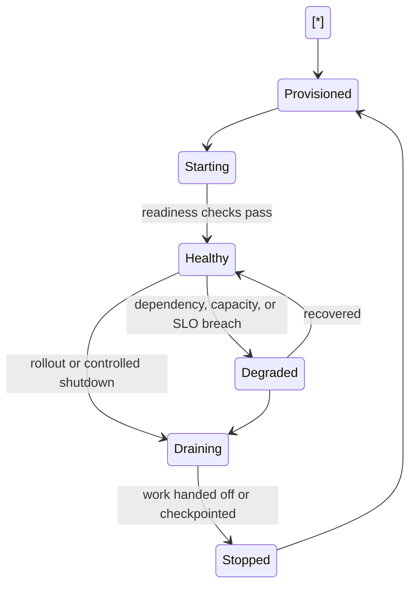
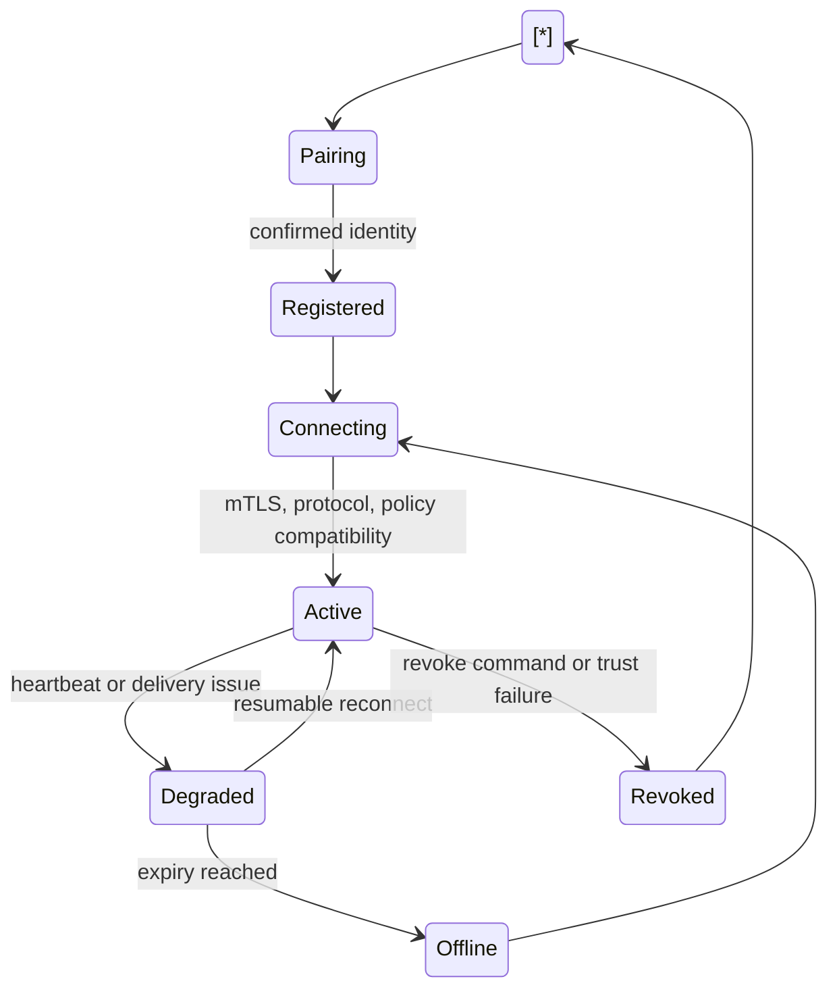
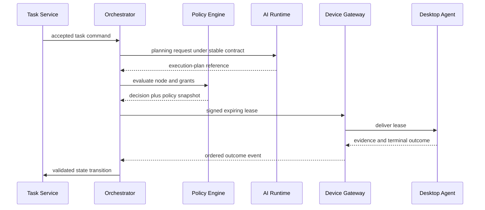
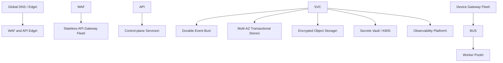

# NexusOS Backend Engineering Design Document (EDD)

## Document Control

| Field | Value |
| --- | --- |
| Status | Implementation-ready engineering design |
| Scope | NexusOS cloud and private-deployment backend control plane |
| Authority | Inherits NexusOS Enterprise PRD v3, Architecture Bible, and approved Desktop Agent EDD |
| Architecture changes | Prohibited; exceptions require an accepted ADR |
| Non-scope | Desktop execution, AI Runtime planning internals, implementation code, API reference documentation |

## Authority and Conformance

This EDD incorporates by reference the NexusOS Enterprise PRD v3, the Architecture Bible, and the Desktop Agent EDD. The Architecture Bible is normative for service ownership, durable eventing, signed expiring leases, policy enforcement, data ownership, ACP, observability, deployment, and ADR governance.

The Backend is the NexusOS control plane. It coordinates authorized work, persists canonical control-plane state, enforces identity and policy, issues and revokes bounded authority, manages durable communication, and makes work observable. It MUST NOT execute desktop tools, arbitrary OS commands, browser actions, plugins, MCP tools, or local models. The Desktop Agent remains the runtime-plane executor. The AI Runtime remains owner of planning, graph generation, capability selection, reflection, and model-routing internals.

No backend service may directly write another service’s canonical datastore. Cross-domain changes use versioned APIs, durable commands, events, and event-derived projections. All normative terms retain the meanings defined in the Architecture Bible.

# 1\. Backend Goals

## 1.1 Responsibilities

The Backend SHALL:

* provide authenticated, tenant-scoped APIs and real-time supervision channels;
* own canonical identity, organization, workspace, task metadata/state, grants, approvals, device registration, audit records, registry metadata, configuration, and control-plane coordination state;
* broker persistent authenticated connectivity with Desktop Agents through Device Gateway;
* request policy decisions, issue signed short-lived task-step leases, and distribute revocation, cancellation, policy, and configuration controls;
* coordinate durable task lifecycle, scheduling, checkpoints, reconciliation, notifications, storage, indexing, usage, and observability;
* integrate with AI Runtime only through stable versioned contracts;
* enforce extension governance for plugins, MCP servers, Skills, marketplaces, secrets, and artifacts.

## 1.2 Non-responsibilities

The Backend MUST NOT:

* execute leased task steps or impersonate a Desktop Agent;
* plan workflows, decide model internals, or mutate AI Runtime-owned graph semantics;
* treat model output, plugin output, web content, or UI input as policy authority;
* retain plaintext secrets outside the Secrets Vault boundary;
* use a UI client, cache, analytics projection, or event consumer as authorization truth;
* bypass policy, audit, registry, lease, or consent controls for internal services.

## 1.3 Trust Boundaries

| Boundary | Backend posture | Required control |
| --- | --- | --- |
| Web/mobile/IDE clients | Untrusted presentation clients | OIDC session validation, server-side authorization, CSRF/origin controls |
| Desktop Agent | Authenticated but potentially compromised runtime | mTLS, device-bound identity, signed expiring leases, sequence and policy checks |
| AI Runtime | Trusted only through explicit service contract | Workload identity, typed contracts, minimized context, policy-gated outputs |
| Plugins/MCP/providers | Untrusted external boundary | manifests, sandbox/host controls, scoped credentials, output validation |
| Storage/analytics | Protected data-plane boundary | service identity, encryption, classification, retention and access grants |

## 1.4 Quality Objectives

| Objective | Initial target |
| --- | --- |
| Control-plane availability | 99.9% monthly, excluding announced maintenance |
| Standard API reads p95 | under 500 ms |
| Device command delivery p95 when connected | under 2 seconds |
| Dashboard task-state freshness p95 | under 3 seconds |
| Approval delivery p95 | under 5 seconds where a delivery channel is available |
| Core metadata RPO | under 15 minutes |
| Control-plane RTO | under 4 hours until a stricter tier is approved |
| Acknowledged transition durability | no acknowledged canonical state loss |

# 2\. High-Level Backend Architecture

```mermaid
flowchart TB
  CLIENT\[Web / Mobile / Developer Client\] --> EDGE\[API Gateway\]
  AGENT\[Desktop Agent\] <-->|TLS 1.3 mTLS ACP stream| DG\[Device Gateway\]
  EDGE --> ID\[Identity Service\]
  EDGE --> WS\[Workspace Service\]
  EDGE --> TASK\[Task Service\]
  EDGE --> ACT\[Activity Service\]
  EDGE --> REG\[Plugin Registry / Marketplace\]
  TASK --> ORCH\[Task Orchestrator\]
  ORCH --> POL\[Policy and Permission Engine\]
  ORCH --> AIR\[AI Runtime Interface\]
  ORCH --> MEM\[Memory Service\]
  ORCH --> SCH\[Scheduler\]
  ORCH --> SNAP\[Snapshot / Artifact Service\]
  ORCH --> BUS\[(Durable Event Bus)\]
  DG --> BUS
  BUS --> WORK\[Worker Pools\]
  BUS --> NOTIF\[Notification Service\]
  BUS --> AUDIT\[Audit Service\]
  BUS --> TEL\[Telemetry Pipeline\]
  REG --> VAULT\[Secrets Service\]
  MEM --> RDB\[(Transactional Stores)\]
  MEM --> SEARCH\[(Search / Vector Index)\]
  SNAP --> OBJ\[(Encrypted Object Storage)\]
  AUDIT --> LOG\[(Immutable Audit/Event Store)\]
  TEL --> MON\[Monitoring / Alerting\]

```

## 2.1 Architectural rules

* API Gateway is an edge policy and routing boundary, not a workflow engine.
* Task Service owns task state; Orchestrator owns dispatch coordination and graph-version references, not desktop execution.
* Policy Engine is the final control-plane decision authority. Desktop Agent performs an independent execution-time enforcement check.
* Device Gateway owns connection and delivery state, never task truth or device execution.
* Event Bus is the asynchronous backbone. Commands request work; events report facts.
* Worker Pools perform bounded backend jobs only: projections, indexing, delivery, reconciliation, artifact processing, schedules, and integrations. They never substitute for Desktop Agent execution.

# 3\. Service Architecture Standard

Every service SHALL publish a catalog entry containing owner, canonical data, API/event contracts, dependencies, classification, retention, SLO, runbook, dashboard, capacity model, threat model, and compatibility matrix.

## 3.1 Common lifecycle



All services MUST fail closed for authority, secret access, signature validation, tenant isolation, and destructive mutation. Services MUST fail informative for users and operators, with stable error code, correlation ID, retryability, safe remediation, and evidence reference.

## 3.2 Service catalog

## 3.2 Service catalog

| Service | Canonical ownership | Public interfaces | Primary dependencies | Scale unit |
| --- | --- | --- | --- | --- |
| Identity | principals, sessions, memberships | OIDC/OAuth, identity APIs/events | KMS, enterprise directory | stateless request worker |
| Workspace | workspaces, membership projections, settings | workspace APIs/events | Identity, Policy | workspace partition |
| Task | task metadata/state, templates, schedules refs | task APIs/commands/events | DB, Bus, Policy | task/workspace partition |
| Orchestrator | dispatch decisions, graph references, recovery coordination | orchestration commands/events | Task, Policy, AI Runtime, Device Gateway | workflow partition |
| Device Gateway | connections, delivery ACK/cursors, device presence | mTLS ACP stream, device events | Identity, Bus, Policy bundles | connection shard |
| Policy/Permission | policies, grants, approvals, decisions | decision/grant APIs/events | Identity, registry | low-latency decision worker |
| Memory | memory metadata, retrieval lineage | ingestion/retrieval APIs/events | Policy, search, artifacts | query/ingestion workers |
| Search | index projections/query service | search API/events | Memory, Artifact | index shard |
| Secrets | secret metadata, references, leases | vault lease API/events | KMS/HSM | isolated vault cluster |
| Registry/Marketplace | manifests, installations, compatibility, publisher trust | registry APIs/events | Policy, Vault, Artifact | installation partition |
| Notification | preferences, templates, delivery receipts | notification commands/events | providers, Activity | provider queue |
| Audit | immutable audit records, legal hold | query/export APIs/events | immutable store, KMS | append/query shard |
| Configuration | typed config releases and rollout state | config APIs/events | Policy, Vault | immutable revision |
| Analytics | usage/operational projections | query/export APIs | Bus, telemetry store | analytical shard |

Cross-references: the catalog should record contract/version, owner, compatibility policy, consumers, lifecycle, deprecation & sunset details, and adoption telemetry. New enterprise/ future controls (Reliability, Cost Control, API Contract Registry, Feature Flags) should be linked from the relevant catalog entries as non-blocking maturity additions.

# 4\. API Gateway

## Responsibilities

Authenticate requests; establish tenant and trace context; enforce request schema, quotas, idempotency, API versioning, payload limits, rate limits, WAF policies, compression rules, protocol negotiation, and routing. It exposes REST, GraphQL where approved, WebSocket/SSE real-time channels, and webhook ingress/egress through dedicated policy modules.

## Non-responsibilities

It MUST NOT own domain authorization truth, task state transitions, long-running orchestration, secret resolution, or direct datastore mutations.

## Interfaces and lifecycle

Inbound protocols are versioned under explicit major versions. WebSocket/SSE sessions are authenticated, workspace-filtered, resumable by cursor, backpressure-aware, and reauthorized on token refresh or membership change. Mutations require idempotency keys unless safely proven non-retriable.

Deprecation requires published migration guidance, adoption telemetry, compatibility window, and controlled sunset. Emergency security retirement creates audit and incident records.

## Failure, security, and scaling

## API Contract Registry (Future/Enterprise Hardening)

Gateway overload triggers bounded admission control, prioritizes authentication and safety-critical control traffic, and sheds nonessential reads before backend capacity is endangered. It never caches authorization truth. Caches are tenant-scoped, versioned, explicitly invalidated, and excluded from task terminal state, audit, grants, and secrets.

The API Contract Registry is a centralized governance catalog for REST, GraphQL, ACP, WebSocket/SSE, event schemas, and plugin APIs. Each contract record must include version, schema, owner, compatibility policy (semver or contract rules), permitted consumers, lifecycle state, deprecation and sunset timeline, and adoption telemetry. The registry provides machine-readable artifacts for validation, automated compatibility checks, schema evolution tooling, and adoption dashboards. Contracts are referenced by service catalog entries and required for public/ cross-service interfaces; missing contracts are a non-blocking future hardening gap rather than an immediate implementation blocker.

# 5\. Authentication and Identity

Identity owns users, organizations, service principals, sessions, membership, role bindings, device registration claims, API keys, OAuth clients, MFA enrollment, and enterprise federation mappings.

Identity owns users, organizations, service principals, sessions, membership, role bindings, device registration claims, API keys, OAuth clients, MFA enrollment, and enterprise federation mappings.

Authorization composes RBAC with ABAC, workspace membership, resource/action capability grants, device trust, policy conditions, and runtime context. Roles do not grant ambient execution authority. API keys are scoped, attributable, rotatable, expiring where possible, and prohibited from interactive approval actions.

Token lifecycle: short-lived access tokens; rotating refresh tokens with replay detection; session/device visibility; revoke-all; MFA step-up for sensitive operations; OAuth/OIDC authorization-code flows with PKCE; SCIM/enterprise SSO through adapter contracts. Device identity uses pairing-confirmed device-bound credentials, mTLS, certificate/key rotation, revocation, posture and version evaluation.

Failure behavior: authentication uncertainty denies; membership or grant changes invalidate relevant sessions/caches and emit durable security events. Identity mutations are strongly consistent, audited, idempotent, and replicated only through approved projections.

# 6\. Device Gateway

## Purpose and boundaries

Device Gateway terminates outbound agent-initiated TLS 1.3 mTLS streams and delivers versioned ACP leases and controls. It does not execute work, define policy, mutate task truth, or retain plaintext secrets.

## Connection lifecycle



Connection establishment negotiates protocol/capability versions, validates device certificate and trust state, resumes sequence cursor, distributes applicable signed policy/configuration bundles, and registers health/capability inventory. Heartbeats include safe device health, supported capabilities, agent version, policy revision, queue/spool state, and resource posture.

Lease delivery uses a signed, expiring, device-targeted contract including task and graph-node references, policy snapshot hash, capability constraints, timeout, idempotency key, correlation context, offline eligibility, and nonce. Gateway records delivery and ACK state; Task/Orchestrator own semantic lease state.

Offline synchronization accepts ordered, signed events with sequence IDs, ACK windows, deduplication, flow control, payload limits, and conflict escalation. State transitions and approvals are never silently dropped; low-value telemetry may be sampled under policy.

# 7\. Task Orchestration

## Responsibilities

Task Service owns task lifecycle: Draft, Planning, AwaitingApproval, Queued, Running, Paused, Blocked, Completed, Failed, Canceled, Expired. Orchestrator coordinates graph-version references, policy evaluation, dispatch, lease generation, checkpoint synchronization, prioritization, scheduling, retries, compensation requests, cancellation, and reconciliation. AI Runtime owns planning and execution-graph construction; Desktop Agent owns execution of a delivered leased node.



## Rules

* Every dispatched node has an idempotency key, timeout, retry policy, expected evidence, compensation/reconciliation strategy, and trace context.
* Lease validation is performed by Orchestrator before issue and Desktop Agent before execution.
* Retry is bounded, classified, jittered, and prohibited for ambiguous external mutation until receipt reconciliation succeeds.
* Priorities are policy-controlled and fair-queued by tenant/workspace/device, with reserved control capacity for cancellation, revocation, and approval traffic.
* Human Override uses immutable graph versions and optimistic concurrency. Backend records override authorization, rationale, impact preview, predecessor version, and resulting events.

# 8\. Workflow Management

Workflow Service, implemented as a bounded domain of Task Service unless extracted after contract maturity, owns workflow definitions, templates, validation records, publication state, permissions, compatibility metadata, execution history references, and rollback/version lineage. AI Runtime provides planning artifacts but cannot publish a workflow outside this governed lifecycle.

Workflow states: Draft, Validating, ReviewRequired, Published, Deprecated, Archived, RolledBack. Validation checks schema, referenced capabilities, policy compatibility, dependency versions, data classifications, approval requirements, budget declarations, and compensation declarations. Publishing is immutable-version creation; edits create a new version. Rollback repoints eligibility to a prior compatible version and never erases history.

# 9\. Event Bus Integration

The durable Event Bus is the primary asynchronous backbone. Every event includes event ID, name, schema ID/version, producer identity, tenant/workspace scope, aggregate reference/version, correlation ID, causation ID, timestamp, trace context, classification, retention class, and payload or protected payload reference.

| Topic family | Producers | Principal consumers | Partition key |
| --- | --- | --- | --- |
| task.lifecycle | Task, Orchestrator | Activity, Audit, Notification, Analytics | task ID |
| device.lifecycle | Device Gateway | Task, Security, Activity | device ID |
| policy.decision | Policy/Permission | Audit, Orchestrator, Activity | grant/task ID |
| execution.evidence | Gateway/Agent ingress | Task, Artifact, Audit | task ID |
| registry.lifecycle | Registry | Policy, Marketplace, Audit | installation ID |
| memory.lifecycle | Memory | Search, Audit, Analytics | memory ID |
| security.events | all services | Security operations, Audit | principal/device ID |

Delivery is at-least-once. Consumers are idempotent by event ID and aggregate version. Ordering is only guaranteed within a partition. Producers use transactional outbox. Retries use bounded exponential backoff with jitter; terminal delivery failures enter DLQ with reason, attempts, correlation links, payload reference, alerting, and controlled replay. Replay mode must prevent production side effects.

# 10\. Memory Service

Memory Service owns typed memory metadata, source lineage, consent, sensitivity, retention, retrieval decisions, deletion propagation, snapshots, and retrieval audit. It supports conversation, knowledge, workspace, semantic, procedural, and artifact-backed memory.

Ingestion: classify and authorize; capture provenance; extract/index; assign confidence, owner/workspace, labels, retention, and source reference; publish lifecycle events. Sensitive or low-confidence memory is proposed or denied according to policy, not silently generalized.

Retrieval: policy filtering occurs before hybrid search output. Ranking combines eligibility, semantic similarity, lexical relevance, graph/provenance signals, authority, recency, confidence, task affinity, and duplication penalties. Results are minimal cited context bundles.

Embeddings are replaceable provider adapters. Hybrid search supports structured filters, keyword and vector retrieval, reranking, and bounded result/token budgets. Deletion immediately revokes retrieval, then propagates through indexes, caches, replicas, exports, and backups under retention policy.

# 11\. Database Architecture

# 11\. Database Architecture

Logical stores only:

| Domain | Canonical store | Consistency | Key strategy |
| --- | --- | --- | --- |
| identity, workspace, tasks, grants, approvals | relational transactional store | strong | tenant-aware IDs and optimistic versions |
| events/audit | append-only immutable event store | durable ordered per key | time + aggregate partitions |
| artifacts/snapshots | encrypted object store + metadata | durable | content/checksum manifests |
| cache/presence/short leases | distributed cache | ephemeral | never source of truth |
| memory/search | vector, lexical, graph projections | eventual | policy-filtered indexes |
| telemetry/analytics | columnar analytical store | eventual | time/tenant partition |

## Enterprise Multi-Tenant Isolation Model (Future/Enterprise Hardening)

**Note:** This subsection describes recommended enterprise-grade tenant isolation and sharding philosophy. It is presented as future hardening guidance and does not block initial implementations.

Tenant Placement & Sharding Philosophy: use deterministic tenant placement and explicit shard mapping for high-volume tenants. Prefer tenant-aware partitions for metadata and task-related stores; use region-aware placement for residency requirements while preserving single-writer truth for tenant-critical objects.

Tenant-scoped identities & access paths: identity and access paths must be tenant-scoped. Access control checks must use tenant-scoped principals, resource partition keys, and explicit cross-tenant prohibition enforced at service/API and datastore layers.

Storage & Encryption Isolation: separate encryption keys per tenant where required by compliance; use vaulted key hierarchies and tenant-keyed object encryption for sensitive assets. Storage namespaces and encryption boundaries should be demonstrable and testable.

Compute & Queue Isolation: isolate noisy tenants by dedicated compute pools or tenant-aware autoscaling policies and per-tenant queue partitions to bound scheduling interference.

Noisy-neighbor Protection & Quotas: enforce per-tenant quotas (requests, concurrent tasks, workspace budgets), adaptive throttling, and priority lanes. Provide tenant-level telemetry and throttling policies to mitigate impact.

Billing/Metering Isolation: maintain clear attribution metadata across events and stores for billing. Reconciliation exports must be available per tenant/workspace.

Cross-tenant Operation Prohibition & Testable Guarantees: prohibit cross-tenant operations unless explicit, auditable, and authorized. Provide test suites and validation checks that assert tenant isolation properties (cross-tenant read/write forbidden, scoped identities enforced).

Indexes exist only for defined query patterns and include tenant scope, cardinality, write cost, lifecycle/retention impact, and owner. Online cross-tenant scans are prohibited. Partition high-volume event, audit, activity, telemetry, and artifact metadata by time and tenant/workspace. Use replication across availability zones, encrypted backups, point-in-time recovery, object versioning, restore drills, retention/archiving, legal hold, and documented DR tiers. Cross-service workflows use sagas and outbox, never distributed transactions.

# 12\. AI Runtime Integration

Backend communicates with AI Runtime through stable typed contracts and never depends on internal planners, agents, models, prompts, or provider implementations.

Backend communicates with AI Runtime through stable typed contracts and never depends on internal planners, agents, models, prompts, or provider implementations.

| Contract | Backend input | Required result | Failure posture |
| --- | --- | --- | --- |
| Planning Request | authorized goal, minimal cited context, policy/budget constraints | plan/graph reference, assumptions, required approvals | pause/replan; no execution |
| Execution Plan | graph version reference and validation request | compatible node descriptors | reject incompatible graph |
| Capability Discovery | policy-permitted capability query | capability candidates/versions | explicit unavailable state |
| Model Routing Request | task class, constraints, permitted providers, budget | routing decision receipt | pause if no compliant route |
| Memory Request | subject/task/purpose selectors | cited minimal context | deny on scope uncertainty |
| Budget Request | estimated usage and constraints | reservation/decision | reject/defer on budget exhaustion |
| Reflection Request | expected vs observed evidence | findings/replan request | bounded attempts |
| Cancellation | task/graph/node identifier | acknowledged cancellation state | reconcile if in progress |
| Health | dependency probe | version/capability/health | degrade orchestration |

All requests carry correlation/causation, tenant scope, classification, policy snapshot reference, schema version, timeout, idempotency semantics, and trace context. Sensitive data uses protected references rather than broad inline payloads.

# 13\. Marketplace and Plugin Registry

Registry owns plugin, MCP, Skill, publisher, package, installation, dependency, compatibility, trust-tier, signing, entitlement, and lifecycle metadata. Marketplace owns discovery, catalog presentation, reviews, private/enterprise catalogs, and publication workflow without bypassing Registry policy.

Publishing validates signed manifests, publisher identity, schemas, SBOM/provenance where applicable, declared capabilities, data classes, domains, secret types, compatibility, telemetry, dependencies, and risk tier. Installation resolves a versioned dependency graph, policy eligibility, approval/grant needs, device compatibility, secret bindings, and rollout channel. Lifecycle is Discovered, Verified, Installed, Configured, Active, Suspended, Updating, Quarantined, Uninstalled.

Private registries, enterprise registries, and air-gapped packages use identical signature, manifest, policy, audit, and compatibility requirements. Registry emits lifecycle events; Desktop Agent/Plugin Host performs runtime isolation. Backend never executes plugin code to validate a package.

# 14\. Notification System

Notification Service owns user/workspace preferences, templates, routing, suppression, delivery attempts, receipts, and provider health. Supported channels are in-app, desktop through Device Gateway, push, email, and future SMS. Notifications are derived from durable events and are never authorization proof.

Delivery evaluates recipient membership, policy, privacy/lock-screen settings, locale, quiet hours, severity, dedupe key, expiration, and channel preference. Retries are provider-specific, bounded, idempotent, and recorded. Approval, security, revocation, and task-blocked notifications receive priority; content is minimized and avoids secrets/sensitive detail.

# 15\. Audit and Compliance

Audit Service records immutable, append-only, actor-attributed facts for authentication, authorization, policy decisions, grants, approvals, task lifecycle, leases, device trust, secret access metadata, registry changes, configuration, overrides, exports, retention/legal-hold actions, and privileged operations.

Audit records include actor, subject, action, target, decision, timestamp, correlation/causation IDs, policy/version reference, source IP/device/service identity, classification, and protected evidence reference. Integrity protection uses append-only storage, cryptographic chaining or equivalent tamper-evident control, restricted writer identity, monitored verification, and immutable retention policy. Legal hold prevents eligible deletion/archiving. Exports are authorized, watermarkable, scoped, auditable, and preserve evidence lineage.

# 16\. Security

Security controls are defense in depth: Zero Trust workload identity; RBAC + ABAC + capability grants; mTLS; TLS 1.3; envelope encryption; KMS/HSM-backed keys; key rotation; vault-only secrets; least privilege; network segmentation; WAF/rate limits; supply-chain signing/SBOM; policy enforcement outside models; audit; detection and incident controls.

Threat model priorities include account takeover, device impersonation, lease replay/tampering, tenant isolation failure, prompt injection/tool abuse, malicious plugin/MCP, secret disclosure, data exfiltration, queue flooding, provider outage, supply-chain compromise, and destructive recovery retry. Mitigations must be validated by threat-specific tests, detection signals, runbooks, and revocation paths.

Abuse prevention includes tenant/user/device quotas, adaptive rate limits, bot and anomaly detection, maximum task/tool/token/time budgets, circuit breakers, egress/connector restrictions, and manual incident lockdown. Security events trigger immutable audit, alerting, scoped containment, and evidence preservation.

# 17\. Performance and Scalability

Services scale horizontally and independently. API workers scale by latency/saturation; Device Gateway by concurrent connections/outbound backlog; Task/Orchestrator by task/workflow partitions and queue age; worker pools by capability queue depth; Event Bus by partition lag; search by query/index load; artifact transfers by bandwidth; notifications by provider queue.

Backpressure is explicit at every boundary: request limits, connection windows, queue capacities, per-tenant concurrency ceilings, payload caps, token/time budgets, circuit breakers, bulkheads, priority lanes, and dead-letter handling. Caches are tenant-scoped accelerators, never authority. Autoscaling uses measured queue lag, saturation, p95 latency, error rate, and backlog age; it includes cooldowns and cost guardrails.

## Performance & Cost Control Engine (Future/Enterprise Hardening)

**Note:** Future-added centralized cost controls for enterprise deployments. These are non-blocking to core functionality but recommended for production governance.

Cost Control Engine: enforce hierarchical budgets (workspace daily/monthly, user, connector, storage, compute) with reservation and settlement mechanics, live attribution, reconciliation reports, alerts on threshold breaches, and automated quota actions (throttling, soft/ hard limits). Distinguish engine-managed backend budgets from AI Runtime model budgets — the latter remain under AI Runtime contract and model-budgeting controls.

Features: budget reservation APIs, attribution metadata (workspace, user, connector), reconciliation jobs, cost alerts and playbooks, quota enforcement with safe-fail behavior, billing/metering isolation per tenant, and penalty/settlement workflows. Provide reconciliation exports for billing and audit.

Backpressure is explicit at every boundary: request limits, connection windows, queue capacities, per-tenant concurrency ceilings, payload caps, token/time budgets, circuit breakers, bulkheads, priority lanes, and dead-letter handling. Caches are tenant-scoped accelerators, never authority. Autoscaling uses measured queue lag, saturation, p95 latency, error rate, and backlog age; it includes cooldowns and cost guardrails.

# 18\. Observability

# 18\. Observability

All services use the standardized telemetry SDK and emit structured redacted logs, metrics, traces, domain events, liveness/readiness/dependency health, version/config revision, and diagnostic bundles. A task correlation ID propagates across API request, task, graph node, policy decision, lease, ACP message, tool receipt, artifact, event, audit, notification, and model/AI Runtime request.

Dashboards cover control-plane SLOs, API latency/errors, device fleet connectivity, queue depth/age, workflow outcomes, policy denials, approval latency, event/DLQ lag, storage health, model-provider integration, registry health, notification delivery, security anomalies, and cost/usage. Every alert has severity, owner, runbook, customer-impact classification, and rollback/mitigation guidance.

# 19\. Reliability Engineering (Future/Enterprise Hardening)

**Note:** The items in this section are future-oriented reliability controls and enterprise hardening guidance. They are non-blocking to the implementation-ready core design but are expected to be adopted as maturity gates by enterprises.

SLIs & SLOs: define service- and API-level SLIs (availability, latency, error-rate, queue-age) and corresponding SLOs with clear measurement windows and aggregation rules. Error budgets, burn-rate calculations, and automated enforcement/mitigation policies must be specified per service and critical API.

Alerting & Escalation: establish multi-tier alerting with health gates, automated paging, on-call rotations, runbooks linked to alerts, and incident severity mapping. Define escalation paths and stakeholder notification templates for customer-facing impact.

Incident Command & Response: codify incident commander roles, war-room procedures, hot/follow-up tracks, postmortem timelines, and customer communication templates. Ensure templates include correlation IDs, impact scope, mitigation actions, and rollback decisions.

Postmortems & Corrective Action: require blameless postmortems with root-cause analysis, action items, owners, target completion dates, and tracked closure. Actions should feed into reliability review gates before risky changes are reintroduced.

Disaster Recovery & Exercises: schedule regular DR drills (region failover, restore drills, replay scenarios) with evidence of successful recovery, RTO/RPO measurement, and runbook validation.

Reliability Review Gates: require a reliability checklist and sign-off as part of release acceptance for services that affect customer-impacting SLOs or cross-service critical paths.

# 19\. Deployment

Cloud services run in containers on Kubernetes or an equivalent orchestrator through declarative infrastructure. Environments are development, integration, staging, security evaluation, dogfood, and production, with isolated credentials and sanitized lower-environment data.



Deployment supports cloud, single-tenant enterprise, private cloud, self-hosted, hybrid, and future air-gapped profiles while preserving policy, audit, contracts, signing, and identity semantics. Releases use signed artifacts, SBOM/provenance, tests/scans, feature flags, backward-compatible migrations, canary and progressive delivery by default, blue-green where safer, and verified rollback. Self-hosted and air-gapped profiles require local registry/artifact distribution, key management, upgrade/rollback procedures, and evidence-export equivalence.

# 20\. Testing Strategy and Quality Gates

| Layer | Required validation |
| --- | --- |
| Unit | state machines, policy logic, schemas, redaction, idempotency, retention |
| Integration | databases, bus/outbox, gateway, vault, AI Runtime contracts, providers |
| Contract | API, event, ACP, plugin manifest, AI Runtime compatibility matrix |
| Performance/load | p95/p99 latency, queue behavior, connection scale, tenant fairness |
| Chaos/recovery | process loss, zone loss, replay, duplicate events, partitions, restore |
| Security | authz bypass, tenant escape, injection, secrets, signing, abuse controls |
| End-to-end | pairing, task lifecycle, approvals, cancellation, offline reconciliation, audit |

Cross-reference: testing strategy and quality gates should include testable suites for tenant isolation, contract compatibility tests against the API Contract Registry, cost-control reconciliation tests, feature-flag dependency/expiry tests, and reliability drills as non-blocking enterprise hardening additions.

For every service, Definition of Done requires: documented owner/boundary/contracts/data classification/retention; unit coverage appropriate to risk; integration and consumer-driven contract tests; load and stress benchmark against SLO; threat-model validation; chaos/recovery tests; dashboards/runbook/alerts; architecture review; release compatibility review; rollback rehearsal; and acceptance criteria proving no policy, audit, lease, or service-ownership bypass.

Release blockers include authorization bypass, secret exposure, unsigned artifact acceptance, task-state loss, unsafe duplicate mutation, inability to revoke/cancel, unbounded resource regression, unresolved critical vulnerability, contract incompatibility, failed restore, failed rollback, or unmet SLO/error-budget criteria. Enterprise hardening items (API Contract Registry, Cost Control Engine, Feature Flags governance, Tenant Isolation model, Reliability Engineering practices) are labeled future/enterprise improvements and are cross-referenced as recommended maturity controls, not immediate blockers for initial implementation readiness.

# 21\. Future Evolution

Multi-region evolution uses region-aware tenant placement, globally unique IDs, regional eventing with defined ordering boundaries, replicated immutable evidence, residency-aware routing, and tested failover. It MUST NOT weaken single-writer truth for tasks, grants, approvals, and leases.

Edge and federated deployments add regional/device-adjacent services only through versioned contracts and delegated authority; no edge node receives ambient transitive privilege. Enterprise, private cloud, hybrid, and air-gapped editions preserve policy/audit/lease semantics through deployment profiles rather than product forks. New services, stores, transports, providers, and cross-cutting dependencies require ADR review when they change a parent invariant.

# Appendix A. Service Definition of Done Checklist

* Responsibilities and explicit non-responsibilities documented.
* Canonical data ownership and cross-service access path documented.
* Public/internal APIs, events, schemas, versioning, compatibility and deprecation documented.
* Lifecycle, state transitions, idempotency, retries, reconciliation, degraded behavior and rollback documented.
* Dependencies, capacity, caching, cost, extension points and scale model documented.
* Threat model, authentication/authorization, secrets, encryption, classification, retention and deletion documented.
* Logs, metrics, traces, SLOs, dashboards, alerts, diagnostics and runbooks implemented.
* Unit, integration, contract, security, performance, chaos, recovery and acceptance tests passed.
* Architecture review confirms conformance with PRD v3, Architecture Bible, Desktop Agent EDD, and accepted ADRs.

# Appendix B. Backend Acceptance Criteria

1. A user can create and supervise a task with durable, auditable state transitions.
2. A paired Desktop Agent receives only signed, expiring, policy-bound leases and can be revoked immediately.
3. Backend orchestration coordinates but never performs desktop execution.
4. AI Runtime integration remains typed, versioned, and independent of runtime internals.
5. All external mutation commands are idempotent or have a reconciliation procedure.
6. Every material mutation has correlation-linked immutable audit evidence.
7. A service outage, event duplication, device disconnect, provider failure, or deploy rollback fails safely and recovers through documented controls.
8. Tenant isolation, least privilege, secret protection, retention, and legal-hold behavior are demonstrably enforced.