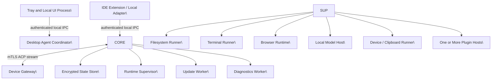
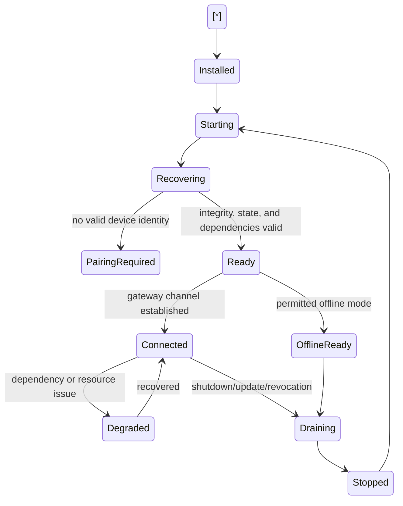
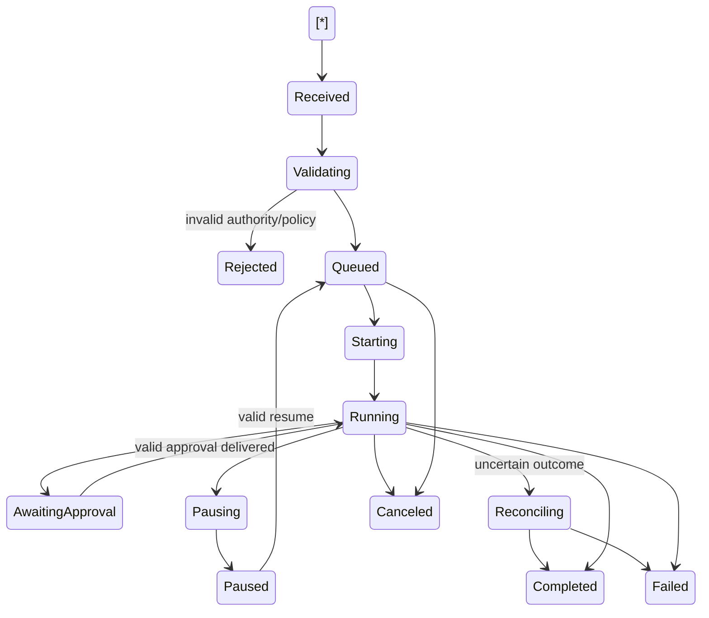
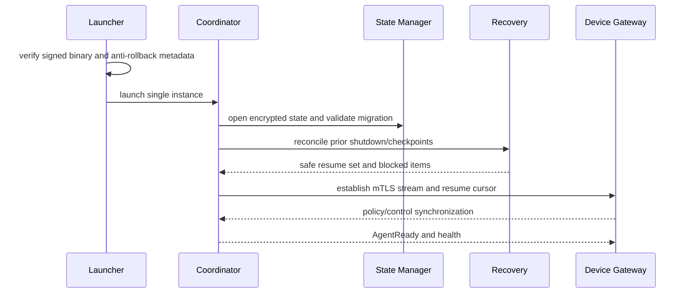
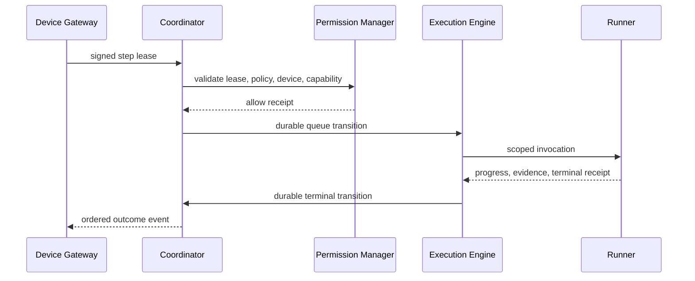
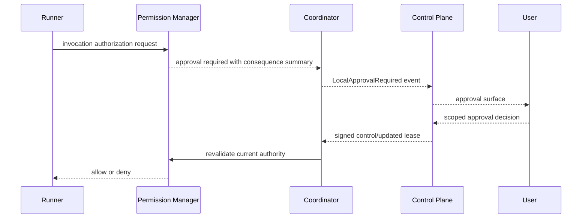
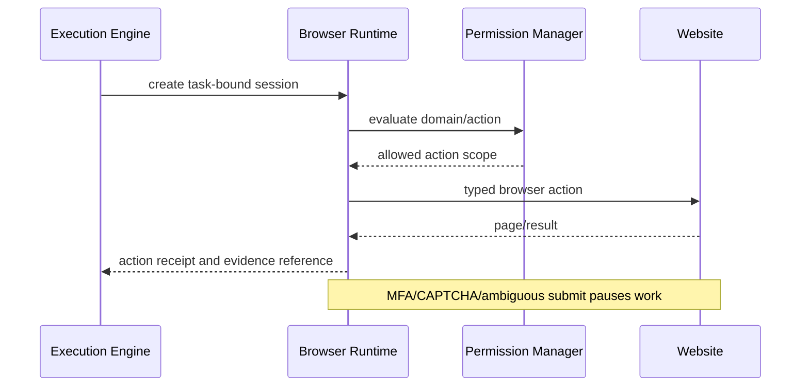
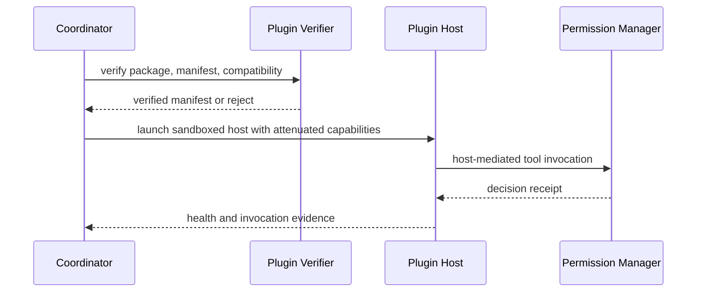
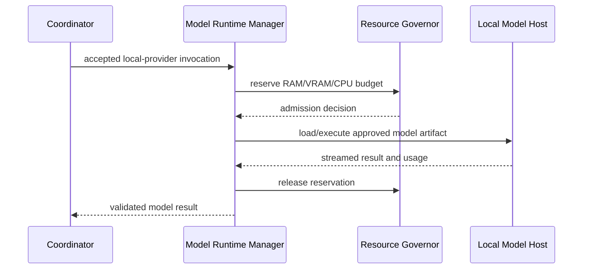
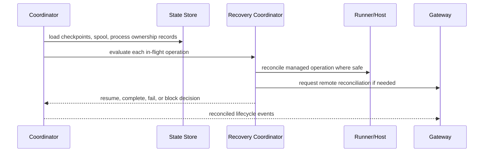

# NexusOS Desktop Agent Engineering Design Document (EDD)

## Document Control

| Field | Value |
| --- | --- |
| Status | Implementation-ready engineering design |
| Scope | Windows-first NexusOS Desktop Agent only |
| Authority | Inherits NexusOS Enterprise PRD v3 and NexusOS Architecture Bible — Pre-EDD Foundation |
| Normative language | MUST, MUST NOT, SHOULD, MAY retain the meanings defined in the Architecture Bible |
| Architecture changes | Prohibited by this EDD; any conflict or exception requires an accepted ADR |
| Non-scope | Product requirement changes, cloud-control-plane redesign, source code, web dashboard implementation |

## Authority and Conformance

This EDD is subordinate to and incorporates by reference:

1. NexusOS — Enterprise PRD for AI Desktop Agent & Web Platform, Version 3.
2. NexusOS Architecture Bible — Pre-EDD Foundation.
3. Architecture Bible ADR-0001 through ADR-0010 and all future accepted ADRs applicable to the Desktop Agent.

The Desktop Agent is a runtime-plane executor. It receives bounded, signed, expiring work leases from the control plane; validates current authority locally; executes only within approved capabilities; and emits evidence, state, and audit-linked events. It MUST NOT become an independent policy authority, a global task orchestrator, or a bypass around service ownership, ACP, event-bus, audit, permission, secret, or registry controls.

Where an implementation question is not explicitly settled by the parent documents, this EDD selects an implementation design only when it does not alter a parent invariant. A future decision that changes a trust boundary, public contract, persistent cross-cutting dependency, isolation model, or architectural invariant requires an ADR.

# 1\. Desktop Agent Goals

## 1.1 Responsibilities

The Desktop Agent SHALL:

* Run as a signed Windows background application after explicit user-enabled installation.
* Maintain an outbound TLS 1.3 mutually authenticated connection to Device Gateway; it SHALL require no inbound firewall port.
* Pair, identify, and continuously report a device using device-bound credentials or hardware-backed keys where available.
* Register capability inventory, supported protocol versions, health, agent version, adapter inventory, policy revision, and resource posture.
* Receive, validate, acknowledge, execute, pause, resume, cancel, reconcile, and report signed task-step leases targeted to its device identity.
* Enforce local policy and capability grants at execution time, independently of any UI decision or model output.
* Provide bounded local execution through filesystem, terminal, browser, application/IDE, device, plugin, and local-model runtimes.
* Persist encrypted local checkpoints, event spool records, receipts, and recovery manifests sufficient for safe restart and reconnect reconciliation.
* Present tray state, native notifications, local approval surfaces, diagnostics controls, and emergency stop controls.
* Supervise isolated child runtimes and terminate managed process trees when cancellation, revocation, emergency stop, or health policy requires it.
* Produce structured, redacted logs, metrics, traces, evidence references, health signals, and audit-linked lifecycle events.
* Download, validate, stage, activate, and roll back signed updates according to release-channel policy.

## 1.2 Non-responsibilities

The Desktop Agent MUST NOT:

* Define, mutate, or infer global policy, grants, organization RBAC, task status truth, or approval truth.
* Execute arbitrary user/model/plugin instructions without a valid lease, capability binding, and runtime policy decision.
* expose a privileged unrestricted localhost API.
* accept inbound task commands from the LAN, browser pages, IDE extensions, plugins, or other local processes without authenticated local IPC and authorization.
* execute untrusted plugin, MCP, browser-content, model, or UI code inside the coordinator process.
* retain plaintext secrets in configuration, logs, event spools, crash dumps, prompts, screenshots, artifacts, or diagnostics.
* silently retry ambiguous external mutations.
* bypass CAPTCHA, MFA, paywalls, anti-bot controls, access controls, or website terms.
* act as a source of fresh high-risk authority while disconnected.
* make cloud service data-store writes directly; it interacts with cloud domains only through Device Gateway, ACP, APIs, and event contracts.

## 1.3 Execution boundaries

| Boundary | Agent authority | Explicit limit |
| --- | --- | --- |
| Device | Executes only on the paired target device | No cross-device dispatch or delegation |
| Task step | Executes one leased graph node and approved descendants only where explicitly delegated | No graph mutation authority |
| Capability | Uses resource/action selectors in the lease and local policy bundle | No ambient filesystem, network, terminal, or credential access |
| Time | Operates before lease expiry and within timeout/heartbeat constraints | Expired authority terminates or safely pauses work |
| Resources | Uses per-runtime CPU, memory, GPU, disk, process, output, and queue budgets | No unbounded background processing |
| Offline mode | Executes only explicitly offline-eligible leases under valid cached policy | No fresh approval, credential refresh, remote mutation, or high-risk inference |
| User session | Uses session-scoped local IPC and disclosure controls | No assumption that interactive user is authorized for all workspaces |

## 1.4 Trust boundaries

## 1.4 Trust boundaries

The device environment is independently authenticated but potentially hostile or compromised. The coordinator treats local users, local processes, browser content, files, clipboard contents, model outputs, plugin/MCP outputs, and external process output as untrusted inputs.

| Boundary | Inbound data | Required control | Default on uncertainty |
| --- | --- | --- | --- |
| Device Gateway to coordinator | ACP command/lease/control message | mTLS, message signature, nonce, device target, expiry, schema, sequence validation | Reject and security-event |
| Local UI/IDE to coordinator | User actions and status requests | authenticated named-pipe IPC, caller identity, session authorization, schema validation | Deny |
| Coordinator to runner | scoped execution request | capability attenuation, immutable request, timeout, cancellation token, environment sanitization | Do not start |
| Plugin/MCP host | manifests, tool output, lifecycle messages | isolated process, typed host protocol, output limits, policy checks | Suspend/quarantine |
| Browser/page | page data, downloads, automation selectors | provenance labeling, domain policy, content isolation, output validation | Pause on consequential ambiguity |
| Local model | generated text/tool proposals | no direct tools, schema validation, policy gate outside model | Reject invalid output |

## 1.5 Performance goals

The agent SHALL meet PRD targets and the following design budgets on supported reference hardware, excluding active model processes and explicitly user-authorized heavyweight workloads:

| Metric | Target | Measurement boundary |
| --- | --- | --- |
| Idle CPU | under 2% average | Coordinator, tray, IPC, health, connection idle |
| Idle working set | under 300 MB | Excludes browser, plugin, terminal and model child processes |
| Connected event delivery p95 | under 2 seconds | Durable local state transition to Device Gateway acknowledgement path |
| Local approval display p95 | under 1 second | Validated local request to native prompt availability |
| Task cancellation acknowledgement | under 2 seconds | Coordinator receipt; child process termination may continue under bounded grace period |
| Startup readiness | under 15 seconds | Cold start on supported reference device, excluding update/migration recovery |
| Resume recovery decision | under 30 seconds | Checkpoint load, lease validation, process reconciliation |
| Local IPC control p95 | under 100 ms | Same-session authorized client, excluding long-running operation |

## 1.6 Failure goals

* Fail closed for authority, secret access, signature validation, policy freshness, unsafe path resolution, and untrusted executable activation.
* Fail informative for users: surface status, correlation ID, safe remediation, and whether work was changed, paused, rolled back, or requires reconciliation.
* Preserve enough local evidence to distinguish “not started,” “in progress,” “completed,” and “externally ambiguous.”
* Prevent a child runtime failure from crashing the coordinator or granting another runtime its authority.
* Ensure no acknowledged local task-state transition is lost across restart; use durable local append-before-send semantics.
* Treat stale leases, invalid policy snapshots, unknown plugin state, and uncertain process ownership as non-resumable until reconciled.

## 1.7 Security goals

* Enforce least privilege at every tool invocation.
* Ensure every observable mutation produces immutable audit-linked evidence and correlation identifiers.
* Keep secrets device-protected and lease them only to the narrowly scoped runtime that needs them.
* Maintain OS-process isolation between coordinator, UI, updater, browser, local model host, and plugin hosts.
* Support emergency pause, managed-child kill, device revocation response, policy lockdown, connector disablement, and local forensic preservation.
* Detect tampered executable/configuration/model/plugin artifacts before use.

# 2\. Runtime Architecture

## 2.1 Process architecture

The agent uses a supervisor-and-isolated-worker topology. The privileged coordinator is deliberately narrow: it manages identity, policy validation, durable state, scheduling, lifecycle, and supervision, but it does not execute untrusted workloads.



### Process roles

| Process | Privilege posture | Owns | May not do |
| --- | --- | --- | --- |
| Coordinator | Least practical long-lived user-context privilege | connection, leases, local state, IPC, policy enforcement, scheduler, supervision | execute plugins/models/terminal commands in-process |
| UI | unprivileged user process | tray, local dialogs, notifications, diagnostic consent | enforce authority or access secrets |
| Filesystem runner | constrained child | scoped file operations and snapshots | access paths outside capability scope |
| Terminal runner | constrained child | managed process tree, sanitized environment, streams | inherit broad user environment or unmanaged background ownership |
| Browser runtime | separate crash/profile domain | managed browser sessions and action receipts | share cookies/profile across workspace/task without explicit policy |
| Local model host | resource-contained child | provider adapters, artifact loading, inference | invoke tools or make policy decisions |
| Plugin host | sandboxed, one trust/isolation domain | plugin/MCP execution | obtain ambient credentials or coordinator internals |
| Updater | minimal independent updater authority | signed package staging, rollback activation | accept unsigned/incompatible releases |

The initial installation mode is per-user. A Windows Service is an optional enterprise deployment profile, not a default requirement. When enabled, it MUST remain a broker/supervisor with no interactive desktop assumptions and must not weaken per-user consent, local IPC authentication, or execution isolation.

## 2.2 Thread model

Each process uses asynchronous I/O and bounded worker pools. UI, connection, and control loops never block on filesystem scans, inference, process output, archive extraction, or plugin operations.

| Coordinator execution lane | Duties | Blocking policy |
| --- | --- | --- |
| Main lifecycle loop | startup/shutdown state, supervisor decisions | non-blocking only |
| Connection loop | mTLS stream, ACKs, heartbeats, flow control | async I/O only |
| Command-validation lane | signature/schema/lease/policy validation | bounded CPU work only |
| Durable-state lane | append log, checkpoint commit, encryption | serialized per aggregate; bounded queue |
| Scheduler lane | due timers, retry timers, lease-expiry timers | no execution; dispatch only |
| IPC acceptor lane | named-pipe connection acceptance and identity validation | no business operation execution |
| Telemetry export lane | batching/redaction/export | lossy only for permitted diagnostic detail |
| Supervisor lane | child state and resource sampling | bounded polling/event-driven |

Rules:

* Every queue has explicit capacity, shedding behavior, priority, metrics, and cancellation semantics.
* A task/device aggregate is serialized through a keyed executor to preserve local state ordering.
* CPU-intensive operations run in constrained worker processes or pools.
* The coordinator uses cooperative cancellation first, then process-tree termination under a bounded escalation ladder.
* Thread-pool starvation, unbounded task creation, and synchronous cross-process waits are release-blocking defects.

## 2.3 Background workers

| Worker | Trigger | Durability | Failure handling |
| --- | --- | --- | --- |
| Connection/reconnect worker | startup, socket close, network change | connection cursor in state store | exponential backoff with jitter; network-aware pause |
| Event spool sender | new durable outbound record, reconnect | append-only encrypted spool | resend with sequence/ACK dedupe |
| Lease-expiry worker | active lease timer | checkpointed deadlines | cancel/pause capability at expiry |
| Local scheduler | offline-eligible delayed work | encrypted schedule record | verifies authority at firing time |
| Health worker | fixed interval and state change | latest health snapshot | degrades health, restarts isolated runtime if policy allows |
| Artifact cleanup worker | retention, task terminal state | deletion journal | secure cleanup with retry and audit event |
| Cache eviction worker | memory/disk pressure | reconstructable indexes | evicts least-recent safe entries only |
| Update worker | signed manifest/enterprise schedule | transactional update journal | staged activation and rollback |
| Crash-recovery worker | startup after abnormal exit | recovery manifest | reconciliation before any resume |

## 2.4 Service lifecycle



Readiness requires: verified executable/configuration, usable protected state store, valid local IPC endpoint, policy cache validation, supervisor availability, and either a connected gateway or permitted offline-ready posture. A device can report degraded health while still accepting narrowly safe work only if the affected capabilities are not required.

## 2.5 Windows startup

1. Windows starts the per-user launcher after user-enabled startup registration.
2. Launcher verifies coordinator binary signature, version compatibility, and anti-rollback metadata.
3. Launcher creates a single-instance guard scoped to the installed user and launches the coordinator.
4. Coordinator initializes structured logging with redaction, opens protected state, validates schema migrations, and performs tamper checks.
5. Coordinator starts authenticated local IPC before UI integration, then starts the supervisor, health monitor, and connection manager.
6. The agent loads only signed configuration/policy cache artifacts with valid expiry and version compatibility.
7. The agent reconciles recovery manifests before accepting new leases.
8. Tray UI starts or reconnects; startup does not require an interactive full window.

Startup registration is user-controlled. A user declining automatic start retains manual launch capability. Startup failure must not repeatedly spawn crash loops; the launcher applies bounded restart policy and exposes a repair/diagnostics path.

## 2.6 Shutdown, suspend, resume, and safe termination

### Controlled shutdown

* Mark coordinator as draining and reject new lease starts.
* Notify gateway with drain intent when connected.
* Stop dispatching queued work; preserve runnable state.
* Request checkpoints from resumable runners.
* Cancel non-resumable work at safe boundaries or surface an explicit user decision if policy permits waiting.
* Flush durable outbound spool records; never block shutdown indefinitely on network delivery.
* Terminate runners in dependency order: plugins, browser, terminal, filesystem/model, then coordinator.
* Write clean-shutdown marker only after durable state is consistent.

### Suspend and resume

Windows suspend is not a clean shutdown. On suspend notification, the coordinator marks active work suspended, sends best-effort state to gateway, checkpoints where possible, and pauses timers. On resume it re-evaluates wall-clock lease expiry, network, policy cache, child health, resource posture, and clock skew before resuming. A step that expired during sleep cannot continue.

### Safe termination ladder

1. Request cooperative cancellation using runner protocol.
2. Stop new child work and wait bounded grace period.
3. Terminate known managed child process tree.
4. Verify process identity using creation-time/ownership token before terminating; never kill a reused PID.
5. Record outcome; if ownership is ambiguous, do not kill and escalate to user/security diagnostics.

# 3\. Internal Modules

All modules expose versioned internal contracts, emit structured lifecycle events, receive cancellation context, support dependency injection, and are independently testable. Module dependencies follow the Architecture Bible: contracts and shared primitives are dependency-light; runtimes do not import control-plane domain implementations.

## 3.1 Module catalog

| Module | Purpose | Key dependencies | Primary failure posture |
| --- | --- | --- | --- |
| Desktop Runtime | coordinator composition root and lifecycle | all core abstractions | fail startup safely |
| Task Scheduler | dispatches leased/local scheduled work | state, clock, supervisor | pause/requeue; never duplicate |
| Execution Engine | local step state machine and runner orchestration | policy, state, supervisor | reconcile before retry |
| Permission Manager | local lease/grant/policy enforcement | policy cache, identity | deny |
| Browser Runtime | governed sessions and automation | supervisor, artifacts, policy | pause/handoff |
| Filesystem Runtime | scoped file operations/snapshots | permission manager, state | deny unsafe path/mutation |
| Terminal Runtime | managed command execution | permission manager, secrets | terminate tree and classify |
| Plugin Host Manager | plugin verification, hosting, quarantine | registry metadata, policy | suspend/quarantine |
| Secrets Vault Client | local secret-reference resolution | OS credential protection, gateway | deny secret use |
| Configuration Manager | typed signed settings/feature gates | state, signature verifier | retain last known good |
| Health Monitor | liveness, readiness, resource diagnosis | supervisor, telemetry | degrade/recover |
| Crash Recovery | checkpoint and process reconciliation | state, scheduler | block unsafe resume |
| Logger | structured redacted logs | redactor, local store | bounded loss of noncritical logs |
| Telemetry Manager | metrics/traces/export | logger, connection | local aggregate/spool |
| Notification Manager | local notices and action routing | UI IPC, policy | queue/coalesce |
| Update Manager | signed release lifecycle | updater, state | rollback |
| IPC Manager | local authenticated named pipes | identity, authorization | deny |
| State Manager | encrypted durable local records | OS crypto, serializer | fail closed |
| Model Runtime Manager | local provider lifecycle/admission | supervisor, model registry | fallback/pause |
| Memory Cache | policy-scoped ephemeral context cache | state, policy | evict/deny stale data |
| Clipboard Runtime | explicit clipboard read/write | permission manager | deny; clear temporary data |
| Device Runtime | local capabilities such as notifications/mic/camera | OS consent, policy | deny/disable capability |

## 3.2 Desktop Runtime

Purpose: compose modules, manage lifecycle state, publish agent readiness, and maintain a narrow trusted coordinator.

Interfaces: `IAgentLifecycle`, `ILeaseDispatcher`, `IRuntimeSupervisor`, `IShutdownCoordinator`.

Lifecycle: constructed from validated configuration; starts state, IPC, supervisor, health, then connection. It enters Ready only after recovery gate passes.

Events: AgentStarting, AgentReady, AgentDegraded, AgentDraining, AgentStopped, AgentIntegrityFailed.

Failure handling: an initialization failure records a redacted diagnostic reason and transitions to Failed/Stopped without accepting work. Extension points are lifecycle observers only; no plugin may alter startup authority.

## 3.3 Task Scheduler and Execution Engine

Purpose: maintain local execution queue, deadlines, retry timers, dependencies delegated by the graph lease, and runner ownership.

Interfaces: `IScheduleStore`, `ILeaseValidator`, `IStepExecutor`, `ICancellationRegistry`, `IRecoveryPlanner`.

Lifecycle: restores persisted schedule items only after lease and policy validation. It uses task-step keyed serialization and separate priority queues for revoke/cancel, approvals, active work, retries, and background maintenance.

Events: LocalStepQueued, LocalStepStarted, LocalStepPaused, LocalStepBlocked, LocalStepCompleted, LocalStepFailed, LocalStepCanceled, LocalRetryDue, LocalLeaseExpired.

Failure handling: a durable state transition precedes user-visible/event emission. Retries require idempotency or a reconciliation plan. Extension points include new runner adapters registered through capability registry only.

## 3.4 Permission Manager

Purpose: evaluate every local invocation against the signed lease, cached policy snapshot, capability grants, device posture, runtime state, and OS-consent state.

Interfaces: `IAuthorizationEvaluator`, `ICapabilityTokenValidator`, `IConsentStatusProvider`, `IPolicyBundleStore`.

The manager validates action, resource selector, task/step binding, device binding, expiry, conditions, risk tier, maximum counts/bytes/spend where applicable, and revocation cursor. It emits a decision receipt for every allow, deny, or approval-needed result.

Failure handling: cache expiry, signature error, clock-skew beyond allowed tolerance, unknown resource mapping, or missing OS consent returns deny. Extension points may add capability evaluators but cannot weaken baseline checks.

## 3.5 Filesystem Runtime

Purpose: execute authorized local file operations with canonical path resolution, precondition checks, snapshots, evidence, and recovery semantics.

Interfaces: `IFileCapability`, `IPathResolver`, `ISnapshotClient`, `IFileReceiptStore`, `IContentScanner`.

Dependencies: Permission Manager, State Manager, artifact/snapshot contracts, Logger. It does not depend on browser/plugin implementation.

Lifecycle: initialized per runner request with immutable authorized roots, action list, file-count/byte budgets, sensitive-pattern policy, and cancellation context. It releases handles before terminal reporting.

Events: FileRead, FileListed, FileSearchStarted/Progress/Completed, FileCreated, FileWritten, FileCopied, FileMoved, FileRenamed, FileDeleteRequested, FileDeleted, FileSnapshotCreated, FileConflictDetected, FileOperationDenied.

Failure handling: deny traversal, reparse-point ambiguity, alternate data stream ambiguity, unsupported filesystem semantics, sharing violation, changed precondition, and protected/sensitive path. Before overwrite/move/delete, record metadata and create snapshot when required. Default deletion uses Recycle Bin where supported; permanent deletion requires fresh policy/approval. Extension points: content extractors, preview providers, archive adapters, and version-control awareness adapters under typed contracts.

## 3.6 Terminal Runtime

Purpose: run approved PowerShell, CMD, Git, Node, Python, package-manager, and other registered tool commands in controlled process trees.

Interfaces: `ITerminalCapability`, `IProcessLauncher`, `IEnvironmentBuilder`, `IOutputRedactor`, `IProcessReceiptStore`.

Each request has executable identity, argument vector, approved working directory, sanitized environment allowlist, stdin policy, output size limits, timeout, process-tree ownership token, network policy reference, and cancellation token. Shell-string execution is prohibited unless a specific adapter declares and safely validates it.

Events: TerminalStarted, CommandStarted, CommandOutputChunk, CommandExited, BackgroundProcessRegistered, ProcessTreeTerminationRequested, TerminalDenied, TerminalOutputRedacted.

Failure handling: classify exit code, timeout, spawn error, lost ownership, output overflow, credential prompt, and ambiguous external mutation. Package installation, migrations, deployments, and Git remote mutation require specialized reconciliation rather than generic retry. Extension points: registered tool adapters and parsers, never arbitrary environment inheritance.

## 3.7 Browser Runtime

Purpose: provide assisted, managed-visible, and approved managed-headless sessions isolated by workspace/device/profile/task.

Interfaces: `IBrowserSessionManager`, `IBrowserPolicyEnforcer`, `IBrowserAutomationDriver`, `IDownloadManager`, `IBrowserEvidenceCollector`.

Lifecycle: create profile from policy-defined template; bind to task; establish domain/action policy; launch; execute typed actions; persist only authorized session state; dispose/clear as instructed.

Events: BrowserSessionCreated, BrowserOpened, BrowserNavigated, BrowserActionProposed, BrowserActionExecuted, BrowserDownloadStarted/Completed, BrowserUploadRequested, BrowserAuthRequired, BrowserMfaRequired, BrowserCaptchaDetected, BrowserSessionCleared.

Failure handling: pause on login, MFA, CAPTCHA, paywall, anti-bot, unexpected permission prompt, disallowed redirect, sensitive form submit, unknown download type, or ambiguous page state. Extension points are browser-engine drivers and domain adapters behind normalized action receipts.

## 3.8 Plugin Host Manager

Purpose: resolve signed plugin packages, enforce lifecycle, allocate sandboxed hosts, pass attenuated capabilities, collect health, and quarantine failures.

Interfaces: `IPluginCatalog`, `IPluginVerifier`, `IPluginHostFactory`, `IPluginPolicyGateway`, `IPluginQuarantineStore`.

No executable plugin code runs in the coordinator. Plugin hosts receive manifest-approved capabilities only through host-mediated invocations. Crash loops, signature mismatches, policy denials, anomalous resource use, or egress violations cause suspend/quarantine according to policy.

Events: PluginDiscovered, PluginVerified, PluginInstalled, PluginConfigured, PluginActivated, PluginSuspended, PluginUpdated, PluginQuarantined, PluginHostCrashed, PluginInvocationCompleted.

## 3.9 Secrets Vault Client

Purpose: resolve opaque secret references to narrowly scoped, short-lived local use without persistence or disclosure.

Interfaces: `ISecretLeaseResolver`, `ISecretInjector`, `ISecretRedactionRegistry`, `ISecretRevocationHandler`.

Secrets are injected through approved runner channels only. The coordinator stores references, lease metadata, and redaction fingerprints—not plaintext values. Secret access is denied while offline unless an explicitly allowed protected local lease exists and remains valid.

## 3.10 Configuration Manager

Purpose: maintain typed configuration layers: immutable shipped defaults, signed release configuration, enterprise/device policy overlays, and user-safe preferences.

Precedence cannot override security baselines. Configuration changes are versioned, validated atomically, observable, rollback-capable, and attached to health/diagnostic metadata. Unknown or invalid high-impact settings fail closed to last known good configuration.

## 3.11 Health Monitor and Crash Recovery

Health Monitor collects process liveness, readiness, resource saturation, queue age, spool backlog, connection health, policy freshness, disk headroom, update status, and capability availability. It publishes health only through sanitized aggregate signals.

Crash Recovery owns abnormal-exit detection, recovery manifest validation, child-process ownership reconciliation, local spool replay preparation, snapshot receipt verification, and safe resume eligibility. It never repeats an ambiguous mutation automatically.

## 3.12 Logger and Telemetry Manager

Logger emits structured records with timestamp, component, severity, task/step correlation, safe error code, and redacted fields. Telemetry Manager batches metrics, traces, and approved diagnostics under backpressure. State transitions, approval events, security events, and audit evidence are never dropped; high-volume debug logs may be sampled only under declared policy.

## 3.13 Notification Manager

Purpose: deliver actionable local notifications without leaking sensitive content. It maps approved actions to authenticated local IPC commands and requires revalidation when clicked. Notifications are coalesced, expiry-aware, lock-screen privacy aware, and never treated as authorization proof.

## 3.14 Update Manager

Purpose: manage manifest retrieval, channel selection, package download, signature/integrity verification, staged install, health-gated activation, rollback, repair, and update evidence.

It treats update packages and manifests as untrusted until cryptographically verified. It does not use the main coordinator process to replace binaries currently executing.

## 3.15 IPC Manager, State Manager, Memory Cache, Clipboard and Device Runtime

IPC Manager implements authenticated named-pipe endpoints with protocol negotiation, per-session authorization, request limits, impersonation-safe caller identity, and correlation propagation.

State Manager owns encrypted local state only: identity handles, connection cursors, lease/checkpoint metadata, spool, schedules, configuration revisions, runtime receipts, and cache indexes. It uses append-before-send journals and atomic compaction. It is not a local replica of cloud policy/task truth.

Memory Cache stores only policy-approved, TTL-bound, encrypted, purpose-bound local context artifacts. A policy/revocation change invalidates affected entries immediately.

Clipboard Runtime requires explicit capability and minimizes retention. Device Runtime mediates notifications, microphone, camera, startup registration, and other OS capabilities through both OS consent and NexusOS policy.

# 4\. Folder Structure

The production repository location is `apps/desktop-agent/` within the governed NexusOS monorepo. The hierarchy separates contracts, composition, domain modules, platform adapters, worker hosts, packaging, and tests.

```text
apps/desktop-agent/
  README.md
  docs/
    edd/
    runbooks/
    threat-models/
    compatibility/
  src/
    bootstrap/
    composition/
    contracts/
    domain/
      lifecycle/
      execution/
      permissions/
      scheduling/
      recovery/
    modules/
      connection/
      ipc/
      state/
      configuration/
      health/
      logging/
      telemetry/
      notifications/
      updates/
      secrets/
      filesystem/
      terminal/
      browser/
      plugins/
      local-models/
      device/
      clipboard/
      memory-cache/
    hosts/
      coordinator/
      tray-ui/
      filesystem-runner/
      terminal-runner/
      browser-runtime/
      plugin-host/
      local-model-host/
      updater/
      diagnostics/
    platform/
      windows/
        identity/
        crypto/
        ipc/
        process/
        filesystem/
        notifications/
        installer/
        resource-controls/
    adapters/
      gateway/
      acp/
      artifact/
      snapshot/
      model-providers/
      browser-engines/
      ide/
      plugin-transports/
    security/
      verification/
      authorization/
      redaction/
      secure-storage/
      tamper-detection/
    observability/
    shared/
  resources/
    manifests/
    policy-schemas/
    protocol-schemas/
    localization/
    defaults/
  installer/
    packages/
    bootstrapper/
    repair/
  deployment/
    channels/
    enterprise/
  scripts/
  tests/
    unit/
    component/
    contract/
    integration/
    system/
    security/
    chaos/
    fixtures/
    harness/
  tools/
    test-device-simulator/
    protocol-inspector/
    diagnostic-decoder/

```

Directory rules:

* `contracts/` contains Desktop-Agent-owned interfaces and imports shared versioned contracts from repository `packages/contracts`; it contains no concrete Windows or cloud implementations.
* `domain/` holds process-independent local state machines and policy-neutral business rules. It cannot import `platform/`, `hosts/`, or concrete adapters.
* `modules/` owns cohesive application services and module-local contracts. Cross-module access goes through interfaces, not private storage.
* `hosts/` contains process entry points and host-specific composition only; no reusable domain logic.
* `platform/windows/` encapsulates Windows APIs so future OS implementations can provide alternative adapters without modifying domain contracts.
* `security/` owns verification, redaction, secure storage adapters, and enforcement utilities; no caller bypass is permitted.
* `resources/` is non-secret, signed or packaged static material. No credentials, private keys, or mutable policy decisions are committed.
* `installer/` and `deployment/` own signed packaging/channel metadata and enterprise installation profiles.
* `tests/fixtures/` contains synthetic, sanitized fixtures only.

# 5\. Class Architecture

## 5.1 Design strategy

The agent uses composition over inheritance. Domain behavior is modeled through small interfaces, immutable command/value objects, explicit state machines, and factories selected through validated capability registries. Inheritance is restricted to framework-required host abstractions or closed internal error hierarchies; it MUST NOT encode policy, capability, or provider specialization.

## 5.2 Core abstractions

| Abstraction | Responsibility |
| --- | --- |
| AgentCoordinator | lifecycle composition, lease intake, supervisor coordination |
| LeaseDispatcher | validates accepted lease and routes to ExecutionEngine |
| ExecutionEngine | local step state transitions and runner orchestration |
| ExecutionContext | immutable task/step, trace, budget, policy, cancellation, authority context |
| CapabilityAuthorizer | produces allow/deny/approval-needed receipt |
| RuntimeSupervisor | creates, monitors, drains, restarts, and terminates hosts |
| RunnerFactory | chooses a registered runner based on capability binding |
| StateRepository | encrypted durable journals/checkpoints and atomic transitions |
| EventPublisher | maps local facts to ACP/event-spool records |
| RecoveryCoordinator | determines resumability and reconciliation plans |
| ResourceGovernor | admission control and runtime resource limits |
| SecretLeaseBroker | resolves/injects scoped secret use |
| UpdateCoordinator | update transaction lifecycle |

## 5.3 Interface rules

Interfaces describe stable behavioral contracts, not implementation convenience. They accept typed input objects and return typed results with explicit error categories, evidence references, and cancellation semantics. No interface accepts a generic “execute arbitrary command” payload. Every cross-process boundary uses a separately versioned protocol contract.

## 5.4 Factories and dependency injection

The composition root is host-specific and the only location permitted to bind concrete implementations. Factories validate manifest/capability compatibility before constructing browser drivers, plugin hosts, model-provider adapters, IDE adapters, or tool runners. Dependency injection supports deterministic tests through injected clocks, IDs, storage, process launchers, network transports, and policy evaluators.

A module may depend on an interface from another module but MUST NOT construct its implementation directly. Singleton scope is limited to host-lifetime safe services such as configuration, logging, state, and supervisor. Task contexts and runner instances are scoped to one lease execution.

## 5.5 Lifecycle ownership

Coordinator owns service lifecycle. Supervisor owns child host lifecycle. ExecutionEngine owns task-step lifecycle. Runner owns operation lifecycle. The entity that starts an operation owns cancellation and evidence finalization. Ownership transfers require a durable handoff record and ACK.

# 6\. IPC Architecture

## 6.1 Local IPC principles

Local IPC is not a public localhost API. The agent uses authenticated Windows named pipes (or an equivalent OS-local transport with equivalent identity guarantees). Pipe names are installation/user scoped and non-discoverability is not treated as security.

Every connection performs protocol negotiation, caller identity validation, session binding, authorization, message-size limits, rate limits, schema validation, correlation assignment, and cancellation/disconnect handling. Local clients include Tray UI, diagnostic UI, approved IDE adapters, installer/repair tools, and supervised hosts.

## 6.2 IPC channels

| Channel | Parties | Authority | Typical messages |
| --- | --- | --- | --- |
| Control IPC | UI/IDE ↔ coordinator | session-scoped user control only | status, open task, pause, diagnostics request |
| Runner IPC | coordinator ↔ runner | attenuated step capability | start, progress, receipt, cancel, heartbeat |
| Plugin host IPC | coordinator ↔ plugin host | manifest and invocation scoped | lifecycle, tool invocation, health |
| Updater IPC | coordinator ↔ updater | update transaction only | stage, activate, rollback, status |
| Diagnostics IPC | UI ↔ diagnostics worker | explicit user-consented collection | collect, preview, export |

Runner IPC messages contain execution context reference, immutable invocation contract, token/authority reference, timeout, resource limits, and a one-time operation identifier. Hosts cannot use a runner message to invoke another unrelated capability.

## 6.3 Desktop-to-cloud communication

The Connection Manager establishes the Architecture Bible-defined TLS 1.3 mTLS persistent channel and ACP envelope semantics. It supports resumable sequence cursor, ACK windows, compression only for eligible non-sensitive payloads, flow control, device health, signed control messages, and encrypted local spool.

Inbound messages are validated in this order: transport identity; envelope schema/version; sender authorization; signature; device target; replay/nonce; sequence; lease expiry; policy snapshot compatibility; command idempotency; capability binding. Failure produces a safe rejection receipt when possible and security telemetry.

# 7\. Event Integration

## 7.1 Event-bus role

The Desktop Agent publishes facts through Device Gateway/ACP into the durable Event Bus. It consumes commands and state/control updates delivered through Device Gateway. Commands request actions; events report completed facts. The agent MUST NOT use events as hidden commands or directly write cloud read models.

## 7.2 Published event families

## 7.2 Published event families

| Family | Examples | Partition key |
| --- | --- | --- |
| Device lifecycle | DeviceConnected, DeviceDisconnected, DeviceHealthChanged, AgentUpdated | device ID |
| Execution | LocalStepStarted, ToolExecuted, LocalStepCompleted, LocalStepFailed | task ID |
| Permission | LocalPolicyDenied, LocalApprovalRequired, GrantRevocationApplied | task ID/device ID as applicable |
| Filesystem | FileModified, SnapshotCreated, FileOperationDenied | task ID |
| Browser | BrowserOpened, BrowserActionExecuted, BrowserAuthRequired | task ID/session ID |
| Plugin | PluginActivated, PluginHostCrashed, PluginQuarantined | plugin installation ID |
| Model | LocalModelReady, ModelInferenceCompleted, ModelAdmissionDenied | task ID/model artifact ID |
| Security | LeaseRejected, TamperDetected, SecretAccessDenied | device ID |
| Recovery | RecoveryStarted, StepReconciled, ResumeBlocked | task ID |

Every event follows the canonical envelope: event ID, name, schema ID/version, producer identity, tenant/workspace scope, aggregate reference, correlation/causation IDs, timestamp, classification, payload or payload reference, and retention class.

## 7.3 Ordering, retries, replay

Task-step and device stream events preserve order only within their designated aggregate partition. The local spool assigns monotonically increasing per-stream sequences; remote ACKs allow retransmission without duplicate semantic processing. Consumers are at-least-once and idempotent.

The agent can replay local unsent events after reconnect but cannot replay an operation. Replay is limited to durable facts/receipts and preserves original occurrence timestamps and causation. Local spool corruption triggers integrity failure, not fabricated reconstruction.

# 8\. Task Execution

## 8.1 Local task-step lifecycle



The cloud graph remains authoritative. Locally, the agent manages only leased node execution and local child dependencies explicitly embedded in the lease contract. Each transition is durable before outbound reporting.

## 8.2 Pause, resume, cancel, retry, rollback

Pause stops new invocations and asks active runners to checkpoint at their declared safe boundary. Resume requires an unexpired/reissued lease, valid policy snapshot, unchanged resource/permission prerequisites, and recovered runner state.

Cancel is a signed control command or authenticated local emergency action. It removes queued work, triggers cancellation ladder for active runners, records managed-child outcomes, and marks uncertain side effects for reconciliation.

Retry is permitted only when the error class and step contract declare it safe. Idempotent operations reuse the same idempotency key. External mutation with unknown receipt enters Reconciling and may require user intervention.

Rollback executes a graph-provided compensation instruction or restores a local snapshot. It never claims atomic rollback for external systems. If no compensation exists, the runtime produces an explicit irreversible outcome with evidence.

## 8.3 Recovery

After crash/reboot/reconnect, the agent validates checkpoint integrity, execution lease, policy freshness, process ownership, artifact/snapshot state, and remote event cursor. It resumes only explicitly resumable/idempotent operations. All other active operations are reconciled through a runner-specific receipt query or surfaced as blocked.

# 8.a AI Workflow Execution Engine

## 8.a.1 Scope and authority

Workflow definitions, graph authorship, graph mutation, orchestration truth, and workflow planning belong exclusively to the AI Runtime / control plane. The Desktop Agent MUST NOT author, mutate, or treat local inference as orchestration truth. It only executes leased workflow nodes presented as signed, auditable step/graph node leases delivered via ACP. The agent validates lease authority, policy compatibility, and capability bindings before any execution.

## 8.a.2 Lifecycle and node execution

Lifecycle: a workflow node execution follows a stable lifecycle: Received → Validating → Queued → Starting → Running → Terminal (Completed/Failed/Canceled/Reconciling). Each durable transition is recorded before outward reporting.

## 8.a.3 Durable node state, checkpoints, and evidence

Durable node state: node execution records include node ID, lease reference, authority receipt, input artifact references, checkpoints, outputs/evidence references, correlation IDs, timestamps, and retention class. Checkpoints are encrypted, append-before-send, and sufficient to resume only explicitly resumable nodes under validated authority. Evidence objects reference proofs (signatures, receipts) and are correlated to node-state via stable identifiers.

## 8.a.4 Cancellation, resume, rollback, and compensation

Cancellation: node cancellation is a signed control command or authenticated local emergency action; it triggers the safe cancellation ladder (cooperative cancel → process-tree termination → escalation) and durable outcome recording. Resume requires an unexpired/reissued lease, validated policy snapshot, recovered runner state, and revalidation of authority. Rollback/compensation executes graph-provided compensation instructions or restores a local snapshot. The agent MUST NOT assert atomic rollback across external systems; if no compensation exists, produce an explicit irreversible outcome with evidence.

## 8.a.5 Synchronization and graph reconciliation

Synchronization: the agent preserves ordering and correlation but does not hold orchestration truth. Ambiguous mutations, unknown external mutation results, or conflicting outcomes enter Reconciling and surface for remote reconciliation. Reconciliation procedures include receipt queries, evidence exchange, and control-plane mediated resolution; local-only speculative reconciliation is prohibited.

## 8.a.6 Failure recovery and idempotency

Recovery: after crash/reboot/reconnect the agent verifies checkpoint integrity, lease validity, policy freshness, process ownership, and artifact state. Resume is permitted only for explicitly resumable/idempotent operations. All node-side retry semantics require idempotency keys, durable evidence correlation, and reconciliation plans. Unverified or ambiguous results must not be replayed as new operations.

## 8.a.7 Normative constraints

The agent MUST require idempotency for retried node operations, preserve state/evidence correlation, revalidate authority before state transitions, and perform reconciliation for ambiguous mutations. The agent MUST NOT perform local graph mutation, claim orchestration authority, or accept unsigned orchestration decisions.

# 9\. Local AI Runtime

## 9.1 Scope and boundary

Local models are policy-governed providers selected by Model Router. The Desktop Agent hosts local inference but does not make global routing decisions. A local model receives only policy-permitted context and cannot invoke tools directly.

## 9.2 Runtime adapters

Supported adapter categories: Ollama, LM Studio, llama.cpp/GGUF, ONNX Runtime, CUDA, ROCm where available, and CPU fallback. Adapter conformance includes capability discovery, artifact identity, health, model load/unload, streaming generation, cancellation, telemetry, and output limits.

## 9.3 Model lifecycle and cache

States are discovered, requested, downloading, verifying, installed, compatible, warming, ready, draining, inactive, quarantined, deleted. Records include provenance, hash, signature/checksum, license metadata, quantization, supported hardware/runtime, vulnerability status, policy labels, storage size, last use, and retention.

Model cache uses content-addressed immutable artifacts, quota-aware eviction, download resume, checksum verification before activation, and atomic promotion from staging to installed. Partial or unverified artifacts are never loadable.

## 9.4 Hardware and resource admission

Hardware detector inventories CPU architecture, RAM, GPU adapters, VRAM, supported drivers, NPU capability when available, disk headroom, power/thermal state, and active competing workloads. ResourceGovernor admits inference only when it can reserve declared CPU/RAM/VRAM/disk budgets without violating host safety thresholds. It can select approved quantization/configuration only where supplied by Model Router/model artifact policy; it cannot silently replace a required model.

## 9.5 RAG and LoRA

Local RAG retrieval uses access-filtered, cited context bundles supplied through approved Memory interfaces. Local caches remain encrypted and TTL-bound. LoRA/QLoRA/PEFT artifacts are governed model artifacts requiring provenance, signature, compatibility, evaluation gate, and explicit policy authorization. The Desktop Agent supports loading approved adapters; it does not define a foundation-model training platform.

# 10\. Filesystem Runtime

## 10.1 Authorization and path safety

Every operation begins with canonicalization under an approved root, including drive normalization, relative traversal resolution, reparse-point/symlink handling, UNC policy, case behavior, alternate data streams, and file identity capture. Authorization evaluates resolved resource identity and path selector, not only the original string.

Trusted folders are explicit policy/configuration selectors. System directories, credential stores, SSH/key paths, browser credential stores, and configured sensitive patterns receive heightened protection. Access to a child through a reparse point outside an authorized root is denied unless policy explicitly authorizes the final resolved target.

## 10.2 Operations

Read, list, search, copy, move, rename, create, write, archive, extract, metadata inspection, preview, duplicate detection, and supported structured-file operations use typed requests with preconditions. Mutations capture before/after metadata, actor, task/step, policy decision, content hash where feasible, and snapshot/receipt references.

Safe deletion defaults to Recycle Bin. Permanent delete is prohibited without explicit fresh authorization and an irreversibility declaration. Bulk changes enforce file-count, bytes, depth, and rate limits.

## 10.3 Watching, search, snapshots, version awareness

File watchers are subscription-scoped, debounced, overflow-aware, and never become an authority source. Overflow triggers re-scan/reconciliation rather than assuming no changes.

Search streams partial results, applies classification and scope before content exposure, and enforces result/byte budgets. Indexes are rebuildable caches.

Snapshots create manifest, hash, original metadata, task correlation, classification, retention, and restore feasibility. For agent-authored text and supported structured formats, version awareness includes content hash and optional VCS metadata. Restore validates current state and warns on conflict; it never overwrites unrelated user changes without policy and explicit confirmation.

# 11\. Browser Runtime

## 11.1 Session and profile model

A session is bound to workspace, device, profile, task, mode, policy revision, and user-selected persistence setting. Profiles are isolated by default. Session persistence requires explicit user choice and protected local credential storage. Dashboard/desktop clear commands are authoritative and wipe cookies, site data, downloads, and tokens associated with the selected profile according to policy.

Modes are assisted, managed visible, and managed headless. Headless is allowed only for low-risk, explicitly domain-allowlisted work. Sensitive actions remain governed identically in all modes.

## 11.2 Authentication, cookies, downloads, uploads

The runtime never captures or exports credentials merely because a browser session is authenticated. Login, MFA, CAPTCHA, anti-bot, and paywall encounters generate a pause/handoff request. Cookies and persisted storage remain profile-local, encrypted where supported, and are never inserted into logs/events.

Downloads require destination, file-type, size, malware/content scanning policy, and evidence capture. Uploads require source authorization, destination domain/action policy, data-classification check, and user approval where required. The runtime records receipt metadata but not sensitive content in general activity events.

## 11.3 Automation architecture

Automation uses typed browser actions—navigate, inspect, extract, click, fill, select, upload, download, screenshot, wait, and submit—rather than arbitrary page-script execution. Drivers must produce action receipts with target/frame context, domain, selector strategy, page-state evidence, and result classification. Domain adapters may improve reliability but cannot bypass generic policy gates.

# 12\. Plugin Runtime

## 12.1 Lifecycle and isolation

Plugin lifecycle follows the parent architecture: discovered, verified, installed, configured, active, suspended, updating, quarantined, uninstalled. Verification checks publisher signature, manifest schema, compatibility, dependency graph, risk tier, entitlement, and declared capabilities before installation.

Hosts are allocated by trust tier, plugin installation, and resource profile. Plugins do not receive direct filesystem/network/secrets APIs; host-mediated capability calls perform policy evaluation at invocation time. Tier 0 is declarative/UI-only; Tier 1 supports scoped remote connectors; Tier 2 supports isolated local tools; Tier 3 uses strongest available sandbox and may be draft-only/approval-only.

## 12.2 SDK, sandbox, and marketplace integration

Plugin SDK integration is through typed, versioned host contracts. Manifest declarations include capability actions, data classes, outbound domains, secrets references, telemetry declaration, resource limits, compatibility, publisher, and risk tier. The desktop host enforces network egress allowlists, filesystem allowlists, process limits, CPU/memory quotas, output limits, and cancellation.

Marketplace installation and updates use registry-approved package identity, dependency resolution, compatibility checks, staged rollout, health gates, and rollback. Private enterprise catalogs and offline packages retain identical verification and policy rules.

# 13\. Update Engine

## 13.1 Update lifecycle

1. Retrieve signed update manifest using configured release channel.
2. Validate channel authorization, signing chain, version compatibility, anti-rollback policy, package hashes, and minimum OS requirements.
3. Download to staging with resumable transfer and content verification.
4. Drain coordinator and child hosts; persist update transaction journal.
5. Activate through independent updater/launcher process.
6. Run post-activation health gate: startup, protected state migration, IPC, connection, core capability checks.
7. Commit new version only after health gate; otherwise roll back last known good version.
8. Emit update outcome with correlation and safe diagnostic reason.

## 13.2 Versioning, delta updates, channels

Agent versions follow semantic versioning and published cloud/protocol compatibility matrix. Delta updates are permitted only when the base artifact hash, package signature, and reconstructed artifact hash validate. Full package fallback is mandatory. Channels are internal, beta, stable, and enterprise-managed variants. Channel changes require authorized local/admin action and are auditable.

# 14\. Health Monitoring

Health uses liveness, readiness, dependency, capability, and performance dimensions. Heartbeats include agent version, protocol support, connection state, policy revision age, queue/spool state, disk headroom, resource summaries, child-host health, and privacy-safe diagnostics flags.

| Condition | Detection | Recovery policy |
| --- | --- | --- |
| Coordinator crash | launcher watchdog | bounded restart; recovery gate |
| Child host crash | supervisor exit observation | restart only if safe and budgeted; otherwise fail step |
| Gateway disconnect | heartbeat/transport state | encrypted spool, reconnect backoff |
| Disk pressure | periodic resource monitor | stop downloads/cache growth; pause snapshot-heavy work |
| Resource saturation | quota/latency monitor | admission control, throttle, pause low priority |
| Plugin anomaly | resource/egress/crash signals | suspend/quarantine |
| Integrity failure | signature/hash/config check | stop capability, security alert, repair path |

Crash reports are opt-in/enterprise-policy controlled, redacted, encrypted, and exclude secrets by design. Performance monitoring uses bounded sampling and must not materially affect idle budgets. Recovery policies are explicit, rate-limited, and observable.

# 15\. Security

## 15.1 Secrets and encryption

All network traffic uses TLS 1.3. Protected local state uses OS-backed encryption keys, scoped to installation/user/device as appropriate, with authenticated encryption and key rotation support. Secret material originates in the Secrets Vault or platform credential facilities; the agent retains opaque references and short-lived use leases only.

Secrets are redacted at process-launch, terminal-output, log, telemetry, diagnostics, artifact, and crash-report boundaries. A redaction failure is treated as a security event and blocks broad export where feasible.

## 15.2 Permission enforcement and least privilege

Policy Engine remains final authority; the local Permission Manager is final device-side enforcement point. Each invocation checks both. Runners receive only capability attenuation necessary for the operation. Plugins, models, and UI cannot elevate or extend a runner’s capability.

## 15.3 Tamper detection and emergency stop

At startup and before loading executable artifacts, verify signatures/hashes for coordinator, updater, plugins, models where applicable, manifests, and critical configuration. Detect unexpected binary replacement, protected-state integrity failure, debugger/injection signals where feasible and policy-approved, and invalid anti-rollback metadata. Detection triggers capability lockdown, evidence preservation, and security reporting; it does not attempt risky self-remediation.

Emergency stop supports: pause new work, cancel active managed work, terminate managed child trees, revoke local secret leases, clear eligible session data, disconnect device, and enter incident lockdown. It cannot guarantee termination of unmanaged or OS-protected processes; UI and audit records must state that limitation.

# 16\. Performance

## 16.1 Resource governance

Every runtime request carries declared or policy-derived resource limits. The ResourceGovernor reserves before launch, measures during execution, and releases after verified termination. Limits are configurable by device class, user mode, enterprise policy, and runtime type.

| Resource | Control |
| --- | --- |
| CPU | bounded pools, process priority policy, per-host ceilings |
| Memory | working-set/commit thresholds, host restart/deny thresholds |
| Disk | download/snapshot/cache quotas, minimum free-space reserve |
| GPU/VRAM | inference admission reservation, model load serialization, thermal/power consideration |
| Threads | bounded executor pools; no unbounded task-per-message threads |
| Queues | explicit capacity, priority, backpressure, expiration, metrics |
| Network | outbound connection reuse, payload caps, spool quota, retry backoff |

The agent favors protecting interactive user experience over maximizing throughput. Under pressure it rejects/defer low-priority work, evicts reconstructable cache, pauses model preload/download, and surfaces constrained state rather than causing system instability.

# 17\. Error Handling

All errors use the canonical classification: validation, authorization, transient infrastructure, provider capacity, external ambiguity, security, invariant violation. Error results include stable code, retryability, user-safe message, technical safe detail, correlation ID, affected operation, evidence references, and remediation route.

| Scenario | Required behavior |
| --- | --- |
| Invalid/expired lease | reject; security/audit event; no runner start |
| Missing permission/consent | pause or deny with scoped approval route |
| Network loss | spool facts; continue only offline-eligible work |
| Gateway duplicate command | idempotent ACK with existing outcome/reference |
| File conflict/lock | stop mutation; report precondition mismatch; offer safe retry/replan |
| Terminal timeout | cooperative cancel, tree termination, capture partial redacted output |
| Browser auth/MFA/CAPTCHA | pause for user; never bypass |
| Plugin crash | fail invocation; restart/quarantine under policy |
| Local model OOM | unload/reclaim, report admission failure, allow policy-compatible fallback |
| Update health failure | rollback to last known good |
| State corruption | stop affected capability, preserve forensic copy, repair/re-pair path |
| Secret-resolution failure | deny invocation; do not log secret details |
| Security/tamper signal | lockdown affected scope, preserve evidence, notify |
| Unknown external mutation result | reconcile receipt before retry; otherwise block/escalate |

User notification severity is risk-aware. Low-risk transient retries are visible in activity but need not interrupt. Approval, blocked, security, data-loss risk, and required user action generate actionable notice subject to privacy settings.

# 18\. Sequence Diagrams

## 18.1 Startup



## 18.2 Shutdown

```mermaid
sequenceDiagram
 participant U as User/Windows
 participant C as Coordinator
 participant X as Execution Engine
 participant H as Child Hosts
 participant G as Gateway
 U->>C: shutdown/suspend request
 C->>C: enter draining; reject new starts
 C->>X: checkpoint or cancel active steps
 X->>H: cooperative pause/cancel
 H-->>X: receipts/checkpoints
 C->>G: send durable final state when available
 C->>C: flush spool and persist recovery manifest
 C-->>U: stopped safely

```

## 18.3 Task execution



## 18.4 Permission request



## 18.5 Browser automation



## 18.6 Plugin loading



## 18.7 Local AI execution



## 18.8 Recovery



# 19\. Deployment

## 19.1 Installer and modes

The installer is code-signed, publisher-identifiable, supports per-user installation, presents startup/permission choices, and launches pairing only after authenticated user intent. It installs coordinator, launcher, updater, tray UI, signed resources, and repair metadata. It does not install arbitrary drivers or require elevation unless a separately approved enterprise profile requires it.

Portable mode is limited to an explicitly supported package with reduced guarantees: no automatic startup, no background updates unless launched, controlled local state location, and clear disclosure of unsupported enterprise/device-trust capabilities. Portable mode still requires signature verification, pairing, local encryption, and policy enforcement.

## 19.2 Windows Service profile

A Windows Service MAY be supplied for enterprise-managed deployment where accepted by ADR/security review. It acts as managed broker/health/update support and must preserve user-context execution isolation. It cannot silently execute interactive browser, clipboard, or user-profile operations across sessions.

## 19.3 Uninstall and repair

Uninstall offers choices for removing local caches, browser profiles, model artifacts, logs, diagnostics, and paired-device credentials subject to retention/legal-hold policy. It revokes device trust when online or records pending revocation when offline. Repair verifies installed artifacts, protected state readability, updater/launcher health, IPC registration, and policy-compatible configuration; it never replaces state or credentials without explicit recovery workflow.

# 20\. Testing Strategy

## 20.1 Test layers

| Layer | Coverage |
| --- | --- |
| Unit | state machines, authorization evaluators, path normalization, redaction, retry classification, serializers |
| Component | state store, IPC security, runner supervision, terminal/filesystem/browser adapters, update transaction |
| Contract | ACP envelopes, Gateway protocol, plugin host protocol, manifest compatibility, event schemas |
| Integration | paired gateway, policy updates, vault leases, artifact/snapshot behavior, browser sessions, IDE IPC |
| System/E2E | PRD core journeys: pairing, files, terminal, managed browser research, pause/resume/cancel, update rollback |
| Stress | queue limits, spool replay, file-search scale, output flooding, concurrent hosts, GPU/RAM contention |
| Failure/chaos | abrupt reboot, power loss simulation, network flaps, corrupted cache, child crash, gateway replay, disk-full |
| Security | authz bypass, named-pipe impersonation, path traversal/reparse escape, secret leak, malicious plugin, tampered update/model |

## 20.2 Required test principles

* Deterministic clocks, IDs, process launchers, and network simulations are used for stateful tests.
* Contract compatibility is tested against supported cloud/agent/plugin version matrix.
* Test devices are disposable or virtualized; no test may operate on uncontrolled user paths/accounts.
* Adversarial fixtures include prompt injection in pages/files, malformed ACP events, malicious plugin output, long paths, Unicode confusion, symlink/reparse cases, partial downloads, and secret-like terminal output.
* Recovery tests prove no duplicate mutation for crash points before/during/after receipt persistence.
* Accessibility and native-notification privacy tests cover local approval/kill-switch paths.

## 20.3 Release gates

A release is blocked by authorization bypass, secret exposure, unsigned artifact acceptance, unsafe recovery duplication, inability to revoke/cancel managed work, critical protocol incompatibility, failed rollback, or unmet idle resource regression budget.

# 21\. Future Evolution

## 21.1 Linux and macOS

The domain, contract, runner, capability, and policy layers remain OS-neutral. Future OS support supplies platform adapters for protected storage, IPC, process supervision, filesystem semantics, browser engines, installer/updater, notifications, and sandbox primitives. A platform capability matrix prevents a weaker platform from silently claiming Windows-equivalent controls.

## 21.2 Mobile companion

Mobile remains a supervision surface: task state, approvals, notifications, sanitized logs, emergency stop, and device health. It does not become an unrestricted executor. Local agent contracts expose supervision events through existing control-plane APIs rather than direct device peer control.

## 21.3 Remote execution and multi-device synchronization

Future remote runners and multi-device task placement remain control-plane orchestrated. Each device receives separate signed leases and maintains independent local journals. No peer device receives transitive authority. Synchronization reconciles facts through event identities, aggregate ordering, idempotency, and orchestrator-mediated conflict resolution.

## 21.4 Evolution constraints

Future capabilities must preserve: signed expiring leases, local execution-time policy checks, isolated untrusted runtimes, no ambient secrets, event/audit evidence, durable recovery, backward-compatible contracts, and explicit platform capability disclosure.

# Appendix A. Operational Runbook Minimums

Each production module requires owner, on-call classification, dashboard, SLO, alert thresholds, rollback steps, dependency map, diagnostic commands, security escalation route, and customer-safe status messaging. Required agent runbooks include pairing failure, gateway disconnect, spool saturation, state corruption, runner crash loop, plugin quarantine, browser session recovery, model resource exhaustion, update rollback, emergency stop, and suspected tampering.

# Appendix B. Desktop Agent EDD Conformance Checklist

* Inherits PRD and Architecture Bible without redefining their architecture.
* Enforces signed expiring leases and policy snapshot validation.
* Contains no UI-as-authorization assumption or ambient local authority.
* Defines process isolation, IPC authentication, lifecycle, recovery, event contracts, and observability.
* Defines every runner’s capability boundaries, resource limits, cancellation, evidence, and failure behavior.
* Defines secret protection, update verification/rollback, tamper response, and emergency controls.
* Defines contract, integration, security, recovery, stress, and system test coverage.
* Requires ADR for any future exception to parent invariants.

The purpose of this EDD is to eliminate engineering ambiguity.

After completing this document, no engineer should need to make architectural assumptions while implementing the Desktop Agent.

If implementation decisions remain ambiguous, expand the document until the ambiguity is resolved instead of summarizing.