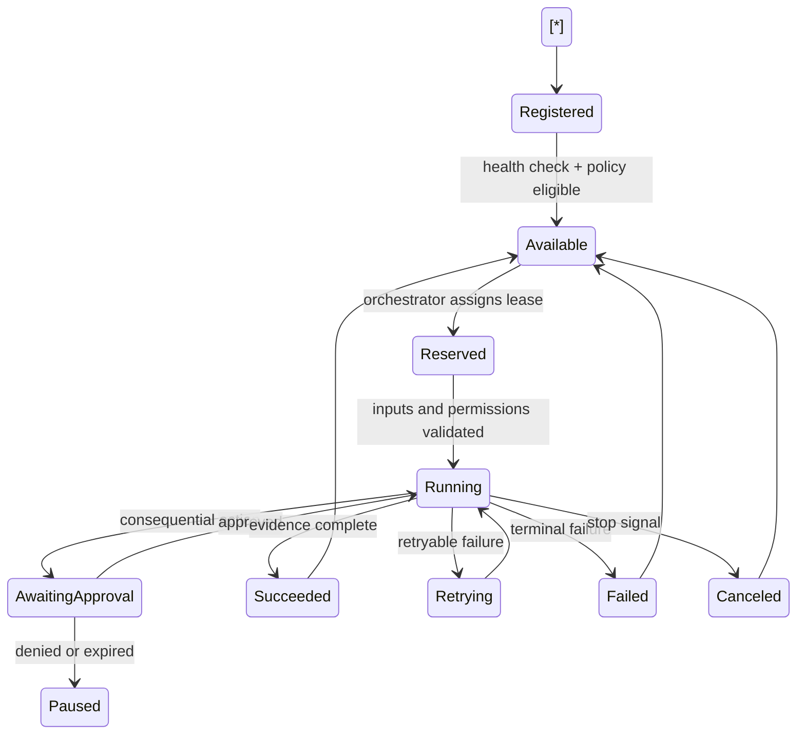
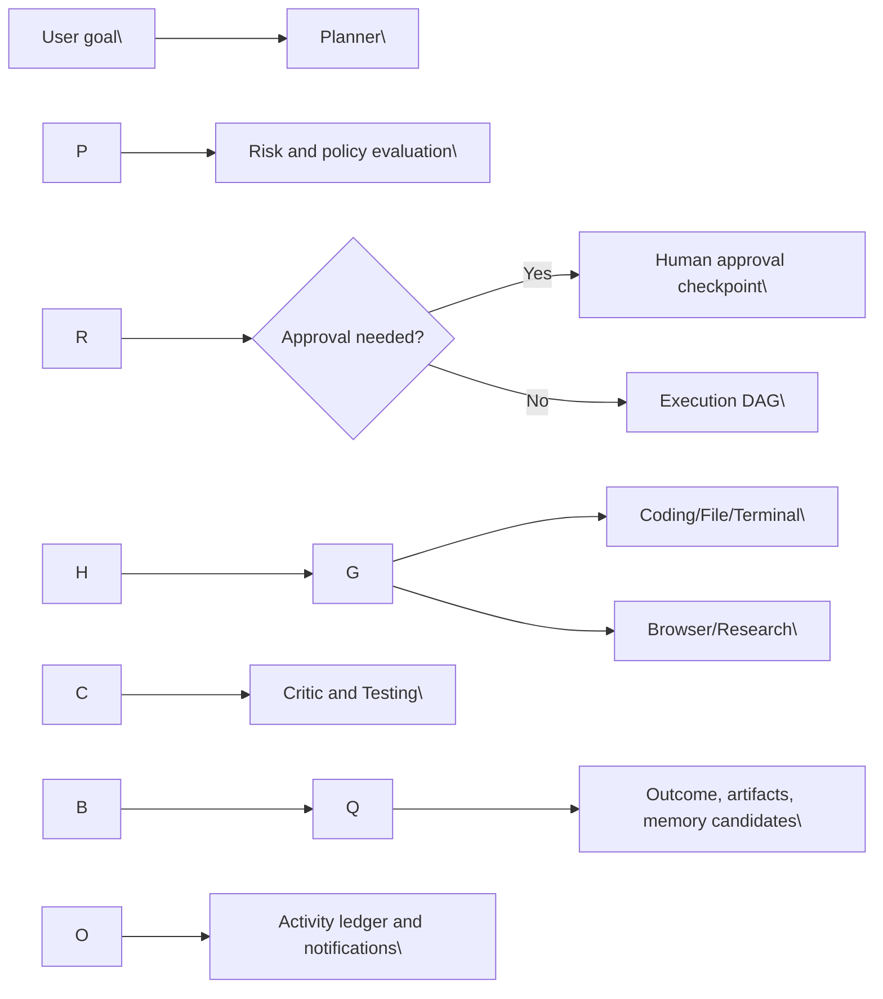
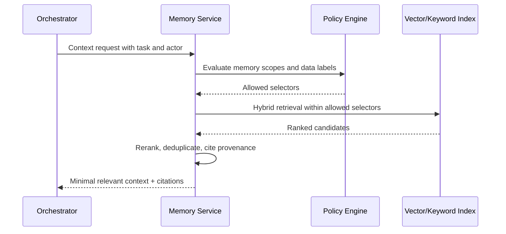
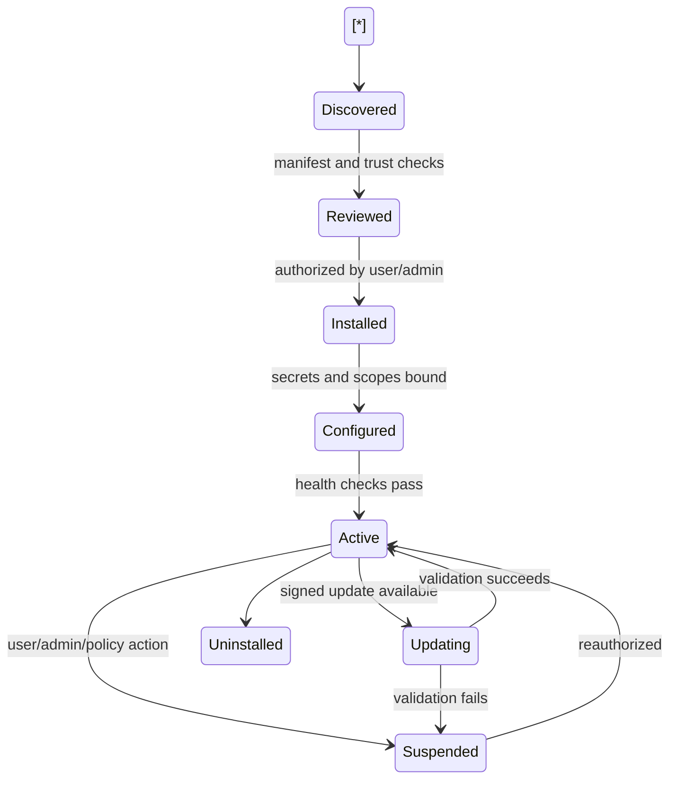
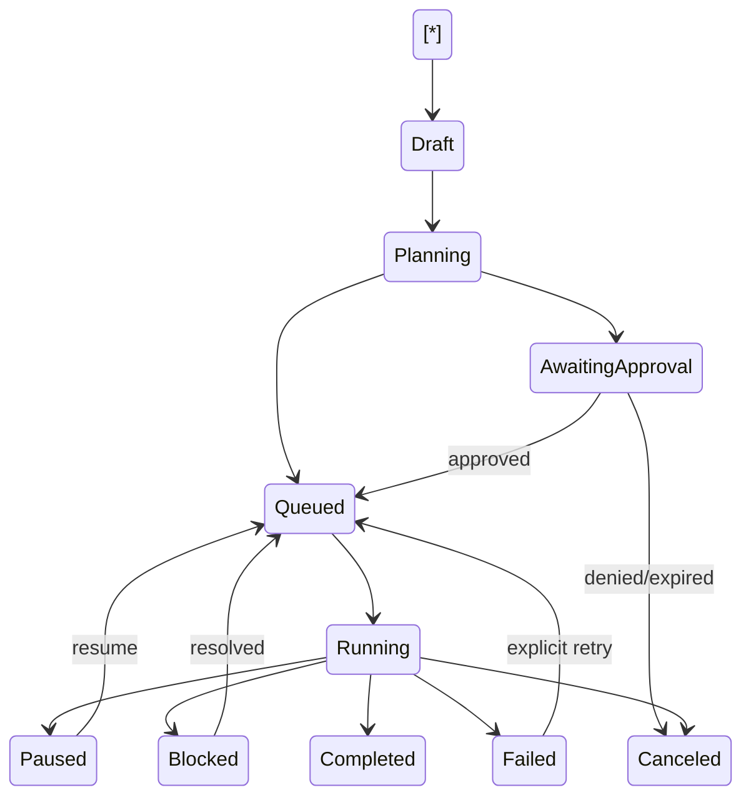

# NexusOS — Enterprise PRD for AI Desktop Agent & Web Platform

## Document Control

| Field | Value |
| --- | --- |
| Status | Draft for product, architecture, security, and engineering review |
| Product | NexusOS (working name) |
| Primary platforms | Windows desktop agent and responsive web dashboard |
| Intended release path | MVP → Alpha → Beta → Public Beta → v1 → v1.5 → v2 |
| Primary audience | Product, design, engineering, security, operations, QA, and executive stakeholders |
| Key assumption | Cloud control plane with a Windows-first execution plane; self-hosted and additional OS support are future extensions unless explicitly planned |

## TL;DR

NexusOS is an AI operating system that plans and performs authorized work across a user’s Windows desktop, browser, files, terminal, IDEs, and connected services. It pairs a local desktop agent with a web command center, allowing users to delegate outcomes, observe execution in real time, approve consequential actions, and retain control through granular permissions, auditability, and emergency stop controls.

The product is not a conversational assistant with tool calls bolted on. It is a durable task-execution platform: an orchestrator decomposes goals, routes work to specialized agents and models, coordinates dependencies, manages retries, and records an explainable activity trail. The initial product emphasizes safe, high-value developer and knowledge-work workflows, then expands through a connector and MCP registry, plugins, design automation, and multimodal creation capabilities.

---

# 1\. Executive Summary

## 1.1 Problem

Knowledge workers repeatedly context-switch between browsers, files, terminals, IDEs, SaaS tools, and communication systems. Existing automation is usually brittle, isolated, difficult to monitor, or requires users to write scripts. Chat assistants can suggest steps but generally cannot safely complete end-to-end work across a user’s actual environment.

This creates four persistent gaps:

1. Execution gap: users must manually turn plans into actions.
2. Context gap: tools lack persistent, permissioned knowledge of projects, environments, and preferences.
3. Control gap: users cannot safely supervise autonomous work with meaningful guardrails and recovery.
4. Integration gap: workflows span local applications, browsers, APIs, MCP servers, and files without a unified execution layer.

## 1.2 Opportunity

NexusOS provides an outcome-oriented workspace where a user can assign work such as “review this repository, fix the failing tests, and open a draft pull request” or “research competitors, save evidence, and prepare a briefing.” The system develops a plan, asks for only the approvals needed, executes through the appropriate local or connected tools, and surfaces live evidence, checkpoints, cost, and history.

## 1.3 Product Principles

* Autonomy with boundaries: automate aggressively inside explicit user authority.
* Observable by default: every material action has a trace, rationale, actor, timestamp, and result.
* Local-first trust: sensitive execution and secrets remain on the device whenever feasible.
* Reversible by design: favor previews, drafts, checkpoints, version history, and recoverable actions.
* Tool-agnostic execution: IDEs, models, browsers, MCPs, and plugins are replaceable adapters.
* Progressive capability: new users begin with narrow permissions; autonomy expands through trust and demonstrated success.
* Premium operational clarity: the product should feel like a focused operating system, not a chat transcript.

## 1.4 Product Scope

In scope:

* Windows desktop agent, system tray controls, local tool adapters, and resumable execution.
* Web dashboard for remote task creation, oversight, approvals, configuration, analytics, and governance.
* Cloud control plane, task orchestration, model routing, secure device messaging, memory, activity, and plugin registry.
* Built-in agents for planning, terminal, files, browser, coding, research, memory, critique, testing, deployment, documentation, vision, voice, and communication.
* Native and connector-based integrations, including MCP server registration and governance.

Out of scope for v1:

* Fully unbounded autonomy with no policy or approval layer.
* macOS/Linux execution support, except architecture compatibility and exploratory adapters.
* Guaranteed control of arbitrary proprietary applications without a supported automation surface.
* Marketplace monetization and third-party plugin revenue sharing before the plugin security model is mature.

---

# 2\. Goals

## 2.1 Business Goals

1. Establish NexusOS as a trusted desktop-to-cloud AI execution platform for technical and knowledge-work users.
2. Achieve 40% weekly active usage among activated Alpha users within 60 days of invitation.
3. Reach a median of three completed meaningful tasks per activated user per week by v1.
4. Maintain a task-success rate of at least 80% for supported, pre-authorized workflows by v1.
5. Create an extensible connector/MCP ecosystem that can support 25 vetted first-party or partner integrations by v1.5.

## 2.2 User Goals

1. Delegate multi-step work without manually coordinating every tool.
2. Maintain control over sensitive actions through understandable permission and approval choices.
3. See what the agent is doing now, what it changed, and how to undo or continue safely.
4. Reuse trusted project context, preferences, reusable playbooks, and connected tools.
5. Move work between desktop and web without losing task state.

## 2.3 Non-Goals

1. Replace professional judgment in high-impact domains such as legal, medical, hiring, or financial decisions.
2. Circumvent access controls, CAPTCHA systems, anti-bot measures, or website terms.
3. Conceal automated activity from users, administrators, or service providers.

---

# 3\. Personas

| Persona | Context | Primary jobs | Key concerns | Priority workflows |
| --- | --- | --- | --- | --- |
| Developer | Works across repos, terminals, issue trackers, and IDEs | Diagnose, implement, test, document, ship | Code safety, secrets, diffs, reliable tooling | Fix test failures; dependency updates; PR drafts |
| Student | Juggles research, notes, coursework, and deadlines | Gather sources, organize study material, draft work | Academic integrity, privacy, clarity | Research brief; citation collection; file organization |
| Startup founder | Operates across product, sales, operations, and engineering | Move quickly with small-team leverage | Cost, oversight, prioritization | Market research; customer synthesis; release coordination |
| Researcher | Works with papers, datasets, experiments, and citations | Search, extract, compare, document evidence | Provenance, reproducibility, sensitive data | Literature review; dataset preparation; research log |
| Freelancer | Manages multiple clients, files, communications, and delivery | Produce work and reduce admin overhead | Client separation, time, confidentiality | Proposal drafts; project setup; delivery packaging |
| Designer | Uses design tools, assets, briefs, and collaboration tools | Prepare assets, inspect files, document design decisions | Visual fidelity, source integrity | Asset inventory; handoff documentation; design QA |
| Recruiter | Coordinates candidates, roles, notes, and outreach | Source, organize, communicate, schedule | PII, consent, fairness | Candidate research; pipeline summaries; outreach drafts |
| Content creator | Works across research, scripts, media assets, and publishing tools | Produce and package content | Brand voice, copyright, review | Research packs; file organization; publishing drafts |
| Business owner | Runs operations across financial, customer, and staff systems | Automate repeatable operations | Risk, visibility, delegation | Operational reports; customer follow-ups; document workflows |
| Power user | Configures automation, models, MCP servers, and scripts | Build reusable workflows and environments | Extensibility, precision, local control | Custom MCPs; task templates; local model routing |

## 3.1 Persona Requirements

* Every persona needs transparent action logs, approval controls, and workspace-level isolation.
* Developers and power users require terminal, Git, IDE, local-model, MCP, and API-key workflows.
* Business owners and recruiters require strong data boundaries, audit history, and role-based administration.
* Designers and creators require file previews, metadata, asset-aware organization, and future vision-capable workflows.
* Students and researchers require source provenance, citation capture, and explicit academic-integrity guidance.

---

# 4\. Product Vision and Experience Model

## 4.1 Mental Model

NexusOS is an operational workspace with five layers:

1. Command: describe an outcome in chat, task form, saved playbook, API, or external trigger.
2. Plan: inspect the proposed execution graph, tools, permissions, estimates, and approval checkpoints.
3. Execute: specialized agents act on the local device and connected services.
4. Supervise: users view live activity, artifacts, logs, browser sessions, and requests for approval.
5. Learn: successful context, user preferences, project data, and reusable workflow knowledge are stored subject to memory policy.

## 4.2 Core User Journeys

### Journey A: Developer fixes a failing test

1. User selects a connected Windows device and enters: “Investigate failing tests in the Acme API repository. Make a minimal fix, run the test suite, and create a draft PR. Ask before pushing.”
2. Planner detects the project, proposes a plan, required permissions, expected terminal/Git use, and a push approval checkpoint.
3. User approves execution and grants temporary repository write and terminal permissions.
4. Desktop agent opens the project or uses an approved workspace path, examines Git status, runs tests, and streams structured logs.
5. Coding and testing agents coordinate changes; critic agent reviews the diff for scope, regressions, and secrets.
6. User sees changed files, test evidence, and a concise summary. The system requests approval before remote push and PR creation.
7. After approval, the Git plugin opens a draft PR. Activity timeline records every command, diff artifact, approval, and external request.

### Journey B: Founder creates an evidence-backed competitive briefing

1. User delegates a research task with competitors, questions, output format, and destination folder.
2. Research agent creates a source plan, launches a visible or managed browser session, and captures URLs, timestamps, extracts, and confidence.
3. Critic agent flags weak claims and missing sources.
4. Documentation agent creates a draft briefing in a user-selected location; file agent saves a versioned artifact.
5. The user reviews, edits, and approves optional sharing through a connected drive or communication plugin.

### Journey C: Power user adds an MCP server

1. User opens Marketplace → MCP Servers → Add server.
2. They choose hosted, local command, or remote URL transport; NexusOS validates manifest, tool schema, signing status, endpoint trust, and requested scopes.
3. User maps secrets from the vault and chooses device, workspace, allowed tools, network boundary, and approval policy.
4. The server runs in a constrained host where possible. Tool invocations are visible in the activity feed and governed by policy.
5. The user can test tools in a sandbox, promote the connector to a workspace, suspend it, rotate secrets, or revoke access.

---

# 5\. Functional Requirements

## 5.1 Requirements Conventions

Priority definitions:

| Priority | Meaning |
| --- | --- |
| P0 | Required for MVP safety and core value |
| P1 | Required for v1 differentiated workflows |
| P2 | Planned expansion after core validation |
| P3 | Future exploration |

Each requirement has a stable identifier for planning and acceptance testing.

## 5.2 Identity, Workspaces, and Devices

| ID | Priority | Requirement | Acceptance criteria |
| --- | --- | --- | --- |
| IDN-001 | P0 | Users can sign up, sign in, sign out, reset credentials, and manage active sessions. | Session list shows device, IP region, last activity, and revoke action. |
| IDN-002 | P0 | A user can create personal or organization workspaces. | Workspace switching isolates tasks, memory, connectors, and audit history. |
| IDN-003 | P0 | Windows devices can be paired through a short-lived, user-confirmed flow. | Pairing requires authenticated web session plus local confirmation code or deep link. |
| IDN-004 | P0 | Device trust state is continuously evaluated. | Untrusted, stale, compromised, or revoked devices cannot execute tasks. |
| IDN-005 | P1 | Organizations support RBAC: owner, admin, operator, member, auditor, billing. | Role grants are enforced by API and UI; audit records capture changes. |
| IDN-006 | P1 | Device groups and policy inheritance are supported. | Admin can apply policies to a group and override only where authorized. |

## 5.3 Task Management and Chat

| ID | Priority | Requirement | Acceptance criteria |
| --- | --- | --- | --- |
| TSK-001 | P0 | Users can create tasks from chat, quick command palette, task form, API, or saved playbook. | A task has title, goal, workspace, target device, mode, and status. |
| TSK-002 | P0 | Tasks support statuses: draft, planning, awaiting approval, queued, running, paused, blocked, completed, failed, canceled, expired. | Status transitions are validated and logged. |
| TSK-003 | P0 | A task shows plan, progress, events, artifacts, tool calls, costs, approvals, and final outcome. | User can inspect each action and linked evidence. |
| TSK-004 | P0 | Users can pause, resume, cancel, duplicate, and archive a task. | Cancellation sends a signed stop signal and confirms terminal/browser child process handling. |
| TSK-005 | P1 | Tasks support dependencies, parallel branches, scheduled starts, and retries. | Dependency failure applies configurable propagation policy. |
| TSK-006 | P1 | Users can save task templates/playbooks with variables and policy presets. | Template execution requires variable validation and displays tool footprint. |
| TSK-007 | P2 | External events can trigger approved playbooks. | Trigger runs are rate-limited, attributed, and governed by the same policies. |

## 5.4 Desktop Agent

### Responsibilities

* Start automatically after user-enabled installation and run as a signed background application.
* Maintain a mutually authenticated, encrypted outbound connection to the control plane.
* Register device capabilities, health, agent version, installed adapters, and policy state.
* Execute only signed, policy-validated task leases targeted to the device.
* Run background jobs, persist resumable state locally, queue outbound events while offline, and reconcile on reconnect.
* Provide local notifications, system tray controls, local approval prompts, and a kill switch.

| ID | Priority | Requirement | Acceptance criteria |
| --- | --- | --- | --- |
| DSK-001 | P0 | Installer is code-signed, supports per-user installation, and clearly asks for startup and permission choices. | User can decline startup without blocking basic app use. |
| DSK-002 | P0 | Agent exposes system tray state: connected, working, awaiting approval, offline, error, paused. | Tray menu supports open dashboard, pause agent, view active task, diagnostics, quit. |
| DSK-003 | P0 | Agent uses an outbound persistent connection; it does not require inbound firewall ports. | Connectivity survives NAT and enterprise-standard egress rules where permitted. |
| DSK-004 | P0 | Agent executes terminal commands through a controlled runner with working-directory and environment isolation. | Command, exit code, duration, redacted output, and process tree are logged. |
| DSK-005 | P0 | Agent can access selected local paths only after policy evaluation. | Attempts outside scope fail with a user-readable reason. |
| DSK-006 | P0 | Agent can launch supported applications and detect their lifecycle. | Launch events and failures appear in activity stream. |
| DSK-007 | P1 | Agent resumes eligible interrupted tasks after crash/reboot/reconnect. | Resume requires lease validity and state integrity checks. |
| DSK-008 | P1 | Agent offers local diagnostic bundle generation. | Bundle excludes secrets by default and requires user confirmation to upload. |
| DSK-009 | P1 | Agent update system supports signed staged rollout and rollback. | Failed updates revert to last known good version. |

## 5.5 File System Operations

| ID | Priority | Requirement | Acceptance criteria |
| --- | --- | --- | --- |
| FIL-001 | P0 | Support read, list, search, copy, move, rename, create, and write inside authorized roots. | Every mutation has before/after metadata and actor trace. |
| FIL-002 | P0 | Delete operations always require an explicit approval unless a narrowly scoped policy grants a recoverable exception. | Default deletion moves to Recycle Bin where supported. |
| FIL-003 | P1 | Support compress, extract, duplicate detection, metadata inspection, previews, and content search. | Large-file operations report progress and cancellation state. |
| FIL-004 | P1 | Provide version snapshots for agent-authored text and supported structured files. | User can compare and restore a prior snapshot. |
| FIL-005 | P1 | Detect sensitive files and apply heightened approval requirements. | Credentials, key material, system directories, and configured patterns are protected. |
| FIL-006 | P2 | Support asset-aware operations for design and media files. | Preview pipeline provides metadata and safe derived thumbnails. |

## 5.6 Terminal and Developer Tooling

| ID | Priority | Requirement | Acceptance criteria |
| --- | --- | --- | --- |
| DEV-001 | P0 | Support PowerShell, CMD, Git, Node, Python, package managers, and environment discovery. | Tool availability and version are reported before task execution. |
| DEV-002 | P0 | Terminal execution supports foreground and managed background processes. | Background jobs show PID, health, logs, stop control, and ownership. |
| DEV-003 | P1 | Support Docker subject to explicit permission and resource limits. | Image pulls, mounts, ports, and privileged flags are surfaced for approval. |
| DEV-004 | P1 | Support virtual environments and project-local dependency installation. | The agent prefers project-local environments and records changes. |
| DEV-005 | P1 | Git operations include status, diff, branch, commit, push, pull request through connectors, and conflict detection. | Push, force push, protected branch actions, and remote PR creation require policy evaluation. |

## 5.7 Browser Automation

### Operating model

Browser automation operates in one of three modes:

1. Assisted: user sees and controls a normal browser; agent suggests or fills drafts.
2. Managed visible: agent controls an isolated visible profile/window, streaming readable activity.
3. Managed headless: permitted only for low-risk, policy-allowed workflows with explicit domain allowlisting.

| ID | Priority | Requirement | Acceptance criteria |
| --- | --- | --- | --- |
| BRW-001 | P0 | Browser sessions are tied to workspace, device, profile, and task. | Session lifecycle and domain activity are visible. |
| BRW-002 | P0 | Agent can navigate, extract structured page data, fill forms, upload/download files, and capture screenshots with authorization. | Sensitive form submission requires approval by default. |
| BRW-003 | P0 | Agent must never bypass CAPTCHA, paywalls, MFA, or anti-bot controls. | It pauses and requests user intervention where required. |
| BRW-004 | P1 | Domain policies classify read, draft, submit, purchase, publish, account change, and data export actions. | High-impact actions request just-in-time approval with a clear consequence summary. |
| BRW-005 | P1 | Browser sessions can persist only with explicit user choice and protected local credential storage. | User can clear session, cookies, and downloads from dashboard or desktop. |
| BRW-006 | P2 | Web testing mode supports test plans, trace capture, screenshots, and non-production safeguards. | Production destructive test actions are blocked unless specifically authorized. |

## 5.8 IDE Integration

* P0: VS Code extension providing workspace discovery, file context handoff, task links, diff review entry points, and terminal association.
* P1: Cursor and Antigravity IDE adapter framework using capability detection rather than hard-coded product assumptions.
* P2: IDE-neutral local protocol for future editors.

The desktop agent remains authoritative for permission enforcement. IDE extensions cannot independently gain broader local access.

## 5.9 Connector, Plugin, and MCP Registry

| ID | Priority | Requirement | Acceptance criteria |
| --- | --- | --- | --- |
| CON-001 | P0 | Dashboard contains a unified Integrations area for plugins, OAuth/API connections, local tools, and MCP servers. | Users can filter by type, status, workspace, device, permission, and trust level. |
| CON-002 | P0 | Users can register local and remote MCP servers with a manifest, transport, tool schema, secret bindings, and scopes. | Unverified tools cannot execute without an explicit trust decision. |
| CON-003 | P1 | Registry supports GitHub, GitLab, Notion, Slack, Discord, Google Drive, Figma, Jira, email, calendar, Docker, Supabase, and local AI model connectors. | Every connector implements standard lifecycle and permission contracts. |
| CON-004 | P1 | Connectors declare data classes, outbound domains, actions, required grants, and risk tier. | Policy engine evaluates connector actions before invocation. |
| CON-005 | P1 | Marketplace supports discovery, install, update, suspend, uninstall, reviews, verified publisher badges, and compatibility metadata. | Install flow shows a human-readable permission manifest. |
| CON-006 | P2 | Connector packs support design workflows, 2D/3D motion graphics, and asset pipelines. | Packs can register capabilities without bypassing the core permission system. |

---

# 6\. AI Orchestration and Multi-Agent Design

## 6.1 Orchestrator Responsibilities

The orchestration service converts a user objective into a policy-constrained execution graph. It must:

* Classify task intent, sensitivity, affected resources, and required capabilities.
* Retrieve relevant task, workspace, device, connector, project, and memory context.
* Generate alternative plans where risk, cost, or ambiguity warrants comparison.
* Select agents and models based on capability, policy, quality, latency, availability, and budget.
* Create explicit dependency edges, checkpoints, rollback strategy, and evidence requirements.
* Dispatch signed work leases to local or cloud runners.
* Detect failures, distinguish transient from terminal errors, retry safely, and escalate with context.
* Run critique/review gates before consequential actions.
* Maintain an execution ledger and publish normalized activity events.

## 6.2 Agent Catalog

| Agent | Purpose | Inputs | Outputs | Default permissions | Failure handling |
| --- | --- | --- | --- | --- | --- |
| Planner | Converts outcome into execution graph | Goal, context, policy | Plan, estimates, checkpoints | Read-only metadata | Ask clarifying question or generate constrained alternatives |
| Coding | Analyzes and modifies code | Repo context, task branch | Diff, notes, tests requested | Scoped file read/write | Revert patch, request review, hand off to critic |
| Browser | Performs authorized web actions | URL/domain policy, steps | Extracts, screenshots, action receipts | Browser session scope | Pause on login/MFA/ambiguous UI |
| Research | Finds and evaluates sources | Questions, sources, time budget | Evidence set, synthesis | Browser read and file draft | Mark uncertainty and request source expansion |
| Memory | Retrieves, proposes, and curates memory | Task, workspace policy | Ranked context, candidate memories | Memory read; write by policy | Avoid write on low confidence; request confirmation |
| File | Safely manages local artifacts | Paths, policies, instructions | File changes, previews, snapshots | Scoped filesystem | Stop on conflict, sensitive path, or destructive action |
| Terminal | Executes approved commands | Command plan, environment | Logs, artifacts, exit result | Terminal scope | Classify exit failure; clean up child processes |
| Vision | Interprets authorized images/screens | Image/video frames, task | Structured observations | Read-only media scope | Report confidence and preserve source reference |
| Voice | Handles opt-in voice input/output | Audio stream, locale | Transcript, response | Mic only while active | Clearly signal recording and avoid hidden capture |
| Communication | Drafts or sends messages | Recipient, channel, content | Draft/send receipt | Connector scope | Default to draft; pause before external send |
| Critic | Reviews plan, output, risk, and evidence | Plan/diff/result | Findings, approval recommendation | Read-only task data | Blocks release on critical policy violation |
| Testing | Executes validation suite | Test plan, repo/app | Test results, traces | Terminal/browser test scope | Isolate flaky results and suggest rerun |
| Deployment | Performs controlled releases | Build artifacts, target | Deployment receipt, rollback point | Deployment connector scope | Requires protected environment gate |
| Documentation | Produces structured documentation | Artifacts, source evidence | Docs, changelog, runbook | File write/draft connector | Cite sources and flag gaps |

## 6.3 Agent Lifecycle



## 6.4 Plan and Execution Graph

A plan is a versioned directed acyclic graph (DAG) of steps. Each step includes:

* objective and expected evidence;
* assigned agent and candidate fallback agents;
* input references and output artifact contract;
* capability requirements and permission scope;
* risk classification and approval policy;
* retry policy, timeout, idempotency key, and rollback instruction;
* model budget, confidence threshold, and escalation route.



## 6.5 Model Routing

The router evaluates provider/model candidates against:

* task type: classification, extraction, coding, planning, long-context synthesis, visual interpretation, or conversational response;
* quality score measured through offline benchmarks and production feedback;
* effective context window and tool-use reliability;
* current provider latency, rate limits, availability, and error rate;
* organization/user allowlist and data residency restrictions;
* estimated token cost and per-task/workspace budget;
* sensitivity tier and provider data-processing policy;
* fallback compatibility.

Supported provider adapters initially include OpenAI, Gemini, and Groq, with a provider-neutral interface for future vendors and local models. The system must not silently route a restricted data class to a provider that is disallowed by workspace policy.

Routing policies:

* Use deterministic, low-cost models for classification and routine extraction where quality thresholds are met.
* Use coding-specialized models for patch generation and review.
* Use high-reasoning models for complex planning, ambiguity resolution, and critical review.
* Use local models when selected and capabilities meet task requirements.
* On provider outage, fall back only to policy-compatible models; otherwise pause and notify the user.

---

# 7\. Permission Architecture

## 7.1 Design

NexusOS uses capability-based authorization layered with RBAC, device trust, workspace policy, resource scope, action risk, and runtime context. A permission grant is not a blanket instruction to act: each tool invocation is evaluated against current policy and may require a just-in-time approval.

## 7.2 Permission Taxonomy

| Capability family | Examples | Default posture |
| --- | --- | --- |
| Files | Read folder, write folder, rename, copy, delete, archive | Deny until path-scoped grant |
| Terminal | Run command, background process, install package, elevate | Require scoped grant; elevation always explicit |
| Development | Git read/write/push, Docker, IDE context | Read narrowly; remote mutations gated |
| Browser | Navigate, read, fill, upload, download, submit | Read/assist allowed with authorization; submit gated |
| Device | Clipboard, camera, microphone, notifications, startup | Explicit OS and NexusOS consent |
| Network | Outbound domains, local network, remote endpoints | Allowlisted by connector/task policy |
| Integrations | Read/write per connected service resource | OAuth scopes minimized and visible |
| Memory | Read, write, edit, delete, export | Workspace policy plus user ownership rules |
| Administration | User, policy, billing, audit, device management | Role restricted |

## 7.3 Grant Structure

A grant includes subject, workspace, device, resource selector, permitted actions, conditions, expiry, approver, provenance, and revocation state. Conditions may include task type, allowed domains, working hours, required human presence, maximum file count, maximum spend, or environment designation.

Grant durations:

* One-time: valid for a single action receipt.
* Task-scoped: expires when task terminates.
* Session-scoped: expires on session end or inactivity.
* Time-bounded: explicit expiry timestamp.
* Persistent: requires user/admin consent and periodic review.

## 7.4 Approval UX

Approval cards must state:

* what will happen in plain language;
* affected application, account, path, domain, or service;
* why the action is needed;
* reversibility and potential impact;
* relevant evidence, diff, command, or data preview;
* choices: approve once, approve for task, approve with narrower scope, deny, or stop task.

High-risk actions always require a fresh explicit approval: deleting outside recycle bin, force push, sending external communications, purchases, changing credentials/security settings, production deployment, sensitive-data export, privilege escalation, and irreversible account actions.

## 7.5 Emergency Controls

* Global pause stops new tool invocation and pauses active tasks at safe boundaries.
* Device disconnect revokes active execution leases immediately.
* Kill switch terminates managed child processes subject to operating-system constraints.
* Revoke-all removes connector tokens, device trust, and persistent grants as selected by the user/admin.
* Incident mode disables high-risk capabilities organization-wide.

---

# 8\. Memory Architecture

## 8.1 Memory Classes

| Class | Purpose | Storage and retention |
| --- | --- | --- |
| Working memory | Current task state and recent context | Ephemeral, task-bound, encrypted |
| Episodic memory | Summaries of completed work and decisions | Workspace-scoped, retention policy controlled |
| Semantic memory | Stable preferences, concepts, coding style, project knowledge | Versioned facts with confidence and provenance |
| Procedural memory | Reusable playbooks, successful strategies, tool recipes | Explicitly saved or high-confidence candidate proposals |
| Artifact memory | Indexed documents, code metadata, media descriptors | Source-linked and access-controlled |

## 8.2 Requirements

* Memory writes must have source, timestamp, owner/workspace, confidence, sensitivity label, and retention policy.
* The system proposes memories rather than silently storing sensitive or low-confidence personal details.
* Users can inspect, edit, pin, disable, export, and delete memories.
* Retrieval is access-aware: the model receives only memory allowed for the task, workspace, device, and actor.
* Deletion removes active retrieval access immediately and triggers deletion propagation according to storage policy.
* Retrieval combines lexical search, metadata filters, recency, semantic vector similarity, graph relationships, authority, and confidence.

## 8.3 Retrieval Flow



## 8.4 Privacy Controls

Memory defaults to workspace isolation. Personal memory is never visible to an organization workspace unless the user intentionally copies or shares it. Sensitive data classifiers identify secrets, payment information, health information, government IDs, and configured enterprise patterns; such content is excluded from automatic memory creation unless a policy explicitly permits it.

---

# 9\. System Architecture

## 9.1 Logical Architecture

```mermaid
flowchart TB
  WEB\[Web Dashboard\] --> API\[API Gateway\]
  DESK\[Windows Desktop Agent\] <-->|mTLS WebSocket| EDGE\[Device Gateway\]
  API --> AUTH\[Identity and Authorization\]
  API --> ORCH\[Orchestrator\]
  API --> ACT\[Activity and Notification Service\]
  API --> REG\[Connector/MCP Registry\]
  ORCH --> POLICY\[Policy Engine\]
  ORCH --> MODEL\[Model Router\]
  ORCH --> QUEUE\[Durable Task Queue\]
  ORCH --> MEM\[Memory Service\]
  ORCH --> ART\[Artifact Service\]
  QUEUE --> RUN\[Cloud Agent Runners\]
  EDGE --> LOCAL\[Local Tool Runners\]
  MEM --> DB\[(Relational DB)\]
  MEM --> VEC\[(Vector Index)\]
  ACT --> LOG\[(Event/Log Store)\]
  ART --> OBJ\[(Object Storage)\]
  REG --> VAULT\[Secrets Vault\]
  API --> OBS\[Observability Platform\]

```

## 9.2 Trust Boundaries

1. Browser/web client: untrusted presentation layer; all authorization is server-enforced.
2. Cloud control plane: trusted service boundary with service-to-service identity.
3. Device agent: independently authenticated execution boundary; assumes local user/environment may be hostile or compromised.
4. Tool/connector boundary: third-party or local systems with least-privilege grants and input/output validation.
5. Model provider boundary: data exposure is policy-governed, minimized, and logged.

## 9.3 Desktop-to-Cloud Protocol

* Device initiates outbound connection using TLS 1.3 and device-bound credentials.
* Mutual authentication uses a device certificate or hardware-backed key where available.
* Server issues short-lived signed work leases containing task step ID, policy snapshot hash, capabilities, expiry, nonce, and idempotency key.
* Agent validates signature, device target, expiration, capability constraints, and local policy before execution.
* Events use an ordered envelope with sequence IDs, acknowledgements, retry, local encrypted spool, and deduplication.
* Control messages include pause, resume, cancel, revoke, rotate credentials, update policy, and update agent.

## 9.4 Execution Isolation

Tool runners execute with the narrowest practical Windows user context, resource controls, allowlisted working directories, sanitized environment variables, and network egress policy. High-risk or untrusted plugin/MCP processes run in an isolated host process or sandbox where operating-system support permits. The system must clearly disclose when full sandboxing is unavailable.

---

# 10\. Backend and API Design

## 10.1 Service Domains

| Service | Responsibilities |
| --- | --- |
| API Gateway | REST/GraphQL boundary, request validation, rate limits, auth context |
| Identity Service | Accounts, SSO, MFA, RBAC, session lifecycle, SCIM later |
| Device Gateway | Device pairing, mTLS connections, leases, event relay, health |
| Orchestrator | Plans, execution graphs, dispatch, retries, model routing coordination |
| Policy Service | Authorization decisions, policy versions, approvals, risk scoring |
| Task Service | Task CRUD, state machine, schedules, templates, dependencies |
| Memory Service | Ingestion, retrieval, lifecycle, deletion, consent |
| Connector Registry | Manifests, installations, MCP configuration, plugin lifecycle |
| Artifact Service | Encrypted artifact storage, previews, retention, signed access |
| Activity Service | Normalized event ledger, real-time feed, audit projections |
| Notification Service | In-app, desktop, email, webhook notification delivery |
| Billing/Usage Service | Metering, budget controls, plan entitlements, invoice-ready records |

## 10.2 API Standards

* Versioned public APIs under `/v1`.
* OAuth 2.1/OIDC access tokens for users; signed device credentials for agents; service identities internally.
* Idempotency keys required for mutation endpoints that can be retried.
* Cursor pagination, explicit field filtering, and stable resource IDs.
* Structured errors: code, message, correlation ID, retryability, field errors, safe remediation.
* OpenAPI specification generated and published for supported external APIs.
* Webhooks signed with rotating secrets and replay protection.

## 10.3 Representative Endpoints

| Method | Endpoint | Purpose |
| --- | --- | --- |
| POST | `/v1/tasks` | Create task or draft |
| GET | `/v1/tasks/{taskId}` | Get task, plan, status, artifacts summary |
| POST | `/v1/tasks/{taskId}/approve` | Approve scoped checkpoint |
| POST | `/v1/tasks/{taskId}/cancel` | Request cancellation |
| GET | `/v1/tasks/{taskId}/events` | Paginated normalized events |
| POST | `/v1/devices/pair` | Start device pairing |
| GET | `/v1/devices` | List devices and health |
| POST | `/v1/permissions/grants` | Create scoped permission grant |
| POST | `/v1/connectors` | Install/configure connector |
| POST | `/v1/mcp-servers` | Register MCP server |
| GET | `/v1/memory/search` | Access-controlled memory retrieval |
| GET | `/v1/audit-events` | Filterable audit history |

## 10.4 Real-Time Events

Web clients subscribe to workspace-scoped WebSocket or server-sent event channels. Events are signed internally, permission-filtered before delivery, and may include task status, activity entries, approval requests, device health, logs, notifications, and connector lifecycle updates.

---

# 11\. Data Design

## 11.1 Technology Recommendation

* Primary relational store: PostgreSQL for transactional consistency, row-level security options, JSONB metadata, and mature operational tooling.
* Cache/ephemeral coordination: Redis-compatible service for rate limits, presence, short-lived leases, and queue support.
* Durable workflow/task queue: managed durable queue or workflow engine supporting retries, schedules, visibility timeouts, and idempotency.
* Vector search: PostgreSQL vector extension for early stages; separate managed vector index when scale/latency warrants it.
* Object storage: encrypted S3-compatible storage for artifacts, screenshots, previews, diagnostics, and exports.
* Event analytics/log store: columnar/event store for high-volume telemetry and queryable activity projections.

## 11.2 Core Entities

| Entity | Selected fields |
| --- | --- |
| users | id, email, name, status, locale, timezone, created_at |
| organizations | id, name, plan, policy_version, retention_profile |
| workspaces | id, organization_id, name, classification, settings |
| memberships | user_id, workspace_id, role, status |
| devices | id, user_id, device_public_key, platform, trust_state, agent_version, last_seen_at |
| tasks | id, workspace_id, creator_id, target_device_id, title, objective, status, risk_level, budget |
| task_steps | id, task_id, graph_node, agent_type, status, input_ref, output_ref, lease_id |
| approvals | id, task_step_id, action_summary, scope, status, approver_id, expires_at |
| permissions | id, subject_type, subject_id, resource_selector, actions, conditions, expiry |
| connectors | id, workspace_id, type, manifest_version, trust_tier, status, config_ref |
| mcp_servers | id, connector_id, transport, endpoint_ref, tool_manifest, host_policy |
| secrets | id, owner_scope, vault_ref, purpose, rotation_state |
| memories | id, workspace_id, type, content_ref, source_ref, confidence, labels, retention |
| artifacts | id, task_id, kind, storage_ref, checksum, classification, version |
| activity_events | id, workspace_id, task_id, actor, event_type, payload_ref, occurred_at |
| audit_events | id, actor, action, target, decision, correlation_id, immutable_at |
| sessions | id, user_id, auth_method, device_info, expires_at, revoked_at |
| usage_records | id, workspace_id, task_id, model, input_tokens, output_tokens, cost |

## 11.3 Data Retention

Default policies are configurable by workspace plan and jurisdiction. Suggested defaults: task metadata and audit events 24 months; operational logs 30–90 days; artifacts 90 days unless pinned; browser screenshots 30 days; memory retained until deleted or retention policy expires. Enterprise plans require legal hold, configurable residency, customer-managed retention, and export/delete workflows.

---

# 12\. Web Dashboard UX Specification

## 12.1 Navigation

Desktop-wide left navigation:

* Home / Dashboard
* Chat
* Tasks
* Activities
* Live Logs
* Running Agents
* Memory
* Files
* Browser Sessions
* Connected Devices
* Integrations
* Marketplace
* Permissions
* Analytics
* System Health
* Usage
* Notifications
* Audit History
* Settings
* Profile
* Billing

A persistent command palette supports keyboard-first navigation, task creation, global search, device switching, and safe quick actions.

## 12.2 Dashboard

The dashboard answers: what needs attention, what is running, and what changed?

Modules:

* Command input with device/workspace selector and autonomy mode.
* Active task cards with status, current step, duration, owner, and stop/pause controls.
* Approval inbox prioritized by expiry and risk.
* Recent activity timeline.
* Device health and connectivity summary.
* Usage/cost snapshot with budget alerts.
* Saved playbooks and recent artifacts.

## 12.3 Chat

Chat is a task-authoring and supervision surface, not the entire product. It contains task context, selected device, attached artifacts, cited memory, plan preview, action checkpoints, and compact execution updates. Long logs, artifacts, and diffs open into dedicated panes rather than flooding the chat transcript.

## 12.4 Task Detail

Three-column layout:

* Left: execution graph and step status.
* Center: live narrative, artifacts, approvals, and result.
* Right: permissions, device, model usage, budget, linked memory, and task controls.

Task modes:

* Ask: answer or plan only; no external action.
* Assist: prepares drafts and suggests actions.
* Execute with approvals: runs low-risk steps and pauses at gates.
* Trusted playbook: runs within a reviewed, persistent policy.

## 12.5 Design System

Visual direction: premium, calm, high-information-density operating system inspired by Linear, Notion, Arc, Raycast, Warp, Vercel, Apple, and Perplexity without reproducing any product’s trade dress.

* Theme: dark and light themes, system preference default, high-contrast option.
* Typography: legible neo-grotesk UI family, monospaced code/log family, clear hierarchy.
* Surfaces: layered panels; restrained translucency/glass only where readability is preserved.
* Color: semantic status colors never rely on color alone.
* Motion: 150–250 ms purposeful transitions; reduced-motion setting honored.
* Layout: responsive breakpoints for desktop, tablet, and mobile oversight; creation and approvals remain usable on mobile, while dense logs optimize for larger screens.
* Accessibility: WCAG 2.2 AA target, keyboard access for every interactive action, visible focus, ARIA labels, screen-reader announcements for task status changes.

## 12.6 States and Errors

Every page must implement loading, empty, permission-denied, offline, partial-data, and recoverable-error states. Errors include correlation ID, safe plain-language explanation, retry where appropriate, and link to diagnostics or support without exposing secrets.

---

# 13\. Desktop UX Specification

## 13.1 Onboarding

1. User downloads a signed installer from an authenticated dashboard.
2. Installer displays publisher identity, version, terms, startup option, and data/permission explanation.
3. App launches a pairing flow; user confirms workspace and device label.
4. Agent runs capability discovery and asks for only required initial permissions.
5. Interactive checklist validates local connection, notifications, selected workspace folder, and optional IDE integration.
6. User sees a first safe task example and controls for autonomy mode.

## 13.2 System Tray and Notifications

Tray icon communicates state without requiring a full window. Native notifications are actionable: approve/deny a low-context-safe request, open task, pause, or view details. Notifications must not display sensitive content on lock screen unless the user enables it.

## 13.3 Offline and Recovery

When offline, the agent may continue only leases explicitly marked offline-eligible and within their local policy snapshot. It stores encrypted event records locally. Actions requiring fresh approval, remote mutation, policy refresh, or credential refresh pause until connectivity returns. On restart, the agent checks task lease validity, process ownership, and artifact integrity before offering or performing recovery.

---

# 14\. Security Architecture and Threat Model

## 14.1 Security Objectives

* Prevent unauthorized device control and data access.
* Limit the blast radius of model errors, prompt injection, compromised connectors, and stolen credentials.
* Preserve a verifiable record of actions and approvals.
* Protect user and organization data in transit, at rest, and during processing.
* Provide rapid revocation, incident containment, and recoverability.

## 14.2 Controls

| Area | Controls |
| --- | --- |
| Authentication | OIDC/OAuth 2.1, MFA, optional enterprise SSO, secure password hashing, session rotation |
| Authorization | RBAC + capability grants + resource policies + device posture |
| Device trust | Pairing confirmation, device-bound keys, mTLS, revocation, version compliance |
| Encryption | TLS 1.3 in transit; envelope encryption at rest; keys managed in a KMS/HSM-backed service |
| Secrets | Vault-backed secret references, no plaintext in logs/prompts, scoped access, rotation and revocation |
| Audit | Immutable append-only audit stream with actor, policy decision, resource, correlation ID |
| Application security | Secure SDLC, SAST, DAST, dependency scans, SBOM, signed releases, code review |
| Runtime safety | Sandboxing, tool allowlists, command validation, egress controls, rate limits, process limits |
| Resilience | Backups, restore testing, multi-zone services, incident runbooks |

## 14.3 Prompt Injection and Tool Abuse Defenses

External content is untrusted by default. Browser pages, documents, emails, plugin responses, and MCP tool output are labeled as untrusted data and cannot directly alter policy, invoke privileged tools, reveal hidden instructions, or override user intent.

Defenses include:

* Separate system policy, user goal, trusted workspace data, and untrusted content in the agent context model.
* Structured tool contracts rather than free-form tool instructions.
* Tool-call validation against capability policy and explicit task plan.
* High-risk action confirmation independent of model text.
* Content provenance labels and injection heuristics.
* Critic review for suspicious instruction patterns and unexpected scope expansion.
* Output encoding and schema validation before passing data to downstream tools.
* Per-task budgets, maximum tool calls, loop detection, and anomaly detection.

## 14.4 Threat Model

| Threat | Example | Mitigation |
| --- | --- | --- |
| Account takeover | Stolen session token | MFA, short sessions, device/session visibility, revocation, anomaly detection |
| Device impersonation | Attacker registers fake agent | User-confirmed pairing, mTLS, device-bound keys, attestation where feasible |
| Prompt injection | Web page tells agent to exfiltrate secrets | Trust labeling, policy enforcement outside model, approval gates, output validation |
| Overbroad automation | Agent deletes unintended files | Path scopes, previews, recycle bin, confirmation, snapshots, rate limits |
| Malicious plugin/MCP | Connector requests excessive access | Signing, manifest review, isolation, network policy, scoped secrets, audit |
| Secret leakage | Token appears in terminal output | Redaction, vault references, secret scanning, restricted artifact access |
| Supply chain compromise | Tampered desktop update | Code signing, provenance, staged rollout, rollback, SBOM |
| Data exfiltration | Browser upload or network request | Egress policy, domain allowlist, data classification, approval and audit |
| Denial of service | Task loops or queue flooding | Budgets, circuit breakers, quotas, backpressure, retries with jitter |

## 14.5 Compliance Readiness

Build toward SOC 2 controls from the beginning: access reviews, change management, monitoring, incident response, vendor management, data inventory, and evidence collection. Enterprise roadmap should assess GDPR, CCPA/CPRA, regional residency, DPA needs, and sector-specific requirements only when target markets require them.

---

# 15\. Plugin and MCP Platform

## 15.1 Plugin Model

A plugin is a versioned package that exposes one or more capabilities through a declared manifest. It may include cloud service integration, local desktop adapter, workflow template, UI extension, or model provider adapter. An MCP server is treated as a connector subtype with MCP-specific transport and tool schemas.

## 15.2 Manifest Requirements

* Publisher identity and signature.
* Plugin ID, version, compatibility range, changelog, support status.
* Declared tools/actions and JSON schemas.
* Required OAuth scopes, secret types, local capabilities, outbound domains, and data classes.
* Risk tier and approval recommendations.
* UI contribution points and localized labels.
* Telemetry declaration and privacy statement.

## 15.3 Lifecycle



## 15.4 MCP Specific Requirements

* Support stdio/local process, HTTP streaming, and future approved transports.
* Validate tool schemas and cap payload/output sizes.
* Require explicit mapping between MCP tools and NexusOS permission categories.
* Run local MCP processes under constrained host policies where possible.
* Store remote endpoints and credentials as vault references, not task text.
* Support tool health checks, timeouts, cancellation, circuit breakers, and per-tool audit events.
* Provide a test console using non-production/limited credentials where available.

---

# 16\. Activity, Logs, and Observability

## 16.1 Activity System

The activity timeline is the canonical user-facing explanation of work. Events include task created, plan generated, step started, agent selected, permission evaluated, approval requested, browser launched, file modified, terminal command executed, connector invoked, retry scheduled, task completed, and task failed.

Each event contains human-readable summary plus structured details, actor, task, source component, timestamp, correlation ID, sensitivity label, and links to artifacts. Sensitive arguments and outputs are redacted before broad display.

## 16.2 Live Logs

Live Logs supports streaming with filters for task, device, agent, severity, tool, correlation ID, and time. It distinguishes user-visible operational events from engineering diagnostics. Users can copy sanitized commands and export authorized log bundles.

## 16.3 Operational Dashboards

* Task reliability: completion, failure category, retry rate, approval abandonment.
* Agent health: availability, queue depth, step duration, tool errors.
* Model operations: tokens, cost, latency, fallback use, quality feedback.
* Device health: online rate, agent versions, CPU/memory/network signals, crash rate.
* Security: denied actions, suspicious connector behavior, failed pairing, token anomalies.
* Product usage: activation, repeat task use, playbook use, connector adoption.

## 16.4 Service-Level Objectives

| Metric | Initial target |
| --- | --- |
| Control plane monthly availability | 99.9% excluding scheduled maintenance |
| Device event delivery p95 when connected | Under 2 seconds |
| Dashboard task-status update p95 | Under 3 seconds |
| API read latency p95 | Under 500 ms for standard queries |
| Approval delivery p95 | Under 5 seconds when push channel available |
| Task state durability | No acknowledged state transition loss |
| Critical security event alerting | Under 5 minutes |

---

# 17\. Non-Functional Requirements

## 17.1 Performance

* Agent idle CPU target: under 2% average on supported reference hardware; memory target under 300 MB excluding active tool runners.
* Task planning initial response target: p95 under 8 seconds for standard requests, excluding provider delays.
* Local file search must stream partial results and avoid blocking the UI for large roots.
* Logs and activity must use pagination/windowing and support at least 100,000 events per workspace without unusable UI degradation.

## 17.2 Reliability and Availability

* All task mutation operations are idempotent.
* State transitions are durable before user-facing acknowledgement.
* Retries use classified errors, exponential backoff with jitter, attempt limits, and dead-letter handling.
* Critical services support multi-zone deployment and tested restore procedures.
* Agent update, task dispatch, and notification systems include circuit breakers and graceful degradation.

## 17.3 Maintainability and Extensibility

* Use clear domain boundaries and versioned contracts.
* Maintain a capability registry so new plugins/agents do not require privileged core changes.
* Enforce automated tests, linting, type checks, dependency scanning, and API compatibility checks in CI.
* Publish architecture decision records for consequential choices.

## 17.4 Internationalization and Accessibility

* Architect strings and date/number formats for localization from MVP.
* Initial release language: English (US); support locale-aware user preferences.
* WCAG 2.2 AA target for web and key desktop flows.

## 17.5 Offline Support

* Offline task behavior is explicit, limited, and policy-controlled.
* Local state is encrypted; synchronization resolves duplicate events via sequence IDs and idempotency keys.
* Any stale-policy, high-risk, or remote mutation action pauses rather than guessing.

---

# 18\. Error Handling and Recovery

## 18.1 Error Taxonomy

| Category | Examples | System behavior |
| --- | --- | --- |
| User input | Ambiguous goal, invalid path | Ask concise clarification or propose safe defaults |
| Permission | Missing or expired scope | Pause and request scoped approval |
| Environment | App absent, file locked, command missing | Explain prerequisite and suggest repair path |
| Transient | Network timeout, provider rate limit | Retry according to policy, surface progress |
| External service | OAuth invalid, API error | Reauthorize or retry; preserve context |
| Agent/model | Invalid tool output, low confidence | Replan, use fallback, critic review, escalate |
| Security | Injection signal, suspicious endpoint | Block tool call, create security event, explain safely |
| Internal | Invariant failure, service outage | Fail safely, capture diagnostic correlation ID, notify operations |

## 18.2 Recovery Rules

* No retry of non-idempotent external mutation unless receipt status is verified.
* File mutations create snapshots before overwrite when feasible.
* Browser submissions use page/result verification before retry.
* Terminal retries require command classification; package installs, deployments, and migrations need specialized reconciliation.
* A failed substep never silently expands permissions or scope to recover.

---

# 19\. Testing Strategy

## 19.1 Quality Approach

Testing must validate traditional software correctness and agentic behavior. The release gate includes deterministic tests, integration environments, adversarial safety evaluations, and human workflow trials.

| Layer | Test focus |
| --- | --- |
| Unit | Policies, state machines, parsers, schema validation, redaction |
| Component | Tool runners, connector adapters, file operations, model router |
| Integration | Device gateway, task queue, database, OAuth, MCP transports |
| End-to-end | Core user journeys across dashboard, agent, browser, and connectors |
| Security | Penetration tests, authz tests, secret leak scans, injection evaluations |
| Reliability | Chaos tests, reconnect/restart, queue replay, provider outage, load |
| Usability | Moderated task completion, approval comprehension, accessibility audits |
| Agent evaluation | Plan quality, tool selection, task success, safe refusal, regression suite |

## 19.2 Test Environments

* Local developer environment with mock providers and simulated desktop capabilities.
* Shared integration environment with disposable workspace/device simulators.
* Staging with production-like policy, observability, and synthetic connectors.
* Dedicated security sandbox for malicious plugins, documents, websites, and MCP responses.
* Opt-in dogfood environment with telemetry review and kill switch.

## 19.3 Acceptance Criteria for MVP

* Pair a Windows device securely and execute a low-risk, authorized local task.
* Create, review, approve, pause, resume, and cancel tasks from web.
* Read/write inside a selected workspace folder with audit trail and snapshots.
* Execute PowerShell/CMD commands with logs and policy enforcement.
* Run a managed browser research workflow with evidence capture and no unsanctioned submission.
* Connect GitHub or GitLab and prepare a draft PR through an approval checkpoint.
* Register a local or remote MCP server with manifest inspection and governed tool calls.
* Demonstrate emergency pause and immediate revocation in test environment.

---

# 20\. Deployment and Operations Strategy

## 20.1 Environments and Release Management

* Environments: development, integration, staging, production, security evaluation.
* Cloud services deploy through infrastructure-as-code and policy-as-code.
* Progressive delivery: internal → dogfood → canary → staged cohort → general availability.
* Feature flags control agents, tools, providers, connectors, and risky workflows independently.
* Desktop releases use signed update channels: stable, beta, internal; include compatibility checks and rollback.

## 20.2 Backup and Disaster Recovery

* Automated encrypted backups for transactional databases with point-in-time recovery.
* Cross-region backup replication according to data residency policy.
* Object-storage versioning and lifecycle rules.
* Quarterly restore exercises for critical data and annual disaster-recovery simulation.
* Define RPO/RTO targets before public beta; initial target: RPO under 15 minutes for core metadata and RTO under 4 hours for control plane.

## 20.3 Incident Response

Severity levels, on-call ownership, communication templates, containment runbooks, customer notification criteria, and post-incident reviews are required before public beta. Emergency mechanisms must support organization-wide connector disablement, provider disablement, device revocation, and policy lockdown.

---

# 21\. Analytics and Success Metrics

## User-Centric Metrics

* Activation rate: users who pair a device and complete one successful task within seven days.
* Meaningful task completion rate: completed tasks with user-confirmed value or artifact use.
* Weekly retained active users: users who complete or supervise a task in consecutive weeks.
* Time saved: user-reported and model-estimated minutes saved, clearly labeled by methodology.
* Approval confidence: approval acceptance, denial, and post-action regret/undo rates.
* User satisfaction: task-level thumbs up/down with qualitative reason; periodic NPS/CSAT.

## Business Metrics

* Activated workspace growth and paid conversion when pricing is introduced.
* Cost per successful task and model gross margin.
* Connector adoption and retained usage by connector category.
* Support ticket rate per 100 active devices.

## Technical Metrics

* Task completion rate by workflow, agent, provider, connector, and device version.
* Median/p95 step duration and queue wait time.
* Agent crash-free sessions and update rollback rate.
* Permission-denied rate segmented into expected safety controls versus usability friction.
* Security policy violation detection rate and mean time to contain.

## Tracking Plan

* `task_created`, `task_planned`, `task_started`, `task_step_started`, `task_step_completed`, `task_completed`, `task_failed`, `task_canceled`
* `approval_requested`, `approval_approved`, `approval_denied`, `approval_expired`
* `permission_grant_created`, `permission_revoked`, `policy_denied`
* `device_paired`, `device_connected`, `device_disconnected`, `agent_crashed`, `agent_updated`
* `connector_installed`, `connector_authorized`, `connector_invoked`, `mcp_tool_invoked`
* `memory_created`, `memory_retrieved`, `memory_edited`, `memory_deleted`
* `model_routed`, `model_fallback`, `token_usage_recorded`
* `artifact_created`, `artifact_viewed`, `artifact_restored`

---

# 22\. Milestones and Sequencing

## Project Estimate

A credible path to a safe, polished v1 is approximately 9–14 months with staged releases. A narrower MVP can be delivered in 12–16 weeks by a lean team if it limits supported workflows, integrations, and enterprise controls.

## Team Size and Composition

Initial lean team: 5–7 people.

* 1 product lead/founder with product, customer discovery, and delivery ownership.
* 2–3 full-stack/backend engineers with distributed systems and security experience.
* 1 Windows/desktop engineer.
* 1 frontend/product designer who can implement high-fidelity UI.
* 1 AI/platform engineer, shared or full-time depending on model and evaluation complexity.
* Security/QA/DevOps expertise embedded part-time initially, increasing before Beta.

## Suggested Phases

### Phase 0: Foundations and Validation (4–6 weeks)

* Deliverables: architecture decision records, threat model, design system foundations, clickable workflow prototype, device pairing spike, core task state machine.
* Dependencies: cloud account, CI/CD, identity provider decision, code-signing capability.
* Risks: attempting broad automation before core trust model is proven.
* Success: internal team completes safe local file and terminal tasks with inspectable activity.

### Phase 1: MVP — Trusted Local Execution (8–10 weeks)

* Features: Windows agent, pairing, dashboard task creation, plan display, file read/write in authorized roots, PowerShell/CMD runner, activity timeline, approvals, pause/cancel, basic memory, core observability.
* Architecture: single-region control plane; relational database; durable queue; outbound device gateway.
* Testing: end-to-end happy paths, permission boundaries, reconnect, destructive file action prevention.
* Success: 70% success rate on defined internal workflows; no critical unauthorized-action defects.

### Phase 2: Alpha — Developer and Research Workflows (6–8 weeks)

* Features: Git, managed browser research, VS Code integration, task templates, artifact previews, critic/testing agents, model routing, GitHub/GitLab and selected SaaS connectors.
* Risks: browser variability, model reliability, Git safety.
* Success: 20–50 design partners complete recurring workflows; 75% success on supported playbooks.

### Phase 3: Beta — Extensibility and Governance (8–12 weeks)

* Features: MCP registry, plugin SDK beta, granular organization policies, audit history, analytics, SSO groundwork, agent updater/rollback, stronger sandboxing, budget controls.
* Dependencies: security review, plugin signing, secrets vault, legal/privacy readiness.
* Success: vetted third-party/internal MCP servers operate within policy; no high-severity unresolved security findings.

### Phase 4: Public Beta (6–8 weeks)

* Features: onboarding refinement, billing-ready entitlements, support tooling, incident runbooks, public documentation, marketplace discovery, broader integrations including Notion, Slack, Drive, Jira, Figma, Supabase.
* Testing: load, penetration, accessibility, recovery drills, usability testing.
* Success: 80% supported workflow completion; 30-day retention target met in beta cohort.

### Phase 5: v1 — Reliable Autonomous Workflows (8–12 weeks)

* Features: reliable schedules/dependencies, advanced browser controls, deployment agent with gates, richer memory controls, enterprise RBAC, policy packs, improved local resilience.
* Success: SLOs met for 60 consecutive days; support burden and cost per successful task within target.

### Phase 6: v1.5 and v2

* v1.5: design/media connector packs, vision workflows, 2D/3D asset pipeline experiments, advanced MCP marketplace, local model improvements.
* v2: additional OS agents, enterprise deployment options, collaboration/multi-user task handoffs, self-hosted or private control plane evaluation, advanced workflow builder.

---

# 23\. Risks and Mitigations

| Risk | Impact | Mitigation |
| --- | --- | --- |
| Scope explosion | Delayed MVP and unreliable experience | Strict P0 workflow set; capability framework before breadth |
| Unsafe autonomous behavior | User harm and reputational damage | Least privilege, approvals, policy engine outside model, audit, kill switch |
| Browser automation fragility | Task failure | Domain-specific adapters, visible mode, robust selectors, fallback to user handoff |
| Model cost volatility | Unsustainable unit economics | Routing, budgets, caching, provider competition, local model option |
| Provider outage | Interrupted work | Compatible fallbacks, pause/resume, status communication |
| Windows environment variance | Support burden | Capability discovery, supported configuration matrix, diagnostic bundles |
| Malicious MCP/plugin ecosystem | Security compromise | Signing, sandboxing, permission manifests, curation, incident disablement |
| Sensitive data exposure | Compliance and trust failure | Classification, vault, redaction, provider policy controls, retention controls |
| User overtrust | Incorrect outcomes | Evidence-first UX, confidence cues, review gates, explicit limitations |

---

# 24\. Open Questions

1. What initial customer segment will define the MVP workflow set: developers, founders, or cross-functional power users?
2. Which data residency and compliance commitments are required before Beta?
3. What pricing model will govern device count, task volume, model usage, premium connectors, and enterprise controls?
4. Which browser engine and automation approach best balances reliability, visibility, and local credential safety?
5. What minimum Windows versions and hardware baseline will be supported?
6. Which local sandboxing/virtualization techniques are acceptable given performance and installation friction?
7. Will plugin/MCP marketplace submissions be curated-only at launch, or allow private organization publishing first?
8. Which design applications and 2D/3D motion tools should be prioritized after core developer/research workflows validate?
9. What is the policy for local model setup, hardware detection, and model artifact management?
10. What legal review is required for automated communication, recruiting, financial, and content publishing workflows?

---

# 25\. Appendix

## A. Task State Machine



## B. High-Risk Action Matrix

| Action | Default policy | Required evidence |
| --- | --- | --- |
| Delete file | Approval; recycle bin preferred | Path list, size/count, restore option |
| Permanently delete | Fresh approval | Irreversibility warning and exact targets |
| Send email/message | Draft by default; approval to send | Recipient, channel, full content |
| Push code | Approval for remote mutation | Diff, branch, remote, commit list |
| Force push | Fresh approval, restrictive policy | Branch, impact warning, recovery guidance |
| Production deployment | Fresh approval plus environment gate | Release artifact, target, rollback plan |
| Purchase/financial action | Not supported in MVP | Explicit future policy and verification |
| Credential/security change | Fresh approval | Target account, exact setting, consequence |
| Sensitive data export/upload | Fresh approval | Data classification, destination, file list |

## C. Initial Supported Workflow Catalog

1. Repository health check: inspect status, run tests, summarize failures.
2. Documentation refresh: inspect source files, draft/update markdown, show diff.
3. Research briefing: gather allowed web sources, cite evidence, save a draft.
4. File workspace organization: find duplicates, propose move/rename plan, execute after approval.
5. Dependency audit: inspect package manifests, identify updates, prepare a change plan.
6. Issue-to-PR draft: read issue, inspect repo, create scoped patch, tests, draft PR after approval.
7. Meeting follow-up preparation: summarize authorized notes and draft tasks/messages without sending.
8. Connector/MCP onboarding: verify configuration and run a constrained test action.

## D. Design and Motion Graphics Expansion

Future design automation should treat design tools as governed capability providers rather than direct unrestricted control surfaces. A design project context may include brand rules, design tokens, approved asset libraries, file locations, export presets, review stages, and licensing metadata. Candidate workflows include asset inventory, automated export preparation, naming normalization, accessibility QA, design handoff documentation, prototype test capture, and motion-render queue preparation. All source-file modifications, publishing actions, and asset uploads follow the same permission and activity architecture defined in this PRD.

## E. Architecture Decision Rationale Summary

| Decision | Rationale |
| --- | --- |
| Windows-first local agent | Matches stated requirement and enables focused reliability/security investment |
| Cloud control plane + local execution | Enables remote supervision while retaining local tool/file execution |
| Outbound mTLS device connection | Reduces inbound attack surface and supports common network environments |
| Capability-based permissions | Better fits dynamic agent tool use than role-only access control |
| Durable task DAG | Supports dependencies, retries, observability, and resumability |
| Unified connector/MCP registry | Prevents fragmented integrations and centralizes governance |
| Hybrid memory retrieval | Balances semantic relevance with filters, provenance, access control, and recency |
| Model-provider abstraction | Prevents lock-in and enables cost/quality/resilience optimization |

---

# 26\. Final Product Positioning

NexusOS should earn trust by doing bounded work exceptionally well, showing its work, and making control effortless. The strategic advantage is not simply access to models or automation APIs; it is the secure, observable bridge between intent, cloud intelligence, local execution, connected tools, durable memory, and a growing ecosystem of MCP servers and plugins. The roadmap should prioritize dependable recurring workflows over superficial breadth, then compound capability through governed integrations and reusable playbooks.

# 27\. Versioning and Document Control — PRD Version 3

Version: PRD Version 3 (additive enhancement)

Status: Draft for product, architecture, security, and engineering review

Product: NexusOS (working name)

Primary platforms: Windows desktop agent and responsive web dashboard

Intended release path: MVP → Alpha → Beta → Public Beta → v1 → v1.5 → v2 → v3 (editions and long-term releases)

Primary audience: Product, design, engineering, security, operations, QA, and executive stakeholders

Key assumption: Cloud control plane with a Windows-first execution plane; self-hosted and additional OS support are future extensions unless explicitly planned

# 28\. AI Operating System Philosophy

NexusOS is an AI Operating System (AI OS) rather than an assistant: it provides a persistent, policy-governed intent-to-execution control plane with first-class runtime, data, experience, and ecosystem planes. It qualifies as an OS because it coordinates authority, capability execution, resource management, lifecycle, and user supervision across heterogeneous local tools, models, connectors, and UI surfaces.

## Planes and responsibilities

* **Control plane (intent-to-execution):** plans, composes DAGs, enforces policy, issues signed work leases, and maintains the execution ledger (see sections 6, 7).
* **Capability / runtime plane:** agent runtime, tool runners, plugin sandboxes, and local model runtimes that actually perform actions on behalf of tasks (see Desktop Agent and Plugin Sandbox).
* **Data / memory plane:** memory classes, storage, retrieval, retention, and privacy controls (see Section 8).
* **Experience plane:** UI surfaces (web dashboard, mobile companion, IDE extensions) that present plan, approvals, evidence, and controls.
* **Ecosystem plane:** Skills, plugins, MCP servers, connectors, marketplace, and registries governed by manifests, signatures, and policy (see Sections 15 and new Skills Marketplace).

## Core architectural principles

* Human-first supervision: human-in-the-loop approvals and visible evidence for consequential actions (Section 7).
* Capability replaceability: models, agents, plugins, runtimes, storage, transport, and clients must be replaceable via versioned contracts and registries.
* Least privilege and explicit grants: every action evaluates current grants and policy (Section 7).
* Observable and auditable: every action creates traceable events, artifacts, and immutable audit records (Sections 16, 11).
* Resilience by design: idempotent mutations, durable DAGs, DLQs, and graceful degraded modes (Sections 17, 18).

## Long-term vision and execution & trust philosophies

Over time NexusOS evolves into an extensible platform that composes curated outcome-oriented Skills on top of a stable control plane, enabling organizations to safely delegate repeatable work while retaining revocation, audit, and legal controls. Trust is enforced through layered policy evaluation external to model outputs, capability scoping, approval UX, and incident controls (Sections 7, 14).

## Extensibility and governance

All extensions (agents, plugins, skills, MCPs, and models) register with the connector/registry and abide by manifest, signing, capability, and policy rules. Versioned contracts (APIs, event schemas, ACP messages, sandbox capabilities) are mandatory to allow rolling upgrades and safe rollback.

# 29\. AI Skills Marketplace (User-Facing)

The Skills Marketplace is the end-user-facing storefront for curated, outcome-oriented Skill products. Skills are composition artifacts that package plugins, connectors, MCP servers, models, workflows, policies, UI templates, and entitlements into a discoverable product.

## Skill concept and examples

Examples include: LinkedIn Researcher, YouTube Summarizer, Android Studio Build Assistant, Blender Asset Pipeline, Photoshop Batch Export, Excel Financial Reconciler, Finance Assistant, Email Assistant, Meeting Assistant, Recruiting Assistant.

## Discovery and installation

* Discover by categories, tags, author, trust tier, and ratings.
* Installation shows a human-readable manifest with required permissions, connector dependencies, model dependencies, and offline capabilities. Installation converts required items into explicit permission grant flows and registry entries (governed by existing permission system and plugin registry — Section 15).

## Permissions, configuration, and dependencies

Skills surface an auditable permission review before installation. Dependencies (plugins, MCP servers, models) are listed; the system enforces compatibility and installs or references required artifacts from registries. All Skills remain governed by the permission, sandbox, audit, and policy systems (Sections 7, 15, Plugin Sandbox).

## Publishing, verification, and governance

Publishers supply signed manifests, changelogs, telemetry declarations, and licensing. Marketplace supports verified publishers, paid/premium skills, enterprise skills, private org catalogs, ratings/reviews, and publisher governance flows including deprecation and rollback. The Marketplace enforces entitlement enforcement and license checks at install/run time.

## Lifecycle and updates

Skills support versioned updates, dependency resolution, compatibility checks, and staged rollout. Users and admins can pin skill versions, request verification, and perform rollbacks. Offline skills (cached binaries/models) require explicit offline-install consent and storage quotas.

# 30\. Agent Communication System (ACP)

Define an Agent Communication Protocol (ACP): versioned, schema-driven message envelopes for agent-to-agent and agent-to-orchestrator exchanges. ACP is the canonical inter-agent transport and must be supported by the Agent Directory/Runtime and ACP Gateway service.

## Core envelope

Every message includes: version, message_id (UUID), correlation_id, causation_id (optional), from_agent, to_agent or service, timestamp, policy_snapshot_hash, auth_token or signature, schema_id, body_ref (inline or artifact ref), and trace hints.

## Message types and semantics

* Request / Reply: typed RPC-style messages with idempotency keys and explicit timeout.
* ProgressUpdate: incremental progress, percent, artifacts, and health.
* CapabilityDiscovery: advertised agent capabilities and supported schemas.
* Delegation / Handoff: request to spawn or assign substeps to another agent, with explicit input refs and required grants.
* FailureReport: structured error with category, retryability, suggested remediation, evidence refs.
* Heartbeat / Liveness: periodic signals with health metrics.

## Delivery guarantees and ordering

ACP supports configurable delivery semantics: at-most-once for non-critical telemetry, at-least-once with idempotent consumer handling for commands, and ordered channels for single-writer step state. Correlation and causation IDs link messages to DAG nodes and audit events (Sections 6, 16).

## Synchronization, backpressure, reconciliation

ACP defines backpressure signals and flow-control windows. When conflicting state arises, ACP uses a conflict-resolution hierarchy: single-writer authoritative, then mergeable CRDT-like fields with defined merge functions, then orchestrator-mediated reconciliation. State reconciliation includes explicit reconciliation messages carrying manifests and checksums.

## Security and policy

Messages carry a policy snapshot hash and are authenticated; the receiving agent validates that the policy allows requested actions. Sensitive payloads are referenced by artifact IDs and access-controlled (no plaintext secrets in ACP bodies).

## Schemas and governance

ACP uses a schema registry. New message types require backward-compatible schema evolution and registration. Sample envelopes and schemas are provided to integrators via the Developer Platform.

# 31\. Human Override Engine

Introduce a graph-aware control service that permits human operators to perform surgical interventions on execution graphs with full auditability and safety checks.

## Supported operations

* Replace Agent / Replace Model
* Pause / Resume
* Skip Step / Retry Step / Rollback Step / Continue from Step
* Modify Execution Graph / Inject New Instructions
* Cancel Subtask / Fork Task / Merge Tasks

## Preconditions and compatibility

Every override checks: grant/authorization, policy compatibility, downstream dependency validity, immutable graph versioning, and potential for compensation actions. Overrides create new immutable graph versions and snapshots; the system records expected impact previews for users to review before confirmation.

## Snapshots, compensation, and race conditions

Overrides trigger snapshot creation where required. Rollbacks produce compensation steps where possible; when external non-atomic systems are involved the UX explicitly warns that full atomicity is not guaranteed. The engine handles concurrent override attempts with optimistic concurrency using graph version IDs and explicit human-visible conflict resolution flows.

## Auditing and safety

All overrides generate audit events, diffable execution graph manifests, and require approver identity and justification for high-risk changes. Emergency overrides (kill switch, revoke-all) follow stricter incident runbooks (Section 7.5).

# 32\. Workspace Snapshot Engine

Introduce a Snapshot service for workspace state to support restores, comparisons, and recovery around high-risk operations.

## Snapshot lifecycle

* Pre-step snapshot: created automatically before high-risk steps (deletions, pushes, deployments).
* Manual snapshot: user-triggered for checkpoints.
* Auto-policy snapshot: periodic or size-triggered snapshots per workspace policy.

## Capabilities

Snapshots support full and partial restore, compare/diff, manifest and checksum verification, compression, encryption at rest, retention policies, expiration, and legal-hold metadata. Snapshots include a manifest listing included files/artifacts, agent runtime metadata, model references, and snapshot provenance.

## Constraints and UX

Snapshot consistency boundaries are explicit: operations that include external services (third-party SaaS) may only capture local artifacts and references; the UI must not claim atomic cross-system snapshots where backend support is absent. Restore verification runs integrity checks and replayable verification steps before marking a restore successful.

# 33\. Model Benchmark Engine

Define a Versioned Model Benchmarking service that maintains capability profiles and scores across dimensions: coding, planning, reasoning, vision, tool use, latency, availability, reliability, context window, memory usage, cost, energy, and offline capability.

## Methodology and governance

Benchmarks use standardized workload segments, evaluation datasets, confidence intervals, and provider/hardware normalization. Benchmark runs are versioned and time-stamped; score freshness is recorded. Anti-gaming measures, blind test partitions, and drift detection guard score integrity.

## Integration with Model Router

Scores and capability profiles feed the Model Router (Section 6.5) as inputs alongside policy, cost, and availability. Admins/owners can override routing decisions; users get visibility to routing rationale where relevant.

## Privacy-preserving benchmarking

User-workload benchmarking is opt-in with consent and preserves PII by design (aggregation, differential reporting where required).

# 34\. Model Training & Continuous Improvement

NexusOS will not train foundation models. It will support governed parameter-efficient adaptation (LoRA, QLoRA, PEFT), retrieval-augmented approaches, preference learning, and controlled fine-tuning pipelines under strict governance and approval gates.

## Controls and data rights

All training/finetuning actions require explicit dataset provenance, consent, PII scrubbing, approval gates, rollback capability, and evaluation pipelines. No silent training: every dataset, objective, and artifact is logged and auditable.

## Model registry and approval

Model artifacts and fine-tuned variants are stored in a Model Artifact Manager with signatures, versioning, compatibility metadata, and rollback support. Fine-tuning remains admin-authorized and scoped to allowed data classes.

# 35\. Local Model Ecosystem

Support adapters and runtime integration for local model environments: Ollama, LM Studio, llama.cpp, GGUF, ONNX, CUDA, ROCm, CPU. Include automatic quantization selection, hardware benchmarking, VRAM planning, model cache, background downloads, integrity/signature verification, and offline model packs with disk/storage budgets.

## Policy and routing

Local models are treated as policy-governed providers in the Model Router. Provider-neutral interfaces keep routing and policy protections in place.

# 36\. Internal Event Bus

Define a durable internal Event Bus as the primary asynchronous backbone. All subsystems publish versioned, normalized events for key lifecycle transitions (TaskStarted, TaskCompleted, PermissionGranted/Denied, SnapshotCreated, PluginInstalled, AgentSpawned, ModelChanged, DeviceDisconnected, MemoryUpdated, BrowserOpened, FileModified, ToolExecuted, etc.).

## Contract and operations

Event envelopes include schema_id, version, event_id, correlation_id, occurred_at, producer_id, payload_ref (sensitive fields redacted), and retention metadata. The bus supports partitioning, ordering guarantees per topic, at-least-once delivery with idempotent consumer semantics, retention and replay, DLQs, and observability hooks.

## Sensitive data handling

Sensitive payloads must be referenced via artifact IDs with access controls; redaction policies apply before wide distribution (Section 14).

# 37\. Internal Service Architecture (Expanded)

Expand the backend service inventory to include: Event Bus, Agent Directory/Runtime, ACP Gateway, Human Override, Snapshot Service, Benchmark/Evaluation, Skills Marketplace, Plugin Sandbox Manager, Model Artifact Manager, Enterprise Administration, Mobile Gateway, and Developer Platform. For each service the PRD records:

* Responsibilities: clear owned responsibilities and contract surface (APIs, events).
* Strict boundaries: no direct datastore mutation across services outside defined contracts.
* Owned data and retention: canonical ownership per entity (see 11.2).
* Dependencies and interfaces: required upstream/downstream services.
* Caching, scaling, failure recovery, degraded-mode behavior, and SLO considerations.

These services must interoperate through the API Gateway, Event Bus, ACP, and registries; direct cross-service writes are prohibited without an approved contract and audit trail.

# 38\. Plugin Sandbox

Define sandbox tiers and runtime controls. Sandboxes enforce capability whitelists, network egress policies, filesystem allowlists, secret leash policies, CPU/memory/process limits, and OS-level isolation where available. The Plugin Sandbox Manager monitors resource usage, detects malicious behavior, and supports automatic suspension and quarantine flows. Sandbox availability and restrictions vary by host OS; high-risk plugins default to restricted sandboxed execution or draft-only workflows until verified.

# 39\. Agent Observability

Agent dashboards provide role-based views for current tasks, queue state, memory/context references, model selections, latency, retries, tool calls, failures, resource usage, ACP traces (redacted), decision trees, confidence scores, and cost metrics. Engineering views include deeper traces, heap/process sampling, and correlation IDs. Observability integrates with the Event Bus and Activity Service for alerts and anomaly detection.

# 40\. Developer Platform

Provide CLI, SDKs (Plugin SDK, Agent SDK, Workflow SDK, Desktop SDK), REST/GraphQL, webhooks, sample projects, and a local emulator/testing harness. Include contract tests, API lifecycle/versioning, auth scopes, developer keys, quotas, certification, and sandbox environments aligned with public API standards (Section 10).

# 41\. Enterprise Features

Enterprise edition adds SSO, SCIM, audit export, compliance reporting, organization policies, workspace templates, central administration, private model hosting, customer-managed keys, air-gapped deployment options, private skills registries, and legal-hold controls. Policy inheritance and enterprise templates must not weaken core safety constraints and must surface required approvals for high-risk actions.

# 42\. Mobile Companion

Define iOS/Android companion as a supervisory surface for task monitoring, approvals, notifications, live logs (sanitized), memory search, chat, voice approvals, emergency stop, and device status. It is not an unrestricted executor in initial releases. Includes secure push, short-lived tokens, and offline notification handling with strict privacy and consent controls.

# 43\. Implementation Readiness Matrix (Summary)

For each major subsystem (Event Bus, Agent Runtime, ACP, Snapshot, Skills Marketplace, Plugin Sandbox, Model Router, Model Artifact Manager, Benchmark Engine, Human Override, Developer Platform, Mobile Gateway) the PRD includes: complexity (Low/Med/High), estimated dev time (weeks), dependencies, required skills, testing strategy, principal risks, priority, and suggested phase. Implementation should sequence foundational services (Event Bus, Agent Directory/Runtime, ACP, Snapshot, Human Override) before broader ecosystem rollout (Skills Marketplace, Model Ecosystem).

# 44\. Long-Term Roadmap (v3 and editions)

Extend the milestone roadmap through v3 and edition planning: Enterprise, Cloud, Self-Hosted, Education, Developer. Roadmap items include Marketplace Ecosystem, third-party Skills, Agent Marketplace, private agent registry, Local AI Packs, Model Packs, and Workflow Marketplace. Milestones remain dependency-aware and sequence foundations before breadth as in Sections 22 and 23.

# 45\. Engineering Design Documents (EDD) Recommendations

Recommend dedicated EDDs for Desktop Agent, Web Dashboard, Backend services, Memory Engine, Agent Runtime, Plugin SDK, Marketplace, Browser Engine, Model Router, ACP, Security, Deployment, and Monitoring. Each EDD should state scope, interface contracts, operational model, failure modes, and required approvals before implementation.

# 46\. Architecture Decision Records (ADR) Index

Append an ADR index and template. ADR template: Problem, Alternatives, Decision, Tradeoffs, Risks, Future Revisions. Initial ADR entries (concise): AI OS modularity; Event Bus contract; Agent Communication Protocol; Execution DAG override model; Snapshot engine design; Benchmark-driven model routing; Parameter-efficient adaptation (LoRA preference); Local model runtime abstraction; Skills marketplace composition; Sandbox tiering; Service data ownership policies; Enterprise deployment modes; Mobile supervision contract; Developer platform contract.

Each ADR entry contains the template fields and a short justification to seed later EDDs.