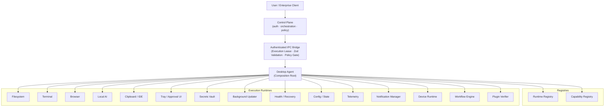

# NexusOS

An enterprise AI operating system that plans and performs authorized work across a user's Windows
desktop, browser, files, terminal, IDEs, and connected services — governed end-to-end by
execution leases, policy gates, and tenant isolation.

[](https://github.com/Priyankkhatri/NexusOS---AI-Workspace/actions)

---

## Overview

NexusOS bridges a cloud control plane with a local Desktop Agent that executes authorized
tasks on behalf of enterprise users. Every action the agent takes — whether reading a file,
running a terminal command, querying hardware posture, or dispatching a notification — must
pass through an authenticated IPC boundary, carry a valid execution lease, and satisfy the
configured policy gate before any runtime is invoked.

The system is structured around three layers:

| Layer                            | Responsibility                                                          |
| -------------------------------- | ----------------------------------------------------------------------- |
| **Control / Coordination Plane** | Authentication, orchestration, task dispatch, policy decisions          |
| **Desktop Agent (Host Plane)**   | IPC management, runtime registry, lease enforcement, capability routing |
| **Execution Runtimes**           | Isolated subsystems (filesystem, terminal, browser, device, AI, etc.)   |

The Desktop Agent is the primary deliverable of Sprint 0. It is a fully self-contained Node.js
process that owns the local execution boundary and exposes a structured IPC surface to the
control plane.

---

## Architecture



> All runtime invocations pass through lease validation and policy authorization before
> execution. No runtime can be invoked without a valid `ExecutionLease` and an authorized
> `RuntimeCategory`.

---

## Repository Structure

```
NexusOS/
├── apps/
│   └── desktop-agent/          # Desktop Agent host process (main Sprint 0 deliverable)
│       ├── src/
│       │   ├── agent.ts         # DesktopAgent composition root (~50 KB)
│       │   ├── registry/        # RuntimeRegistry · CapabilityRegistry
│       │   ├── permissions/     # ExecutionLeaseBoundary · PluginExecutionPolicy
│       │   ├── ipc/             # IPC Manager · channel routing
│       │   ├── orchestrator/    # Agent Orchestrator
│       │   ├── scheduler/       # Task Scheduler · priority queue
│       │   ├── workflow/        # Workflow Engine · DAG parser · state machine
│       │   ├── runtimes/        # Execution runtimes (7 subsystems)
│       │   ├── vault/           # Secrets Vault · injection · redaction
│       │   ├── health/          # Health Monitor · Crash Recovery
│       │   ├── config/          # Configuration Manager · LKG rollback
│       │   ├── state/           # State Manager · encrypted persistence
│       │   ├── telemetry/       # Telemetry Spool · structured logger
│       │   ├── notifications/   # Notification Manager · policy gate
│       │   ├── updater/         # Background Updater · artifact integrity
│       │   ├── identity/        # Agent Identity · device binding
│       │   ├── communication/   # Control Plane Client
│       │   ├── memory/          # Memory Cache · ephemeral context
│       │   ├── observability/   # Observability state
│       │   ├── sandbox/         # Plugin sandbox
│       │   ├── ui/              # Tray UI Controller
│       │   └── adapters/        # IDE adapter
│       ├── tests/               # 78 test files (unit · IPC integration · security hardening)
│       └── docs/                # Task completion reports
├── packages/
│   └── contracts/              # Shared Zod schemas · API types · cross-workspace contracts
├── services/
│   ├── backend/                # Backend HTTP service · health endpoints · request context
│   ├── identity/               # JWT validation · authenticated context · auth middleware
│   └── policy/                 # Policy evaluator · decision evidence · HTTP policy middleware
├── runtimes/                   # Standalone execution runtime modules
├── docs/
│   ├── EDDs/                   # Engineering Design Documents (4 subsystems)
│   ├── PRDs/                   # Enterprise Product Requirements Document
│   ├── Architecture_and_Specs/ # Architecture Bible · API contracts · coding standards · sprint blueprint
│   └── INDEX.md                # Documentation navigation index
├── adrs/                       # Architectural Decision Records
├── threat-models/              # Threat models · security risk assessments
├── scripts/                    # validate-repo.js · security-scan.js
└── .github/workflows/          # CI: NexusOS Monorepo CI Quality Gates
```

---

## Desktop Agent Capabilities

All capabilities are implemented, tested, and verified in CI as of Task 041.

| Capability                  | Description                                                                                |
| --------------------------- | ------------------------------------------------------------------------------------------ |
| **Workflow Engine**         | DAG-based workflow execution with state machine, checkpointing, and retry policy           |
| **Agent Orchestrator**      | Central task dispatch, capability routing, and execution lifecycle management              |
| **Task Scheduler**          | Priority queue with admission control, retry policy, and backpressure                      |
| **Filesystem Runtime**      | Authorized file read/write with path traversal protection and symlink escape prevention    |
| **Terminal Runtime**        | Process execution with supervisor, resource limits, and command authorization              |
| **Browser Runtime**         | Controlled browser automation with domain allowlist enforcement                            |
| **Local AI Runtime**        | Hardware detection, resource governor, model cache, and provider adapter management        |
| **Clipboard / IDE Runtime** | Clipboard read/write and IDE adapter with authorized IPC channels                          |
| **Tray UI / Approval Host** | System tray controller and native approval request routing                                 |
| **Secrets Vault**           | Secret storage, reference authorization, injection, redaction, and offline revocation      |
| **Background Updater**      | Artifact download, HMAC integrity verification, and staged update delivery                 |
| **Health / Recovery**       | Readiness gate, health monitor, crash recovery, and process reconciliation                 |
| **Configuration Manager**   | Multi-source config with signed revision verification, LKG rollback, and observer registry |
| **State Manager**           | AES-256-GCM encrypted local persistence with atomic journaling and schema migration        |
| **Memory Cache**            | Ephemeral context storage with TTL, capacity bounds, and eviction                          |
| **Telemetry**               | Structured logging, spool with HMAC batch integrity, backpressure, and redaction           |
| **Notification Manager**    | Host-plane notification dispatch with policy gate enforcement                              |
| **Device Runtime**          | Hardware posture query, device info, and authorized device operation execution             |
| **Plugin Verifier**         | Plugin manifest validation and catalog integrity checking                                  |
| **Control Plane Client**    | Authenticated outbound communication to the cloud coordination plane                       |
| **IPC Manager**             | Channel-multiplexed secure local IPC with per-handler lease and scope enforcement          |

---

## Security Model

Every IPC handler in the Desktop Agent enforces the following chain before invoking any runtime:

```
Raw IPC payload
  → Zod schema validation (malformed input rejected at boundary)
    → ExecutionLeaseBoundary.validateLease() (fail-closed on invalid/expired lease)
      → PluginExecutionPolicy.isRuntimeCategoryAuthorized() (deny-by-default)
        → Runtime invoked
```

Security controls verified in code and adversarial regression tests:

| Control                            | Description                                                               |
| ---------------------------------- | ------------------------------------------------------------------------- |
| **Execution lease validation**     | Every handler requires a signed, non-expired `ExecutionLease`             |
| **Fail-closed policy**             | `FoundationExecutionPolicy` denies all executable registration by default |
| **Tenant isolation**               | Cross-tenant access attempts are blocked at the lease boundary            |
| **Zod schema enforcement**         | All IPC payloads are validated before processing                          |
| **Secret redaction**               | Secrets and credentials are redacted from logs, telemetry, and responses  |
| **HMAC integrity verification**    | Telemetry batches and update artifacts are HMAC-verified                  |
| **Replay attack protection**       | Duplicate lease IDs are detected and rejected                             |
| **Path traversal protection**      | Filesystem runtime enforces canonical path boundaries                     |
| **Symlink escape prevention**      | Symlink targets are validated against the allowed root                    |
| **Anti-replay for config**         | Signed configuration revisions prevent rollback injection                 |
| **LKG rollback**                   | Configuration and state have last-known-good recovery paths               |
| **Resource bounds**                | Memory cache, telemetry spool, and task scheduler enforce capacity limits |
| **Graceful shutdown guard**        | All runtimes enforce ordered teardown preventing use-after-stop           |
| **AES-256-GCM state encryption**   | Local state is encrypted at rest with authenticated encryption            |
| **Structured 4xx error envelopes** | Auth and policy failures return structured errors, never stack traces     |

See [`SECURITY.md`](SECURITY.md) for vulnerability reporting policy and
[`threat-models/TM-0001-phase0-baseline.md`](threat-models/TM-0001-phase0-baseline.md) for the
Phase 0 threat model.

---

## Implementation Milestones

Sprint 0 is structured as a sequential series of tasks, each implementing one subsystem of the
Desktop Agent host plane. Every task delivers source code, adversarial security tests, a
completion report, and a CI-verified green build.

| Task    | Subsystem                                                                  | Status          |
| ------- | -------------------------------------------------------------------------- | --------------- |
| 03A–03F | Monorepo foundation · backend service · identity · policy · contracts      | ✅ Complete     |
| 03G     | Configuration Manager (precedence · signatures · LKG rollback · baselines) | ✅ Complete     |
| 03H–03J | _(internal sprint milestones)_                                             | ✅ Complete     |
| 03K     | Update Manager · artifact integrity · staged delivery                      | ✅ Complete     |
| 03L     | IPC Manager · secure channel multiplexing                                  | ✅ Complete     |
| 03M     | State Manager · AES-256-GCM encrypted local storage                        | ✅ Complete     |
| 03N     | Memory Cache · ephemeral context storage                                   | ✅ Complete     |
| 03O     | Device Runtime (initial) · Clipboard · OS capabilities                     | ✅ Complete     |
| 03P     | Control Plane Client · authenticated outbound communication                | ✅ Complete     |
| 03Q     | Agent Orchestrator · capability routing · security hardening               | ✅ Complete     |
| 03R     | Task Scheduler · priority queue · admission control · retry policy         | ✅ Complete     |
| 03S     | Workflow Engine · DAG parser · domain contracts                            | ✅ Complete     |
| 03T     | Local AI Runtime · hardware detection · provider adapters                  | ✅ Complete     |
| 03U     | Clipboard Runtime · IDE Adapter · IPC contracts                            | ✅ Complete     |
| 03V     | Tray UI Host · Approval Host · domain contracts                            | ✅ Complete     |
| 03W     | Secrets Vault · Update Host · domain contracts                             | ✅ Complete     |
| 03X     | Health Monitor · Crash Recovery · readiness gate                           | ✅ Complete     |
| 03Y     | Configuration & State host integration · IPC handlers                      | ✅ Complete     |
| 03Z     | Telemetry host integration · spool · HMAC integrity                        | ✅ Complete     |
| **040** | **Notification Manager & Notification Policy Gate — Host Integration**     | ✅ **Complete** |
| **041** | **Device Runtime & Hardware Posture Adapter — Host Integration**           | ✅ **Complete** |
| **042** | _(next milestone — discovery pending)_                                     | 🔲 Not started  |

---

## Current Status

```
Branch:       main
HEAD:         0479021
origin/main:  0479021 (synchronized)
Working tree: clean
CI run #124:  GREEN (all gates passing)
Tests:        569 / 569 passing
Task 041:     COMPLETE
Task 042:     NOT STARTED
```

GitHub Actions CI validates every push with the full quality gate pipeline:

| Gate                     | Command                 |
| ------------------------ | ----------------------- |
| Code formatting          | `pnpm run format:check` |
| Lint                     | `pnpm run lint`         |
| Build                    | `pnpm run build`        |
| TypeScript typecheck     | `pnpm run typecheck`    |
| Test suite               | `pnpm run test`         |
| Architecture boundaries  | `pnpm run validate`     |
| Secret & dependency scan | `pnpm run security`     |

---

## Getting Started

### Requirements

| Tool       | Version                             |
| ---------- | ----------------------------------- |
| Node.js    | ≥ 24.0.0 (pinned: 24.14.1)          |
| pnpm       | ≥ 11.0.0 (pinned: 11.21.0)          |
| TypeScript | 5.7.3 (strict mode)                 |
| OS         | Windows (Desktop Agent host target) |

### Install

```bash
pnpm install
```

> The lockfile is frozen in CI (`--frozen-lockfile`). Do not run `npm install`; use `pnpm`.

### Development Commands

```bash
# Format code
pnpm run format

# Check formatting (CI gate)
pnpm run format:check

# Lint
pnpm run lint

# TypeScript typecheck
pnpm run typecheck

# Run full test suite
pnpm run test

# Build all packages and services
pnpm run build

# Validate repository architecture boundaries
pnpm run validate

# Run secret and dependency security scan
pnpm run security
```

---

## Testing

The test suite uses Node.js built-in test runner (`node:test`) with `tsx` for ESM TypeScript
execution. Tests run in a single-concurrency mode to avoid IPC port conflicts.

**Current baseline (Task 041 / CI run #124):** **569 / 569 tests passing**

Test coverage spans three layers per subsystem:

| Layer                          | Purpose                                                                                                                                                   |
| ------------------------------ | --------------------------------------------------------------------------------------------------------------------------------------------------------- |
| **Unit tests**                 | Domain logic, boundary contracts, configuration, lifecycle                                                                                                |
| **IPC integration tests**      | End-to-end IPC handler invocation through `DesktopAgent` composition root                                                                                 |
| **Adversarial security tests** | 12-case hardening suites (SEC-01–SEC-12) per subsystem covering lease bypass, tenant escape, replay, malformed input, scope violation, and secret leakage |

```bash
# Run the full suite
pnpm run test

# Run a single test file (example)
node --import tsx/esm --test apps/desktop-agent/tests/local-device-ipc.test.ts
```

---

## Documentation

| Document                   | Path                                                                                                                                                                                                           |
| -------------------------- | -------------------------------------------------------------------------------------------------------------------------------------------------------------------------------------------------------------- |
| Documentation index        | [`docs/INDEX.md`](docs/INDEX.md)                                                                                                                                                                               |
| Enterprise PRD             | [`docs/PRDs/NexusOS_Enterprise_PRD_for_AI_Desktop_Agent_and_Web_Platform.md`](docs/PRDs/NexusOS_Enterprise_PRD_for_AI_Desktop_Agent_and_Web_Platform.md)                                                       |
| Architecture Bible         | [`docs/Architecture_and_Specs/NexusOS_Architecture_Bible_Pre_EDD_Foundation.md`](docs/Architecture_and_Specs/NexusOS_Architecture_Bible_Pre_EDD_Foundation.md)                                                 |
| Desktop Agent EDD          | [`docs/EDDs/NexusOS_Desktop_Agent_Engineering_Design_Document_EDD.md`](docs/EDDs/NexusOS_Desktop_Agent_Engineering_Design_Document_EDD.md)                                                                     |
| AI Runtime EDD             | [`docs/EDDs/NexusOS_AI_Runtime_Engineering_Design_Document_EDD.md`](docs/EDDs/NexusOS_AI_Runtime_Engineering_Design_Document_EDD.md)                                                                           |
| Backend EDD                | [`docs/EDDs/NexusOS_Backend_Engineering_Design_Document_EDD.md`](docs/EDDs/NexusOS_Backend_Engineering_Design_Document_EDD.md)                                                                                 |
| Experience Platform EDD    | [`docs/EDDs/NexusOS_Experience_Platform_Engineering_Design_Document_EDD.md`](docs/EDDs/NexusOS_Experience_Platform_Engineering_Design_Document_EDD.md)                                                         |
| API Contract Specification | [`docs/Architecture_and_Specs/NexusOS_API_Contract_Specification_Section_1_System_Communication_Map.md`](docs/Architecture_and_Specs/NexusOS_API_Contract_Specification_Section_1_System_Communication_Map.md) |
| AI Coding Standards        | [`docs/Architecture_and_Specs/NexusOS_AI_Coding_Standards_and_Development_Guide.md`](docs/Architecture_and_Specs/NexusOS_AI_Coding_Standards_and_Development_Guide.md)                                         |
| Sprint 0 Blueprint         | [`docs/Architecture_and_Specs/NexusOS_Sprint_0_Implementation_Blueprint.md`](docs/Architecture_and_Specs/NexusOS_Sprint_0_Implementation_Blueprint.md)                                                         |
| Phase 0 Threat Model       | [`threat-models/TM-0001-phase0-baseline.md`](threat-models/TM-0001-phase0-baseline.md)                                                                                                                         |
| ADR Index                  | [`adrs/0001-monorepo-foundation.md`](adrs/0001-monorepo-foundation.md)                                                                                                                                         |
| Task 041 Completion Report | [`apps/desktop-agent/docs/task-041-completion-report.md`](apps/desktop-agent/docs/task-041-completion-report.md)                                                                                               |

---

## Contributing

See [`CONTRIBUTING.md`](CONTRIBUTING.md) for code ownership, pull request, and review standards.

Security vulnerabilities should be reported according to [`SECURITY.md`](SECURITY.md).
