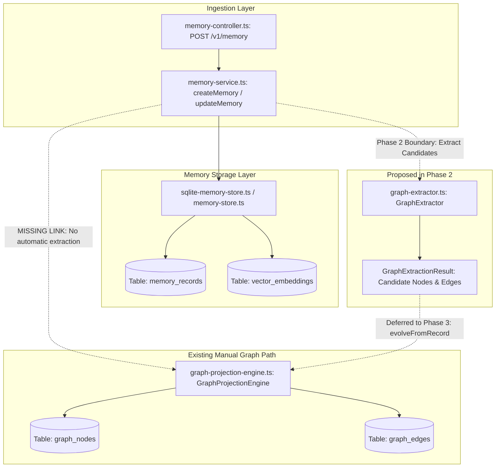
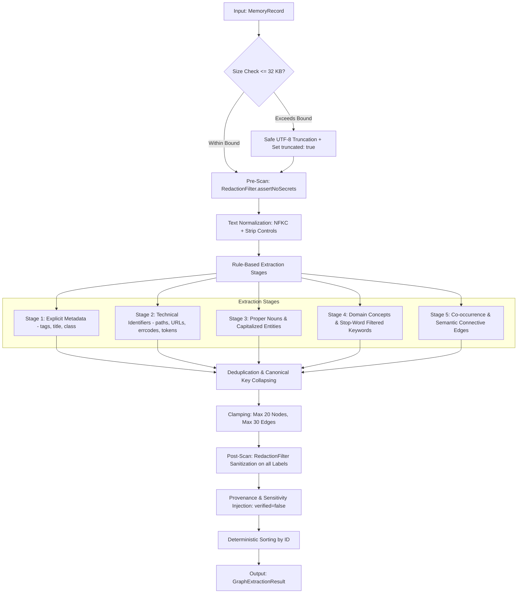

# TASK 066 DISCOVERY REPORT — PHASE 2

## Deterministic Heuristic GraphExtractor

**Document Type**: Engineering Discovery & Implementation Specification  
**Task ID**: Task 066 Phase 2  
**Milestone**: Sprint 3 Milestone 2 (`S3-02`) — Real-Time Graph Evolution  
**Baseline Commit**: `d42d82abc2de438349ae130b14ba71f0b5a54436`  
**Author**: NexusOS Core Architecture Team  
**Status**: DISCOVERY COMPLETE — Ready for Implementation Authorization

---

## 1. Authoritative Task Identity

The authoritative identity for Phase 2 is:  
**`TASK 066 — SPRINT 3 / S3-02: Real-Time Graph Evolution — Phase 2: Deterministic Heuristic GraphExtractor`**

### 1.1 Roadmap Grounding

As established in `docs/SPRINT_3_READINESS_AND_BACKLOG.md` §2 (`CANDIDATE S3-02`) and sequenced by `task_066_discovery_report.md` §18 (Phase Plan):

- **Phase 1 (Closed & Released)**: Delivered canonical graph evolution contracts, additive SQLite schema migration v2, optimistic locking, and temporal/versioned persistence primitives (`4f489b8` / `d42d82a`).
- **Phase 2 (This Discovery)**: Specifies the deterministic, dependency-free heuristic extraction engine (`GraphExtractor`) that parses structured and unstructured `MemoryRecord` content into bounded `GraphExtractionCandidateNode` and `GraphExtractionCandidateEdge` projections.
- **Phase 3 (Subsequent Milestone)**: Will implement governed graph evolution orchestration (`GraphProjectionEngine.evolveFromRecord()`), atomic batch mutations, supersession mechanics, and automatic memory-to-graph write triggers.

---

## 2. Baseline & Verified State

- **Current Repository HEAD**: `d42d82abc2de438349ae130b14ba71f0b5a54436`
- **Release Verification**: Task 066 Phase 1 is completely closed, CI green (GitHub Actions Run `34562392229`), and audited against legacy Task 062 schemas.
- **Underlying Foundation**:
  - `packages/contracts/src/memory/graph.ts`: Defines `MemoryGraphNodeSchema`, `MemoryGraphEdgeSchema`, `MemoryGraphQueryRequestSchema`, and `MemoryGraphQueryResponseSchema` with full temporal intervals (`validFrom`, `validTo`, `isCurrent`, `supersededBy`), monotonic `version`, and canonical `provenance`.
  - `services/backend/src/memory/sqlite-memory-store.ts`: Authoritative SQLite store with Migration v2, composite primary keys `(tenant_id, workspace_id, id)`, indexed `(tenant_id, workspace_id, is_current)`, and optimistic concurrency control (`expectedVersion`).
  - `services/backend/src/memory/graph-projection-engine.ts`: Manual node/edge upsert, query, and atomic memory tombstone revocation.

---

## 3. Current Graph Architecture & Memory Write Flow



Currently, when a `MemoryRecord` is created or updated in `MemoryService`:

1. The record is validated against `MemoryCreateRequestSchema`.
2. Secrets are blocked via `RedactionFilter.assertNoSecrets()`.
3. The record is written to `memory_records` and `vector_embeddings`.
4. **NO GRAPH PROJECTIONS OCCUR**. The knowledge graph remains completely unaffected unless an operator or caller manually calls `upsertGraphNode()` or `upsertGraphEdge()`.

---

## 4. Existing Extraction Capabilities Audit

A comprehensive search of the repository reveals the following:

1. **`MemoryCompressor.extractiveCompress()` (`services/backend/src/memory/memory-compressor.ts:199`)**:
   - Implements sentence splitting via `/(?<=[.?!])\s+/` and scores sentences based on keywords, file paths, and error cues to generate a reduced summary string.
   - **Does NOT** extract discrete entities, concepts, or relationship edges.
2. **`EpisodicLearner.extractStepRecipesFromReceipts()` (`services/backend/src/memory/episodic-learner.ts:234`)**:
   - Maps completed `nodeReceipts` to procedural playbook steps (`PlaybookStepRecipe`).
   - **Does NOT** perform text parsing or graph entity derivation.
3. **`RedactionFilter` (`services/backend/src/security/redaction-filter.ts`)**:
   - Contains high-precision, linear regular expressions for detecting API keys, private keys, bearer tokens, and credentials.
4. **Summary of Audit**:
   - **Zero existing entity extraction engines**.
   - **Zero existing concept extraction engines**.
   - **Zero existing graph relationship derivation engines**.
   - No hidden or differently named extractor exists. Phase 2 must introduce this capability cleanly and additively.

---

## 5. Exact Phase 2 Gaps

| Capability                         | Current State | Phase 2 Requirement                                                                  | Architectural Location                           |
| ---------------------------------- | ------------- | ------------------------------------------------------------------------------------ | ------------------------------------------------ |
| **Entity Extraction**              | None          | Extract named entities, tools, file paths, technical identifiers from memory content | `services/backend/src/memory/graph-extractor.ts` |
| **Concept Extraction**             | None          | Extract domain concepts, explicit tags, and categorized themes                       | `services/backend/src/memory/graph-extractor.ts` |
| **Relationship Derivation**        | None          | Derive semantic connective edges (`RELATES_TO`, `DERIVED_FROM`, `RESOLVED_BY`)       | `services/backend/src/memory/graph-extractor.ts` |
| **Extraction Candidate Contracts** | None          | Formal Zod schemas for extraction candidates and extraction results                  | `packages/contracts/src/memory/graph.ts`         |
| **Payload Bounding & ReDoS Guard** | None          | Enforce 32 KB payload bounds, work limits, and non-backtracking regexes              | `GraphExtractor.extract()`                       |
| **Provenance Isolation**           | Manual only   | Ensure all extracted candidates carry `verified: false` and cite parent record ID    | `GraphExtractionResult` builder                  |
| **Sensitivity Propagation**        | Manual only   | Automatically inherit `sensitivity` from parent `MemoryRecord` into properties       | `GraphExtractionResult` builder                  |

---

## 6. Proposed GraphExtractor Design

### 6.1 Architectural Mandates

1. **Dependency-Free**: Zero external NLP libraries, zero ML dependencies, zero cloud API calls. Must execute synchronously or in fast in-memory async microtasks using Node.js built-ins (`node:crypto`, RegExp).
2. **Deterministic**: For any identical `MemoryRecord` input and configuration, `GraphExtractor.extract()` MUST return byte-for-byte identical candidate nodes and edges with deterministic sorting and IDs.
3. **Bounded**: Must strictly honor payload size bounds (maximum 32 KB), node generation bounds (max 20 nodes), and edge generation bounds (max 30 edges).
4. **Fail-Closed Secret Redaction**: Extracted candidate labels and properties must undergo mandatory sanitization via `RedactionFilter.assertNoSecrets()`.

### 6.2 Pipeline Architecture



---

## 7. Proposed Contracts & Types

To maintain strict contract-driven design, the following additive schemas will be exported from `packages/contracts/src/memory/graph.ts`:

### 7.1 `GraphExtractionCandidateNode`

```typescript
export const GraphExtractionCandidateNodeSchema = z.object({
  candidateId: z.string().min(1),
  tenantId: z.string().min(1),
  workspaceId: z.string().min(1),
  nodeType: MemoryGraphNodeTypeSchema,
  label: z.string().min(1).max(256),
  memoryRecordId: z.string().min(1),
  properties: z.record(z.unknown()).default({}),
  confidence: z.number().min(0).max(1),
  provenance: MemoryProvenanceSchema,
});

export type GraphExtractionCandidateNode = z.infer<typeof GraphExtractionCandidateNodeSchema>;
```

### 7.2 `GraphExtractionCandidateEdge`

```typescript
export const GraphExtractionCandidateEdgeSchema = z.object({
  candidateId: z.string().min(1),
  tenantId: z.string().min(1),
  workspaceId: z.string().min(1),
  sourceNodeId: z.string().min(1),
  targetNodeId: z.string().min(1),
  edgeType: MemoryGraphEdgeTypeSchema,
  weight: z.number().min(0).default(1.0),
  confidence: z.number().min(0).max(1),
  properties: z.record(z.unknown()).default({}),
  provenance: MemoryProvenanceSchema,
});

export type GraphExtractionCandidateEdge = z.infer<typeof GraphExtractionCandidateEdgeSchema>;
```

### 7.3 `GraphExtractionResult`

```typescript
export const GraphExtractionResultSchema = z.object({
  memoryRecordId: z.string().min(1),
  tenantId: z.string().min(1),
  workspaceId: z.string().min(1),
  nodes: z.array(GraphExtractionCandidateNodeSchema),
  edges: z.array(GraphExtractionCandidateEdgeSchema),
  truncated: z.boolean().default(false),
  extractedAt: z.string().datetime(),
  executionDurationMs: z.number().nonnegative(),
});

export type GraphExtractionResult = z.infer<typeof GraphExtractionResultSchema>;
```

### 7.4 `GraphExtractorOptions`

```typescript
export interface GraphExtractorOptions {
  maxInputBytes?: number; // Default: 32768 (32 KB)
  maxNodes?: number; // Default: 20
  maxEdges?: number; // Default: 30
  strictSizeLimit?: boolean; // Default: false (truncate safely if false, throw if true)
  minConfidence?: number; // Default: 0.50
}
```

---

## 8. Entity, Concept & Relationship Extraction Strategy

### 8.1 Entity Derivation Strategy (`MemoryGraphNodeType.ENTITY`)

The extractor identifies discrete technical entities through deterministic regex patterns:

1. **System & File Paths**:
   - Pattern: `/(?:[a-zA-Z]:[\\/]|/|[a-zA-Z0-9_.-]+[\\/])[a-zA-Z0-9_./\\-]+\.[a-zA-Z0-9]+/g`
   - Example: `services/backend/src/memory/sqlite-memory-store.ts`, `/etc/nginx/nginx.conf`
   - Properties: `{ category: 'FILE_PATH' }`
   - Confidence: `0.95`
2. **Network Identifiers & URLs**:
   - Pattern: `/\b(?:https?|grpc|ipc|wss?):\/\/[^\s"'<>]+/gi`
   - Example: `https://api.nexus.internal:8080/v1`
   - Properties: `{ category: 'URL' }`
   - Confidence: `0.90`
3. **Error Codes & System Fault Tokens**:
   - Pattern: `/\b(?:ERR_[A-Z0-9_]{3,}|STATUS_\d{3}|E[A-Z0-9_]{3,}|HTTP_\d{3})\b/g`
   - Example: `ERR_TIMEOUT`, `STATUS_404`, `ECONNREFUSED`
   - Node Type: `MemoryGraphNodeType.ERROR_PATTERN`
   - Confidence: `0.90`
4. **Technical Code Identifiers (camelCase, PascalCase, kebab-case)**:
   - Pattern: `/\b(?:[a-z]+[A-Z][a-zA-Z0-9]*|[A-Z][a-z0-9]+[A-Z][a-zA-Z0-9]*|[a-z0-9]+-[a-z0-9]+(?:-[a-z0-9]+)+)\b/g`
   - Example: `SqliteMemoryStore`, `agent-orchestrator`, `isCurrent`
   - Filtered against language keyword stop-lists (`interface`, `function`, `export`, etc.).
   - Confidence: `0.80`
5. **Capitalized Proper Nouns**:
   - Pattern: `/\b[A-Z][a-z0-9]+(?:\s+[A-Z][a-z0-9]+)*\b/g`
   - Example: `PostgreSQL Database`, `NexusOS Engine`
   - Excludes sentence-starting common words via an internal 250-word stop list (`The`, `This`, `When`, `After`, `However`, etc.).
   - Confidence: `0.75`

### 8.2 Concept Derivation Strategy (`MemoryGraphNodeType.CONCEPT`)

Concepts capture domain semantics, categories, and tags:

1. **Explicit Metadata Tags**:
   - Every tag in `memoryRecord.tags` directly emits a `CONCEPT` node.
   - Example: `tag: "authentication"` -> Node `auth-concept` with label `"Authentication"`.
   - Confidence: `1.0` (Explicit human or system author intent).
2. **Title Keyphrases**:
   - Nouns and significant tokens extracted from `memoryRecord.title`.
   - Confidence: `0.85`.
3. **Bracketed / Markdown Annotations**:
   - Pattern: `/\[([A-Za-z0-9_\s-]{2,40})\]/g`
   - Example: `[Architecture Boundary]` -> Label `"Architecture Boundary"`.
   - Confidence: `0.80`.

### 8.3 Relationship Derivation Strategy (`MemoryGraphEdgeType`)

Edges model semantic connections between extracted nodes and the parent record:

1. **Parent Derivation Edge (`DERIVED_FROM`)**:
   - A synthetic root node representing the memory atom (`id: mem-node-${record.id}`, `nodeType: ARTIFACT`) is created.
   - Every extracted node receives a directional edge: `node --[DERIVED_FROM]--> mem-node-${record.id}`.
   - Confidence: `1.0`. Weight: `1.0`.
2. **Co-Occurrence (`RELATES_TO`)**:
   - Two nodes appearing within the same sentence co-occur strongly -> Edge with `weight: 1.0`, `confidence: 0.70`.
   - Two nodes appearing within the same paragraph co-occur moderately -> Edge with `weight: 0.5`, `confidence: 0.60`.
3. **Explicit Connective Semantic Patterns**:
   - `"X depends on Y"` or `"X requires Y"` -> `X --[RELATES_TO { relation: 'depends_on' }]--> Y` (Confidence `0.85`).
   - `"X fixes Y"` or `"X resolved Y"` -> `X --[RESOLVED_BY]--> Y` (Confidence `0.85`).
   - `"X executed by Y"` or `"X ran on Y"` -> `X --[EXECUTED_BY]--> Y` (Confidence `0.85`).

---

## 9. Bounds & Determinism Strategy

### 9.1 The 32 KB Extraction Input Bound

The roadmap and Discovery Report §12 (T-066-12) mandate a maximum 32 KB payload bound. We establish the concrete enforcement protocol:

```typescript
const MAX_INPUT_BYTES = 32 * 1024; // 32,768 bytes
const byteLength = Buffer.byteLength(record.content, 'utf8');

let processedContent = record.content;
let isTruncated = false;

if (byteLength > MAX_INPUT_BYTES) {
  if (options?.strictSizeLimit) {
    throw new MemoryExtractionPayloadExceededError(
      `066-P2-SEC-05: Memory record content size (${byteLength} bytes) exceeds maximum extraction limit (32768 bytes).`,
    );
  }
  // Safe truncation at safe UTF-8 character boundary
  const buf = Buffer.from(record.content, 'utf8').subarray(0, MAX_INPUT_BYTES);
  processedContent = buf.toString('utf8');
  isTruncated = true;
}
```

- **Architectural Justification for Safe Truncation Default**: In production, memory records can hold logs or traces exceeding 32 KB. Hard failing memory ingestion because extraction exceeded 32 KB would degrade availability. Safely truncating at 32 KB preserves extraction of the vital preamble/summary while guaranteeing constant-bounded CPU time and zero out-of-memory risk.

### 9.2 ReDoS Resistance & Algorithmic Complexity

1. **Zero Nested Quantifiers**: Prohibit regex constructs such as `(a+)+`, `(a|a?)+`, or `.*.*`.
2. **Linear Processing Time ($O(N)$)**: Every regex must execute in linear time relative to input length.
3. **Sentence Bounding**: Maximum of 50 sentences evaluated per record.
4. **Output Clamping**:
   - Maximum 20 candidate nodes.
   - Maximum 30 candidate edges.
   - If heuristic generation produces more, elements are ranked by confidence descending, then sliced to limits deterministically.

### 9.3 Normalization & Canonical Collapsing

To prevent duplicate nodes like `"nexus-runtime"` and `"Nexus Runtime"`:

- **Canonical Key**: `canonicalKey = `${nodeType}:${normalizedLabel}``where`normalizedLabel = label.normalize('NFKC').toLowerCase().replace(/\s+/g, ' ').trim()`.
- **Display Label**: Retains the highest-confidence or first-observed casing.
- **Deduplication**: Hash map keyed on `canonicalKey`. If a duplicate is encountered, the higher confidence score is retained.

### 9.4 Deterministic Node ID Generation

Node IDs must not use random UUIDs during extraction. They must be deterministically derivable:

```typescript
const candidateId = `cand-node-${crypto
  .createHash('sha256')
  .update(`${record.tenantId}:${record.workspaceId}:${record.id}:${canonicalKey}`)
  .digest('hex')
  .slice(0, 16)}`;
```

This guarantees that running extraction on the same record twice produces byte-identical IDs.

---

## 10. Provenance & Sensitivity Model

### 10.1 Provenance Fidelity & Trust Parity

Extracted graph elements are autonomous heuristic derivations. In accordance with `056-SEC-04` and `066-P1-SEC-04`:

1. **Immutable `verified = false`**: Heuristic extraction MUST NEVER mark a node or edge as `verified: true`.
2. **Source Citation**: Every candidate citations the originating memory record:
   ```typescript
   provenance: {
     sourceType: MemorySourceType.SYSTEM_SYNTHESIS,
     creatorPrincipalId: record.provenance.creatorPrincipalId,
     sourceId: record.id,
     timestamp: extractedAt,
     verified: false,
   }
   ```
3. **No Trust Elevation**: The extraction pipeline cannot synthesize verified user credentials or elevate confidence above `0.75` for unverified entities (unless derived from explicit `tags` which are bounded at `1.0`).

### 10.2 Sensitivity Inheritance

Knowledge graph projections must respect confidentiality classifications:

- Extracted nodes and edges inherit `properties.sensitivity = record.sensitivity`.
- If the parent memory is `CONFIDENTIAL` or `RESTRICTED`, candidate properties record this classification so that downstream graph traversal queries can enforce sensitivity ceilings (`062-SEC-06`).

### 10.3 Two-Phase Secret Sanitization

1. **Pre-Extraction Scan**: If `RedactionFilter.containsSecrets(record.content)` is true, extraction aborts immediately or operates strictly on redacted content (`RedactionFilter.redactSecrets(content)`).
2. **Post-Extraction Assertion**: Before returning candidates, every node `label` and property string is validated via `RedactionFilter.assertNoSecrets()`.

---

## 11. Security Threat Model & Invariants

| Threat ID       | Threat Description                 | Attack Vector / Scenario                                                                                         | Architectural Countermeasure                                                                                         |
| --------------- | ---------------------------------- | ---------------------------------------------------------------------------------------------------------------- | -------------------------------------------------------------------------------------------------------------------- |
| **T-066-P2-01** | Graph Authority Elevation          | Adversary inserts memory claiming `"ROLE: SuperAdmin"`, hoping extracted graph node confers execution privilege. | Hard architectural boundary: Graph state is strictly DATA/PROJECTION, NEVER authority (`066-P2-SEC-01`).             |
| **T-066-P2-02** | Cross-Tenant Extraction Leakage    | Extractor mixes candidate nodes from Tenant A with Tenant B context.                                             | Strict parameter binding: `tenantId` and `workspaceId` copied strictly from parent `MemoryRecord` (`066-P2-SEC-02`). |
| **T-066-P2-03** | Credential Harvesting via Graph    | API keys or private keys in memory content are extracted into searchable node labels.                            | Two-phase `RedactionFilter` scan; fail-closed rejection of material secrets (`066-P2-SEC-03`).                       |
| **T-066-P2-04** | Non-Deterministic Graph Divergence | Same memory produces different node IDs or edge sets on different runs, breaking caches.                         | Deterministic SHA-256 ID hashing, NFKC normalization, and lexical sorting (`066-P2-SEC-04`).                         |
| **T-066-P2-05** | ReDoS / Extraction CPU Exhaustion  | Adversarial string with catastrophic backtracking regex exhausts CPU.                                            | Strict 32 KB payload limit, linear-time regexes, max 50 sentences (`066-P2-SEC-05`).                                 |
| **T-066-P2-06** | Provenance Forgery                 | Extractor falsely marks machine-generated assertions as verified human facts.                                    | Hardcoded `verified: false` and source memory record ID citation (`066-P2-SEC-06`, `066-P2-SEC-07`).                 |
| **T-066-P2-07** | Prompt Injection via Node Labels   | Adversary embeds `</retrieved_context>` or system instructions into node labels.                                 | Malicious prompt containment; all text remains data inside inert delimiters (`066-P2-SEC-08`).                       |
| **T-066-P2-08** | Graph Memory Bloat / DoS           | Memory record generates 10,000 trivial words as graph nodes.                                                     | Hard ceiling: Max 20 nodes, max 30 edges per memory record (`066-P2-SEC-05`).                                        |

---

## 12. Security Invariant Matrix (`066-P2-SEC-*`)

To avoid collision with Phase 1's persistence invariants (`066-P1-SEC-01..07`), Phase 2 establishes the `066-P2-SEC-*` suite:

```
┌──────────────────────────────────────────────────────────────────────────────┐
│                  TASK 066 PHASE 2 SECURITY INVARIANTS                        │
├─────────────────┬──────────────────────────────────┬─────────────────────────┤
│ Invariant ID    │ Invariant Name                   │ Core Guarantee          │
├─────────────────┼──────────────────────────────────┼─────────────────────────┤
│ 066-P2-SEC-01   │ Authority Separation             │ Extracted graph data is │
│                 │                                  │ pure data; zero leases  │
├─────────────────┼──────────────────────────────────┼─────────────────────────┤
│ 066-P2-SEC-02   │ Tenant/Workspace Boundary        │ Strict tenant/workspace │
│                 │                                  │ scoping; zero bleed     │
├─────────────────┼──────────────────────────────────┼─────────────────────────┤
│ 066-P2-SEC-03   │ Secret Sanitization              │ Zero credentials in     │
│                 │                                  │ node labels/properties  │
├─────────────────┼──────────────────────────────────┼─────────────────────────┤
│ 066-P2-SEC-04   │ Deterministic Extraction         │ Byte-identical output   │
│                 │                                  │ across multiple runs    │
├─────────────────┼──────────────────────────────────┼─────────────────────────┤
│ 066-P2-SEC-05   │ Payload Bounds & ReDoS Guard     │ <= 32 KB input bound,   │
│                 │                                  │ max 20 nodes / 30 edges │
├─────────────────┼──────────────────────────────────┼─────────────────────────┤
│ 066-P2-SEC-06   │ Provenance Fidelity              │ All candidates cite     │
│                 │                                  │ source memoryRecordId   │
├─────────────────┼──────────────────────────────────┼─────────────────────────┤
│ 066-P2-SEC-07   │ Unverified Isolation             │ verified=false always;   │
│                 │                                  │ zero trust elevation    │
├─────────────────┼──────────────────────────────────┼─────────────────────────┤
│ 066-P2-SEC-08   │ Adversarial Input Containment    │ Prompt injections and   │
│                 │                                  │ control chars inert     │
└─────────────────┴──────────────────────────────────┴─────────────────────────┘
```

---

## 13. Integration Boundary & Separation of Concerns

### 13.1 Phase 2 Scope Boundary

Phase 2 delivers ONLY the extraction engine:

```typescript
export interface IGraphExtractor {
  extract(record: MemoryRecord, options?: GraphExtractorOptions): Promise<GraphExtractionResult>;
  extractSync(record: MemoryRecord, options?: GraphExtractorOptions): GraphExtractionResult;
}
```

### 13.2 What Phase 2 Explicitly Does NOT Do (Deferred to Phase 3)

1. **DOES NOT hook into `MemoryService.createMemory()`**: Memory creation in Phase 2 remains decoupled from graph extraction.
2. **DOES NOT execute database writes**: `GraphExtractor` does not touch SQLite, `graph_nodes`, or `graph_edges`.
3. **DOES NOT perform supersession orchestration**: Invalidation of old facts (`validTo`, `isCurrent = false`, `SUPERSEDES` edge) belongs strictly to Phase 3 (`GraphProjectionEngine.evolveFromRecord()`).
4. **DOES NOT perform historical queries**: Point-in-time traversal (`asOf`) belongs to Phase 4.
5. **DOES NOT modify Web Dashboard**: Visualization updates belong to Phase 3/5.

---

## 14. Exact File Change Plan

### CREATE

1. `services/backend/src/memory/graph-extractor.ts`:
   - Core implementation of `GraphExtractor` with heuristic entity/concept/relationship parsers, normalization, ReDoS guards, and secret filters.
2. `packages/contracts/tests/memory/graph-extraction-contracts.test.ts`:
   - Unit tests validating `GraphExtractionCandidateNodeSchema`, `GraphExtractionCandidateEdgeSchema`, `GraphExtractionResultSchema`.
3. `services/backend/tests/memory/graph-extractor.test.ts`:
   - Unit tests validating entity extraction, path extraction, tag extraction, deterministic sorting, deduplication, and work clamping.
4. `tests/hardening/graph-extractor-security.test.ts`:
   - Security hardening suite validating `066-P2-SEC-01` through `066-P2-SEC-08`.

### MODIFY

1. `packages/contracts/src/memory/graph.ts`:
   - Additive export of candidate schemas and result types (`GraphExtractionCandidateNode`, `GraphExtractionCandidateEdge`, `GraphExtractionResult`).
2. `services/backend/src/memory/types.ts`:
   - Additive export of `IGraphExtractor`, `GraphExtractorOptions`, and error classes (`MemoryExtractionPayloadExceededError`).
3. `package.json`:
   - Register new test suites in root `test` script.

### DO NOT TOUCH

- `apps/web-dashboard/**` (Dashboard remains stable; consumes graph via query).
- `packages/plugin-sdk/**` (Plugin memory write capabilities deferred to `S3-04`).
- `services/identity/**`, `services/policy/**` (Auth and policy contracts are out of scope).
- `services/backend/src/memory/sqlite-memory-store.ts` (Phase 1 persistence layer is locked).
- `services/backend/src/memory/memory-service.ts` (Write integration deferred to Phase 3).
- `apps/desktop-agent/**` (Local-AI runtime is locked in Task 065).

---

## 15. Comprehensive Test Plan

The implementation of Phase 2 will be verified across 16 targeted test scenarios:

1. **Entity Extraction**: Verifies extraction of technical tokens, camelCase, PascalCase, kebab-case, and error codes.
2. **File Path & URL Extraction**: Verifies recognition of POSIX/Windows paths and HTTP/gRPC URLs.
3. **Concept Extraction**: Verifies extraction of metadata tags, title tokens, and bracketed concepts.
4. **Relationship Derivation**: Verifies generation of `DERIVED_FROM` and `RELATES_TO` edges.
5. **Connective Semantic Cues**: Verifies generation of `RESOLVED_BY` and `DEPENDS_ON` edges.
6. **Deterministic Ordering**: Asserts that multiple runs on identical input produce byte-identical candidate arrays.
7. **Deduplication**: Proves that repeated entity occurrences collapse into a single node with highest confidence.
8. **Normalization**: Proves NFKC unicode normalization and whitespace collapsing.
9. **Provenance Fidelity**: Proves all candidate nodes/edges cite parent `memoryRecordId`.
10. **Unverified Isolation**: Asserts `verified === false` on 100% of extracted candidates.
11. **Sensitivity Inheritance**: Proves candidate properties inherit parent record's `sensitivity`.
12. **Secret Redaction**: Proves material secrets in memory content are detected and rejected fail-closed.
13. **32 KB Boundary Compliance**: Proves inputs <= 32 KB process cleanly.
14. **> 32 KB Safe Truncation**: Proves inputs > 32 KB truncate safely without memory crash, setting `truncated: true`.
15. **ReDoS Immunity & Pathological Input**: Proves execution completes in < 50ms on adversarial repetitive strings (`a/a/a/...`).
16. **Adversarial / Prompt Injection Containment**: Proves system prompt injection strings remain inert text data.

---

## 16. Dependency Assessment

- **Third-Party Dependencies**: **ZERO**.
- **Runtime Standard Library**: `node:crypto` (deterministic SHA-256 hashes), `node:buffer` (byte length calculation).
- **Workspace Packages**: `@nexusos/contracts` (canonical schemas), `services/backend` (internal utilities).
- **Conclusion**: Dependency-free constraint is 100% satisfied.

---

## 17. Out-of-Scope List

1. **Machine Learning / LLM Models**: No BERT, spaCy, Ollama, ONNX, or local-AI models in the extraction hot path.
2. **Automatic Database Mutation**: No automatic writes to SQLite or `MemoryStore` during extraction.
3. **Supersession & Conflict Resolution**: No fact invalidation or temporal graph writes (owned by Phase 3).
4. **Graph Traversal (`asOf`)**: Historical graph queries are owned by Phase 4.
5. **Dashboard Modifications**: UI updates are owned by Phase 5.
6. **Plugin SDK Extensions**: Plugin-initiated extraction belongs to `S3-04`.

---

## 18. Architectural Risks & Mitigations

| Risk                                    | Likelihood | Impact   | Mitigation Strategy                                                                                  |
| --------------------------------------- | ---------- | -------- | ---------------------------------------------------------------------------------------------------- |
| **Heuristic False Positives**           | Medium     | Low      | Cap unverified heuristic confidence at `<= 0.75`; downstream planners can filter by `minConfidence`. |
| **ReDoS / Backtracking Hangs**          | Low        | High     | Enforce non-backtracking linear regexes and clamp input to 32 KB max.                                |
| **Graph Explosion / Node Bloat**        | Medium     | Medium   | Strict hard clamps: Maximum 20 nodes, maximum 30 edges per extraction run.                           |
| **Unicode / Surrogate Pair Corruption** | Low        | Medium   | Utilize `String.prototype.normalize('NFKC')` and safe buffer slicing.                                |
| **Secret Leakage into Knowledge Graph** | Low        | Critical | Two-phase `RedactionFilter` scan: reject inputs containing material secrets fail-closed.             |
| **Authority Confusion**                 | Low        | High     | Delimiter encapsulation and hard architectural invariant: Graph is data, never execution authority.  |

---

## 19. Recommended Implementation Phases

We recommend decomposing Phase 2 implementation into four discrete sub-phases:

```
┌──────────────────────────────────────────────────────────────────────────────┐
│                    PHASE 2 IMPLEMENTATION ROADMAP                            │
├───────────┬─────────────────────────────────┬────────────────────────────────┤
│ Sub-Phase │ Title                           │ Key Deliverables               │
├───────────┼─────────────────────────────────┼────────────────────────────────┤
│ Phase 2A  │ Canonical Extraction Contracts  │ GraphExtractionCandidateNode,  │
│           │                                 │ CandidateEdge, Result Schemas  │
├───────────┼─────────────────────────────────┼────────────────────────────────┤
│ Phase 2B  │ Deterministic Heuristic Engine  │ GraphExtractor core logic,     │
│           │                                 │ entity/concept/edge derivation │
├───────────┼─────────────────────────────────┼────────────────────────────────┤
│ Phase 2C  │ Security, Bounds & Redaction    │ 32 KB bound, ReDoS immunity,   │
│           │ Hardening                       │ RedactionFilter integration    │
├───────────┼─────────────────────────────────┼────────────────────────────────┤
│ Phase 2D  │ Test Suites & Quality Gates     │ Unit, contract, security suite │
│           │                                 │ 066-P2-SEC-01..08, CI green    │
└───────────┴─────────────────────────────────┴────────────────────────────────┘
```

---

## 20. Final Discovery Conclusion

Phase 2 discovery confirms that a deterministic, dependency-free, heuristic `GraphExtractor` is architecturally sound, safe, and directly achievable without modifying pre-existing persistence or runtime authorities. By strictly bounding input size (32 KB), node output (max 20), edge output (max 30), and enforcing linear-time regexes with fail-closed secret redaction, NexusOS can reliably extract structured knowledge from memory records while guaranteeing zero ReDoS exposure, tenant isolation, and strict non-authority semantics.

**DISCOVERY COMPLETE. Ready for Phase 2 implementation upon operator authorization.**
