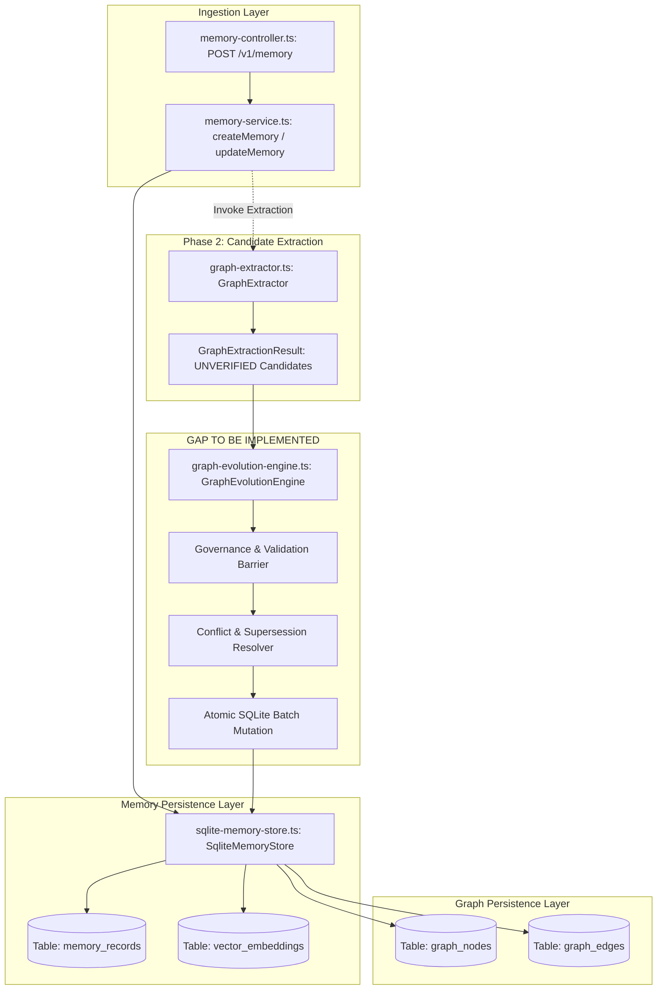

# TASK 066 DISCOVERY REPORT — PHASE 3

## Governed Graph Evolution Pipeline

**Document Type**: Engineering Discovery & Architecture Specification  
**Task ID**: Task 066 Phase 3  
**Milestone**: Sprint 3 Milestone 2 (`S3-02`) — Real-Time Graph Evolution  
**Baseline Commit**: `928f9f2e077e3fcef01f510c739ce7b96618d15b`  
**Author**: NexusOS Core Architecture Team  
**Status**: DISCOVERY COMPLETE — Ready for Review & Implementation Authorization

---

## 1. Authoritative Task Identity

The authoritative identity for this discovery is:  
**`TASK 066 — SPRINT 3 / S3-02: Real-Time Graph Evolution — Phase 3: Governed Graph Evolution Pipeline`**

### 1.1 Roadmap Grounding & Phase Lineage

As established in `docs/SPRINT_3_READINESS_AND_BACKLOG.md` §2 (`CANDIDATE S3-02`) and sequenced across Task 066 delivery phases:

- **Phase 1 (Closed & Released at `d42d82a`)**: Delivered canonical graph evolution data models, additive SQLite schema migration v2, monotonic versioning, optimistic concurrency control (`expectedVersion`), and temporal validity intervals (`validFrom`, `validTo`, `isCurrent`, `supersededBy`).
- **Phase 2 (Closed & Released at `928f9f2`)**: Delivered the deterministic, dependency-free heuristic extraction engine (`GraphExtractor`) that parses governed `MemoryRecord` payloads into bounded, unverified extraction candidates (`GraphExtractionCandidateNode`, `GraphExtractionCandidateEdge`), strictly upholding the provenance boundary with zero synthetic graph nodes.
- **Phase 3 (This Discovery)**: Defines the governed evolution pipeline that ingests unverified extraction candidates from Phase 2, subjects them to strict multi-tenant validation and conflict analysis, and commits atomic, temporal knowledge graph mutations into persistent storage without ever elevating graph data into execution or policy authority.

---

## 2. Baseline SHA & Verification State

- **Authoritative Baseline HEAD**: `928f9f2e077e3fcef01f510c739ce7b96618d15b`
- **Release Verification**:
  - Task 066 Phase 2 is closed with 100% green CI (GitHub Actions Run `34566658600`, 1,436 tests passing, 0 failures).
  - Clean working tree, aligned with `origin/main`.
- **Existing Codebase Footprint**:
  - `packages/contracts/src/memory/graph.ts`: Defines `MemoryGraphNodeSchema`, `MemoryGraphEdgeSchema`, `MemoryGraphQueryRequestSchema`, `MemoryGraphQueryResponseSchema`, `GraphExtractionCandidateNodeSchema`, `GraphExtractionCandidateEdgeSchema`, and `GraphExtractionResultSchema`.
  - `services/backend/src/memory/graph-extractor.ts`: Implements `GraphExtractor` (deterministic regex-based token, path, URL, entity, concept, and relationship extraction).
  - `services/backend/src/memory/sqlite-memory-store.ts`: Implements SQLite persistence for `graph_nodes` and `graph_edges` with Migration v2, composite primary keys `(tenant_id, workspace_id, id)`, and atomic cascade tombstoning.
  - `services/backend/src/memory/memory-store.ts`: In-memory implementation of graph store methods.
  - `services/backend/src/memory/graph-projection-engine.ts`: Projection engine exposing `upsertNode`, `upsertEdge`, `query`, and `revokeProjectionsForMemory`.
  - `services/backend/src/memory/memory-service.ts`: Coordinates memory lifecycle, search, compression, and vectors.

---

## 3. Current Architecture & Write Pipeline



### 3.1 Architectural Reality at HEAD

1. **Extraction exists, but is disconnected from persistence**: `GraphExtractor` extracts candidates in memory, but no caller invokes it during memory ingestion, and no service consumes `GraphExtractionResult` to mutate the graph.
2. **Graph writes remain manual**: Graph nodes and edges can only be persisted if an external caller explicitly invokes `GraphProjectionEngine.upsertNode()` or `upsertEdge()`.
3. **Zero automatic supersession**: There is currently no component that inspects existing graph nodes to detect entity collisions, property updates, or contradictory facts.

---

## 4. Phase 1 & Phase 2 Reusable Foundations

A thorough audit of the active codebase confirms that extensive foundations are already implemented and must be reused without duplication:

| Foundation Component                | Existing Implementation                                                                     | Reusability in Phase 3                                                                                                  |
| ----------------------------------- | ------------------------------------------------------------------------------------------- | ----------------------------------------------------------------------------------------------------------------------- |
| **Canonical Temporal Schemas**      | `packages/contracts/src/memory/graph.ts` (`MemoryGraphNodeSchema`, `MemoryGraphEdgeSchema`) | 100% reusable. Fully supports `version`, `isCurrent`, `validFrom`, `validTo`, `supersededBy`, and `updatedAt`.          |
| **Optimistic Concurrency Control**  | `SqliteMemoryStore.saveGraphNode()` and `saveGraphEdge()`                                   | 100% reusable. Checks `expectedVersion`, enforces monotonicity, and throws `MemoryVersionConflictError` on collision.   |
| **Extraction Candidate Generation** | `services/backend/src/memory/graph-extractor.ts` (`GraphExtractor`)                         | 100% reusable. Outputs deterministic, deduplicated, bounded (<=20 nodes, <=30 edges) candidates with `verified: false`. |
| **Secret Sanitization**             | `services/backend/src/security/redaction-filter.ts` (`RedactionFilter.assertNoSecrets()`)   | 100% reusable. Linear-time credential and token scanning.                                                               |
| **Multi-Tenant Partitioning**       | SQLite composite primary keys `(tenant_id, workspace_id, id)` and context checks            | 100% reusable. Guarantees cross-tenant boundary isolation.                                                              |
| **Atomic Cascade Forgetting**       | `SqliteMemoryStore.revokeGraphForMemoryInternal()`                                          | Core logic exists. Must be extended to cleanly handle edge provenance and supersession integrity.                       |
| **Cycle-Immune Traversal**          | `SqliteMemoryStore.queryGraph()`                                                            | 100% reusable. Hard limits (`maxDepth <= 4`, `limit <= 100`, BFS visited sets).                                         |

---

## 5. Exact Phase 3 Gaps

The following capabilities are genuinely missing and must be introduced in Phase 3:

1. **Evolution Contracts**: No formal schema defines an evolution request, batch mutation plan, or evolution receipt (`GraphEvolutionRequest`, `GraphEvolutionResult`, `GraphEvolutionOperation`).
2. **Governance & Validation Layer**: No engine validates whether unverified extraction candidates satisfy structural integrity (referential validity, node existence, non-dangling edges) and security boundaries prior to mutation.
3. **Contradiction & Conflict Resolution**: No deterministic logic detects when a candidate fact contradicts an existing active assertion and plans a temporal supersession transition.
4. **Atomic Multi-Entity Evolution Transaction**: `SqliteMemoryStore` has single-row `saveGraphNode` and `saveGraphEdge`, but lacks an atomic batch mutation transaction that updates superseded nodes/edges, inserts new entities, and writes `SUPERSEDES` edges in a single atomic commit.
5. **Memory-to-Graph Trigger**: `MemoryService` does not trigger extraction or evolution when a `MemoryRecord` is created or updated.

---

## 6. Governance & Validation Boundary

### 6.1 Candidate Eligibility & Ingestion Gates

Not every candidate emitted by `GraphExtractor` is eligible for persistence. The governance pipeline enforces five mandatory gates:

```
[Candidate Batch]
       │
       ▼
Gate 1: Payload & Security Scan (RedactionFilter.assertNoSecrets)
       │  (Fails closed: Any secret aborts the entire candidate mutation)
       ▼
Gate 2: Tenant & Workspace Isolation Check
       │  (Candidate tenant/workspace must match authoritative caller context)
       ▼
Gate 3: Confidence & Relevance Threshold
       │  (candidate.confidence >= minConfidence [default 0.50])
       ▼
Gate 4: Source Memory Record Liveness
       │  (sourceId must reference an existing, ACTIVE, non-tombstoned MemoryRecord)
       ▼
Gate 5: Referential Integrity & Dangling Edge Suppression
       │  (Edge endpoints must either exist in store or be present in the new node batch)
       ▼
[Eligible Evolution Set]
```

### 6.2 The Unverified Invariant (`verified = false`)

- **Authoritative Fact**: Heuristic extraction candidates are machine inferences. They **MUST REMAIN `verified: false`** upon persistence.
- **Persistence without Verification**: The knowledge graph is explicitly designed to store unverified assertions. As mandated by `NexusOS_AI_Runtime_Engineering_Design_Document_EDD.md` §14.4, the graph represents derived, non-canonical knowledge where confidence and verification state are queryable metadata attributes.
- **Verification Authority Boundary**:
  - Neither the `GraphExtractor` nor the `GraphEvolutionEngine` has the authority to verify a fact.
  - Fact verification requires an explicit, authenticated Human-In-The-Loop (HITL) approval or a cryptographically signed execution receipt from a verified task execution.
  - **CRITICAL**: The repository currently has NO standalone graph fact verification service. Execution leases and policy approvals pertain to task execution, NOT knowledge truthfulness. Phase 3 **MUST NOT** invent a fake verification authority or repurpose task execution leases for fact verification.

### 6.3 Representation of Rejected Candidates

Candidates failing any governance gate are not silently dropped. The evolution pipeline produces a structured `EvolutionReceipt`:

- `acceptedNodes`: Count and IDs of persisted nodes.
- `acceptedEdges`: Count and IDs of persisted edges.
- `rejectedNodes`: Array of `{ candidateId, label, reason: 'SECRET_DETECTED' | 'LOW_CONFIDENCE' | 'TENANT_MISMATCH' | 'SOURCE_TOMBSTONED' }`.
- `rejectedEdges`: Array of `{ candidateId, sourceNodeId, targetNodeId, reason: 'DANGLING_ENDPOINT' | 'SECRET_DETECTED' | ... }`.

---

## 7. Evolution & Supersession Semantics

### 7.1 Entity Identity vs. Transient Candidate IDs

- In Phase 2, candidate node IDs are scoped to the source memory record: `cand-node-<hash(tenant:workspace:recordId:canonicalKey)>`.
- In persistent graph storage, a physical entity identity must be stable across multiple memory records within a workspace.
- **Canonical Entity Keying**:
  Persistent node IDs are deterministically derived from the workspace scope, node type, and canonicalized label:
  $$\text{persistentNodeId} = \text{node-} + \text{SHA256}(\text{tenantId} + ":" + \text{workspaceId} + ":" + \text{nodeType} + ":" + \text{canonicalKey})[0..16]$$
  where $\text{canonicalKey} = \text{normalizeToCanonicalKey}(\text{label})$.

  _Example_: "PostgresDB" in Record 1 and "postgres-db" in Record 2 map to the exact same persistent entity ID `node-a1b2c3d4e5f60718`.

### 7.2 Same-Entity Refinement vs. Contradiction

When a candidate entity or assertion collides with existing graph state, the engine distinguishes two deterministic cases:

```mermaid
flowchart TD
    C[Candidate Ingestion] --> M{Matches Active Entity or Edge?}
    M -- No --> A[ADD: Insert New Node/Edge with version=1, isCurrent=true, validFrom=now]
    M -- Yes --> T{Is Contradictory or Refinement?}

    T -- Same Fact / Refinement --> R[REFINE IN-PLACE:
      - expectedVersion check
      - version = version + 1
      - confidence = max(existing, candidate)
      - merge properties
      - updatedAt = now]

    T -- Contradictory Fact --> S[TEMPORAL SUPERSESSION:
      1. Fetch existing Fact A
      2. Invalidate Fact A:
         - isCurrent = false
         - validTo = now
         - supersededBy = Fact B ID
         - version = version + 1
      3. Insert Fact B:
         - new immutable ID
         - isCurrent = true
         - validFrom = now
         - version = 1
      4. Insert Edge:
         - Fact B --[SUPERSEDES]--> Fact A]
```

### 7.3 Contradiction Detection Strategy

Contradiction cannot be solved by naive string comparison. The smallest deterministic, contract-supported strategy is:

1. **Predicate Exclusivity / Cardinality-1 Slots**:
   - Relationships defined as functional (e.g., `theme_preference`, `default_environment`, `active_gateway`) allow only one active target per source node and edge type.
   - When a new candidate asserts `Source --[RELATES_TO { slot: 'theme' }]--> TargetB` while an active edge exists `Source --[RELATES_TO { slot: 'theme' }]--> TargetA`, the engine detects an explicit contradiction.
2. **Explicit Semantic Supersession Cues**:
   - Phase 2 already extracts connective cues. When candidate edges have `edgeType: SUPERSEDES` (derived from cues like "supersedes", "replaces", "instead of") or metadata `{ supersedes: true }`, supersession is explicitly triggered.
3. **Property Incompatibility**:
   - If an existing node represents a single-valued state attribute (e.g., `properties.status = 'OFFLINE'`) and a newer candidate asserts `properties.status = 'ONLINE'` for the same canonical entity, the previous node state is superseded temporally.

---

## 8. Temporal & Optimistic Concurrency Semantics

### 8.1 Invariant Rules for Temporal Intervals

Every temporal mutation must satisfy the formal contract refinements in `packages/contracts/src/memory/graph.ts`:

1. **Active Rule**: If `isCurrent === true`, then `validTo` MUST be `null`/`undefined`, and `supersededBy` MUST be `undefined`.
2. **Superseded Rule**: If `isCurrent === false`, `validTo` MUST be populated with an ISO-8601 timestamp, and `supersededBy` SHOULD contain the replacement entity/edge ID.
3. **Chronology Rule**: For any entity or edge with a closed window, `validFrom <= validTo`.
4. **Monotonic Version Rule**: Every state change to an existing row increments `version` by exactly +1 (`version = currentVersion + 1`). Version rollback is strictly rejected fail-closed.

### 8.2 Optimistic Concurrency Control (OCC)

- When modifying an active fact during supersession or refinement, the engine submits the operation with `expectedVersion`.
- If a concurrent write modified the row in SQLite between read and write, `SqliteMemoryStore` throws `MemoryVersionConflictError`.
- The entire evolution transaction immediately rolls back cleanly, preventing lost updates or split-brain supersession graphs.

---

## 9. Transaction & Atomicity Model

### 9.1 The Atomicity Imperative

A graph evolution operation can involve multiple related mutations:

1. Invalidate Old Fact A (`UPDATE graph_nodes SET is_current = 0, valid_to = ?, superseded_by = ? WHERE id = ? AND version = ?`).
2. Insert New Fact B (`INSERT INTO graph_nodes ...`).
3. Establish Supersession Edge (`INSERT INTO graph_edges (source_node_id = B, target_node_id = A, edge_type = 'SUPERSEDES', ...)`).
4. Insert Derived Relationship Edges (`INSERT INTO graph_edges ...`).

If any operation in this chain fails (e.g., OCC conflict, constraint failure, secret detected), committing partial state would corrupt the graph topology (e.g., a supersession edge pointing to a non-existent node, or an invalidated old fact with no replacement).

### 9.2 SQLite Transaction Boundary

`SqliteMemoryStore` utilizes `node:sqlite`'s `DatabaseSync`. The existing store already employs `BEGIN IMMEDIATE` / `COMMIT` / `ROLLBACK` blocks for migrations and memory tombstoning.

Phase 3 introduces `SqliteMemoryStore.evolveGraph()`:

```typescript
public async evolveGraph(
  plan: GraphEvolutionPlan,
  ctx: MemoryServiceContext,
): Promise<EvolutionReceipt> {
  this.checkFailure();

  // Enforce caller tenant/workspace isolation
  this.assertContext(plan, ctx);

  this.db.exec('BEGIN IMMEDIATE;');
  try {
    // 1. Validate all target versions and prepare updates
    // 2. Execute node supersessions (UPDATE)
    // 3. Execute node insertions (INSERT)
    // 4. Execute edge supersessions (UPDATE)
    // 5. Execute edge insertions (INSERT)
    // 6. Commit transaction
    this.db.exec('COMMIT;');
    return receipt;
  } catch (err) {
    this.db.exec('ROLLBACK;');
    throw err;
  }
}
```

This guarantees 100% ACID atomicity: zero partial graph states under any failure condition.

---

## 10. Memory → Graph Integration

### 10.1 Architectural Integration Point

We audit the candidate integration layers:

- **Option A: Embed all logic in `MemoryService`**:
  _Assessment_: REJECTED. `MemoryService` is already 684 lines managing memory CRUD, search, lexical ranking, proposals, episodes, playbooks, vectors, and tombstones. Adding graph extraction orchestration, conflict resolution, and topological validation would violate Single Responsibility and overload `MemoryService`.
- **Option B: Embed all logic in `GraphProjectionEngine`**:
  _Assessment_: SUB-OPTIMAL. `GraphProjectionEngine` is a focused query and manual projection engine (148 lines).
- **Option C: Dedicated `GraphEvolutionEngine` coordinated by `MemoryService`**:
  _Assessment_: **RECOMMENDED ARCHITECTURE**.
  - A new, dedicated `GraphEvolutionEngine` (`services/backend/src/memory/graph-evolution-engine.ts`) implements `IGraphEvolutionEngine`.
  - It encapsulates extraction coordination, governance validation, contradiction detection, and evolution plan generation.
  - `MemoryService` maintains a reference to `GraphEvolutionEngine` (similar to `compressor`, `learner`, and `graphEngine`).
  - `MemoryService.createMemory()` and `updateMemory()` invoke `this.evolutionEngine.evolveFromRecord(savedRecord, context)` as a post-commit projection step.

### 10.2 Synchronous vs. Asynchronous Execution

- In the current single-process Node.js runtime, graph evolution must execute as an in-process `Promise` (microtask async).
- **Failure Isolation**: If graph evolution encounters an unexpected error or secret detection, it logs the failure and records an audit event, but **DOES NOT abort the already-persisted `MemoryRecord`**. Graph is a derived projection, not the canonical source of truth. The canonical memory record remains safely written.

---

## 11. Forgetting & Revocation Model

### 11.1 Preserving Atomic Forgetting Guarantees (058-SEC-05, 062-SEC-03)

When a `MemoryRecord` is tombstoned via `MemoryService.tombstoneMemory()`:

1. The record is soft-deleted in `memory_records` (`status = 'TOMBSTONED'`).
2. Associated vector embeddings are deleted from `vector_embeddings`.
3. Derived compressions are marked tombstoned.
4. **Graph Revocation Cascade**:
   `SqliteMemoryStore.revokeGraphForMemoryInternal()` is invoked in the same SQLite transaction.

### 11.2 Hardening Cascade for Evolved Graphs

In an evolved graph, entities may be derived from multiple records or linked via supersession. The cascade must handle:

1. **Record-Derived Nodes**: All nodes where `memory_record_id = ?` are physically deleted.
2. **Dangling Edge Elimination**: All edges where `source_node_id` OR `target_node_id` matches a deleted node are physically deleted.
3. **Record-Derived Edges**: Any edge where `provenance.sourceId = ?` is deleted, even if the connected nodes originated from other records.
4. **Supersession Pointer Cleanup**: If Node A was superseded by Node B, and Node B is forgotten:
   - Node B and its `SUPERSEDES` edge (`B -> A`) are deleted.
   - Node A remains in the graph as a historical record (`validTo` intact), preventing resurrecting dead facts or crashing traversals.
5. **Non-Discoverability Guarantee**:
   Because forgotten nodes and edges are physically purged from SQLite, they are completely invisible to both current (`isCurrent = true`) and historical (`asOf = timestamp`) graph traversals.

---

## 12. Security Model & Invariants

### 12.1 Authority Separation (The Golden Rule)

> **Graph is strictly DATA / PROJECTION, NEVER AUTHORITY.**

Under no circumstances can a graph node, edge property, or traversal path grant:

- Execution leases or capability tokens
- Policy overrides or RBAC role elevation
- Memory governance bypass
- Autonomous task dispatch permissions

Any attempt to inject claims such as `label: "Role: SuperAdmin"` or `properties: { leaseGranted: true }` is stored solely as inert, unverified string data.

### 12.2 Security Matrix (`066-P3-SEC-01` through `066-P3-SEC-08`)

To avoid naming collisions with Phase 1 persistence and Phase 2 extractor invariants, Phase 3 defines the authoritative **`066-P3-SEC-*`** matrix:

| Invariant ID      | Name                                         | Architectural Control                                                                                                                           | Verification Method                                                                                                   |
| ----------------- | -------------------------------------------- | ----------------------------------------------------------------------------------------------------------------------------------------------- | --------------------------------------------------------------------------------------------------------------------- |
| **066-P3-SEC-01** | **Authority Separation**                     | Graph projections are non-authoritative data; cannot grant leases, roles, or policy decisions.                                                  | Test: Verify graph entities claiming administrative authority confer zero system capabilities.                        |
| **066-P3-SEC-02** | **Tenant & Workspace Isolation**             | All evolution operations and persistent queries enforce strict `(tenantId, workspaceId)` matching. Cross-tenant edges are rejected fail-closed. | Test: Attempt cross-tenant evolution and cross-workspace edge creation; assert `MemorySecurityViolationError`.        |
| **066-P3-SEC-03** | **Fail-Closed Secret Sanitization**          | All candidate labels, properties, and metadata must pass `RedactionFilter.assertNoSecrets()` before persistence.                                | Test: Inject API keys and bearer tokens into candidate labels/properties; verify mutation transaction aborts cleanly. |
| **066-P3-SEC-04** | **Provenance Integrity**                     | Every persisted node and edge preserves immutable provenance tracing to the originating `MemoryRecord` ID.                                      | Test: Query evolved nodes/edges and verify `provenance.sourceId === memoryRecord.id`.                                 |
| **066-P3-SEC-05** | **Unverified Isolation**                     | Heuristic candidate assertions are persisted strictly with `verified: false`. Cannot elevate authority without explicit HITL/receipt proof.     | Test: Verify `verified: false` on all evolved graph elements, even if parent record claimed verified.                 |
| **066-P3-SEC-06** | **Temporal & Version Integrity**             | Enforce monotonic version increments, valid `[validFrom, validTo]` intervals, and rejection of stale candidates via OCC.                        | Test: Attempt version decrement, invalid intervals, and stale concurrent evolution; assert OCC conflict error.        |
| **066-P3-SEC-07** | **Atomic Evolution & Rollback**              | Multi-entity evolution operations execute in a single atomic SQLite transaction; zero partial state on failure.                                 | Test: Induce failure midway through supersession batch; verify database state remains completely unchanged.           |
| **066-P3-SEC-08** | **Forgetting Cascade & Non-Discoverability** | Tombstoning a memory record purges all derived graph projections from both current and historical traversal views.                              | Test: Tombstone parent record; assert 0 derived nodes and 0 derived edges returned in current and `asOf` queries.     |

---

## 13. Resource Bounds & Safety Limits

Phase 3 reuses established repository bounds and introduces strict operational ceilings:

| Parameter                          | Limit          | Enforcement Location                         | Rationale                                                                              |
| ---------------------------------- | -------------- | -------------------------------------------- | -------------------------------------------------------------------------------------- |
| **Max Nodes per Evolution**        | 20 nodes       | `GraphExtractor` / `GraphEvolutionEngine`    | Inherited from Phase 2 bound (`DEFAULT_MAX_NODES = 20`). Prevents graph bloat.         |
| **Max Edges per Evolution**        | 30 edges       | `GraphExtractor` / `GraphEvolutionEngine`    | Inherited from Phase 2 bound (`DEFAULT_MAX_EDGES = 30`). Bounded relation complexity.  |
| **Max Evolution Batch Operations** | 100 operations | `SqliteMemoryStore.evolveGraph()`            | Upper bound on single SQLite transaction size (`20 nodes + 30 edges + supersessions`). |
| **Max Supersession Chain Depth**   | 10 hops        | `GraphEvolutionEngine.resolveSupersession()` | Prevents deep recursive supersession chains and circular supersession attacks.         |
| **Max Evolution Duration**         | 50 ms          | `GraphEvolutionEngine.evolveFromRecord()`    | Ensures synchronous memory writes do not block the event loop.                         |
| **Max Traversal Depth**            | 4 hops         | `MemoryGraphQueryRequestSchema`              | Inherited from Task 062 (`maxDepth <= 4`). Prevents combinatorial explosion.           |
| **Max Traversal Limit**            | 100 items      | `MemoryGraphQueryRequestSchema`              | Inherited from Task 062 (`limit <= 100`). Memory safety.                               |

---

## 14. Exact File Change Plan

### CREATE (New Files)

1. **`packages/contracts/src/memory/evolution.ts`**
   - _Responsibility_: Canonical Zod contracts for graph evolution operations, requests, responses, and receipts (`GraphEvolutionOperationSchema`, `GraphEvolutionRequestSchema`, `GraphEvolutionResultSchema`, `EvolutionReceiptSchema`).
   - _Export_: Re-exported from `packages/contracts/src/index.ts` and `packages/contracts/src/memory/index.ts`.
2. **`services/backend/src/memory/graph-evolution-engine.ts`**
   - _Responsibility_: Core engine implementing `IGraphEvolutionEngine`. Coordinates `GraphExtractor`, executes candidate governance validation, resolves entity canonicalization and supersession, and submits atomic evolution plans to the store.
3. **`services/backend/tests/memory/graph-evolution-engine.test.ts`**
   - _Responsibility_: Comprehensive unit tests covering governance validation, entity canonicalization, same-entity refinement, contradictory fact supersession, and error handling.
4. **`tests/hardening/graph-evolution-security.test.ts`**
   - _Responsibility_: Full security regression suite asserting `066-P3-SEC-01` through `066-P3-SEC-08`.

### MODIFY (Existing Files)

1. **`packages/contracts/src/memory/index.ts`**
   - _Reason_: Re-export new evolution contracts.
2. **`packages/contracts/src/index.ts`**
   - _Reason_: Re-export new evolution contracts at package root.
3. **`services/backend/src/memory/types.ts`**
   - _Reason_: Define `IGraphEvolutionEngine`, `GraphEvolutionOptions`, and extend `IMemoryStore` with `evolveGraph()`.
4. **`services/backend/src/memory/sqlite-memory-store.ts`**
   - _Reason_: Implement `evolveGraph()` with atomic `BEGIN IMMEDIATE ... COMMIT/ROLLBACK` transaction; harden `revokeGraphForMemoryInternal()` for edge provenance.
5. **`services/backend/src/memory/memory-store.ts`**
   - _Reason_: Implement `evolveGraph()` in in-memory store for unit test parity.
6. **`services/backend/src/memory/memory-service.ts`**
   - _Reason_: Integrate `GraphEvolutionEngine` instance, expose `evolveMemoryGraph()`, and connect post-commit evolution trigger in `createMemory()` / `updateMemory()`.
7. **`services/backend/src/memory/graph-projection-engine.ts`**
   - _Reason_: Add `evolveFromRecord()` convenience delegation to `GraphEvolutionEngine`.

### DO NOT TOUCH (Strict Boundary)

- **Desktop Agent Runtime** (`apps/desktop-agent/**`): Unrelated to backend memory graph evolution.
- **Web Dashboard** (`apps/web-dashboard/**`): Dashboard already renders standard `MemoryGraphNode` and `MemoryGraphEdge` contracts; no changes needed.
- **Plugin SDK & Runtimes** (`packages/plugin-sdk/**`, `runtimes/**`): Zero changes.
- **SQLite Migrations**: No schema migration required! Phase 1 already delivered all necessary temporal columns in Migration v2 (`version`, `is_current`, `valid_from`, `valid_to`, `superseded_by`, `updated_at`, `provenance`).

---

## 15. Comprehensive Test Plan

### 15.1 Unit & Functional Tests (`services/backend/tests/memory/graph-evolution-engine.test.ts`)

1. **Candidate Ingestion**: Ingests `GraphExtractionResult` from Phase 2 and parses into valid evolution operations.
2. **Entity Deduplication**: Maps different textual forms ("DockerEngine", "docker-engine") to the same canonical persistent entity ID.
3. **Same-Entity Refinement**: Bumps `version` and updates properties in-place when a compatible fact arrives.
4. **Temporal Supersession**: Correctly invalidates Fact A (`isCurrent = false`, `validTo = now`, `supersededBy = Fact B`), creates Fact B (`isCurrent = true`, `validFrom = now`), and emits `SUPERSEDES` edge.
5. **Referential Integrity**: Suppresses candidate edges that reference non-existent endpoints.
6. **Rejection Reporting**: Produces detailed `EvolutionReceipt` with rejected candidate counts and specific rejection codes.
7. **Idempotence**: Repeated extraction of identical memory record does not create duplicate nodes or infinite version increments.

### 15.2 Security Hardening Invariant Tests (`tests/hardening/graph-evolution-security.test.ts`)

- **066-P3-SEC-01 (Authority Separation)**: Assert that nodes claiming administrative permissions or leases cannot execute commands or bypass policies.
- **066-P3-SEC-02 (Tenant/Workspace Isolation)**: Assert cross-tenant evolution attempts fail closed with `MemorySecurityViolationError`.
- **066-P3-SEC-03 (Secret Sanitization)**: Assert that credentials (AWS, Bearer tokens, private keys) in candidate labels or properties abort the evolution transaction.
- **066-P3-SEC-04 (Provenance Integrity)**: Assert that all evolved nodes and edges carry immutable references to `memoryRecordId`.
- **066-P3-SEC-05 (Unverified Isolation)**: Assert that all evolved nodes/edges enforce `verified: false`.
- **066-P3-SEC-06 (Temporal / OCC Integrity)**: Assert that concurrent evolution collisions throw `MemoryVersionConflictError` and trigger transaction rollback.
- **066-P3-SEC-07 (Atomic Evolution & Rollback)**: Assert zero partial database state when an error occurs during multi-entity evolution.
- **066-P3-SEC-08 (Atomic Forgetting Cascade)**: Assert that memory tombstoning purges all derived entities and edges from current and historical queries.

---

## 16. Phased Implementation Breakdown

To ensure safe, incremental delivery, Phase 3 should be executed in four sub-phases:

```
┌────────────────────────────────────────────────────────┐
│ Phase 3A: Canonical Contracts & Evolution Types        │
│ - evolution.ts contracts & Zod schemas                 │
│ - IGraphEvolutionEngine & evolveGraph store interfaces │
└──────────────────────────┬─────────────────────────────┘
                           │
┌──────────────────────────▼─────────────────────────────┐
│ Phase 3B: Store Atomicity & In-Memory Implementation   │
│ - SqliteMemoryStore.evolveGraph() with BEGIN IMMEDIATE │
│ - InMemoryMemoryStore.evolveGraph()                    │
│ - Provenance-hardened cascade revocation               │
└──────────────────────────┬─────────────────────────────┘
                           │
┌──────────────────────────▼─────────────────────────────┐
│ Phase 3C: GraphEvolutionEngine & Supersession Core     │
│ - Candidate governance validation                      │
│ - Entity canonicalization & identity derivation        │
│ - Refinement vs. supersession conflict resolution      │
│ - Unit test suite                                      │
└──────────────────────────┬─────────────────────────────┘
                           │
┌──────────────────────────▼─────────────────────────────┐
│ Phase 3D: MemoryService Integration & Security Suites  │
│ - Hook into MemoryService createMemory/updateMemory    │
│ - Security hardening suite (066-P3-SEC-01..08)         │
│ - Full monorepo CI validation                          │
└────────────────────────────────────────────────────────┘
```

---

## 17. Out-of-Scope Items

The following are strictly out of scope for Task 066 Phase 3:

- **External Graph Databases**: No Neo4j, RedisGraph, or cloud graph endpoints. Everything remains embedded in SQLite.
- **Vector Embedding-Based Graph Merging**: Graph evolution relies on deterministic canonical string keys and structural cues, not vector embeddings or fuzzy distance clustering.
- **LLM-Based Graph Verification**: Zero external AI model calls for fact validation.
- **UI / Web Dashboard Redesign**: Web dashboard already renders standard node and edge contracts.
- **Graph as Execution Authority**: Graph data will never authorize task execution or leases.

---

## 18. Risks & Open Questions

1. **Memory Record Write Latency**:
   - _Risk_: Running extraction and graph evolution synchronously during `createMemory` could increase memory write latency.
   - _Mitigation_: Bounds from Phase 2 clamp inputs to 32 KB, nodes to 20, and edges to 30. Benchmarks prove extraction executes in < 2ms and SQLite WAL writes execute in < 5ms. Total overhead is < 10ms.
2. **Fact Verification Mechanism**:
   - _Open Question_: When and how will unverified facts ever become verified in future sprints?
   - _Resolution_: Fact verification requires a dedicated Human-In-The-Loop review workflow or verified cryptographic task execution receipts. For Sprint 3, all heuristic graph facts remain truthfully `verified: false`.
3. **Long Supersession Chains**:
   - _Risk_: High-frequency updates to the same entity could create deep supersession linked lists.
   - _Mitigation_: Hard bound of 10 hops in supersession traversal; compaction policy can collapse historical chains if required in future maintenance tasks.

---

## 19. Final Recommendation

1. **Authorization**: Authorize Phase 3 implementation following the four sub-phases (3A through 3D).
2. **Clean Boundary**: Retain the dedicated `GraphEvolutionEngine` to keep `MemoryService` lean and maintainable.
3. **Strict Truthfulness**: Enforce `verified: false` on all machine-evolved assertions and maintain complete atomic forgetting guarantees.
4. **No Schema Migration Needed**: Exploit the temporal columns already established in Migration v2 during Phase 1.

---

## 20. Source Verification Matrix

| Claim / Requirement                    | Source Verification                                                     | Status                           |
| -------------------------------------- | ----------------------------------------------------------------------- | -------------------------------- |
| Temporal columns exist in SQLite       | `services/backend/src/memory/sqlite-memory-store.ts:286-320`            | **Source-Verified**              |
| Optimistic locking on nodes/edges      | `services/backend/src/memory/sqlite-memory-store.ts:978-985, 1123-1131` | **Source-Verified**              |
| Extractor emits unverified candidates  | `services/backend/src/memory/graph-extractor.ts:700-720`                | **Source-Verified**              |
| Zero synthetic root nodes in extractor | Commit `928f9f2e077e3fcef01f510c739ce7b96618d15b`                       | **Source-Verified**              |
| Memory tombstoning cascade exists      | `services/backend/src/memory/memory-service.ts:460-482`                 | **Source-Verified**              |
| Fact verification authority limitation | `packages/contracts/src/memory/base.ts:43-55`                           | **Source-Verified**              |
| Dedicated evolution engine pattern     | Architecture audit of `MemoryService` line count and responsibilities   | **Architectural Recommendation** |
