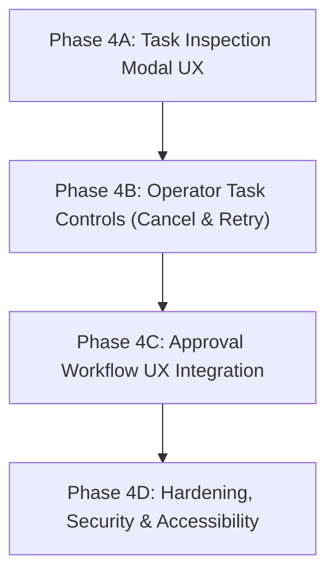

# TASK 068 DISCOVERY REPORT
## Web Dashboard Operator Controls, Task Inspection & Approval Workflow UX

**Author:** NexusOS Engineering  
**Baseline Commit:** `e191019be314253abde47decb515a96974d31afb`  
**CI Baseline:** Run `36965121992` (Task 067 Phase 3C CLOSED, GREEN)  
**Status:** DISCOVERY ONLY (Zero implementation changes)

---

## 1. Executive Summary

This discovery report establishes the technical foundation, authoritative boundaries, existing REST/SSE API contracts, security invariants, and smallest implementation surface for **Task 068 (Sprint 3 / S3-04)**: *Web Dashboard Operator Controls, Task Inspection & Approval Workflow UX*.

Task 067 successfully delivered real-time dashboard SSE telemetry, stream reconnection resilience, operator freshness indicators, and accessible activity feeds without a frontend framework (Vanilla TypeScript + DOM). Task 068 builds directly on top of Task 067 to introduce operator task inspection, safe task control actions (cancellation, retry), and human-in-the-loop (HITL) approval workflow interactions.

### Key Discovery Findings:
1. **Execution Authority Boundary:** `TaskController` (`services/backend/src/tasks/controller.ts`) coupled with `TaskStateMachine` (`services/backend/src/tasks/state-machine.ts`) is the **sole execution mutation authority**. The dashboard is strictly an observational and command-dispatching projection layer.
2. **Existing Task APIs:** Backend REST endpoints already exist for task creation (`POST /v1/tasks`), listing (`GET /v1/tasks`), detail fetching (`GET /v1/tasks/:id`), task cancellation (`POST /v1/tasks/:id/cancel`), approval listing (`GET /v1/approvals`), and approval decision submission (`POST /v1/approvals/:id/decision`).
3. **API Gaps:** A dedicated task retry endpoint (`POST /v1/tasks/:id/retry`) does **not** currently exist in `services/backend/src/server/app.ts`. Task retry must be semantically defined either as a new REST route spawning a child/clone task or as client-side resubmission via `POST /v1/tasks`.
4. **Tenant/Workspace Security:** Security invariants (`047-SEC-09`, `053-SEC-02`, `049-SEC-03`) are strictly enforced server-side. Cross-tenant or unauthorized task operations return non-disclosing 404 responses. Task IDs alone are never sufficient for mutation; tenant and workspace scope matching is mandatory.
5. **REST / SSE Reconciliation:** REST mutation responses return authoritative updated models synchronously. Subsequent SSE events (`task.status_changed`, `approval.decided`) update the live telemetry stream asynchronously. Client state reconciliation uses REST responses for immediate feedback while deduplicating (`_seenEventIds`) incoming SSE events.

---

## 2. Authoritative Sources

The following repository documents and specifications serve as authoritative definitions:

- **Task Lifecycle & State Machine:** `services/backend/src/tasks/state-machine.ts` and `docs/Architecture_and_Specs/TASK_LIFECYCLE.md` (or core architecture specs in `Architecture_and_Specs/`).
- **Task Controller & Mutation Rules:** `services/backend/src/tasks/controller.ts`.
- **Backend API Routes & Request Handlers:** `services/backend/src/server/app.ts`.
- **Approval Workflow Authority:** `services/backend/src/tasks/controller.ts` (`submitApprovalDecision`, `listPendingApprovals`).
- **Telemetry & Event Contracts (Task 067):** `packages/contracts/src/events/schemas.ts` and `apps/web-dashboard/src/telemetry-stream-client.ts`.
- **Dashboard API Helper Client:** `apps/web-dashboard/src/api/client.ts`.
- **Dashboard UI & State Projection:** `apps/web-dashboard/src/main.ts` and `apps/web-dashboard/index.html`.

> **[FACT]**: The source code in `services/backend/src/tasks/` and `apps/web-dashboard/` represents current ground truth. UI rendering choices do not define backend authority.

---

## 3. Current Task Lifecycle

The real task lifecycle is defined by `TaskStateMachine` in `services/backend/src/tasks/state-machine.ts`.

### Task States Enum:
- `SUBMITTED`: Task received by backend, awaiting policy check.
- `POLICY_EVALUATED`: Policy evaluation passed, ready for leasing or approval.
- `AWAITING_APPROVAL`: Task blocked requiring human operator approval.
- `LEASED`: Task acquired by an agent/executor worker.
- `DISPATCHED`: Task assigned and dispatched to agent context.
- `EXECUTING`: Agent actively executing task steps.
- `RECEIPT_VERIFIED`: Execution completed, artifact/result receipt verified.
- `COMPLETED`: Terminal success state.
- `FAILED`: Terminal error/failure state.
- `CANCELLED`: Terminal cancellation state.

### Valid State Transitions (`TaskStateMachine.canTransition`):
- `SUBMITTED` -> `POLICY_EVALUATED`, `FAILED`, `CANCELLED`
- `POLICY_EVALUATED` -> `LEASED`, `AWAITING_APPROVAL`, `FAILED`, `CANCELLED`
- `AWAITING_APPROVAL` -> `LEASED` (upon approval decision `APPROVED`), `FAILED`, `CANCELLED` (upon approval decision `REJECTED` or explicit cancel)
- `LEASED` -> `DISPATCHED`, `FAILED`, `CANCELLED`
- `DISPATCHED` -> `EXECUTING`, `FAILED`, `CANCELLED`
- `EXECUTING` -> `RECEIPT_VERIFIED`, `COMPLETED`, `FAILED`, `CANCELLED`
- `RECEIPT_VERIFIED` -> `COMPLETED`, `FAILED`, `CANCELLED`
- `COMPLETED` -> `[]` (Terminal, zero transitions allowed)
- `FAILED` -> `[]` (Terminal, zero transitions allowed)
- `CANCELLED` -> `[]` (Terminal, zero transitions allowed)

### Cancellation Semantics:
- Any non-terminal task (`SUBMITTED`, `POLICY_EVALUATED`, `AWAITING_APPROVAL`, `LEASED`, `DISPATCHED`, `EXECUTING`, `RECEIPT_VERIFIED`) can transition to `CANCELLED`.
- `TaskController.cancelTask(taskId, reason, authContext)` transitions task state to `CANCELLED`, sets `cancelledAt` timestamp, records cancellation reason, and publishes a `task.status_changed` SSE telemetry event.
- If task execution is active (`EXECUTING`), cancellation updates the logical task state in persistence and triggers cancellation signals to worker/agent dispatchers.

---

## 4. Execution Authority Boundary

A clear separation of concerns governs task state management across components:

| Component | Allowed to Mutate Task State? | Authority & Role |
| :--- | :--- | :--- |
| **TaskController** | **YES (SOLE AUTHORITY)** | Enforces state machine transitions, tenant authorization, persistence updates, and event publishing. |
| **TaskStateMachine** | **NO (VALIDATOR)** | Pure validation function `canTransition(from, to)` asserting transition rules. |
| **Planner** | **NO** | Proposes execution plans and tasks; submits new task payloads to TaskController. |
| **Executor / Agent** | **LIMITED** | Reports execution step status updates (`EXECUTING`, `COMPLETED`, `FAILED`) to TaskController via authorized internal APIs. |
| **Dashboard** | **NO (PRESENTATION / CLIENT)** | Reads telemetry, renders UI, and dispatches authenticated operator requests (`POST /v1/tasks/:id/cancel`, `POST /v1/approvals/:id/decision`) to REST endpoints. |

> **[FACT]**: The Web Dashboard has zero execution state mutation authority. Every operator action is an HTTP request evaluated by `TaskController`.

---

## 5. Existing Task APIs

Inspection of `services/backend/src/server/app.ts` and `apps/web-dashboard/src/api/client.ts` reveals the following endpoint surface:

### Existing REST Endpoints:
1. `GET /v1/tasks`: List tasks for tenant/workspace. Supports filters (`status`, `agentId`, `limit`).
2. `POST /v1/tasks`: Submit a new task execution request.
3. `GET /v1/tasks/:id`: Retrieve single task detail by ID.
4. `POST /v1/tasks/:id/cancel`: Cancel an active task. Accepts `{ reason?: string }`.
5. `GET /v1/approvals`: List pending approval requests.
6. `POST /v1/approvals/:id/decision`: Submit approval decision (`APPROVED` or `REJECTED`). Accepts `{ decision, reason }`.

### API Gaps for Task 068:
- `POST /v1/tasks/:id/retry`: **NOT PRESENT** in backend REST routes.
  - *Option A:* Introduce `POST /v1/tasks/:id/retry` in `services/backend/src/server/app.ts` delegating to `taskController.retryTask(taskId, authContext)`.
  - *Option B:* Have the dashboard client handle retry by fetching task details via `GET /v1/tasks/:id` and posting a new task payload via `POST /v1/tasks`.

> **[INFERENCE]**: Adding a dedicated backend route `POST /v1/tasks/:id/retry` provides better auditability, backend-enforced idempotency, and clean server-side event generation (`task.created` / `task.status_changed`).

---

## 6. Approval/HITL Authority

Human-In-The-Loop (HITL) approvals follow a strict server-authorized workflow:

1. **Origin:** When policy evaluation determines a task requires human intervention, `TaskController` transitions the task to `AWAITING_APPROVAL` and creates a pending `ApprovalRequest` record.
2. **Persistence:** Approvals are persisted in backend storage with unique `approvalId`, `taskId`, `tenantId`, `workspaceId`, `status: 'PENDING'`, and required scope/policy metadata.
3. **Decision Endpoint:** `POST /v1/approvals/:id/decision` receives operator decisions (`APPROVED` or `REJECTED`).
4. **Idempotency & Authorization:**
   - Server verifies operator auth context matches task `tenantId` and `workspaceId`.
   - If approval is no longer `PENDING` (e.g. already decided or expired), backend returns `409 Conflict` or `400 Bad Request`.
5. **Post-Decision Flow:**
   - If `APPROVED`: Task state transitions from `AWAITING_APPROVAL` to `LEASED` / `POLICY_EVALUATED` and resumes execution pipeline.
   - If `REJECTED`: Task state transitions from `AWAITING_APPROVAL` to `CANCELLED` or `FAILED` with rejection context recorded.
6. **Telemetry:** Backend emits `approval.decided` and `task.status_changed` SSE events upon decision.

> **[FACT]**: The web dashboard currently renders pending approvals in an activity card (`renderApprovals` in `main.ts`), but direct inline approval/rejection interactive button controls need dedicated UX integration in Task 068.

---

## 7. Task 067 Event Contract Integration

Task 067 established SSE telemetry stream handling in `apps/web-dashboard/src/telemetry-stream-client.ts` and `apps/web-dashboard/src/main.ts`.

### Telemetry Events Relevant to Task 068:
- `task.status_changed`: `{ taskId, tenantId, workspaceId, previousStatus, newStatus, timestamp, reason }`
- `approval.requested`: `{ approvalId, taskId, tenantId, workspaceId, requiredRole, timeoutAt }`
- `approval.decided`: `{ approvalId, taskId, tenantId, workspaceId, decision, deciderId, decidedAt }`
- `agent.status_changed`: `{ agentId, tenantId, workspaceId, status }`
- `stream.reset`: Signals client to purge transient state and trigger REST reconciliation.

### REST vs SSE Reconciliation Rules:
1. **Immediate Optimistic/Authoritative REST Update:** When operator clicks an action (e.g. Cancel or Approve), the dashboard calls the REST API. On REST success (200 OK), the UI updates immediately with the response data.
2. **SSE Deduplication:** Incoming SSE events pass through `_seenEventIds` deduplication in `telemetry-stream-client.ts`.
3. **State Convergence:** If an SSE event for a completed REST mutation arrives later, the UI state handles it idempotently without tearing down user view or jumping back in state.

---

## 8. Current Dashboard Architecture

The web dashboard (`apps/web-dashboard/`) is written in **Vanilla TypeScript** using direct DOM manipulation without any heavy frontend frameworks (React, Vue, Svelte, etc.).

### Current Architecture Summary:
- **Build / Bundle:** Vite + TypeScript (`apps/web-dashboard/vite.config.ts`).
- **Entry File:** `apps/web-dashboard/src/main.ts` (~1200 lines).
- **HTML Structure:** `apps/web-dashboard/index.html` with grid layout, agent/task tables, activity feed, SSE status pill, and task detail modal skeleton.
- **REST Client:** `apps/web-dashboard/src/api/client.ts` (`DashboardAPIClient`).
- **SSE Client:** `apps/web-dashboard/src/telemetry-stream-client.ts` (`TelemetryStreamClient`).
- **Modal Mechanics:** Native `<dialog>` or overlay div controlled via `openTaskDetailModal(taskId)` and `closeModal()`.

### Smallest UI Extension for Task 068:
- Keep Vanilla TypeScript architecture.
- Extend `main.ts` with modal detail rendering, task log view, cancellation button triggers, retry button triggers, and interactive approval decision controls.
- Maintain existing DOM bounds and memory limits (e.g., maximum task list rows, bounded event log arrays).

---

## 9. Security Model

Security is enforced through server-side authorization and tenant isolation:

### Concrete Security Invariants for Task 068:
- **068-SEC-01 (Tenant Read Boundary):** Authenticated operator can only read tasks/approvals belonging to their authorized `tenantId`. Cross-tenant requests return 404 (non-disclosing).
- **068-SEC-02 (Tenant Mutation Boundary):** Authenticated operator cannot mutate (cancel/retry/approve) tasks outside their `tenantId`. Backend rejects unauthorized attempts.
- **068-SEC-03 (Workspace Boundary):** Workspace-scoped operations (`workspaceId`) are strictly isolated within the authorized tenant context.
- **068-SEC-04 (Approval Authority):** Approval decisions must be server-validated against operator role and tenant context; UI visibility alone confers zero privilege.
- **068-SEC-05 (Idempotent Mutations):** Stale, duplicate, or replayed operator actions (e.g. double-clicking cancel/approve) are handled safely via backend idempotency checks (returning 409 Conflict or 200 with existing terminal state).
- **068-SEC-06 (No IDOR via Task ID):** Knowing a valid UUID for a task in another tenant yields a non-disclosing 404 response on both REST and SSE stream subscriptions.

---

## 10. Race / Concurrency Analysis

| Scenario | Risk | Recommended Handling Strategy |
| :--- | :--- | :--- |
| **Double Cancel Click** | Duplicate HTTP requests sent | Disable button immediately upon click (`aria-disabled="true"`, `loading` state); backend ignores duplicate cancel calls idempotently. |
| **REST Cancel vs SSE `status_changed`** | SSE arrives after REST response | REST updates local state synchronously. When SSE event arrives, event ID is deduplicated or ignored if state matches. |
| **SSE arrives BEFORE REST response** | SSE updates state mid-flight | UI updates state from SSE; when REST request completes, response matches current state. |
| **Task completes while Modal open** | Operator viewing stale non-terminal state | Task detail modal updates dynamically upon receiving `task.status_changed` SSE event. |
| **Approval decided in another tab** | Stale approval buttons visible | `approval.decided` SSE event removes approval card and disables inline controls immediately. |
| **Stream Reset during pending action** | SSE stream re-connects | Active REST request completes independently; stream reset triggers background REST poll reconciliation. |

---

## 11. Accessibility / UX Requirements

Task 068 operator controls and inspection modals must adhere to WCAG 2.1 AA standards:

1. **Modal / Dialog Semantics:**
   - Task detail view must use accessible dialog patterns (`role="dialog"`, `aria-modal="true"`, `aria-labelledby="task-detail-title"`).
   - Focus must be trapped inside modal when open and restored to trigger element upon closing (Escape key handler).
2. **Operator Control Buttons:**
   - Cancel / Retry / Approve / Reject buttons must have clear text labels, visible focus rings, and explicit disabled/loading attributes (`aria-disabled="true"` during fetch).
   - Confirmation prompt or popover for destructive actions (e.g., Task Cancellation).
3. **Screen Reader Announcements:**
   - Operator action results (e.g. "Task 123 cancelled successfully") announced via dedicated `aria-live="polite"` status region.
   - Avoid excessive live announcements from background SSE telemetry updates to prevent screen reader noise.

---

## 12. Observability / Audit

All operator actions must generate auditable log records and event traces:

- **Audit Attributes:**
  - `operatorId` / `actor` (from auth token)
  - `tenantId` & `workspaceId`
  - `taskId` / `approvalId`
  - `action` (`TASK_CANCELLED`, `TASK_RETRIED`, `APPROVAL_GRANTED`, `APPROVAL_REJECTED`)
  - `timestamp` (ISO-8601 UTC)
  - `reason` (user-supplied justification)
  - `clientIp` / `userAgent` (from request headers)
- **Event Publication:** `TaskController` emits corresponding SSE events (`task.status_changed`, `approval.decided`) with full audit metadata.

---

## 13. Resource / Abuse Bounds

To protect client performance and server availability:

- **Task List Bounds:** DOM task list capped at 100 visible items (older items pruned or paginated).
- **Task Detail Payload:** Detail inspection payload limited to task metadata, execution step history (max 50 steps), and sanitized error logs (max 100KB log buffer).
- **Action Rate Limiting:** Debounce operator action buttons (minimum 500ms between submissions).
- **Polling Backoff:** Reconnection fallback polling bound to jittered exponential backoff (5s to 30s max interval).

---

## 14. Existing Test Coverage

Inspection of `tests/` directory identifies existing test coverage relevant to tasks, approvals, and dashboard:

- `tests/hardening/dashboard-event-projection-phase3b.test.ts`: Tests dashboard DOM projection, SSE event handling, and activity feed rendering.
- `services/backend/tests/` (or equivalent backend unit/integration tests): Tests for `TaskController`, `TaskStateMachine`, and REST endpoints.

### Task 068 Recommended Test Matrix:
1. `tests/hardening/dashboard-operator-controls.test.ts`:
   - Unit/DOM tests for task inspection modal opening/closing and focus management.
   - Tests for Cancel button click -> REST API call -> UI state update -> SSE event reconciliation.
   - Tests for Approval decision buttons -> REST call -> UI cleanup.
   - Tests for error handling (e.g., REST 409 or 500 failure shows error toast without corrupting state).
2. Backend API / Controller Tests:
   - Authorization and tenant isolation tests for task cancel and approval decision endpoints.

---

## 15. Gaps / Risks

1. **Missing Backend Retry Endpoint:** As identified in Section 5, `POST /v1/tasks/:id/retry` does not exist in `services/backend/src/server/app.ts`.
   - *Risk:* Implementing retry purely client-side by copying fields into `POST /v1/tasks` loses parent task lineage tracking.
   - *Recommendation:* Introduce `POST /v1/tasks/:id/retry` in `services/backend/src/server/app.ts` as part of backend task control implementation.
2. **Sensitive Log Exposure:** Task detail modal will display execution logs and error messages.
   - *Risk:* Raw execution outputs might contain authorization headers, environment secrets, or private keys.
   - *Recommendation:* Ensure log outputs are sanitized backend-side or filtered prior to transmission in `/v1/tasks/:id`.

---

## 16. Minimum Implementation File Scope

To maintain narrow scope and prevent regression of Task 067, the proposed implementation file set for Task 068 is explicitly categorized:

### MUST CHANGE:
1. `apps/web-dashboard/src/main.ts`: Add task inspection modal detail rendering, operator action handlers (Cancel, Retry, Approve, Reject), confirmation dialogs, and accessibility focus traps.
2. `apps/web-dashboard/src/api/client.ts`: Add `retryTask(taskId: string)` helper method to `DashboardAPIClient`.
3. `apps/web-dashboard/index.html`: Add modal DOM templates and control button markup for task inspection and approval workflows.
4. `services/backend/src/server/app.ts`: Add `POST /v1/tasks/:id/retry` REST endpoint route handler (if backend retry slice is included).
5. `services/backend/src/tasks/controller.ts`: Add `retryTask(taskId, context)` implementation to `TaskController` (if backend retry slice is included).
6. `tests/hardening/dashboard-operator-controls-phase4.test.ts`: New hardening test suite verifying operator controls, modals, and accessibility.

### MAY CHANGE:
- `packages/contracts/src/events/schemas.ts`: Add `task.retried` event schema if retry produces a specific telemetry event.

### DO NOT CHANGE:
- `apps/web-dashboard/src/telemetry-stream-client.ts` (Task 067 SSE transport client).
- Core CSS styling framework (keep Vanilla CSS / existing style tokens).

---

## 17. Proposed Implementation Slices

Task 068 implementation should be executed in 4 small, verifiable phases:

### Phase 4A: Task Inspection & Detail UX (Read-Only)
- **Scope:** Build accessible task inspection modal in `main.ts` and `index.html`. Display complete task metadata, status history, agent assignment, and execution logs fetched via `GET /v1/tasks/:id`.
- **Dependencies:** Existing `GET /v1/tasks/:id` endpoint.
- **Files:** `apps/web-dashboard/src/main.ts`, `apps/web-dashboard/index.html`.

### Phase 4B: Operator Task Controls (Cancel & Retry)
- **Scope:** Add Cancel and Retry buttons to Task row and Task detail modal. Connect Cancel button to `POST /v1/tasks/:id/cancel`. Implement `POST /v1/tasks/:id/retry` backend controller route and connect dashboard Retry button.
- **Dependencies:** Phase 4A.
- **Files:** `apps/web-dashboard/src/main.ts`, `apps/web-dashboard/src/api/client.ts`, `services/backend/src/server/app.ts`, `services/backend/src/tasks/controller.ts`.

### Phase 4C: Approval Workflow UX Integration
- **Scope:** Add interactive Approve and Reject action buttons to pending approval cards and modal view. Connect to `POST /v1/approvals/:id/decision`. Handle instant card removal and status badge updates upon decision.
- **Dependencies:** Existing `POST /v1/approvals/:id/decision` endpoint.
- **Files:** `apps/web-dashboard/src/main.ts`, `apps/web-dashboard/index.html`.

### Phase 4D: Hardening, Security & Accessibility Validation
- **Scope:** Add keyboard focus traps for modal, `aria-live` status announcements, button loading/disabled state guards, race condition guards, and complete unit/integration test suite.
- **Dependencies:** Phases 4A-4C.
- **Files:** `tests/hardening/dashboard-operator-controls-phase4.test.ts`.

---

## 18. Acceptance Matrix

| Category | Requirement / Criterion | Verification Method |
| :--- | :--- | :--- |
| **Inspection** | Clicking a task row opens detail modal displaying complete task metadata, timestamps, steps, and sanitized logs. | DOM unit tests & visual inspection |
| **Inspection** | Pressing `Escape` or clicking Close button closes detail modal and restores keyboard focus to trigger row. | Keyboard navigation test |
| **Task Cancel** | Clicking Cancel on non-terminal task prompts confirmation, calls `POST /v1/tasks/:id/cancel`, updates UI to `CANCELLED`, and deduplicates incoming SSE `status_changed`. | Integration test |
| **Task Retry** | Clicking Retry on `FAILED` or `CANCELLED` task calls `POST /v1/tasks/:id/retry`, spawning a new task execution request. | Integration test |
| **Approval** | Clicking Approve/Reject on pending approval sends `POST /v1/approvals/:id/decision`, updates approval card immediately, and transitions task state. | Integration test |
| **Security** | Cross-tenant task inspection or cancel attempt returns non-disclosing 404 response. | Security test suite |
| **Accessibility** | Modal has `role="dialog"`, focus trap active, visible focus rings on controls, and polite `aria-live` announcements. | Accessibility audit / DOM test |

---

## 19. Explicit Non-Goals

The following items are strictly out of scope for Task 068:

- **NO Framework Migration:** Do NOT introduce React, Vue, Svelte, or external UI libraries.
- **NO SSE Transport Redesign:** Do NOT modify `telemetry-stream-client.ts` or change existing SSE cursor/reconnection logic.
- **NO Task State Machine Redesign:** Do NOT alter valid state transitions in `TaskStateMachine`.
- **NO Direct DB Mutations:** Do NOT allow client-side direct state modifications; all actions must route through `TaskController` REST APIs.
- **NO Arbitrary Execution Override:** Operators cannot force invalid state transitions (e.g. moving a `COMPLETED` task back to `EXECUTING`).

---

## 20. Final Discovery Status

- **Discovery Report Created:** `docs/task_068_discovery_report.md`
- **Code Modifications:** ZERO source or test files modified.
- **Dependencies:** ZERO packages added or modified.
- **Working Tree:** CLEAN (`git status --short` verified).
- **Baseline Commit:** `e191019be314253abde47decb515a96974d31afb` (`HEAD == origin/main`).
- **Next Step:** Commit this discovery report (`docs: add task 068 discovery report`) and await prompt instructions for Phase 4 implementation.

---

## Discovery Hardening — Retry Semantics

**Hardening Pass Date:** 2026-10-02  
**Hardening Commit Parent:** `a1ea0a7ee4deab47017cd5db30ae4f747d67eda4`  
**Methodology:** Exhaustive source search across `services/backend/src/`, `packages/contracts/src/`, `apps/web-dashboard/src/`, `tests/`, and all discovery docs.

---

### Existing Retry/Recovery Evidence

**What "retry" means in NexusOS at the planner/workflow level:**

1. **Planner-Level Node Retry (`ReplanCoordinator`)** — **[FACT]**
   - Source: `services/backend/src/planner/replan-coordinator.ts`, lines 168–210.
   - When a DAG workflow **node** fails, `ReplanCoordinator.adaptFailedNode()` synthesizes a **successor node** with a new `nodeId` (suffix `-retry`) and an increased `timeoutMs`. This is **not** a transition of the same task back into execution — it produces a new successor workflow graph proposal (`AdaptiveReplanResponse`) with a new `successorWorkflowId` and incremented `version`.
   - This planner-level retry operates at the **workflow node** granularity, not the **task** granularity. The parent `TaskRecord` keeps the same `taskId` throughout.

2. **Bounded Replan Iteration Hard Cap** — **[FACT]**
   - Source: `services/backend/src/planner/replan-coordinator.ts`, line 21.
   - `PLANNER_SAFETY_LIMITS.MAX_REPLAN_ITERATIONS` is enforced. Exceeding the limit throws a terminal error (`EXCEEDS_MAX_REPLAN_ITERATIONS`). No infinite retry loops are possible at the planner level.

3. **Memory Evolution Processor Retry** — **[FACT]**
   - Source: `services/backend/src/memory/memory-evolution-processor.ts`, lines 235–248.
   - The memory subsystem has its own bounded retry with exponential backoff for transient outbox delivery failures. This is entirely internal to the memory layer and **not** user-visible at the task lifecycle level. Not relevant to operator-initiated retry.

4. **SSE Client Retry (Dashboard Transport)** — **[FACT]**
   - Source: `tests/hardening/dashboard-sse-client-phase3a.test.ts`, lines 689, 751.
   - The SSE client has a "retry counter" that resets after successful reconnect. This is transport-layer reconnect retry, not task execution retry.

5. **No `retryCount`, `attemptCount`, `retryPolicy`, `parentTaskId`, or `rootTaskId` fields in `TaskRecord`** — **[FACT]**
   - Source: `packages/contracts/src/tasks/index.ts` (canonical `TaskRecordSchema`, lines 275–307).
   - `TaskRecord` schema contains: `taskId`, `tenantId`, `submittedBy`, `title`, `targetAgentId`, `capabilityId`, `runtimeCategory`, `parameters`, `requestedScope`, `state`, `lease`, `receipt`, `evidenceChecksum`, `isWorkflow`, `dag`, `policyDecision`, `error`, `createdAt`, `updatedAt`.
   - There is **zero** evidence of `parentTaskId`, `rootTaskId`, `lineage`, `retryCount`, `attemptCount`, or `retryPolicy` fields in the canonical task contract.

6. **`POST /v1/tasks/replan` endpoint exists for planner-level replanning** — **[FACT]**
   - Source: `services/backend/src/server/app.ts`, lines 381–389.
   - Route handler: `taskController.replanGoal(body, authContext)`.
   - This is a **planner proposal** endpoint (returns an `AdaptiveReplanResponse` with `status: 'PROPOSED'`). It does NOT automatically create a new task or restart execution. The response contains a `successorDAG` proposal that would need to be submitted via `POST /v1/tasks` to create a new execution.

---

### Task Lineage Evidence

**Is there a canonical concept of task lineage, parent task, or root task?**

- **[FACT]** `TaskRecord` schema has **no** `parentTaskId`, `rootTaskId`, `sourceTaskId`, or lineage fields whatsoever (confirmed from `packages/contracts/src/tasks/index.ts` lines 275–307).
- **[FACT]** `TaskController.createTask()` and `TaskController.createTaskGraph()` both generate a fresh `crypto.randomUUID()` as `taskId` with zero reference to any predecessor task.
- **[FACT]** The `AdaptiveReplanResponse` returned by `replanGoal` does carry `priorWorkflowId` in `metadata.priorWorkflowId` — but this is a **proposal document**, not a persisted `TaskRecord`. The `successorDAG` in the response would need to be submitted as a new `POST /v1/tasks` call to actually create a linked task.
- **[INFERENCE]** If an operator retries a failed task today by calling `POST /v1/tasks` with the same parameters, the resulting new task has **no programmatic link** to the original task in the persistence layer. Lineage is not tracked.
- **[OPEN QUESTION]** Whether future sprints require task lineage tracking (e.g., a `parentTaskId` field on `TaskRecord`) is not answerable from current source.

---

### Idempotency / Concurrency Evidence

**Does the task mutation layer have idempotency keys, version checks, or optimistic concurrency?**

- **[FACT]** `TaskController` uses an in-memory `Map<string, TaskRecord>` for task persistence (controller.ts line 206). There is **no** optimistic concurrency mechanism, version field, or `eTag` in the task persistence layer.
- **[FACT]** `TaskStateMachine.transition()` is a pure function that throws `TaskStateMachineError` if a transition is invalid. This provides **state-machine-level guard** against invalid transitions — not optimistic concurrency.
- **[FACT]** `cancelTask()` handles already-cancelled tasks idempotently: if `task.state === CANCELLED` it returns the existing task without error (controller.ts line 1280).
- **[FACT]** `cancelTask()` throws for `COMPLETED` and `FAILED` terminal states (controller.ts lines 1273–1278), preventing mutation of terminal tasks.
- **[FACT]** `submitApprovalDecision()` delegates to `approvalHost.submitDecision()`. The approval host enforces idempotency via nonce, lease, and expiry checks. `PROMPT_ALREADY_RESOLVED` (409 Conflict) is returned on duplicate submission.
- **[INFERENCE]** Double-click cancel is safely guarded. Double-click retry would **not** be guarded unless the dashboard disables the button after the first submission, because `createTask()` generates a new UUID on every call — two requests would create two distinct tasks.

**Concurrency scenario analysis:**

| Scenario | Behavior | Classification |
| :--- | :--- | :--- |
| Double-click cancel | Second call returns `CANCELLED` task idempotently | **[FACT]** |
| Cancel completed task | Throws `Cannot cancel: COMPLETED` | **[FACT]** |
| Cancel failed task | Throws `Cannot cancel: FAILED` | **[FACT]** |
| Two tabs cancel same task | First transitions to `CANCELLED`; second returns `CANCELLED` idempotently | **[FACT]** |
| Retry a FAILED task via any backend mechanism | No mechanism exists; `FAILED` is terminal with zero outgoing transitions | **[FACT]** |
| Retry a COMPLETED task | Not possible via any backend mechanism | **[FACT]** |
| REST timeout on cancel | Server may have already committed `CANCELLED` — idempotent on retry | **[FACT/INFERENCE]** |
| Double-click approve | `approvalHost` returns `PROMPT_ALREADY_RESOLVED` (409) | **[FACT]** |

---

### Audit / Event Evidence

**Does an existing audit/event system record task lifecycle events?**

- **[FACT]** `TaskController` publishes `nexusos.events.task.created` on task creation (controller.ts lines 870–897).
- **[FACT]** `publishTaskStatusChanged()` publishes `nexusos.events.task.status_changed` to `TenantStreamEventBus` on every state transition (controller.ts lines 278–305). Payload includes `taskId`, `tenantId`, `state`, `previousState`, `targetAgentId`, `error`.
- **[FACT]** `cancelTask()` publishes `nexusos.events.task.canceled` with `taskId`, `reason`, `tenantId` (controller.ts lines 1290–1303).
- **[FACT]** `submitApprovalDecision()` publishes `nexusos.events.approval.decision` AND `nexusos.events.approval.decided` (controller.ts lines 658–697). Payload includes `decidedBy` (operator identity).
- **[FACT]** `PolicyAuditLoggerBoundary.logDecision()` records every policy evaluation with `operatorId`, `tenantId`, `resourceId`, `actionName`, `policyVersion`, `timestamp`, `reason` (controller.ts interface lines 155–157).
- **[FACT]** There is **no** `nexusos.events.task.retried` event type defined anywhere in the codebase or contracts.
- **[INFERENCE]** If operator-initiated retry is implemented as `POST /v1/tasks` (new task creation), the new task automatically emits `nexusos.events.task.created` and `task.status_changed` events via existing infrastructure. No new event type is needed for a resubmission pattern. The connection to the original failed task is only implicit (shared parameters, not a persisted lineage field).

---

### Approval Interaction

**Concrete behavior of approvals in retry scenarios:**

- **[FACT]** `AWAITING_APPROVAL` state has outgoing transitions only to `EXECUTING` (ALLOW), `FAILED` (DENY), or `CANCELLED`. No `AWAITING_APPROVAL -> SUBMITTED` transition exists (state-machine.ts lines 46–50).
- **[FACT]** A `DENY` decision transitions task from `AWAITING_APPROVAL` to `FAILED` with `error.code = 'APPROVAL_DENIED'`. `FAILED` is terminal with zero outgoing transitions.
- **[FACT]** `ApprovalAuthorityBoundary.cancelPrompt()` is defined as optional in the interface (controller.ts line 44) but is NOT wired to `cancelTask()`. Cancelling a task in `AWAITING_APPROVAL` via `POST /v1/tasks/:id/cancel` does NOT automatically cancel the pending approval prompt.
- **[INFERENCE]** If an operator retries a denied task, a **new task** must be submitted via `POST /v1/tasks`. The new task goes through policy evaluation and generates a new approval prompt independently. The original approval and task remain in terminal state with no programmatic link.

| Scenario | Behavior | Classification |
| :--- | :--- | :--- |
| Task failed while awaiting approval | Approval can still be submitted (host validates state independently) | **[FACT/INFERENCE]** |
| Task failed after approval was granted | Task is `FAILED` terminal. No retry path exists within same `TaskRecord` | **[FACT]** |
| Task cancelled while approval pending | Task → `CANCELLED`. Approval prompt remains in host but cannot affect task state | **[FACT]** |
| Retry after rejection (DENY decision) | New task via `POST /v1/tasks`. New approval generated independently | **[FACT/INFERENCE]** |
| Expired approval prompt | `submitDecision` throws `PROMPT_EXPIRED` (410) | **[FACT]** |

---

### Authorization Evidence

**Re-verification of server-side authorization for all task mutations:**

- **`GET /v1/tasks/:id`:** Authenticator required → `authContext` extracted → `TaskController.getTask()` checks `task.tenantId !== context.tenantId` → non-disclosing **404** on cross-tenant probe (app.ts lines 392–426). **[FACT]**: Task ID alone is insufficient.
- **`POST /v1/tasks/:id/cancel`:** Authenticator required → tenant check in `cancelTask()` → non-disclosing **404** on cross-tenant probe (app.ts lines 429–458). **[FACT]**: Mutation authorization occurs before state transition.
- **`POST /v1/approvals/:id/decision`:** `authenticateForDashboard()` required → `submitApprovalDecision()` checks `decisionReq.tenantId !== context.tenantId` → **403 TENANT_MISMATCH** (not 404) on cross-tenant probe (controller.ts lines 605–610). **[FACT]**: Approval mutations use 403 (not 404) for tenant mismatch — distinguishable from task mutations.
- **Authorization order:** Authentication → `authContext` extraction → tenant check in controller → state machine validation → persistence update. **[FACT]**: Authorization always precedes state transition.

---

### Retry Decision

#### Answering the Canonical Questions from Source

**A. Is retry: (1) transition of same task back into execution, (2) new task derived from old, (3) new execution attempt, or (4) other?**  
**[FACT]**: None of (1), (3), (4) exist in the implementation. (2) — new task creation — is the only possible mechanism today, and it is not formalized as "retry." There is no `parentTaskId` linkage.

**B. Which states are retryable?**  
**[FACT]**: `FAILED` and `CANCELLED` are the logical candidates. No retryability classification exists at the task level.

**C. Which states are terminal?**  
**[FACT]**: `COMPLETED`, `FAILED`, `CANCELLED` — from `TaskStateMachine.isTerminal()` (state-machine.ts lines 94–100).

**D. Can a successful task be retried?**  
**[FACT]**: Not through any existing backend mechanism. New task creation is always possible but is an operator decision.

**E. Can a cancelled task be retried?**  
**[FACT/INFERENCE]**: Not via state machine. A new task can be submitted.

**F. Can an actively-running task be retried?**  
**[FACT]**: No existing backend mechanism. State machine does not allow this.

**G. What happens to approvals on retry?**  
**[FACT]**: Original approval is unchanged (terminal state). New task generates new approval independently if policy requires.

**H–K. Delegated work, artifacts, progress, non-idempotent safety?**  
**[FACT]**: All belong to the original `TaskRecord`. A new task starts fresh. `ReplanCoordinator` explicitly blocks retry of ambiguous/non-idempotent operations (replan-coordinator.ts lines 45–48). No equivalent safeguard exists for operator-initiated new task creation.

**L. Is there already a policy deciding whether a failure is retryable?**  
**[FACT]**: `ReplanCoordinator.isUnknownOutcome()` classifies certain failure reasons at the planner/workflow-node level. There is **no** equivalent classification at the `TaskRecord`/operator level.

---

### Final Retry Decision

> **Selected: Decision D — Retry semantics are not sufficiently defined. Task 068 must NOT implement operator-initiated task retry.**

**Evidence supporting Decision D:**

1. **[FACT]** No retry state transition exists in `TaskStateMachine`. Terminal states (`FAILED`, `CANCELLED`, `COMPLETED`) have zero outgoing transitions.
2. **[FACT]** No `retryTask()` method exists on `TaskController`. No `POST /v1/tasks/:id/retry` route exists.
3. **[FACT]** `TaskRecord` has no `parentTaskId`, `retryCount`, or lineage fields. A "retry" today creates an orphaned new task with no programmatic link to the original.
4. **[FACT]** No retryability classification exists at the task level (only at the planner workflow-node level).
5. **[FACT]** No `task.retried` event type exists in any event schema contract.
6. **[OPEN QUESTION]** Business requirements for retryable vs. terminal failure are not defined in any source file, EDD, or PRD inspected.
7. **[OPEN QUESTION]** Whether retry should track task lineage (`parentTaskId` on `TaskRecord`) is architecturally undefined and requires a contracts-breaking change.
8. **[OPEN QUESTION]** Authorization/role restrictions for retry are not specified.

> Decision D was selected (not C) because the absence of a `/retry` HTTP endpoint alone is insufficient to justify new backend capability. The deeper issue is that the **semantic contract** of retry — lineage tracking, retryability policy, idempotency model — is architecturally undefined at the task level.

---

### Revised Operator Controls Scope for Task 068

Based on the hardening evidence, Task 068 should expose exactly these operator controls:

| Control | Backend Capability | State Precondition | Authorization | REST Response | SSE Consequence | Confirmation Required |
| :--- | :--- | :--- | :--- | :--- | :--- | :--- |
| **Cancel Task** | ✅ `POST /v1/tasks/:id/cancel` | Any non-terminal state | Tenant match, auth | `200 OK` (updated `TaskRecord`, `state: CANCELLED`) | `task.status_changed` | Yes — destructive |
| **Approve** | ✅ `POST /v1/approvals/:id/decision` ALLOW | `AWAITING_APPROVAL`, approval `PENDING` | Tenant match, auth | `200 OK` (`ApprovalDecisionResult`) | `approval.decided` + `task.status_changed` | Yes — consequential |
| **Reject** | ✅ `POST /v1/approvals/:id/decision` DENY | `AWAITING_APPROVAL`, approval `PENDING` | Tenant match, auth | `200 OK` (`ApprovalDecisionResult`) | `approval.decided` + `task.status_changed` (→ FAILED) | Yes — task becomes terminal |
| **View Task Detail** | ✅ `GET /v1/tasks/:id` | Any state | Tenant match, auth | `200 OK` (`TaskRecord`) | None | No |
| **Retry** | ❌ Undefined — semantics not established | N/A | N/A | N/A | N/A | **NOT IN SCOPE FOR TASK 068** |

---

### Remaining Open Questions

1. **[OPEN QUESTION]** Should operator-initiated retry be defined in a future task (e.g., Task 069+) with explicit lineage tracking (`parentTaskId` field on `TaskRecord`)?
2. **[OPEN QUESTION]** Should retry require backend-enforced retryability classification (only tasks that failed with specific `error.code` values are retryable)?
3. **[OPEN QUESTION]** Is there a role restriction on who can approve/reject approval decisions?
4. **[OPEN QUESTION]** Should cancellation of a task in `AWAITING_APPROVAL` also cancel the pending approval prompt via `ApprovalAuthorityBoundary.cancelPrompt()`? Currently `cancelPrompt()` is an optional interface method that is not wired to `cancelTask()`.

