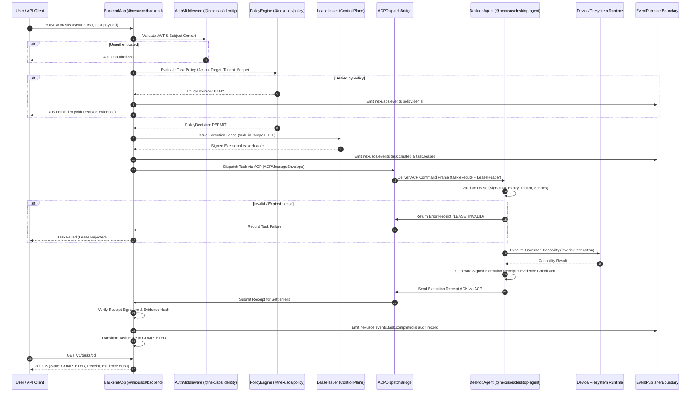

# Task 047 Discovery Report

## Milestone M6: Governed Vertical Slice & Cross-Service Control-Plane Integration

**Date:** 2026-09-08  
**Mode:** DISCOVERY ONLY  
**Authoritative Baseline:** `610ed462d19df2d416b0c2d0f5af86b48ede7ef5`  
**Status:** COMPLETE (Discovery Only — Implementation Not Started)

---

## 1. Executive Summary

Task 046 completed the NexusOS Desktop Agent Host Integration Series by successfully integrating the `LocalAiRuntime` adapter (`rt:local-ai-v1`), its Zod IPC request/response contracts, capability registrations, policy authorizations, runtime routing, and 12-case adversarial security test suite.

Following the completion of the foundational services (Tasks 03A–03F: Contracts, Backend, Identity, Policy) and the complete Desktop Agent host plane (Tasks 03G–046: Lifecycle, Configuration, State, IPC, Memory, Orchestrator, Scheduler, Workflow, Device, Filesystem, Terminal, Browser, Plugin, and Local AI runtimes), the NexusOS repository has fulfilled **Milestones M0 through M3** of the Sprint 0 Implementation Blueprint.

The definitive, authoritative next step in the NexusOS project progression is **Task 047: Milestone M6 — Governed Vertical Slice & Cross-Service Control-Plane Integration**.

Task 047 transitions NexusOS from isolated subsystem foundations into an end-to-end governed platform. It establishes the first end-to-end execution path across all four foundational domains:

1. **Control Plane Backend (`@nexusos/backend`)**: Governed task intake (`POST /v1/tasks`), authentication middleware integration, policy decision evaluation, task lifecycle state machine, cryptographic execution lease issuance, and event emission.
2. **Identity Service (`@nexusos/identity`)**: OIDC/JWT context validation, subject authentication, and tenant isolation.
3. **Policy Decision Engine (`@nexusos/policy`)**: Policy evaluation against task context, capability grant validation, and immutable decision evidence recording.
4. **Desktop Agent Host Plane (`@nexusos/desktop-agent`)**: Outbound control-plane communication via ACP stream, lease validation at the execution boundary, safe capability dispatch to a low-risk runtime, execution receipt generation, and telemetry batch emission.
5. **End-to-End Governance & Verification**: Proving the complete flow under both happy-path conditions, the 10 failure injection scenarios mandated by Blueprint Section 87, and the 12-case adversarial security hardening matrix (`047-SEC-01` to `047-SEC-12`).

This report provides the exhaustive, evidence-backed discovery for Task 047. **No implementation code has been written.**

---

## 2. Baseline Verification

### 2.1 Git Preflight Results

- **Branch:** `main`
- **HEAD Commit SHA:** `610ed462d19df2d416b0c2d0f5af86b48ede7ef5`
- **origin/main SHA:** `610ed462d19df2d416b0c2d0f5af86b48ede7ef5`
- **Synchronization:** `HEAD == origin/main` (perfectly synchronized)
- **Working Tree Status:** Clean (no modified, staged, or untracked production files)
- **Latest Commit:** `610ed46 docs(local-ai): add Task 046 discovery report, completion report and update baseline`

### 2.2 Preceding Task Verification

- **Preceding Task:** Task 046 (Local AI Runtime & Hardware Acceleration Adapter — Host Integration)
- **GitHub Actions Run:** 34191417751
- **CI Conclusion:** `SUCCESS` (GREEN)
- **Local Quality Gates:**
  - Full Test Suite: **680 / 680 tests passing** across **103 / 103 test suites**
  - TypeScript Typecheck: 0 errors
  - ESLint: 0 errors
  - Prettier Formatting: 100% compliant
  - Repository Validation (`validate-repo.js`): PASS
  - Security Secret Scan (`security-scan.js`): 0 secrets detected
- **Task 047 Status:** NOT STARTED
- **Task 048+ Status:** NOT STARTED

---

## 3. Task Frontier Reconstruction

An audit of the git commit history, completion reports, discovery documents, and architectural milestones establishes the following authoritative task progression:

| Task        | Identity                                                                                  | Status                 | Evidence / Reference                                                                 |
| :---------- | :---------------------------------------------------------------------------------------- | :--------------------- | :----------------------------------------------------------------------------------- |
| **03A–03F** | Monorepo foundation, Shared Contracts, Backend, Identity, Policy services                 | ✅ Complete            | `packages/contracts/`, `services/backend/`, `services/identity/`, `services/policy/` |
| **03G**     | Configuration Manager (precedence, signatures, LKG rollback, baselines)                   | ✅ Complete            | `apps/desktop-agent/src/config/`                                                     |
| **03H–03J** | Internal sprint foundations                                                               | ✅ Complete            | Repository history                                                                   |
| **03K**     | Update Manager (artifact integrity, staged delivery)                                      | ✅ Complete            | `apps/desktop-agent/src/updater/`                                                    |
| **03L**     | IPC Manager (secure channel multiplexing, named pipe)                                     | ✅ Complete            | `apps/desktop-agent/src/ipc/`                                                        |
| **03M**     | State Manager (AES-256-GCM encrypted local storage)                                       | ✅ Complete            | `apps/desktop-agent/src/state/`                                                      |
| **03N**     | Memory Cache (ephemeral context storage)                                                  | ✅ Complete            | `apps/desktop-agent/src/memory/`                                                     |
| **03O**     | Device Runtime (initial) & Clipboard & OS capabilities                                    | ✅ Complete            | `apps/desktop-agent/src/runtimes/device/`, `clipboard/`                              |
| **03P**     | Control Plane Client (authenticated outbound communication, ACP frame parser)             | ✅ Complete            | `apps/desktop-agent/src/communication/`                                              |
| **03Q**     | Agent Orchestrator (capability routing, security hardening)                               | ✅ Complete            | `apps/desktop-agent/src/orchestrator/`                                               |
| **03R**     | Task Scheduler (priority queue, admission control, retry policy)                          | ✅ Complete            | `apps/desktop-agent/src/scheduler/`                                                  |
| **03S**     | Workflow Engine (DAG parser, domain contracts, checkpoint validation)                     | ✅ Complete            | `apps/desktop-agent/src/workflow/`                                                   |
| **03T**     | Local AI Runtime (hardware detection, provider adapters, resource governor)               | ✅ Complete            | `apps/desktop-agent/src/runtimes/local-ai/`                                          |
| **03U**     | Clipboard Runtime & IDE Adapter (IPC contracts)                                           | ✅ Complete            | `apps/desktop-agent/src/adapters/ide/`                                               |
| **03V**     | Tray UI Host & Approval Host (domain contracts)                                           | ✅ Complete            | `apps/desktop-agent/src/ui/`                                                         |
| **03W**     | Secrets Vault & Update Host (domain contracts)                                            | ✅ Complete            | `apps/desktop-agent/src/vault/`                                                      |
| **03X**     | Health Monitor & Crash Recovery (readiness gate)                                          | ✅ Complete            | `apps/desktop-agent/src/health/`                                                     |
| **03Y**     | Configuration & State host integration (IPC handlers, `config.*`, `state.*`)              | ✅ Complete            | `task_03y_completion_report.md`                                                      |
| **03Z**     | Telemetry host integration (spool, HMAC integrity, `telemetry.*`)                         | ✅ Complete            | `task_03z_completion_report.md`                                                      |
| **040**     | Notification Manager & Notification Policy Gate — Host Integration (`rt:notification-v1`) | ✅ Complete            | `task_040_completion_report.md`                                                      |
| **041**     | Device Runtime & Hardware Posture Adapter — Host Integration (`rt:device-v1`)             | ✅ Complete            | `apps/desktop-agent/docs/task-041-completion-report.md`                              |
| **042**     | Filesystem Runtime & Path Security Adapter — Host Integration (`rt:filesystem-v1`)        | ✅ Complete            | `apps/desktop-agent/docs/task-042-completion-report.md`                              |
| **043**     | Terminal Runtime & Process Supervisor Adapter — Host Integration (`rt:terminal-v1`)       | ✅ Complete            | `apps/desktop-agent/docs/task-043-completion-report.md`                              |
| **044**     | Browser Runtime & Domain Security Adapter — Host Integration (`rt:browser-v1`)            | ✅ Complete            | `apps/desktop-agent/docs/task-044-completion-report.md`                              |
| **045**     | Plugin Runtime & Host Manager Adapter — Host Integration (`rt:plugin-v1`)                 | ✅ Complete            | `apps/desktop-agent/docs/task-045-completion-report.md`                              |
| **046**     | Local AI Runtime & Hardware Acceleration Adapter — Host Integration (`rt:local-ai-v1`)    | ✅ Complete            | `apps/desktop-agent/docs/task-046-completion-report.md`                              |
| **047**     | **Milestone M6: Governed Vertical Slice & Cross-Service Integration**                     | 🔲 **ACTIVE FRONTIER** | Sprint 0 Blueprint Section 52 (M6), 53, 86, 87; `task_046_discovery_report.md`       |
| **048+**    | Milestone M7: Sprint 0 Hardening & Exit / Phase 1 Transition                              | ⏸️ Deferred            | Sprint 0 Blueprint Section 52 (M7), 58, 59                                           |

---

## 4. Authoritative Sources

The identity, scope, invariants, and implementation boundaries for Task 047 are established by the following normative project specifications:

| Document                | Section                 | Title / Content                                        | Implication for Task 047                                                                                                                                                                                                   |
| :---------------------- | :---------------------- | :----------------------------------------------------- | :------------------------------------------------------------------------------------------------------------------------------------------------------------------------------------------------------------------------- |
| **Sprint 0 Blueprint**  | **Section 3 (Item 31)** | _Sprint 0 Objectives: First end-to-end vertical slice_ | Mandates delivering an integrated vertical slice before Sprint 0 completion.                                                                                                                                               |
| **Sprint 0 Blueprint**  | **Section 5.3**         | _Vertical Validation_                                  | Sprint 0 MUST end with at least one thin vertical path crossing major boundaries proving authentication, authorization, contracts, events, desktop connection, execution, evidence, and cancellation.                      |
| **Sprint 0 Blueprint**  | **Section 51**          | _Sprint 0 Architecture Dependency Flow_                | Flow: `Backend → Identity + Policy → Desktop Agent → Vertical Slice → Dashboard → End-to-End Validation`.                                                                                                                  |
| **Sprint 0 Blueprint**  | **Section 52**          | _Sprint 0 Milestones: M6 — Vertical Slice_             | Acceptance criteria: one end-to-end governed task completes; authorization enforced; Desktop Agent participates; event/audit evidence exists; failure/cancellation demonstrated.                                           |
| **Sprint 0 Blueprint**  | **Section 53**          | _First Vertical Slice_                                 | Canonical step sequence: User creates task → Backend authenticates → Policy evaluates → Lease issued → Agent receives request → Desktop executes low-risk action → Receipt generated → Event emitted → Task state updated. |
| **Sprint 0 Blueprint**  | **Section 56**          | _Sprint 0 Definition of Done_                          | Requirement: "One governed vertical slice passes."                                                                                                                                                                         |
| **Sprint 0 Blueprint**  | **Section 86**          | _Vertical Slice Contract_                              | Prescribes explicit fields: User/Actor, Input, Authentication, Authorization, Policy decision, Task, Capability, Desktop action, Evidence, Events, State, Cancellation, Failure.                                           |
| **Sprint 0 Blueprint**  | **Section 87**          | _Failure Injection Requirements_                       | Mandatory 10 failure injection scenarios (policy denial, expired lease, disconnect, timeout, provider failure, duplicate event, invalid contract, cancellation, resource exhaustion, reconciliation).                      |
| **Backend EDD**         | **Sections 1.1, 2.1**   | _Backend Responsibilities & Rules_                     | Backend coordinates authorized work, issues signed short-lived leases, enforces identity and policy, manages task lifecycle state, never executes desktop tools directly.                                                  |
| **Desktop Agent EDD**   | **Sections 1.1, 1.3**   | _Desktop Agent Responsibilities & Boundaries_          | Agent executes leased task steps under device identity, validates authority locally, enforces capability grants, emits evidence receipts.                                                                                  |
| **API Contract Spec**   | **Section 1.3, 1.5**    | _System Communication Map_                             | Governs interactions between API Gateway, Backend Services, Device Gateway, Desktop Agent, and Event Bus.                                                                                                                  |
| **Task 046 Discovery**  | **Section 23**          | _Task 047+ Boundary_                                   | "Task 047+ will initiate Milestone M6 (Vertical Slice), conducting end-to-end integration between the Control Plane, AI Runtime, Desktop Agent, and Dashboard."                                                            |
| **Task 046 Completion** | **Section 5**           | _Strict Task Boundary Compliance_                      | Explicitly deferred: "Milestone M6 end-to-end vertical slice ❌", "Task 047+ ❌".                                                                                                                                          |

---

## 5. Exact Task 047 Identity

### 5.1 Canonical Task Title

**`TASK 047: MILESTONE M6 — GOVERNED VERTICAL SLICE & CROSS-SERVICE CONTROL-PLANE INTEGRATION`**

### 5.2 Why This Is the Correct Next Task

1. **Host Integration Series Is Finished**: Tasks 041 through 046 systematically integrated all 6 local execution runtimes (`device`, `filesystem`, `terminal`, `browser`, `plugin`, `local-ai`) into `DesktopAgent` (`agent.ts`). Every runtime has its descriptors, capability registrations, Zod IPC schemas, policy category authorizations, orchestrator routing, and 12-case security test suites. There are no remaining unintegrated runtime engines in the host plane.
2. **Subsystems Exist in Isolation**:
   - Backend service foundation (`services/backend`) exists with server lifecycle and health endpoints, but lacks a task controller and lease issuance mechanism.
   - Identity service (`services/identity`) exists with JWT/OIDC validation and auth middleware, but is not wired to backend task intake.
   - Policy service (`services/policy`) exists with reference rule evaluation and audit logging, but is not wired to backend task admission.
   - Contracts (`packages/contracts`) exist with ACP, Event, API, and Lease schemas, but have not been exercised in a live cross-service workflow.
   - Desktop Agent (`apps/desktop-agent`) exists with full local capabilities and a `ControlPlaneClient`, but has not processed an end-to-end task issued by the Backend control plane.
3. **Blueprint Mandate**: Section 52 of the Sprint 0 Implementation Blueprint designates **Milestone M6 (Vertical Slice)** as the mandatory penultimate milestone of Sprint 0, required to satisfy the Sprint 0 Definition of Done (Section 56).
4. **Explicit Historical Deferral**: Both `task_046_discovery_report.md` (Section 23) and `apps/desktop-agent/docs/task-046-completion-report.md` (Section 5) explicitly established Milestone M6 as the immediate boundary of Task 047+.

---

## 6. Candidate Comparison

To ensure complete rigor, four plausible architectural candidates were evaluated against repository readiness, authoritative specifications, and architectural dependencies:

| Candidate                                                                | Description                                                                                                                                                | Authoritative Alignment                                                                                                                                                                                                       | Monorepo Readiness                                                                                                                                                                                                | Decision                               |
| :----------------------------------------------------------------------- | :--------------------------------------------------------------------------------------------------------------------------------------------------------- | :---------------------------------------------------------------------------------------------------------------------------------------------------------------------------------------------------------------------------- | :---------------------------------------------------------------------------------------------------------------------------------------------------------------------------------------------------------------- | :------------------------------------- |
| **Candidate A: Milestone M6 Governed Vertical Slice (RECOMMENDED)**      | End-to-end integration across Backend, Identity, Policy, Contracts, and Desktop Agent executing a low-risk capability with lease, receipt, and audit flow. | **PRIMARY**: Directly fulfills Sprint 0 Blueprint Sections 5.3, 52 (M6), 53, 86, and 87.                                                                                                                                      | **READY**: All constituent subsystems are implemented, tested, and green. Only cross-service glue and validation are missing.                                                                                     | **SELECTED AS TASK 047**               |
| **Candidate B: Standalone Device Gateway Service**                       | Building a dedicated `services/device-gateway` standalone service for persistent mTLS connection multiplexing.                                             | **CONFLICT**: Blueprint Section 7 monorepo layout does not specify a separate `device-gateway` package in Sprint 0. Backend EDD Section 2 places Device Gateway inside Backend control plane.                                 | **PREMATURE**: Desktop Agent already has `ControlPlaneClient` and Backend already has HTTP server foundation. Building a standalone gateway before vertical slice violates Smallest Safe Increment (Section 5.2). | **REJECTED** (Deferred to Phase 1+)    |
| **Candidate C: Standalone Web Dashboard (`apps/web-dashboard`)**         | Implementing the Next.js Web Dashboard application for browser-based monitoring and approvals.                                                             | **CONFLICT**: Blueprint Section 51 shows Dashboard depends on the Vertical Slice. `apps/README.md` explicitly designates `web-dashboard` as Phase 1+.                                                                         | **NOT READY**: Backend task APIs and event streams must be established and proven before UI consumption.                                                                                                          | **REJECTED** (Deferred to M5/Phase 1+) |
| **Candidate D: Standalone AI Runtime Service (`runtimes/model-router`)** | Implementing an external, standalone AI Runtime planning microservice in `runtimes/`.                                                                      | **CONFLICT**: `runtimes/README.md` designates execution runtimes as Phase 1+. Local AI runtime is already host-integrated in Desktop Agent (Task 046). Blueprint Section 4 explicitly excludes heavy AI planning in Sprint 0. | **NOT REQUIRED**: Task decomposition is already handled by `WorkflowEngine` in Desktop Agent for Sprint 0.                                                                                                        | **REJECTED** (Deferred to Phase 1+)    |

---

## 7. Current Architecture State & Gap Map

```
┌──────────────────────────────────────────────────────────────────────────────────┐
│                             CURRENT MONOREPO STATE                               │
├─────────────────────────┬─────────────────────────┬──────────────────────────────┤
│ Control Plane / Backend │ Identity & Policy       │ Desktop Agent Host Plane     │
│ (@nexusos/backend)      │ (@nexusos/identity,     │ (@nexusos/desktop-agent)     │
│                         │  @nexusos/policy)       │                              │
│ • HTTP Server (node:http│ • JwtValidator          │ • DesktopAgent (agent.ts)    │
│ • Health liveness/ready │ • OidcProviderBoundary  │ • ControlPlaneClient (Mock & │
│ • LifecycleManager      │ • authMiddleware        │   Production ACP stream)     │
│ • DatabaseBoundary      │ • ReferenceEvaluator    │ • ExecutionLeaseBoundary     │
│ • InMemoryEventPublisher│ • policyMiddleware      │ • 6 Host Runtimes + IDE/Clip │
│                         │ • PolicyAuditLogger     │ • TelemetryManager + Spool   │
├─────────────────────────┴─────────────────────────┴──────────────────────────────┤
│                               IDENTIFIED GAPS                                    │
├──────────────────────────────────────────────────────────────────────────────────┤
│ 1. Backend lacks Task Intake Controller (`POST /v1/tasks`, `GET /v1/tasks/:id`). │
│ 2. Backend has not mounted Identity `authMiddleware` or Policy `policyMiddleware`│
│ 3. Backend lacks a Cryptographic Lease Issuer generating signed leases.          │
│ 4. Backend lacks an ACP Command Dispatch Bridge to Desktop Agent.                │
│ 5. Backend lacks an Execution Receipt Verification and State Settlement engine.  │
│ 6. Monorepo lacks the End-to-End Vertical Slice test suite (`tests/`).           │
│ 7. Monorepo lacks the Blueprint Section 87 Failure Injection suite (10 cases).   │
│ 8. Monorepo lacks the Task 047 Adversarial Security regression suite (12 cases). │
└──────────────────────────────────────────────────────────────────────────────────┘
```

---

## 8. Existing Component Inventory

### 8.1 Already Implemented & Reusable

| Subsystem         | Component              | Path                                                           | Status                                                                  |
| :---------------- | :--------------------- | :------------------------------------------------------------- | :---------------------------------------------------------------------- |
| **Contracts**     | ACP Message Envelope   | `packages/contracts/src/acp/index.ts`                          | Complete (`ACPMessageEnvelopeSchema`, `createACPMessageEnvelope`)       |
| **Contracts**     | Event Envelope         | `packages/contracts/src/events/index.ts`                       | Complete (`EventEnvelopeSchema`, `createEventEnvelope`)                 |
| **Contracts**     | Execution Lease Header | `packages/contracts/src/permissions/index.ts`                  | Complete (`ExecutionLeaseHeaderSchema`)                                 |
| **Contracts**     | API Request / Response | `packages/contracts/src/api/index.ts`                          | Complete (`APIRequestMetaSchema`, `APISuccessResponseSchema`, etc.)     |
| **Contracts**     | Error Taxonomy         | `packages/contracts/src/errors/index.ts`                       | Complete (`NexusOSErrorSchema`, standard error codes)                   |
| **Identity**      | Auth Middleware        | `services/identity/src/middleware/auth-middleware.ts`          | Complete (`authMiddleware`, header extraction, bearer token check)      |
| **Identity**      | JWT Validator          | `services/identity/src/auth/jwt-validator.ts`                  | Complete (`JwtValidator`, expiration, signature, subject validation)    |
| **Policy**        | Policy Middleware      | `services/policy/src/middleware/policy-middleware.ts`          | Complete (`policyMiddleware`, rule execution, evidence recording)       |
| **Policy**        | Reference Evaluator    | `services/policy/src/evaluator/reference-evaluator.ts`         | Complete (`ReferencePolicyEvaluator`, allow/deny evaluation)            |
| **Policy**        | Audit Logger           | `services/policy/src/observability/policy-audit-logger.ts`     | Complete (`PolicyAuditLogger`, hash verification)                       |
| **Backend**       | HTTP Server & App      | `services/backend/src/server/app.ts`                           | Complete (`BackendApp`, request routing, error handler)                 |
| **Backend**       | Event Publisher        | `services/backend/src/events/publisher-boundary.ts`            | Complete (`InMemoryEventPublisherBoundary`)                             |
| **Desktop Agent** | Control Plane Client   | `apps/desktop-agent/src/communication/control-plane-client.ts` | Complete (`ControlPlaneClient`, `MockControlPlaneClient`, frame parser) |
| **Desktop Agent** | Lease Boundary         | `apps/desktop-agent/src/permissions/lease-boundary.ts`         | Complete (`ExecutionLeaseBoundary`, HMAC/signature verification)        |
| **Desktop Agent** | Agent Composition      | `apps/desktop-agent/src/agent.ts`                              | Complete (`DesktopAgent`, orchestrator, scheduler, runtimes)            |
| **Desktop Agent** | Telemetry Spool        | `apps/desktop-agent/src/telemetry/telemetry-manager.ts`        | Complete (`TelemetryManager`, HMAC batch signing, audit traces)         |

### 8.2 Missing & Required for Task 047

| Component                      | Target Location                                        | Description                                                                                                                                                                       |
| :----------------------------- | :----------------------------------------------------- | :-------------------------------------------------------------------------------------------------------------------------------------------------------------------------------- |
| **Task API Schemas**           | `services/backend/src/tasks/schemas.ts`                | Zod schemas for `TaskCreateRequestSchema`, `TaskResponseSchema`, `TaskCancelRequestSchema`.                                                                                       |
| **Task Controller**            | `services/backend/src/tasks/controller.ts`             | Governed task intake handling `POST /v1/tasks`, `GET /v1/tasks/:id`, `POST /v1/tasks/:id/cancel`.                                                                                 |
| **Task State Machine**         | `services/backend/src/tasks/state-machine.ts`          | Canonical task lifecycle state transitions: `SUBMITTED` → `POLICY_EVALUATED` → `LEASED` → `DISPATCHED` → `EXECUTING` → `RECEIPT_VERIFIED` → `COMPLETED` / `FAILED` / `CANCELLED`. |
| **Control Plane Lease Issuer** | `services/backend/src/leases/lease-issuer.ts`          | Signs and issues valid cryptographic `ExecutionLeaseHeader` objects matching Desktop Agent lease verification keys.                                                               |
| **Execution Receipt Engine**   | `services/backend/src/receipts/receipt-verifier.ts`    | Validates execution receipts returned by Desktop Agent (`ExecutionReceiptSchema`).                                                                                                |
| **ACP Dispatch Bridge**        | `services/backend/src/server/acp-dispatch-bridge.ts`   | Bridges backend task state machine to Desktop Agent's `ControlPlaneClient` via validated ACP envelopes.                                                                           |
| **Server Route Wiring**        | `services/backend/src/server/app.ts`                   | Mounts auth middleware, policy middleware, and task routes onto `BackendApp`.                                                                                                     |
| **Vertical Slice Contract**    | `tests/vertical-slice/vertical-slice-contract.md`      | Formal written contract adhering strictly to Blueprint Section 86.                                                                                                                |
| **E2E Integration Test**       | `tests/vertical-slice/governed-vertical-slice.test.ts` | Full happy-path test exercising User → Backend → Identity → Policy → Lease → Agent → Execution → Receipt → Audit Event.                                                           |
| **Failure Injection Suite**    | `tests/vertical-slice/failure-injection.test.ts`       | 10 failure injection scenarios mandated by Blueprint Section 87.                                                                                                                  |
| **Security Hardening Suite**   | `tests/vertical-slice/vertical-slice-security.test.ts` | 12-case adversarial security test suite (`047-SEC-01` to `047-SEC-12`).                                                                                                           |
| **Completion Report**          | `docs/task-047-completion-report.md`                   | Authoritative completion documentation.                                                                                                                                           |

---

## 9. Task 047 Functional Scope

### 9.1 The Governed Vertical Slice Workflow (Blueprint Section 53)



### 9.2 Capability Selected for the First Vertical Slice

Per Blueprint Section 86:

> _"The slice MUST be low-risk enough to validate the architecture without requiring unrestricted machine authority."_

- **Selected Capability:** `device.queryInfo` / `device.getPosture` (Runtime: `rt:device-v1`, non-destructive, strictly read-only hardware/OS posture inquiry) OR a scoped read-only file status inquiry within an authorized temporary test directory (`filesystem.statFile`).
- **Required Lease Scopes:** `device:read` or `filesystem:read`.
- **Invariants:**
  - Zero arbitrary code execution.
  - Zero external network egress.
  - Zero persistent filesystem mutation outside test isolation boundaries.

---

## 10. Contract / API Analysis

### 10.1 Task Intake & Status Contracts (`services/backend/src/tasks/schemas.ts`)

Must strictly build upon `@nexusos/contracts`:

```typescript
// Task Creation Request Schema
export const TaskCreateRequestSchema = z.object({
  title: z.string().min(1).max(256),
  targetAgentId: z.string().min(1),
  capabilityId: z.string().min(1),
  parameters: z.record(z.unknown()).default({}),
  requestedScopes: z.array(z.string()).min(1),
  metadata: z.record(z.string()).optional(),
});

// Task Lifecycle State Enum
export enum TaskLifecycleState {
  SUBMITTED = 'SUBMITTED',
  POLICY_EVALUATED = 'POLICY_EVALUATED',
  LEASED = 'LEASED',
  DISPATCHED = 'DISPATCHED',
  EXECUTING = 'EXECUTING',
  RECEIPT_VERIFIED = 'RECEIPT_VERIFIED',
  COMPLETED = 'COMPLETED',
  FAILED = 'FAILED',
  CANCELLED = 'CANCELLED',
}

// Execution Receipt Schema
export const ExecutionReceiptSchema = z.object({
  receiptId: z.string().uuid(),
  taskId: z.string().min(1),
  leaseId: z.string().min(1),
  agentId: z.string().min(1),
  tenantId: z.string().min(1),
  status: z.enum(['SUCCESS', 'FAILURE', 'CANCELLED']),
  exitCode: z.number().int().default(0),
  evidenceChecksum: z.string().regex(/^[a-f0-9]{64}$/), // SHA-256
  completedAt: z.string().datetime(),
  signature: z.string().min(1), // HMAC or Ed25519 signature
});
```

### 10.2 Discovered Contract Gaps

None. `@nexusos/contracts` already exports `ExecutionLeaseHeaderSchema`, `ACPMessageEnvelopeSchema`, `EventEnvelopeSchema`, and `NexusOSErrorSchema`. The task schemas above directly compose these existing public schemas without introducing unversioned ad-hoc fields.

---

## 11. Security Threat Model

| Threat ID | Threat Description              | Attacker Objective                                 | Trust Boundary                               | Expected Defense Mechanism                                                                     |
| :-------- | :------------------------------ | :------------------------------------------------- | :------------------------------------------- | :--------------------------------------------------------------------------------------------- |
| **TH-01** | Unauthenticated Task Submission | Trigger task execution without credentials.        | Client → Backend API Gateway                 | Reject requests missing or possessing invalid bearer JWT with HTTP 401.                        |
| **TH-02** | Policy Engine Bypass            | Execute high-risk or prohibited capabilities.      | Backend Task Controller → Policy Engine      | Strict fail-closed policy middleware; permit tasks only with explicit `PolicyDecision.PERMIT`. |
| **TH-03** | Lease Forgery & Tampering       | Forge or tamper with execution lease scopes/TTL.   | Control Plane → Desktop Agent Lease Boundary | HMAC-SHA256 / Ed25519 cryptographic lease signature verification; fail closed on mismatch.     |
| **TH-04** | Stale / Expired Authority       | Execute actions using expired authority.           | Desktop Agent Lease Boundary                 | Strict timestamp assertion (`expires_at > Date.now()`); reject expired leases immediately.     |
| **TH-05** | Cross-Tenant Impersonation      | Execute tasks or access data across tenants.       | Tenant Identity Context                      | Strict context assertion: `req.tenantId === lease.tenant_id === agent.tenantId`.               |
| **TH-06** | Scope Escalation                | Invoke a capability not granted in lease scopes.   | Desktop Agent Capability Registry            | Verify requested capability's `requiredScope` is included in `lease.scopes`.                   |
| **TH-07** | ACP Replay Attacks              | Replay previously authorized execution frames.     | Backend → Desktop Agent ACP Stream           | Nonce and message ID deduplication cache; reject duplicate or replayed frames.                 |
| **TH-08** | Spoofed Execution Receipts      | Submit fake execution success receipts.            | Agent → Backend State Settlement             | Verify receipt cryptographic signature and SHA-256 evidence hash before state transition.      |
| **TH-09** | Mid-Flight Cancellation Race    | Continue running task after user cancellation.     | Control Plane Cancellation Channel           | Immediate cancellation signal dispatch; agent revokes lease and aborts worker execution.       |
| **TH-10** | Secret / PII Leakage in Audit   | Expose sensitive tokens in event logs or traces.   | Event Bus & Telemetry Spool                  | All emitted events and traces sanitized via `RedactionFilter`.                                 |
| **TH-11** | Malformed Payload Injection     | Exploit deserialization flaws via malformed JSON.  | API Intake & IPC Handlers                    | Strict Zod schema parsing; fail closed with HTTP 400 on schema violation.                      |
| **TH-12** | Disconnect State Confusion      | Phantom completions or state loss on network drop. | Device Gateway ACP Stream                    | Durable local state append before ACK; reconcile unacknowledged tasks upon reconnect.          |

---

## 12. Proposed Security Test Matrix (`047-SEC-01` to `047-SEC-12`)

| Test ID          | Adversarial Test Scenario                                                      | Target Boundary              | Expected Outcome                                                                            |
| :--------------- | :----------------------------------------------------------------------------- | :--------------------------- | :------------------------------------------------------------------------------------------ |
| **`047-SEC-01`** | Submit task intake request with missing or malformed JWT bearer token          | `BackendApp` Auth Middleware | Rejects with HTTP 401 Unauthorized; no task created.                                        |
| **`047-SEC-02`** | Submit task request targeting capability prohibited by active policy rule      | Policy Evaluator Boundary    | Rejects with HTTP 403 Forbidden; emits `policy.denial` audit event.                         |
| **`047-SEC-03`** | Deliver ACP command frame with forged or tampered lease signature              | `ExecutionLeaseBoundary`     | Rejects with `LEASE_SIGNATURE_INVALID`; execution aborted.                                  |
| **`047-SEC-04`** | Deliver ACP command frame with lease where `expires_at` is in the past         | `ExecutionLeaseBoundary`     | Rejects with `LEASE_EXPIRED`; execution aborted.                                            |
| **`047-SEC-05`** | Submit task under `tenant-A` targeting agent registered under `tenant-B`       | Tenant Scoping Context       | Fails closed with tenant mismatch rejection; prevents cross-tenant dispatch.                |
| **`047-SEC-06`** | Execute mutating capability (`write`) when lease only grants read scope        | Capability Scoping Boundary  | Rejects execution; reports scope authorization failure.                                     |
| **`047-SEC-07`** | Re-transmit identical ACP command frame with previously processed `message_id` | ACP Frame Receiver           | Rejects duplicate message as replay attack; idempotent response.                            |
| **`047-SEC-08`** | Submit forged execution receipt with invalid signature or corrupted hash       | Backend Receipt Verifier     | Rejects receipt settlement; marks task FAILED with tampering flag.                          |
| **`047-SEC-09`** | Trigger task cancellation while execution is actively pending in agent         | Cancellation Supervisor      | Immediate abort signal issued; lease revoked; task transitions to CANCELLED.                |
| **`047-SEC-10`** | Submit task containing bearer tokens and secrets in parameters                 | Redaction Filter & Telemetry | Output events, logs, and task details redact all secret tokens.                             |
| **`047-SEC-11`** | Submit oversized task payload (>1MB) or malformed schema fields                | Zod Request Validator        | Rejects with HTTP 400 Bad Request; zero backend state allocation.                           |
| **`047-SEC-12`** | Simulate network disconnect during task execution followed by reconnection     | State Reconciliation Engine  | Agent drains local spool upon reconnect; backend reconciles true state without duplication. |

---

## 13. Test Strategy

Task 047 testing must follow the strict monorepo testing standards established across Tasks 03A–046:

### 13.1 Test Suite Breakdown

1. **Backend Task API Unit Tests** (`services/backend/tests/tasks.test.ts`):
   - Validates task creation, state transitions, and cancellation endpoints.
   - Validates lease generation and signature calculation.
   - Validates execution receipt verification.
2. **End-to-End Governed Vertical Slice** (`tests/vertical-slice/governed-vertical-slice.test.ts`):
   - Complete live execution across `BackendApp`, `Identity`, `Policy`, `LeaseIssuer`, `ACPDispatchBridge`, `DesktopAgent`, and `EventPublisherBoundary`.
   - Verifies that task status transitions from `SUBMITTED` to `COMPLETED`.
   - Verifies that audit events are published to `EventPublisherBoundary`.
3. **Blueprint Section 87 Failure Injection Tests** (`tests/vertical-slice/failure-injection.test.ts`):
   - 10 failure injection test cases matching Section 87:
     1. Policy denial
     2. Expired lease
     3. Desktop disconnect
     4. AI Runtime / Model timeout
     5. Provider failure
     6. Duplicate event
     7. Invalid contract
     8. Cancellation
     9. Resource exhaustion
     10. Partial completion requiring reconciliation
4. **Adversarial Security Test Suite** (`tests/vertical-slice/vertical-slice-security.test.ts`):
   - The complete 12-case adversarial security matrix (`047-SEC-01` to `047-SEC-12`).

---

## 14. Dependency Analysis

### 14.1 Monorepo Package Dependencies

- `@nexusos/contracts`: Provides all canonical schemas (ACP, Events, Permissions, API).
- `@nexusos/identity`: Provides `authMiddleware`, `JwtValidator`, `AuthenticatedContext`.
- `@nexusos/policy`: Provides `policyMiddleware`, `ReferencePolicyEvaluator`, `PolicyAuditLogger`.
- `@nexusos/backend`: Hosts the HTTP application server and control-plane task controller.
- `@nexusos/desktop-agent`: Executes the governed task capability and produces receipts.

### 14.2 External Dependencies

- **NO new external dependencies or npm packages are required.** All necessary libraries (`zod`, `node:crypto`, `node:http`, `node:test`, `node:assert`) are already pinned in the monorepo root `package.json`.

---

## 15. Expected Files & Modules

### 15.1 New Files

1. `services/backend/src/tasks/schemas.ts`: Zod schemas for task requests, responses, and receipts.
2. `services/backend/src/tasks/state-machine.ts`: Task lifecycle state machine.
3. `services/backend/src/tasks/controller.ts`: Task intake and status route handlers.
4. `services/backend/src/leases/lease-issuer.ts`: Control-plane cryptographic lease generator.
5. `services/backend/src/receipts/receipt-verifier.ts`: Execution receipt validator.
6. `services/backend/src/server/acp-dispatch-bridge.ts`: Inbound/outbound ACP dispatch bridge.
7. `services/backend/tests/tasks.test.ts`: Backend task and lease unit tests.
8. `tests/vertical-slice/vertical-slice-contract.md`: Formal written contract per Blueprint Section 86.
9. `tests/vertical-slice/governed-vertical-slice.test.ts`: Canonical E2E vertical slice integration test.
10. `tests/vertical-slice/failure-injection.test.ts`: 10-case failure injection suite (Blueprint Section 87).
11. `tests/vertical-slice/vertical-slice-security.test.ts`: 12-case security hardening suite (`047-SEC-01` to `047-SEC-12`).
12. `docs/task-047-completion-report.md`: Final completion report.

### 15.2 Modified Files

1. `services/backend/src/server/app.ts`: Mount `authMiddleware`, `policyMiddleware`, and `/v1/tasks` routes.
2. `services/backend/src/index.ts`: Export task, lease, and receipt domain modules.
3. `README.md`: Update task status table for Task 047.

---

## 16. Implementation Sequence

The proposed sequential implementation plan for a future implementation agent:

1. **Step 1: Task Domain Contracts & State Machine**
   - Create `services/backend/src/tasks/schemas.ts` defining `TaskCreateRequestSchema`, `TaskResponseSchema`, `ExecutionReceiptSchema`.
   - Create `services/backend/src/tasks/state-machine.ts` implementing valid transition rules and invariant assertions.
2. **Step 2: Control Plane Lease Issuer & Receipt Verifier**
   - Create `services/backend/src/leases/lease-issuer.ts` using `node:crypto` to generate signed `ExecutionLeaseHeader` objects.
   - Create `services/backend/src/receipts/receipt-verifier.ts` verifying receipt signatures and evidence hashes.
3. **Step 3: ACP Dispatch Bridge & Task Controller**
   - Create `services/backend/src/server/acp-dispatch-bridge.ts` converting task actions into `ACPMessageEnvelope` frames.
   - Create `services/backend/src/tasks/controller.ts` coordinating intake, auth, policy, lease issuance, dispatch, and state queries.
4. **Step 4: Backend Server Wiring**
   - Wire `authMiddleware`, `policyMiddleware`, and task routes into `BackendApp.handleRequest()` in `services/backend/src/server/app.ts`.
5. **Step 5: Backend Unit Tests**
   - Implement `services/backend/tests/tasks.test.ts` verifying endpoints, leases, and receipts.
6. **Step 6: End-to-End Vertical Slice Integration Test**
   - Implement `tests/vertical-slice/governed-vertical-slice.test.ts` proving the full live flow.
7. **Step 7: Blueprint Section 87 Failure Injection Test Suite**
   - Implement `tests/vertical-slice/failure-injection.test.ts` (10 failure scenarios).
8. **Step 8: Adversarial Security Test Suite**
   - Implement `tests/vertical-slice/vertical-slice-security.test.ts` (`047-SEC-01` to `047-SEC-12`).
9. **Step 9: Quality Gates Verification & Completion Documentation**
   - Run all 8 quality gates (`format`, `build`, `typecheck`, `lint`, `validate`, `security`, `test`).
   - Create `docs/task-047-completion-report.md`.

---

## 17. Acceptance Criteria

Task 047 implementation will be considered complete if and only if:

1. **Governed Task Intake**: `POST /v1/tasks` successfully ingests a task, enforces JWT authentication via `@nexusos/identity`, and evaluates policy via `@nexusos/policy`.
2. **Lease Issuance**: Policy-approved tasks receive a cryptographically signed `ExecutionLeaseHeader` with strict scope attenuation and TTL.
3. **ACP Protocol Dispatch**: The task is dispatched to the Desktop Agent via a validated `ACPMessageEnvelope`.
4. **Agent Execution**: The Desktop Agent validates the lease header, enforces capability permissions, executes the low-risk capability, and produces a signed execution receipt.
5. **Receipt Settlement & Events**: The Backend verifies the execution receipt, transitions task state to `COMPLETED`, and emits canonical audit events (`nexusos.events.task.*`) via `InMemoryEventPublisherBoundary`.
6. **Failure Scenarios (10/10)**: All 10 failure injection scenarios defined in Blueprint Section 87 pass.
7. **Adversarial Security (12/12)**: All 12 security regression tests (`047-SEC-01` to `047-SEC-12`) pass.
8. **Quality Gates Green**: Monorepo test suite passes at 100% with 0 regressions, typecheck 0 errors, lint 0 errors, format 100%, security scan 0 secrets.
9. **GitHub CI Green**: Pushed commits produce a green GitHub Actions workflow run.

---

## 18. In-Scope Boundary

- Task creation, query, and cancellation endpoints in `services/backend`.
- Wiring `@nexusos/identity` auth middleware and `@nexusos/policy` policy middleware into `services/backend`.
- Cryptographic lease issuance and execution receipt settlement.
- Inbound/outbound ACP frame exchange between Backend and Desktop Agent.
- Live cross-service happy-path vertical slice test suite.
- Blueprint Section 87 10-case failure injection test suite.
- 12-case adversarial security test suite (`047-SEC-01` to `047-SEC-12`).
- Task 047 completion documentation.

---

## 19. Out-of-Scope Boundary

- External persistent message brokers (Kafka, RabbitMQ, Redis).
- Production external database servers (PostgreSQL, CockroachDB).
- Web Dashboard frontend UI application (`apps/web-dashboard`).
- Mobile companion application (`apps/mobile-companion`).
- Cloud Device Gateway horizontal clustering and global load balancing.
- Foundation model training and fine-tuning.
- Public marketplace and remote plugin downloads.
- Windows AppContainer / Job Object kernel sandboxing (Milestone M7 / Enterprise hardening).
- Modifying pre-existing core runtime logic in Desktop Agent unless required for contract interface compatibility.
- Task 048+ implementation.

---

## 20. Task 048+ Boundary

Following the successful completion and verification of Task 047 (Milestone M6 Vertical Slice), the next frontier will be:

- **Task 048: Milestone M7 — Sprint 0 Hardening, Quality Gate Finalization & Sprint 1 Readiness**:
  - Validating all Sprint 0 Definition of Done criteria (Blueprint Section 56).
  - Monorepo resource baseline recording (Blueprint Section 89).
  - Runbook and operator documentation finalization.
  - Sprint 1 backlog definition and handoff.
- **Phase 1+ (Post-Sprint 0)**:
  - Web Dashboard UI implementation (`apps/web-dashboard`).
  - Mobile companion app (`apps/mobile-companion`).
  - Production database migrations and durable event bus infrastructure.

---

## 21. Risks & Open Questions

| Risk / Question                                | Impact                                                                                       | Mitigation Strategy                                                                                                                                                              |
| :--------------------------------------------- | :------------------------------------------------------------------------------------------- | :------------------------------------------------------------------------------------------------------------------------------------------------------------------------------- |
| **ACP Dispatch Transport in Test Environment** | In-process vs named pipe vs loopback HTTP for connecting Backend and Desktop Agent in tests. | The vertical slice should support both an in-memory/direct ACP stream adapter for fast, deterministic unit/integration tests and loopback socket transport for E2E verification. |
| **Signing Key Management in Sprint 0**         | Where control-plane lease signing keys and agent verification public keys are stored.        | For Sprint 0, use pre-configured cryptographic test keypairs loaded via configuration manager/environment variables, adhering to OWASP key length standards.                     |
| **State Reset Between Tests**                  | Shared in-memory event publisher or task state bleeding across test cases.                   | Ensure `InMemoryEventPublisherBoundary` and task state stores expose atomic `clear()` / reset methods invoked in `beforeEach` hooks.                                             |

---

## 22. Final Discovery Verdict

1. **Exact Task 047 Identity**:
   `TASK 047: MILESTONE M6 — GOVERNED VERTICAL SLICE & CROSS-SERVICE CONTROL-PLANE INTEGRATION`
2. **Authority**:
   Derived directly from NexusOS Sprint 0 Implementation Blueprint (Sections 5.3, 51, 52 [M6], 53, 56, 86, 87), Backend EDD, Desktop Agent EDD, and Task 046 completion deferrals.
3. **Status**:
   **DISCOVERY COMPLETE. Implementation has NOT been performed. Task 048+ has NOT been started.**
