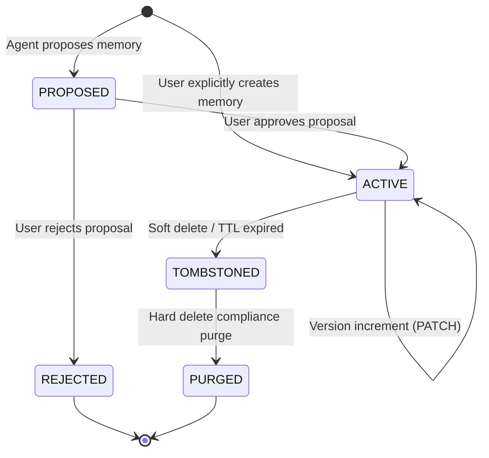

# Task 056 Discovery Report

## 1. Exact Task Identity

- **Task Title**: TASK 056: SPRINT 1 MILESTONE 8 — MEMORY / CONTEXT RUNTIME FOUNDATION & GOVERNED PERSISTENT CONTEXT
- **Milestone**: Sprint 1, Milestone 8
- **Scope & Ownership**:
  - **Contracts**: Canonical memory and context schemas, validation contracts, enums, record structures, and API request/response types in `packages/contracts/src/memory/`.
  - **Backend Control Plane**: Persistent memory management, storage abstraction, authorization/tenant isolation, search/retrieval service, retention enforcement, tombstones, and deletion propagation in `services/backend/src/memory/`.
  - **Desktop Agent Runtime**: Memory client abstraction, local context assembly integration, proposal submission, and access to governed context while preserving the existing ephemeral L1 `MemoryCacheManager` in `apps/desktop-agent/src/memory/`.
  - **Observability & Evidence**: Structured audit events, memory lifecycle activity telemetry, and retrieval tracking.
- **Upstream Dependencies**:
  - Task 050: Path & Local Storage Security Primitives
  - Task 051: Local AI Runtime & Provider Contracts
  - Task 052: Human Approval Authority & Governed Escalation
  - Task 053: Activity & Evidence Observability
  - Task 054: Plugin Governance & Extension SDK
  - Task 055: Browser Runtime Hardening & Action Receipts
- **Downstream Tasks Blocked**:
  - Task 057: Autonomous Workflow Orchestrator & Adaptive Goal Decomposer (requires persistent task/episodic context)
  - Task 058+: Cross-Session Episodic Learning, Memory Compression & Graph Retrieval Projections

---

## 2. Baseline SHA

- **Baseline SHA**: `bca8f4a2f78fd4ae415d05a90ca4cbafe0d4ece2`
- **Current Branch**: `main`
- **Origin Tracking**: Up to date with `origin/main` (HEAD is `bca8f4a2f78fd4ae415d05a90ca4cbafe0d4ece2`)
- **Working Tree**: Clean (prior to authoring this discovery report)

---

## 3. Authoritative Requirements

### Primary Authoritative Sources

1. `docs/PRDs/NexusOS_Enterprise_PRD_for_AI_Desktop_Agent_and_Web_Platform.md`
   - **Section 8 (Memory Architecture)**:
     - Defines 5 memory classes:
       1. _Working Memory_: Ephemeral, execution-bound, TTL-enforced, encrypted in-flight and at rest.
       2. _Episodic Memory_: Structured summaries of completed tasks, decisions, tool executions, and user interactions; scoped to workspace/tenant; retention-controlled.
       3. _Semantic Memory_: Long-term preferences, user profile traits, project concepts, conventions, domain knowledge; explicit confidence ratings and lineage/provenance links.
       4. _Procedural Memory_: Reusable workflows, action playbooks, tool invocation recipes, verification procedures.
       5. _Artifact Memory_: Indexed document snippets, code symbols, visual assets, conversation transcripts with explicit URIs and source hashes.
     - **Section 8.2 (Memory Ingestion & Governance)**:
       - Memory is created either through explicit user input, explicit user confirmation of agent proposals, or governed background synthesis.
       - Mandatory attributes: `tenant_id`, `workspace_id`, `owner_id`, `classification`, `provenance`, `confidence`, `ttl`/retention.
       - Prohibits silent automatic storage of credentials, API keys, tokens, session identifiers, PII, and sensitive corporate secrets.
     - **Section 8.3 (Retrieval Flow)**:
       - Multi-stage retrieval: Access policy filtering -> lexical/vector search -> recency/confidence re-ranking -> token budgeting -> prompt injection into sandboxed context blocks.
     - **Section 8.4 (Privacy & Compliance Controls)**:
       - Right to inspect, export, edit, tombstone, and permanently delete memory records.
       - Tenant and workspace strict boundaries; zero cross-tenant retrieval.
2. `docs/Architecture_and_Specs/NexusOS_Sprint_0_Implementation_Blueprint.md`
   - **Section 30 (Memory Foundation)**:
     - Explicitly defines foundational memory contracts and lifecycle operations: `write`, `read`, `scope`, `ownership`, `classification`, `ttl`, `permission`, `reference`, `invalidation`, `compression`, `deletion`.
     - Directs that memory metadata must be structured and typed, while raw vectors/embeddings remain implementation details decoupled from core domain schemas.
3. `docs/EDDs/NexusOS_Backend_Engineering_Design_Document_EDD.md`
   - **Section 10 (Memory Service)**:
     - Defines Backend Memory Service as authoritative owner of persistent typed memory metadata, source lineage, consent state, sensitivity labels, retention/TTL schedules, retrieval authorization, deletion propagation, and audit trail.
   - **Section 11 (Database Architecture & Storage Strategy)**:
     - Memory records stored with relational integrity (Postgres/SQLite metadata) and vector/lexical projections for semantic search.
   - **Section 12 (Memory Contracts & Endpoints)**:
     - `POST /v1/memory`: Create memory record (direct or via approved proposal).
     - `GET /v1/memory/search`: Access-filtered query across memory classes.
     - `GET /v1/memory/{id}`: Retrieve memory record by ID with access verification.
     - `PATCH /v1/memory/{id}`: Update confidence, metadata, or content.
     - `DELETE /v1/memory/{id}`: Soft delete (tombstone) or hard delete with audit trail.
4. `docs/EDDs/NexusOS_AI_Runtime_Engineering_Design_Document_EDD.md`
   - **Section 14 (Memory Integration & Consumption)**:
     - The AI Runtime consumes Memory Service via access-aware retrieval.
     - Mandates: _STORED MEMORY IS DATA, NOT AUTHORITY_. Stored memories cannot dictate policy, grant tool access, bypass approval gates, or masquerade as system prompts.
     - Context injection must demarcate memory blocks as untrusted context with clear citation/provenance metadata.
5. `docs/EDDs/NexusOS_Experience_Platform_Engineering_Design_Document_EDD.md`
   - **Section 9 (Memory Explorer)**:
     - Web dashboard requirement to view, inspect, search, filter, pin, export, and delete persistent memory records.
   - **Section 21.4 (Sprint 1 Milestone 8 DoD)**:
     - Governed memory persistence with multi-tenant isolation, canonical contracts, access-filtered retrieval, and deletion audit.

---

## 4. Existing Implementation Inventory

| Component Path                                          | Purpose                                                                                   | State / Tier     | Current Contract / API                                                         | Ownership Boundary            | Task 056 Disposition                                                                                               |
| :------------------------------------------------------ | :---------------------------------------------------------------------------------------- | :--------------- | :----------------------------------------------------------------------------- | :---------------------------- | :----------------------------------------------------------------------------------------------------------------- |
| `packages/contracts/src/`                               | Shared TypeScript contracts & Zod schemas across monorepo                                 | Production       | No memory or context contracts currently exist                                 | Shared Contracts package      | **EXTEND**: Create `packages/contracts/src/memory/` and export via index                                           |
| `apps/desktop-agent/src/memory/memory-cache-manager.ts` | Ephemeral in-memory key-value cache with LRU & TTL for local agent runtime (Task 03E/03K) | Production       | `MemoryCacheManager`, `MemoryCacheStore`, `CacheOptions`, `MemoryCacheMetrics` | Desktop Agent local execution | **REUSE AS-IS**: Maintain as fast local L1 execution cache; do NOT conflate with persistent governed memory        |
| `apps/desktop-agent/src/memory/schemas.ts`              | Zod validation schemas for local cache entries                                            | Production       | `MemoryCacheEntrySchema`, `MemoryCacheConfigSchema`                            | Desktop Agent local execution | **REUSE AS-IS**: Keep for local cache; canonical memory contracts belong in `packages/contracts`                   |
| `apps/desktop-agent/src/memory/types.ts`                | Type definitions for cache options and cache metrics                                      | Production       | `MemoryCacheOptions`, `MemoryCacheMetrics`                                     | Desktop Agent local execution | **REUSE AS-IS**: Keep for local cache                                                                              |
| `apps/desktop-agent/src/memory/index.ts`                | Barrel export for memory cache manager                                                    | Production       | Exports `MemoryCacheManager` and cache types                                   | Desktop Agent                 | **EXTEND**: Export new persistent memory client alongside existing cache manager                                   |
| `services/backend/src/memory/`                          | Backend persistent memory service & storage                                               | **NON-EXISTENT** | None                                                                           | Backend Control Plane         | **CREATE**: Implement governed persistent memory service, store, controller, and routes                            |
| `services/backend/src/audit/`                           | Audit logging and event publishing                                                        | Production       | `AuditLogger`, `AuditEvent`                                                    | Backend Control Plane         | **REUSE**: Emit memory lifecycle events (`MEMORY_CREATED`, `MEMORY_UPDATED`, `MEMORY_DELETED`, `MEMORY_RETRIEVED`) |
| `services/backend/src/auth/`                            | Tenant, workspace, and principal authentication / authorization                           | Production       | `AuthContext`, `TenantContext`                                                 | Backend Control Plane         | **REUSE**: Enforce multi-tenant and workspace scoping on all memory operations                                     |
| `services/backend/src/security/redaction-filter.ts`     | Secret and credential scanning/redaction                                                  | Production       | `RedactionFilter`, `scanForSecrets`                                            | Backend Security              | **REUSE**: Prevent accidental persistence of secrets/tokens in memory records                                      |

---

## 5. Canonical Contract Gap

### Current State

Inspection of `packages/contracts/src/` reveals **ZERO** memory contracts. Currently, only the following domains exist:

- `agent/`, `ai/`, `auth/`, `automation/`, `browser/`, `common/`, `desktop/`, `execution/`, `filesystem/`, `orchestration/`, `plugins/`, `sandbox/`, `security/`, `tasks/`, `terminal/`, `workflows/`.

### Required Canonical Contracts (`packages/contracts/src/memory/`)

Task 056 must introduce a dedicated namespace `packages/contracts/src/memory/` containing:

1. **Core Enums & Value Objects**:
   - `MemoryClassSchema`: `'WORKING' | 'EPISODIC' | 'SEMANTIC' | 'PROCEDURAL' | 'ARTIFACT'`
   - `MemorySensitivitySchema`: `'PUBLIC' | 'INTERNAL' | 'CONFIDENTIAL' | 'RESTRICTED'`
   - `MemoryStatusSchema`: `'ACTIVE' | 'PROPOSED' | 'TOMBSTONED' | 'ARCHIVED'`
   - `MemorySourceTypeSchema`: `'USER_EXPLICIT' | 'TASK_EXECUTION' | 'CONVERSATION' | 'SYSTEM_SYNTHESIS' | 'PLUGIN'`
2. **Entity Schemas**:
   - `MemoryProvenanceSchema`: Linkage to source task, execution step, document URI, or conversation ID, including creator principal and verification status.
   - `MemoryRecordSchema`: Complete canonical persistent memory record with strict bindings:
     - `id`: UUIDv4
     - `tenantId`: string
     - `workspaceId`: string
     - `ownerId`: string (principal)
     - `class`: MemoryClass
     - `status`: MemoryStatus
     - `sensitivity`: MemorySensitivity
     - `title`: string (optional summary)
     - `content`: string (structured or textual data)
     - `summary`: string (optional compressed representation)
     - `confidence`: number (0.0 to 1.0)
     - `tags`: string[]
     - `metadata`: Record<string, unknown>
     - `provenance`: MemoryProvenance
     - `retentionPolicy`: Object with optional `ttlSeconds` and `expiresAt`
     - `version`: number (integer monotonic version)
     - `createdAt`: ISO 8601 string
     - `updatedAt`: ISO 8601 string
     - `tombstonedAt`: optional ISO 8601 string
3. **API Request & Response Contracts**:
   - `MemoryCreateRequestSchema`: Validation schema for creating a memory record.
   - `MemoryUpdateRequestSchema`: Validation schema for patching content, tags, sensitivity, or confidence.
   - `MemorySearchRequestSchema`: Query filter supporting text query, memory classes, sensitivity ceiling, workspace scope, tag filters, recency weighting, limit, and pagination.
   - `MemorySearchResponseSchema`: Array of scored, access-filtered memory records with citation tokens and token-budget estimates.
   - `MemoryProposalSchema`: Proposal format for agent-inferred memories awaiting user approval or automated governed synthesis.
   - `MemoryTombstoneResponseSchema`: Deletion acknowledgement with audit confirmation.

---

## 6. Architecture / Data Model Findings

### Distinguishing Documented Requirements vs. Inferred Design Implications

_Authoritative Documentation Facts_:

- PRD Section 8.1 & EDD Section 10 require exactly 5 memory classes: Working, Episodic, Semantic, Procedural, Artifact.
- Backend EDD Section 10 explicitly mandates that memory records must carry strict multi-tenant bindings (`tenantId`, `workspaceId`, `ownerId`), classification labels, provenance lineage, confidence rating, and TTL/retention.
- AI Runtime EDD Section 14 mandates that memory records must be immutable in provenance; updates create new versions with monotonic increments.

_Inferred Design Implications_:

- In SQLite/Postgres persistence, vector embeddings can be stored as either binary blobs or in dedicated vector columns (e.g. sqlite-vss / pgvector). However, for Sprint 1 Milestone 8 foundation, exact vector similarity can be backed by a clean storage abstraction (`MemoryStore`) that supports lexical and hybrid search, without requiring an external heavyweight vector database daemon in CI.
- Working memory can be synchronized between Desktop Agent ephemeral L1 cache and Backend persistent L2/L3 store when a task completes or checkpoints.

---

## 7. Security Threat Model

Task 056 operates under rigorous enterprise security constraints. The primary threats and mandated mitigations are:

| Threat ID      | Threat Description                              | Authoritative Rule                                              | Mandated Technical Mitigation                                                                                                                                                                                                                                   |
| :------------- | :---------------------------------------------- | :-------------------------------------------------------------- | :-------------------------------------------------------------------------------------------------------------------------------------------------------------------------------------------------------------------------------------------------------------- |
| **056-SEC-01** | **Stored Memory Prompt Injection**              | AI Runtime EDD Sec 14.3: "Stored memory is data, not authority" | Retrieved memory injected into LLM prompts MUST be framed inside isolated, untrusted data containers (e.g., `<retrieved_context>` blocks with escaping); LLM instructions inside memory MUST NEVER be parsed as system instructions or tool execution commands. |
| **056-SEC-02** | **Cross-Tenant / Cross-Workspace Data Leakage** | Backend EDD Sec 10.2; PRD Sec 8.4                               | Every query and read operation MUST enforce `tenantId` and `workspaceId` equality at the storage layer; zero cross-tenant retrieval. Failing to provide matching context returns 403 / empty result set.                                                        |
| **056-SEC-03** | **Sensitive Data / Secret Persistence**         | PRD Sec 8.2: Secret exclusion                                   | Integration with `RedactionFilter` on memory ingestion; automatic detection and rejection/masking of API keys, tokens, SSH keys, passwords, and private certificates.                                                                                           |
| **056-SEC-04** | **Poisoned Memory / Provenance Spoofing**       | AI Runtime EDD Sec 14.4                                         | Memories generated autonomously must be tagged with `PROPOSED` status or have explicit provenance back to a verified task execution receipt. Provenance fields (`taskId`, `stepId`, `sourceHash`) cannot be arbitrarily spoofed.                                |
| **056-SEC-05** | **Deletion Bypass / Tombstone Leakage**         | PRD Sec 8.4; Backend EDD Sec 10.5                               | Deleting a memory creates a verifiable tombstone and immediately excludes the record from search/retrieval index. Hard delete permanently purges record content while preserving immutable audit logs.                                                          |
| **056-SEC-06** | **Unauthorized Memory Mutation**                | Backend EDD Sec 10.3                                            | Memory updates require principal ownership or workspace admin role; monotonic versioning prevents silent race condition overwrites.                                                                                                                             |

---

## 8. Governance & Lifecycle

### Supported Lifecycle States

1. **Ingestion & Proposal Flow**:
   - Direct: User creates memory via explicit API or UI (`status: ACTIVE`).
   - Inferred: AI Agent proposes an episodic or semantic memory upon task completion. If confidence < threshold or sensitivity is high, memory enters `status: PROPOSED` requiring user approval.
2. **Retention & TTL Enforcement**:
   - Records with `retentionPolicy.expiresAt` past current timestamp are automatically excluded from search and marked `TOMBSTONED` by scheduled or lazy cleanup.
3. **Tombstones & Deletion Propagation**:
   - Soft delete sets `status = TOMBSTONED`, records `tombstonedAt`, and strips searchable embeddings/content from retrieval indices.
   - Hard delete physically purges content while retaining an anonymized tombstone audit entry for compliance.
4. **Audit & Export**:
   - Every read, write, update, tombstone, and export triggers a structured audit event published via `AuditLogger`.

---

## 9. Retrieval / Context Injection Boundary

### What Task 056 Includes:

- **Access-Aware Search**: Filter candidates by `tenantId`, `workspaceId`, `ownerId`, and maximum allowed `sensitivity` before ranking.
- **Hybrid Retrieval Foundation**: Keyword/lexical matching + vector/semantic embedding abstraction + metadata tag filtering.
- **Scoring & Recency Decay**: Ranking formula combining lexical/semantic score with confidence score and recency decay.
- **Token Budget Packing**: Truncation and formatting helper that packs retrieved memory records into a prompt context block up to a strict token ceiling.

### What Task 056 Explicitly Excludes:

- No automatic rewriting of agent system prompts.
- No dynamic execution of memory instructions.
- No unsupervised memory compression or recursive graph summarization (deferred to Task 058).

---

## 10. Existing Authority Reuse

Task 056 MUST NOT duplicate existing infrastructure:

1. **Redaction & Secret Scanning**: Reuse `services/backend/src/security/redaction-filter.ts` to scan incoming memory content for API keys and tokens.
2. **Audit Logging**: Reuse `services/backend/src/audit/` (`AuditLogger`, `AuditEvent`) to record all memory lifecycle operations.
3. **Authentication & Multi-Tenancy**: Reuse `services/backend/src/auth/` (`AuthContext`, `TenantContext`) for tenant/workspace boundary enforcement.
4. **Local Ephemeral Cache**: Reuse `apps/desktop-agent/src/memory/memory-cache-manager.ts` as the local L1 task cache; do not replace it, but connect it to backend persistent memory as L2/L3.
5. **Human Approval Authority**: Reuse Task 052 approval contracts (`packages/contracts/src/execution/`) if a memory proposal requires governed user confirmation.

---

## 11. Testing Gap

### Current State

- Existing memory tests:
  - `apps/desktop-agent/tests/memory-cache-manager.test.ts` (10 tests passing - L1 cache only).
  - `apps/desktop-agent/tests/memory-cache-security-hardening.test.ts` (8 tests passing - L1 cache eviction & concurrency).
- There are **ZERO** persistent memory tests, contract tests, backend memory service tests, or context injection boundary tests.

### Required Tests for Task 056

1. **Contract Tests (`packages/contracts/tests/memory/`)**:
   - Schema validation, serialization, round-trip checks, and invalid payload rejections for all memory schemas.
2. **Backend Memory Service Unit & Integration Tests (`services/backend/tests/memory/`)**:
   - Memory creation, retrieval, patch, and tombstoning.
   - Retention policy and TTL expiry.
   - Storage adapter persistence across process restarts.
3. **Security Invariant Tests (`services/backend/tests/memory/memory-security.test.ts`)**:
   - `056-SEC-01`: Verify retrieved memory output format prevents prompt instruction breakout.
   - `056-SEC-02`: Multi-tenant isolation — verify Tenant A cannot read or search Tenant B memories even with guessed UUIDs.
   - `056-SEC-03`: Secret sanitization — verify API keys/tokens are detected and blocked/redacted from memory persistence.
   - `056-SEC-04`: Provenance immutability — verify rejection of forged provenance headers.
   - `056-SEC-05`: Tombstone filtering — verify deleted memories are immediately excluded from search results.
   - `056-SEC-06`: Unauthorized update rejection — verify non-owners cannot mutate records.
4. **Desktop Agent Memory Integration Tests (`apps/desktop-agent/tests/persistent-memory-client.test.ts`)**:
   - Desktop agent persistent memory client querying backend and assembling bounded context windows.

---

## 12. Observability Requirements

### Structured Audit Events

The backend must emit structured audit events through `AuditLogger`:

- `MEMORY_CREATED`: `{ memoryId, tenantId, workspaceId, class, sensitivity, confidence, source }`
- `MEMORY_PROPOSED`: `{ proposalId, tenantId, workspaceId, class, confidence }`
- `MEMORY_APPROVED`: `{ memoryId, proposalId, approvedBy }`
- `MEMORY_UPDATED`: `{ memoryId, version, modifiedFields }`
- `MEMORY_TOMBSTONED`: `{ memoryId, reason, actor }`
- `MEMORY_RETRIEVED`: `{ query, matchCount, latencyMs, tenantId }`

### Prohibited Telemetry (CRITICAL)

- **NEVER** log raw memory text/content if classified as `CONFIDENTIAL` or `RESTRICTED`.
- **NEVER** log secrets, credentials, or personal information in audit metadata.
- Query search strings must be truncated or scrubbed of sensitive tokens before telemetry emission.

---

## 13. Dependencies & Blockers

- **Package Dependencies**: No new external dependencies required; standard monorepo libraries (`zod`, `express`, existing database/storage helpers) are sufficient.
- **Database / Storage**: The backend already has persistent storage and testing utilities; an in-memory/sqlite-compatible `MemoryStore` interface allows clean storage implementation without external database daemons.
- **Blockers**: **NONE**. Task 056 is fully unblocked and ready for implementation.

---

## 14. In Scope (Task 056)

- Canonical memory contracts in `packages/contracts/src/memory/` and export in `packages/contracts/src/index.ts`.
- Backend memory domain model, `MemoryStore` abstraction, and in-memory/file-backed persistent store in `services/backend/src/memory/`.
- Backend `MemoryService` implementing CRUD, search, access-aware filtering, lifecycle, and retention/TTL logic.
- Backend HTTP REST routes and controller: `POST /v1/memory`, `GET /v1/memory/search`, `GET /v1/memory/{id}`, `PATCH /v1/memory/{id}`, `DELETE /v1/memory/{id}`.
- Secret redaction on memory ingestion via `RedactionFilter`.
- Desktop Agent persistent memory client and prompt context formatting helper.
- Full suite of unit, contract, integration, and security tests (`056-SEC-01` through `056-SEC-06`).

---

## 15. Out of Scope (Task 056)

- Full Web Dashboard Memory Explorer UI components (Milestone 8 dashboard surface is light/mock-ready; comprehensive full-page explorer belongs to Experience Platform hardening).
- External distributed vector database setup (Qdrant, Pinecone, Milvus, or pgvector daemon infrastructure).
- Advanced automated hierarchical memory summarization and graph projection (Task 058).
- Autonomous goal decomposition and cross-task memory synthesis (Task 057).
- Browser automation or Plugin SDK modifications.

---

## 16. Deferred Work

- Cross-session episodic graph indexing (Deferred to Sprint 2 / Milestone 12).
- Automatic vector embedding model fine-tuning or on-device small embedding model quantization (Deferred to Future Sprint).
- Multi-user collaborative shared memory conflict-free replicated data types (CRDTs) (Deferred to Enterprise Multi-User Milestone).

---

## 17. Recommended Implementation Sequence

1. **Step 1: Canonical Contracts**:
   - Create `packages/contracts/src/memory/index.ts` with all Zod schemas, types, and validation logic.
   - Export memory contracts from `packages/contracts/src/index.ts`.
   - Add contract tests in `packages/contracts/tests/memory/memory-contracts.test.ts`.
2. **Step 2: Backend Memory Store & Storage Abstraction**:
   - Implement `MemoryStore` interface in `services/backend/src/memory/memory-store.ts`.
   - Implement storage engine with tenant/workspace partitioning, index management, and tombstone tracking.
3. **Step 3: Backend Memory Service**:
   - Implement `MemoryService` in `services/backend/src/memory/memory-service.ts` handling access validation, secret scanning, TTL expiration, scoring, and audit logging.
4. **Step 4: Backend Routes & Controller**:
   - Implement `MemoryController` and Express router in `services/backend/src/memory/memory-routes.ts`.
   - Mount routes in `services/backend/src/index.ts` or main app router under `/v1/memory`.
5. **Step 5: Desktop Agent Persistent Memory Client**:
   - Implement `PersistentMemoryClient` in `apps/desktop-agent/src/memory/persistent-memory-client.ts` to consume backend memory APIs.
   - Implement context injection packaging helper ensuring strict `056-SEC-01` data framing.
6. **Step 6: Comprehensive Testing & Verification**:
   - Implement security invariant tests `056-SEC-01` through `056-SEC-06`.
   - Run full monorepo typecheck, lint, and test validation.

---

## 18. Risks / Open Questions

- **Risk 1: Vector Embedding Dependency in Local Mode**: Generating semantic embeddings locally requires an embedding provider or fallback to lexical/BM25 search.
  - _Resolution_: Implement a hybrid search strategy that gracefully operates on keyword/tokenized lexical matching when vector embeddings are unavailable or offline, ensuring local air-gapped functionality without external dependencies.
- **Risk 2: Context Window Overflow from Memory Injection**: Injecting multiple memory records can exceed LLM token limits.
  - _Resolution_: Enforce a strict `maxTokenBudget` parameter in `MemorySearchRequest` and context assembly; prune by score and truncate content gracefully.

---

## 19. Exact Files Likely To Change (Implementation Phase)

### New Files to Create:

1. `packages/contracts/src/memory/index.ts`
2. `packages/contracts/tests/memory/memory-contracts.test.ts`
3. `services/backend/src/memory/types.ts`
4. `services/backend/src/memory/memory-store.ts`
5. `services/backend/src/memory/memory-service.ts`
6. `services/backend/src/memory/memory-controller.ts`
7. `services/backend/src/memory/memory-routes.ts`
8. `services/backend/src/memory/index.ts`
9. `services/backend/tests/memory/memory-service.test.ts`
10. `services/backend/tests/memory/memory-security.test.ts`
11. `apps/desktop-agent/src/memory/persistent-memory-client.ts`
12. `apps/desktop-agent/tests/persistent-memory-client.test.ts`

### Existing Files to Update:

1. `packages/contracts/src/index.ts` (export memory contracts namespace)
2. `services/backend/src/app.ts` or `services/backend/src/index.ts` (mount `/v1/memory` routes)
3. `apps/desktop-agent/src/memory/index.ts` (export `PersistentMemoryClient` alongside `MemoryCacheManager`)

---

## 20. Discovery Conclusion

Task 056 addresses a critical architectural milestone in Sprint 1: elevating ephemeral local execution state into governed, access-controlled, persistent multi-tenant memory. The authoritative documentation (PRD Section 8, Sprint 0 Blueprint Section 30, Backend EDD Section 10, AI Runtime EDD Section 14) provides an unambiguous specification for the 5 memory classes, security boundaries, and lifecycle operations. Existing ephemeral cache in `apps/desktop-agent/src/memory/` remains intact as an L1 execution cache, while Task 056 establishes canonical contracts in `packages/contracts/src/memory/` and the backend control-plane persistent memory service in `services/backend/src/memory/`. All prerequisites are met and Task 056 is unblocked for implementation.
