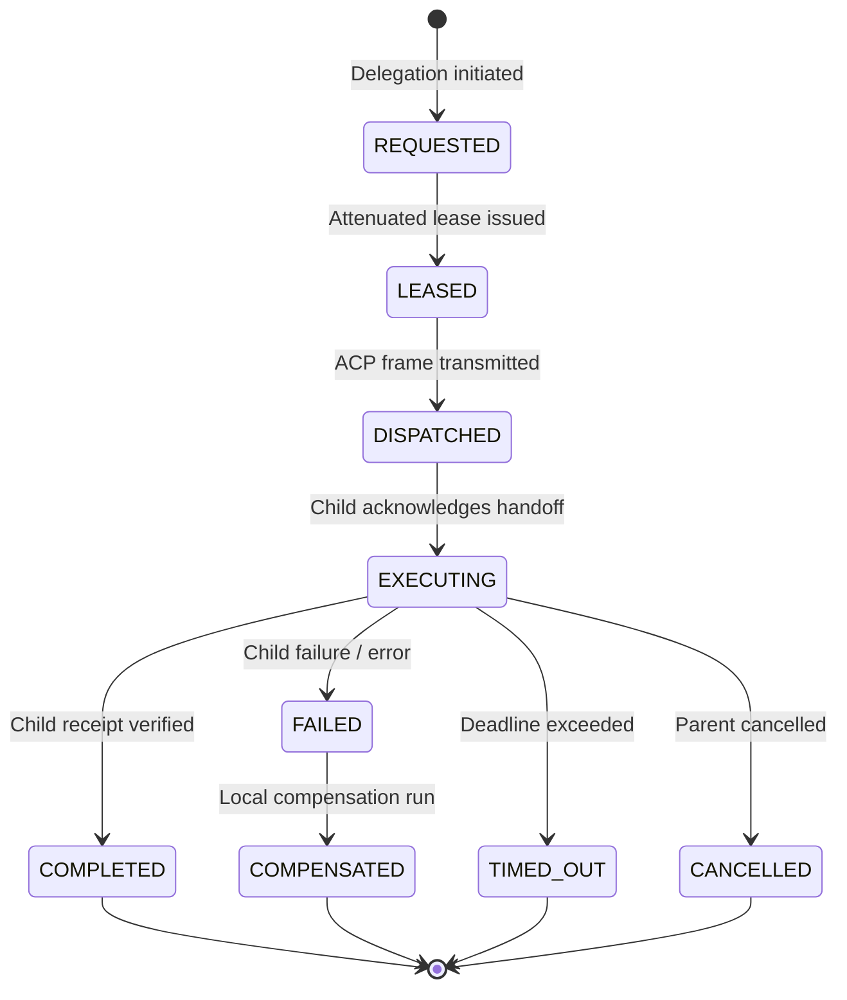

# Task 060 Discovery Report

**Sprint 2 Milestone 1 — Discovery Phase**

---

## 1. Exact Task Identity

### 1.1 Candidate Identification

Authoritative repository documentation and sprint planning artifacts were analyzed to determine the canonical identity and scope of Task 060.

#### PRIMARY / AUTHORITATIVE: Candidate 1

- **Canonical Title**: `TASK 060: SPRINT 2 MILESTONE 1 — ADVANCED MULTI-AGENT COLLABORATION, FEDERATED ACP & AUTONOMOUS SUB-AGENT DELEGATION`
- **Sprint**: Sprint 2
- **Milestone**: Milestone 1
- **Owning Subsystems**:
  - Control-Plane Orchestration & Backend (`services/backend`)
  - Shared Contracts (`packages/contracts`)
  - Desktop Agent Host & Runtime (`apps/desktop-agent`)
  - Agent Directory & Communications (`services/backend/src/agents`, `packages/contracts/src/acp`)
- **Authoritative Sources**:
  - `docs/SPRINT_2_READINESS_AND_BACKLOG.md` — Section 4 (Item 1: Advanced Multi-Agent Collaboration & Sub-Agent Delegation)
  - `task_059_discovery_report.md` — Section 1.2 (Alternative Candidate 2 scheduled for Sprint 2 opening)
  - `docs/EDDs/NexusOS_AI_Runtime_Engineering_Design_Document_EDD.md` — Section 6 (Agent Runtime & Dynamic Multi-Agent Composition) and Section 7 (Agent Communication Protocol / ACP)
  - `docs/PRDs/NexusOS_Enterprise_PRD_for_AI_Desktop_Agent_and_Web_Platform.md` — Section 30 (Agent Communication System / ACP)
  - `docs/EDDs/NexusOS_Desktop_Agent_Engineering_Design_Document_EDD.md` — Section 4 & Section 24 (ACP Stream Transport & Leased Execution)
- **Business Objective**:
  Enable complex, partitionable multi-step outcomes to be autonomously federated across specialized logical agents (e.g., coordinator, specialist, supervisor) with bounded authority, cryptographic capability attenuation, and consolidated hierarchical evidence receipts, without requiring manual human step-by-step routing or granting ambient broad privileges.
- **Architectural Objective**:
  Establish the formal Agent Communication Protocol (ACP) federation layer and Agent Directory/Registry; build the autonomous sub-agent delegation coordinator that decomposes sub-goals into bounded child execution leases with attenuated capability scopes; implement hierarchical receipt roll-up and localized compensation; enforce strict isolation boundaries preventing recursive swarm explosion, ambient authority leakage, or cross-tenant contamination.

#### ALTERNATIVE: Candidate 2

- **Canonical Title**: `TASK 060: SPRINT 2 MILESTONE 1 — NATIVE QUANTIZED LOCAL-AI MODEL EXECUTION & VRAM OFFLOADING (VLLM / ONNX / LLAMA)`
- **Sprint**: Sprint 2
- **Milestone**: Milestone 1
- **Source**: `docs/SPRINT_2_READINESS_AND_BACKLOG.md` — Section 4 (Item 2) and Section 6 (Sequencing Diagram Phase 1, Item 1).
- **Rationale**: In the high-level Sprint 2 sequencing diagram, Phase 1 lists "Native AI & Persistent Knowledge Graph" before Phase 2 "Multi-Agent Federation". However, Item 1 in the candidate backlog is "Advanced Multi-Agent Collaboration", which was explicitly reserved during Task 059 discovery for Sprint 2 Milestone 1 kickoff.

#### ALTERNATIVE: Candidate 3

- **Canonical Title**: `TASK 060: SPRINT 2 MILESTONE 1 — PERSISTENT DISTRIBUTED GRAPH STORE & VECTOR SEARCH (SQLITE / NEO4J)`
- **Sprint**: Sprint 2
- **Milestone**: Milestone 1
- **Source**: `docs/SPRINT_2_READINESS_AND_BACKLOG.md` — Section 4 (Item 3).

#### CONFLICTING / DEFERRED: Candidate 4

- **Title**: `CLOUD STATE SYNC & ENTERPRISE RBAC`
- **Status**: Formally **DEFERRED** to Sprint 3 in `docs/SPRINT_2_READINESS_AND_BACKLOG.md` Section 4 Item 4. Must NOT be implemented in Task 060.

### 1.2 Separation of Fact, Inference, and Open Question

- **FACT**:
  1. Task 059 successfully closed Sprint 1 with exit status **PASS** (commit `ca43e9be1e4971ad1c684d60c3905fe8503689ae`, CI run `34439039651`).
  2. `docs/SPRINT_2_READINESS_AND_BACKLOG.md` establishes that all 10 readiness criteria are satisfied.
  3. `Item 1` in the Sprint 2 Candidate Backlog is "Advanced Multi-Agent Collaboration & Sub-Agent Delegation", with contracts `AcpFederationMessage`, `SubAgentDelegationRequest`, and `CompositeLease`.
  4. The repository currently has a point-to-point ACP bridge (`ACPDispatchBridge`) between backend and desktop agent, but zero agent directory, zero inter-agent routing, zero sub-agent delegation contracts, and zero composite lease attenuation mechanics.
- **INFERENCE**:
  1. Task 060 is canonical Sprint 2 Milestone 1, executing Candidate 1: Advanced Multi-Agent Collaboration, Federated ACP & Autonomous Sub-Agent Delegation.
  2. Implementing this milestone requires expanding `@nexusos/contracts/src/acp`, adding an `AgentDirectoryService` and `DelegationCoordinator` in `services/backend`, updating lease issuance for attenuation, and adding adversarial security verification suites.
- **OPEN QUESTION**:
  1. Confirmation from project leadership on whether Milestone 1 executes **Item 1 (Multi-Agent Delegation & Federated ACP)** as indicated by the backlog list and prompt, or if Phase 1 ordering from the diagram (Native Local AI) is preferred. (This report proceeds with Candidate 1 as the primary authority).

---

## 2. Baseline / Repository State

- **Current HEAD**: `ca43e9be1e4971ad1c684d60c3905fe8503689ae`
- **Branch**: `main`
- **origin/main**: `ca43e9be1e4971ad1c684d60c3905fe8503689ae` (in exact sync)
- **Working Tree**: Clean (0 modified, 0 untracked files)
- **Cumulative Monorepo Tests**: 1112 tests passing across 221 suites (0 failures, 0 skipped)
- **Quality Gates**: `format`, `lint`, `typecheck`, `test`, `build`, `validate-repo`, and `security-scan` all 100% green.

---

## 3. Authoritative Requirements

### 3.1 Capabilities Required

1. **Agent Directory & Registry**:
   - Dynamic registration and discovery of logical agents (`AgentRecord`).
   - Tracking agent role, version, supported schemas, capability bindings, risk profile, tenant affinity, and liveness/heartbeat state.
2. **Federated ACP Message Envelopes**:
   - Canonical typing for inter-agent messages: `Request/Reply`, `Delegation/Handoff`, `Negotiation`, `Heartbeat`, `Progress`, `Cancellation`, `Discovery`, and `Failure`.
   - Mandatory envelope header validation (`version`, `message_id`, `correlation_id`, `causation_id`, `from_agent`, `to_agent`, `timestamp`, `schema_id`, `policy_snapshot_hash`, `signature`, `body_ref`, `trace_hints`).
3. **Sub-Agent Delegation Coordinator**:
   - Bounded sub-goal assignment to specialized child agents.
   - Strict capability lease attenuation: child lease scopes MUST be a strict subset of parent lease scopes (`childScopes ⊆ parentScopes`).
   - Hard delegation depth limits: maximum delegation recursion depth (default max depth = 3).
   - Hard concurrency limits: maximum concurrent delegated children per parent (default max = 5).
4. **Hierarchical Evidence & Receipt Roll-Up**:
   - Sub-agent execution generates cryptographically verifiable `ExecutionReceipt` items.
   - Child receipts aggregate hierarchically into composite parent execution evidence trees.
5. **Localized Failure Compensation**:
   - Sub-agent failure, rejection, or timeout triggers bounded retry or branch compensation without causing catastrophic unhandled crash of the parent workflow.

### 3.2 Canonical Subsystem Boundaries & EDD Citations

- **AI Runtime EDD Section 6 (Agent Runtime)**: Logical agents have no direct tool authority. Multi-agent composition is advisory and orchestrator-coordinated.
- **AI Runtime EDD Section 6.4 (Delegation and Negotiation)**: Delegation creates ACP messages containing attenuated task authority reference, input artifact references, expected output, deadline, budget, and idempotency key.
- **AI Runtime EDD Section 7 (Agent Communication / ACP)**: ACP is the canonical transport. Commands are at-least-once with idempotent consumer handling. No plaintext secrets in message bodies.
- **Desktop Agent EDD Section 4 (Execution Authority)**: Desktop Agent receives bounded, signed, expiring work leases; validates authority locally; executes only within approved capabilities; emits evidence receipts.
- **Backend EDD Section 12 (Device Gateway & ACP Dispatch)**: Delivers versioned ACP leases and controls. Does not execute tool work directly.

---

## 4. Existing Implementation Inventory

| Component Path                                                 | Current State           | Owner Subsystem | Purpose & Capability                                                                                                  | Task 060 Action                                                       |
| :------------------------------------------------------------- | :---------------------- | :-------------- | :-------------------------------------------------------------------------------------------------------------------- | :-------------------------------------------------------------------- |
| `packages/contracts/src/acp/index.ts`                          | Complete (Sprint 0)     | Contracts       | Exports `ACPMessageEnvelopeSchema` and `createACPMessageEnvelope`.                                                    | **EXTEND** with federation & delegation schemas.                      |
| `services/backend/src/server/acp-dispatch-bridge.ts`           | Complete (Task 047/049) | Backend Server  | Point-to-point dispatch of tasks and DAG workflows to desktop agent; handles incoming receipt frames.                 | **EXTEND** / wrap with inter-agent routing.                           |
| `apps/desktop-agent/src/communication/acp-frame-parser.ts`     | Complete (Hardened)     | Desktop Agent   | Validates 1MB frame cap, JSON parsing, envelope schema, device ID, tenant ID, 5-min timestamp drift, signature guard. | **REUSE** as core ingress parser.                                     |
| `apps/desktop-agent/src/communication/control-plane-client.ts` | Complete (Hardened)     | Desktop Agent   | Connects desktop agent to control plane; registers command handlers.                                                  | **REUSE** for receiving delegated sub-agent tasks.                    |
| `services/backend/src/leases/lease-issuer.ts`                  | Complete (Task 047/049) | Backend Leases  | Issues HMAC-SHA256 signed `ExecutionLeaseHeader` with scopes, TTL, and nonce.                                         | **EXTEND** to issue attenuated child leases (`CompositeLease`).       |
| `services/backend/src/planner/capability-registry.ts`          | Complete (Task 057)     | Backend Planner | Closed allowlist of capabilities across filesystem, terminal, device, browser, localAi, and plugin.                   | **EXTEND** to support agent delegation capability (`agent.delegate`). |
| `services/backend/src/planner/decomposer.ts`                   | Complete (Task 057)     | Backend Planner | Decomposes high-level goals into executable DAGs with risk tiers and 3-replan limits.                                 | **REUSE** for sub-goal synthesis.                                     |
| `services/backend/src/tasks/controller.ts`                     | Complete (Sprint 1)     | Backend Tasks   | Coordinates task state machine, policy evaluation, lease generation, and receipt verification.                        | **EXTEND** to track parent-child task hierarchy.                      |

---

## 5. Previous Milestone Authority Map

```
┌────────────────────────────────────────────────────────────────────────┐
│ NEXUSOS SPRINT 1 PREVIOUS MILESTONE AUTHORITY MAP                      │
├──────────────────┬──────────────────────┬──────────────────────────────┤
│ SUBSYSTEM        │ CANONICAL AUTHORITY  │ TASK 060 MAY REUSE / MUST NOT│
├──────────────────┼──────────────────────┼──────────────────────────────┤
│ Task Execution   │ TaskController (047) │ REUSE state machine;         │
│                  │                      │ MUST NOT bypass leases       │
│ DAG Engine       │ WorkflowEngine (049) │ REUSE topology & cycles;     │
│                  │                      │ MUST NOT allow unleased runs │
│ Sandbox / Jail   │ Desktop Agent (050)  │ REUSE jail constraints;      │
│                  │                      │ MUST NOT escape workspace    │
│ Local AI Engine  │ RuntimeRouter (051)  │ REUSE model inference;       │
│                  │                      │ MUST NOT bypass circuit brk  │
│ HITL Approval    │ ApprovalInterceptor  │ REUSE HMAC prompts (052);    │
│                  │                      │ MUST NOT bypass high-risk    │
│ Event Bus / SSE  │ Dashboard Stream(053)│ REUSE SSE event broadcast;   │
│                  │                      │ MUST NOT send raw secrets    │
│ Plugin Runtime   │ PluginHost (054)     │ REUSE 2FA leases & manifest; │
│                  │                      │ MUST NOT grant extra scopes  │
│ Browser Runtime  │ BrowserEngine (055)  │ REUSE SSRF defense;          │
│                  │                      │ MUST NOT bypass egress rules │
│ Memory Store     │ MemoryService (056)  │ REUSE memory leases & redact;│
│                  │                      │ MUST NOT permit raw store wr │
│ Goal Decomposer  │ GoalDecomposer (057) │ REUSE 3-replan cap & bounds; │
│                  │                      │ MUST NOT allow infinite loops│
│ Episodic Graph   │ GraphEngine (058)    │ REUSE knowledge projection;  │
│                  │                      │ MUST NOT cross tenant graph  │
│ Exit Gate / DoD  │ Sprint 1 Gate (059)  │ REUSE 20 runbooks & baseline │
└──────────────────┴──────────────────────┴──────────────────────────────┘
```

---

## 6. ACP / Agent Collaboration Analysis

### 6.1 What Currently Exists

- Generic envelope schema: `ACPMessageEnvelopeSchema` in `packages/contracts/src/acp/index.ts`.
- Dispatch bridge: `ACPDispatchBridge` in `services/backend/src/server/acp-dispatch-bridge.ts` that sends a leased task or workflow DAG to a single paired Desktop Agent.
- Input validation & defense: `ACPFrameParser` in `apps/desktop-agent` with frame size caps (1 MB), drift detection (5 min), schema enforcement, and device binding.

### 6.2 What Task 060 Needs (The Gap)

1. **Multi-Agent Message Typing**: Schemas for `AcpFederationMessage`, `SubAgentDelegationRequest`, `SubAgentDelegationResponse`, `AgentRegistrationRequest`, and `AgentHeartbeat`.
2. **Agent Directory Service**: A centralized in-memory registry of active agents with their registered roles, capability subsets, load, and health status.
3. **Delegation Coordinator**: A service that orchestrates:
   - Verifying parent lease eligibility for delegation.
   - Validating that child requested capabilities are attenuated (`childScopes ⊆ parentScopes`).
   - Checking delegation depth (`depth <= maxDepth`).
   - Generating a child execution lease cryptographically bound to the parent lease ID.
   - Routing the delegation request over ACP.
4. **Hierarchical Receipt Aggregation**: Mechanism to aggregate child task receipts and evidence hashes into the parent task's `ExecutionReceipt`.

---

## 7. Multi-Agent Authority Model

Authoritative answers to core delegation questions based on the PRD and EDDs:

1. **Who can create a delegated task?**
   The backend Orchestrator or a Coordinator Agent operating under an active, policy-approved parent workflow execution lease.
2. **Who can accept it?**
   A registered agent whose declared capabilities match the delegated sub-task requirements, whose tenant ID matches the parent task, and whose health check is passing.
3. **Who can execute it?**
   The assigned agent runtime within its paired execution sandbox.
4. **Who issues leases?**
   The central `LeaseIssuer` in `services/backend/src/leases/lease-issuer.ts`. Sub-agents CANNOT issue their own leases.
5. **Who evaluates policy?**
   The central `PolicyEvaluator` in `services/backend/src/policy/`. Child agents cannot self-authorize or bypass policy checks.
6. **Who approves high-risk operations?**
   The Human-in-the-Loop (HITL) desktop approval interceptor. If a child task requires HIGH or CRITICAL risk operations, approval is triggered on the user's desktop tied to the parent correlation ID.
7. **Who verifies receipts?**
   The backend `TaskController` and receipt settler.
8. **Who owns resulting evidence?**
   The backend Artifact and Memory services. Child agents emit evidence references and checksums, never direct database writes.
9. **Can a sub-agent delegate again?**
   Yes, but ONLY if `currentDepth < maxDepth` and the parent lease explicitly allows sub-delegation.
10. **How is delegation depth limited?**
    A strict integer `delegationDepth` is carried in the delegation envelope and lease header. If `delegationDepth >= MAX_DELEGATION_DEPTH` (default 3), further delegation is rejected fail-closed.
11. **How are capabilities attenuated?**
    A child lease can only contain scopes that are an exact subset of the parent lease scopes (`childScopes ⊆ parentScopes`). Adding an ungranted scope is rejected fail-closed.
12. **How is revocation propagated?**
    Cancelling the parent task or revoking the parent lease immediately cascades cancellation to all active child task IDs and in-flight ACP streams.

---

## 8. Security Threat Model

| Threat ID      | Threat Description                                                                              | Boundary                     | Authority                  | Enforcement Mechanism                                                                    | Required Test                                             |
| :------------- | :---------------------------------------------------------------------------------------------- | :--------------------------- | :------------------------- | :--------------------------------------------------------------------------------------- | :-------------------------------------------------------- |
| **060-SEC-01** | **Privilege Amplification** (Child attempts to acquire scopes not in parent lease)              | Backend / Lease Issuer       | `LeaseIssuer`              | Attenuation check: rejects lease issue if `childScopes \not\subseteq parentScopes`.      | Unit test verifying lease rejection on scope escalation.  |
| **060-SEC-02** | **Recursive Delegation Storm** (Unbounded sub-agent spawning causing resource exhaustion)       | Coordinator / Planner        | `DelegationCoordinator`    | Rejects delegation when `currentDepth >= 3` or `activeChildren >= 5`.                    | Adversarial test attempting recursive depth 4 delegation. |
| **060-SEC-03** | **Cross-Tenant Delegation** (Parent in Tenant A delegates task to Agent in Tenant B)            | Agent Directory / ACP Router | `AgentDirectory`           | Enforces `child.tenantId === parent.tenantId`; directory filters cross-tenant agents.    | Cross-tenant delegation isolation test.                   |
| **060-SEC-04** | **Forged Sub-Agent Identity** (Malicious worker claims to be authorized sub-agent)              | ACP Gateway                  | `ACPFrameParser`           | HMAC-SHA256 signature and device/agent ID token verification.                            | Spoofed sender ID verification test.                      |
| **060-SEC-05** | **Secret Leakage in ACP Body** (Plaintext credentials or tokens included in delegation payload) | ACP Router                   | `ACPMessageEnvelopeSchema` | Sensitive data detector & schema validation rejects raw credentials; references only.    | Payload secret scanner test.                              |
| **060-SEC-06** | **Receipt / Result Forgery** (Compromised child produces fake evidence without execution)       | Receipt Settler              | `TaskController`           | Verifies child receipt signature and validates evidence checksum against artifact store. | Tampered receipt signature rejection test.                |
| **060-SEC-07** | **Orphaned Sub-Agent Execution** (Parent cancels but child continues running unchecked)         | Coordinator / Lifecycle      | `DelegationCoordinator`    | Cascade cancellation: parent cancellation emits cancellation ACP frames to all children. | Cascade cancellation propagation test.                    |

---

## 9. Tenant / Workspace Isolation

- **Tenant Identity Propagation**: `tenantId` is immutable and must be identical across parent task, child delegation request, child execution lease, ACP message envelope, and execution receipt. Cross-tenant delegation is prohibited.
- **Workspace Identity Propagation**: Sub-agents operate strictly within the `workspaceId` established by the parent task. Any filesystem capability delegated to a child is bound to the parent's authorized workspace root directory.
- **Agent Partitioning**: The `AgentDirectoryService` isolates registrations by `tenantId`. An agent registered in Tenant X cannot be discovered, addressed, or assigned tasks by a parent in Tenant Y.

---

## 10. Capability Delegation

- **Attenuation Invariant**:
  $$\text{ChildScopes} \subseteq \text{ParentScopes}$$
- **Time Attenuation**:
  $$\text{ChildTimeoutMs} \le \text{ParentRemainingTimeoutMs}$$
- **Budget Attenuation**:
  $$\text{ChildBudgetLimitUsd} \le \text{ParentRemainingBudgetUsd}$$
- **Risk Tier Ceiling**:
  A child task cannot declare a higher risk tier than the parent task without triggering independent Human-in-the-Loop (HITL) approval.

---

## 11. Data / State / Lifecycle

### 11.1 State Types

1. **`AgentRecord`**: Tracks logical agent lifecycle (`REGISTERED`, `AVAILABLE`, `BUSY`, `UNHEALTHY`, `RETIRED`), capabilities, and heartbeat. Owned by `AgentDirectoryService`.
2. **`DelegationSession`**: Tracks active delegation hierarchy (`sessionId`, `parentTaskId`, `childTaskId`, `delegatingAgentId`, `targetAgentId`, `depth`, `status`, `expiresAt`). Owned by `DelegationCoordinator`.
3. **`CompositeExecutionReceipt`**: Contains the parent receipt and an array of cryptographically signed child `ExecutionReceipt` items.

### 11.2 Lifecycle Transitions



### 11.3 Idempotency & Replay

- Every `SubAgentDelegationRequest` requires an `idempotencyKey`. Duplicate requests within the TTL window return the existing session without re-spawning sub-tasks.

---

## 12. Failure & Recovery Semantics

| Failure Condition           | Severity | Recovery Behavior                                                                 | Fail-Closed Policy                |
| :-------------------------- | :------- | :-------------------------------------------------------------------------------- | :-------------------------------- |
| **Child Agent Unavailable** | HIGH     | Fail-closed; return `AGENT_UNAVAILABLE`; trigger parent fallback agent or replan. | Reject assignment immediately.    |
| **Delegation Timeout**      | HIGH     | Cancel child lease; emit `DELEGATION_TIMEOUT`; trigger branch compensation.       | Revoke child lease after timeout. |
| **Child Scope Escalation**  | CRITICAL | Fail-closed; reject lease generation with `SCOPE_AMPLIFICATION_FORBIDDEN`.        | Never issue lease.                |
| **Depth Limit Exceeded**    | HIGH     | Fail-closed; reject with `MAX_DELEGATION_DEPTH_EXCEEDED`.                         | Never issue lease.                |
| **Parent Cancellation**     | MEDIUM   | Send `acp.cancellation` to all active children; wait for ACK or kill timer.       | Revoke all descendant leases.     |
| **Child Result Tampering**  | CRITICAL | Receipt verification fails with `INVALID_RECEIPT_SIGNATURE`; mark task FAILED.    | Discard invalid receipt.          |

---

## 13. Observability

### 13.1 Audit Events

- `acp.agent.registered`: Agent joins directory with metadata.
- `acp.agent.heartbeat`: Liveness ping.
- `acp.delegation.requested`: Parent initiates sub-agent handoff.
- `acp.delegation.leased`: Attenuated lease issued.
- `acp.delegation.completed`: Child finishes and rolls up receipt.
- `acp.delegation.failed`: Child fails or times out.
- `acp.delegation.cancelled`: Parent cascades cancellation.

### 13.2 Distributed Tracing & Correlation

- `correlationId` preserved across all parent and child ACP messages, tasks, and audit logs.
- `causationId` links child delegation requests directly to the parent workflow node ID.

### 13.3 Redaction Guard

- Secret tokens, private memory references, and credentials must NEVER appear in ACP message bodies or audit logs.

---

## 14. Canonical Contract Gap

### Contracts Currently Present

- `packages/contracts/src/acp/index.ts`: `ACPMessageEnvelopeSchema`, `createACPMessageEnvelope`.
- `packages/contracts/src/tasks/index.ts`: `TaskCreateRequestSchema`, `ExecutionReceiptSchema`, `WorkflowNodeSchema`, `validateDAGTopology`.
- `packages/contracts/src/permissions/index.ts`: `ExecutionLeaseHeaderSchema`.

### Contracts Missing (To Be Created in Task 060)

1. `packages/contracts/src/acp/federation.ts`:
   - `AcpFederationMessageSchema`: Envelope specialization for inter-agent routing.
   - `AgentMessageTypeSchema`: Enum (`REQUEST_REPLY`, `DELEGATION`, `HEARTBEAT`, `CANCELLATION`, etc.).
2. `packages/contracts/src/acp/delegation.ts`:
   - `SubAgentDelegationRequestSchema`: Contains `parentTaskId`, `subGoal`, `requiredCapabilities`, `delegationDepth`, `timeoutMs`, `idempotencyKey`.
   - `SubAgentDelegationResponseSchema`: Contains `childTaskId`, `assignedAgentId`, `leaseId`, `status`.
   - `CompositeExecutionReceiptSchema`: Aggregates parent receipt with array of child receipts.
3. `packages/contracts/src/acp/directory.ts`:
   - `AgentRegistrationRequestSchema`: Agent metadata, roles, capabilities, version.
   - `AgentHeartbeatSchema`: Liveness ping with current load.
4. `packages/contracts/src/permissions/delegated-lease.ts` (or within `permissions`):
   - `DelegatedExecutionLeaseSchema`: Extends lease header with `parent_lease_id`, `delegation_depth`, and `attenuated_scopes`.

---

## 15. Testing Gap

### Unit Tests Required

- Schema validation for all new ACP contracts (`acp-delegation.test.ts`).
- Scope attenuation algorithm test (`attenuation.test.ts`).
- Agent directory registration, heartbeats, and eviction test (`agent-directory.test.ts`).

### Adversarial Security Tests Required

- `tests/hardening/multi-agent-delegation-security.test.ts`:
  - Attack 1: Attempted capability escalation (child requests scope not in parent lease -> FAIL-CLOSED).
  - Attack 2: Recursive delegation explosion (delegation at depth 4 -> REJECTED).
  - Attack 3: Cross-tenant delegation attempt -> REJECTED.
  - Attack 4: Forged child receipt signature -> REJECTED.
  - Attack 5: Cascade cancellation verification -> ALL CHILDREN CANCELLED.

### Integration / Vertical Slice Tests Required

- `tests/vertical-slice/multi-agent-delegation-vertical-slice.test.ts`:
  - Complete flow: Goal submitted -> Decomposed into parent workflow -> Step delegates sub-task to specialist child agent -> Child executes within attenuated sandbox -> Child emits signed receipt -> Parent rolls up receipt -> Workflow succeeds.

---

## 16. Performance / Scale Constraints

- **Maximum Concurrent Registered Agents**: 50 per control-plane instance.
- **Maximum Delegation Depth**: 3 levels (Root -> Sub-Agent -> Leaf Worker).
- **Maximum Children per Parent Task**: 5 concurrent child tasks.
- **Maximum ACP Frame Size**: 1,048,576 bytes (1 MB) — enforced by `ACPFrameParser`.
- **Default Delegation Timeout**: 60,000 ms (1 minute); hard ceiling 300,000 ms (5 minutes).
- **Agent Heartbeat Interval**: 15 seconds; marked unhealthy after 45 seconds of missed heartbeats.

---

## 17. Dependencies & Blockers

- **Hard Blockers**: None. Sprint 1 Exit Gate is CLOSED with status PASS. Repository is green.
- **Soft Dependencies**:
  - `LeaseIssuer` in `services/backend` requires enhancement to issue child leases referencing a parent lease.
  - `DefaultCapabilityRegistry` in `services/backend/src/planner` requires registration of the `agent.delegate` capability.
- **External Dependencies**: Zero. All multi-agent delegation runs in-process or over existing local ACP transports.

---

## 18. In Scope

1. Creation of canonical ACP contracts: `AcpFederationMessage`, `SubAgentDelegationRequest`, `SubAgentDelegationResponse`, `AgentRegistration`, `AgentHeartbeat`, and `CompositeExecutionReceipt`.
2. Implementation of `AgentDirectoryService` in `services/backend/src/agents/`.
3. Implementation of `DelegationCoordinator` and `attenuateLeaseScopes()` in `services/backend/src/agents/`.
4. Enhancement of `LeaseIssuer` to support attenuated child leases bound to parent lease headers.
5. Registration of `agent.delegate` in the planner capability registry.
6. Cascade cancellation propagation from parent task to all active child tasks.
7. Hierarchical receipt verification and roll-up into composite task receipts.
8. Comprehensive test suites: unit tests, adversarial security tests (`060-SEC-01..07`), and vertical slice test.

---

## 19. Out of Scope

1. Physical cross-machine distributed cloud networking (multi-cluster Kubernetes / WAN agent federation).
2. Web Dashboard UI components for multi-agent visual graph (belongs in subsequent frontend milestone).
3. Native GGUF / ONNX quantized model execution (Sprint 2 Item 2).
4. Persistent SQLite / Neo4j distributed graph database (Sprint 2 Item 3).
5. Modifying completed Sprint 0/1 production implementations outside the ACP/delegation boundary.

---

## 20. Deferred Work

1. **Cloud State Sync & Enterprise RBAC**: Formally deferred to Sprint 3.
2. **Persistent Agent Registry**: In-memory directory is sufficient for Sprint 2 Milestone 1; persistent SQL backing is deferred to database migration milestone.

---

## 21. Proposed Files

### New Files to Create

```
packages/contracts/src/acp/federation.ts
packages/contracts/src/acp/delegation.ts
packages/contracts/src/acp/directory.ts
services/backend/src/agents/agent-directory.ts
services/backend/src/agents/delegation-coordinator.ts
services/backend/src/agents/attenuation.ts
services/backend/src/agents/index.ts
packages/contracts/tests/acp-delegation.test.ts
services/backend/tests/agent-directory.test.ts
services/backend/tests/delegation-coordinator.test.ts
tests/hardening/multi-agent-delegation-security.test.ts
tests/vertical-slice/multi-agent-delegation-vertical-slice.test.ts
```

### Files to Modify

```
packages/contracts/src/acp/index.ts               (re-export new schemas)
packages/contracts/src/index.ts                   (re-export acp additions)
services/backend/src/leases/lease-issuer.ts       (support child lease attenuation)
services/backend/src/planner/capability-registry.ts (register agent.delegate capability)
services/backend/src/index.ts                     (export agents subsystem)
```

### Files That Must NOT Be Touched

- `apps/desktop-agent/src/workflow/` (Sprint 1 Milestone 1 production DAG engine)
- `apps/desktop-agent/src/runtimes/` (Filesystem sandbox, Local AI, Browser runtimes)
- `services/backend/src/policy/` (Task 047 zero-trust policy engine)
- `docs/runbooks/` (RB-001 through RB-020 locked Sprint 1 runbooks)

---

## 22. Recommended Implementation Sequence

```
┌─────────────────────────────────────────────────────────────┐
│ PHASE 1: CANONICAL CONTRACTS                                │
│ 1. packages/contracts/src/acp/federation.ts                 │
│ 2. packages/contracts/src/acp/delegation.ts                 │
│ 3. packages/contracts/src/acp/directory.ts                  │
│ 4. packages/contracts/tests/acp-delegation.test.ts          │
└──────────────────────────────┬──────────────────────────────┘
                               │
┌──────────────────────────────▼──────────────────────────────┐
│ PHASE 2: AGENT DIRECTORY & LEASE ATTENUATION                │
│ 5. services/backend/src/agents/agent-directory.ts           │
│ 6. services/backend/src/agents/attenuation.ts               │
│ 7. services/backend/src/leases/lease-issuer.ts (child leases)│
│ 8. services/backend/tests/agent-directory.test.ts           │
└──────────────────────────────┬──────────────────────────────┘
                               │
┌──────────────────────────────▼──────────────────────────────┐
│ PHASE 3: DELEGATION COORDINATOR & RECEIPT ROLL-UP           │
│ 9. services/backend/src/agents/delegation-coordinator.ts    │
│ 10. Planner capability registry: register agent.delegate    │
│ 11. services/backend/tests/delegation-coordinator.test.ts   │
└──────────────────────────────┬──────────────────────────────┘
                               │
┌──────────────────────────────▼──────────────────────────────┐
│ PHASE 4: ADVERSARIAL SECURITY & VERTICAL SLICE              │
│ 12. tests/hardening/multi-agent-delegation-security.test.ts │
│ 13. tests/vertical-slice/multi-agent-delegation-vertical... │
└──────────────────────────────┬──────────────────────────────┘
                               │
┌──────────────────────────────▼──────────────────────────────┐
│ PHASE 5: QUALITY GATES & VALIDATION                         │
│ 14. Full monorepo CI run: build, test, lint, format         │
│ 15. Task 060 completion report & milestone closure          │
└─────────────────────────────────────────────────────────────┘
```

---

## 23. Risks / Open Questions / ADR Candidates

1. **ADR Candidate: Child Agent Process Model**
   - _Question_: Are sub-agents modeled as lightweight logical tasks within the existing Desktop Agent worker queue, or do they spawn isolated OS child processes?
   - _Architecture Guidance_: AI Runtime EDD Section 6 states: "A logical agent is not a desktop process and has no direct tool authority." Therefore, logical routing through bounded worker tasks is recommended for Milestone 1.
2. **ADR Candidate: Agent Directory Persistence vs. In-Memory**
   - _Question_: Should agent directory state be purely in-memory with heartbeat registration on startup, or persisted to SQLite?
   - _Architecture Guidance_: In-memory is standard across early milestones (matching `InMemoryStore` in Task 056 and `DefaultCapabilityRegistry` in Task 057) before persistent store migration in Sprint 2 Item 3.
3. **Open Question: Milestone Ordering Alignment**
   - Confirmation on whether Candidate 1 (Multi-Agent Delegation) or Candidate 2 (Native Quantized Local AI) is formally prioritized as Milestone 1 for Sprint 2.

---

## 24. Discovery Conclusion

Task 060 is well-defined, architecturally bounded, and unblocked. The repository baseline is 100% clean and green following the formal closure of Sprint 1 in Task 059.

The authoritative scope for **TASK 060: SPRINT 2 MILESTONE 1 — ADVANCED MULTI-AGENT COLLABORATION, FEDERATED ACP & AUTONOMOUS SUB-AGENT DELEGATION** encompasses the canonical contracts, agent directory, lease attenuation engine, delegation coordinator, and adversarial security hardening required to introduce safe multi-agent execution to NexusOS without violating established security or authority boundaries.

**Discovery is complete. No implementation files were modified or created beyond this discovery report.**
