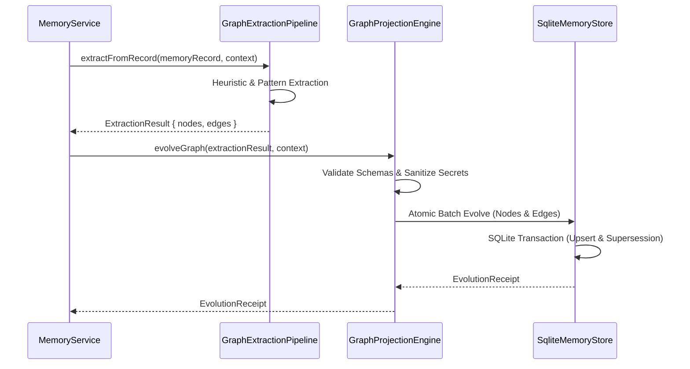

# TASK 066 DISCOVERY REPORT

## Sprint 3 Milestone 2 (S3-02) — Real-Time Graph Evolution, Temporal Knowledge Graph & Governed Mutations

**Document Type**: Engineering Discovery & Architecture Specification  
**Task ID**: Task 066  
**Milestone**: Sprint 3 Milestone 2 (`S3-02`)  
**Baseline Commit**: `c1fc9c14956c1578b074ca3c85d1351a5842b0e9`  
**Author**: NexusOS Core Architecture Team  
**Status**: DISCOVERY COMPLETE — Awaiting Implementation Authorization

---

## 1. Canonical Task Identity

The authoritative identity for Task 066 is:
**`CANDIDATE S3-02: Real-Time Graph Evolution — Streaming Memory Writes to Knowledge Graph`**

As established in `docs/SPRINT_3_READINESS_AND_BACKLOG.md` §2 and sequenced by `docs/task_065_discovery_report.md` §4 (Candidate D), Task 066 builds directly upon the completion of Sprint 3 Milestone 1 (`S3-01` / Task 065: Local-AI Model Manifest, Secure Artifact Lifecycle & Benchmarking) and the persistent SQLite knowledge graph foundation established in Task 062.

---

## 2. Baseline

- **Current Repository HEAD**: `c1fc9c14956c1578b074ca3c85d1351a5842b0e9`
- **Release State**: Task 065 Phase 1, Phase 2, and Phase 3 are completely closed, verified, and CI green (GitHub Actions Run `34507634578`).
- **Subsystem Foundation**:
  - `packages/contracts/src/memory/graph.ts`: Defines `MemoryGraphNodeSchema`, `MemoryGraphEdgeSchema`, `MemoryGraphQueryRequestSchema`, and `MemoryGraphQueryResponseSchema`.
  - `services/backend/src/memory/graph-projection-engine.ts`: Implements `GraphProjectionEngine` with manual `upsertNode`, `upsertEdge`, `query`, and `revokeProjectionsForMemory`.
  - `services/backend/src/memory/sqlite-memory-store.ts`: Implements persistent `graph_nodes` and `graph_edges` tables with WAL mode, composite primary keys `(tenant_id, workspace_id, id)`, and atomic cascade tombstoning.
  - `apps/web-dashboard/src/main.ts`: Visualizes nodes and edges via accessible SVG and tabular views.

---

## 3. Roadmap Evidence

### 3.1 Primary Roadmap Authority: `docs/SPRINT_3_READINESS_AND_BACKLOG.md`

Section 2 explicitly defines `CANDIDATE S3-02`:

- **Depends on**: Task 062 (`GraphProjectionEngine`, `SqliteMemoryStore`)
- **Rationale**: The Sprint 2 Knowledge Graph engine supports write-on-demand but does not automatically derive graph nodes/edges from new `MemoryRecord` content.
- **Sprint 3 Objectives**:
  1. Implement entity/concept extraction from memory content (heuristic/rule-based and metadata-driven extraction).
  2. Automatically upsert `ENTITY`, `CONCEPT`, and `EVENT` nodes from newly written memory records.
  3. Derive edges from co-occurrence or explicit relationship annotations in memory metadata.
  4. Update the Dashboard Knowledge Graph view to show live graph evolution as memories are written.
- **Entry Criteria**:
  - Entity extraction strategy selected (rule-based heuristic with optional embedding/local-AI hooks).
  - `GraphProjectionEngine.deriveFromRecord()` designed and contract-specced.

### 3.2 Engineering Design Documents (EDDs)

- **`docs/EDDs/NexusOS_AI_Runtime_Engineering_Design_Document_EDD.md` §14.4 (AI Runtime Knowledge Graph / ARKG)**:
  - "The AI Runtime Knowledge Graph (ARKG) is a derived, non-canonical, access-filtered graph representing relationships among tasks, goals, capabilities, agents, models, workflows, evidence, failures, recoveries, knowledge, and policy artifacts."
  - "Scope & guarantees: ARKG derives its data from authoritative event and reference sources... It preserves provenance, confidence, time/version metadata, and tenant/workspace isolation. ARKG MUST NOT become a source of authority or bypass Memory, Backend, Policy, Artifact, Registry, or Audit ownership."
- **`docs/EDDs/NexusOS_Experience_Platform_Engineering_Design_Document_EDD.md` §10 (Knowledge Graph)**:
  - "Every node/edge has source provenance, confidence, timestamp/version, and relationship type. Low-confidence inferred relationships are visually and textually distinct from verified links. Deletion/revocation events remove eligible graph projections immediately from the user session and trigger a refresh marker."

---

## 4. Current Graph Architecture

```mermaid
flowchart TD
    subgraph Client Layer
        WD[Web Dashboard /api/client.ts]
        API[External HTTP Clients]
    end

    subgraph Backend Routing & Controller
        MR[memory-routes.ts: POST /v1/memory/graph/query]
        MC[memory-controller.ts: queryGraph()]
        MS[memory-service.ts: queryGraph(), upsertGraphNode(), upsertGraphEdge()]
    end

    subgraph Core Engine Layer
        GPE[graph-projection-engine.ts: GraphProjectionEngine]
        RF[redaction-filter.ts: assertNoSecrets()]
    end

    subgraph Persistence Layer
        SMS[sqlite-memory-store.ts: SqliteMemoryStore]
        GN[(Table: graph_nodes)]
        GE[(Table: graph_edges)]
    end

    WD --> MR
    API --> MR
    MR --> MC
    MC --> MS
    MS --> GPE
    GPE --> RF
    GPE --> SMS
    SMS --> GN
    SMS --> GE
```

### 4.1 Node Data Model (`packages/contracts/src/memory/graph.ts`)

```typescript
export interface MemoryGraphNode {
  id: string;
  tenantId: string;
  workspaceId: string;
  nodeType: MemoryGraphNodeType; // ENTITY, CONCEPT, TASK, WORKSPACE, DECISION, ARTIFACT, ERROR_PATTERN
  label: string;
  memoryRecordId?: string;
  properties: Record<string, unknown>;
  confidence: number; // 0.0 to 1.0
  createdAt: string; // ISO-8601
}
```

### 4.2 Edge Data Model (`packages/contracts/src/memory/graph.ts`)

```typescript
export interface MemoryGraphEdge {
  id: string;
  tenantId: string;
  workspaceId: string;
  sourceNodeId: string;
  targetNodeId: string;
  edgeType: MemoryGraphEdgeType; // DERIVED_FROM, RELATES_TO, SUPERSEDES, DECIDED_IN, EXECUTED_BY, RESOLVED_BY
  weight: number; // >= 0
  confidence: number; // 0.0 to 1.0
  properties: Record<string, unknown>;
  provenance: MemoryProvenance;
  createdAt: string; // ISO-8601
}
```

### 4.3 SQLite Storage Model (`services/backend/src/memory/sqlite-memory-store.ts`)

- **`graph_nodes`**: `(tenant_id, workspace_id, id)` composite primary key, index on `(tenant_id, workspace_id, memory_record_id)`.
- **`graph_edges`**: `(tenant_id, workspace_id, id)` composite primary key, indexes on `source_node_id` and `target_node_id`.

---

## 5. Existing Capabilities

1. **Manual Node & Edge Upsert**: `upsertNode()` and `upsertEdge()` accept explicit nodes and edges via service calls.
2. **Multi-Tenant & Workspace Partitioning (058-SEC-03, 062-SEC-01)**: All operations enforce strict tenant and workspace boundaries. Cross-tenant reads and mutations fail closed with `MemorySecurityViolationError`.
3. **Bounded Graph Traversal (062-SEC-05)**: `queryGraph()` executes breadth-first traversal strictly clamped to `maxDepth <= 4` and `limit <= 100`.
4. **Cycle Immunity (RB-020, RB-024)**: Bounded traversal tracks a `visitedNodes` set and `visitedEdgeIds` set, preventing infinite loops on cyclic graphs.
5. **Secret Redaction (058-SEC-07, 062-SEC-04)**: Labels and properties are scanned using `RedactionFilter.scanForSecrets()` before persistence.
6. **Atomic Cascade Revocation (058-SEC-05, 062-SEC-03)**: When a memory record is tombstoned in `SqliteMemoryStore`, `revokeGraphForMemoryInternal()` atomically deletes all derived nodes and connected edges in the same database transaction.

---

## 6. Confirmed Gaps

| Capability                             | Current State                                                                                    | S3-02 Requirement                                                                                                                                                    | Severity / Gap         |
| :------------------------------------- | :----------------------------------------------------------------------------------------------- | :------------------------------------------------------------------------------------------------------------------------------------------------------------------- | :--------------------- |
| **Automatic Graph Derivation**         | Completely manual. Writing a `MemoryRecord` does **not** update the graph.                       | Memory creation/updates must automatically project `ENTITY`, `CONCEPT`, `TASK`, and `EVENT` nodes and semantic edges.                                                | **CRITICAL GAP**       |
| **Entity / Concept Extractor**         | Does not exist. No parser or extractor is wired.                                                 | Deterministic rule-based/regex/metadata extractor (`GraphExtractionPipeline`) capable of extracting named entities, concepts, and relationships from memory content. | **CRITICAL GAP**       |
| **Temporal Validity Window**           | None. Nodes and edges only have a static `createdAt`.                                            | Add `validFrom`, `validTo`, `isCurrent`, and `supersededBy` to represent evolving facts over time.                                                                   | **ARCHITECTURAL GAP**  |
| **Optimistic Versioning**              | `MemoryRecord` has `version`, but `MemoryGraphNode` and `MemoryGraphEdge` do not.                | Nodes and edges require monotonic `version` integers to prevent race conditions during concurrent graph evolution.                                                   | **CONCURRENCY GAP**    |
| **Node Provenance**                    | `MemoryGraphEdge` has `provenance`, but `MemoryGraphNode` only has an optional `memoryRecordId`. | `MemoryGraphNode` requires full `MemoryProvenance` matching edges to satisfy 056-SEC-04 and ARKG lineage.                                                            | **DATA INTEGRITY GAP** |
| **Fact Reconciliation / Supersession** | Overwrites in place via `ON CONFLICT DO UPDATE`. Historical state is lost.                       | Governed supersession: when a new fact invalidates an older one, close `validTo` on the old fact and emit a `SUPERSEDES` edge.                                       | **SEMANTIC GAP**       |
| **HTTP Mutation Endpoints**            | Only `POST /v1/memory/graph/query` exists. No mutation endpoints exist on HTTP router.           | Dedicated governed mutation routes (`POST /v1/memory/graph/evolve`, `POST /v1/memory/graph/nodes`, `POST /v1/memory/graph/edges`).                                   | **API GAP**            |

---

## 7. Graph Data Provenance & Critical Authority Separation

### 7.1 Data Provenance Hierarchy

Graph elements derive from multiple distinct sources with varying trust levels:

1. **`USER_EXPLICIT`** (Highest confidence, verified): Directly authored facts or user corrections. Default confidence: `1.0`.
2. **`TASK_EXECUTION`** (High confidence, verified with receipt): Extracted from verified task execution receipts and tool outputs. Default confidence: `0.95`.
3. **`CONVERSATION`** (Medium-high confidence): User-agent conversational statements. Default confidence: `0.85`.
4. **`SYSTEM_SYNTHESIS`** (Medium confidence, inferred): Autonomous summaries, clustering, or heuristic co-occurrences. Default confidence: `0.70`.
5. **`PLUGIN`** (Bounded confidence, quarantined unless verified): Facts proposed by third-party extensions. Default confidence: `<= 0.60`.

### 7.2 The Critical Authority Separation Rule

> **CRITICAL ARCHITECTURAL INVARIANT (058-SEC-01 / 062-SEC-07 / 066-SEC-01)**:  
> **Graph state is strictly DATA/PROJECTION, NEVER an authority or execution grant.**

Graph elements MUST NOT:

- Function as a cryptographic execution lease.
- Authorize tool execution or policy overrides.
- Provide capability grants or elevate agent privilege.
- Bypass tenant, workspace, or classification boundaries.
- Substitute for policy evaluation in `PolicyEvaluator` or lease validation in `ExecutionLeaseBoundary`.

Any retrieval from the knowledge graph injected into prompts or planner context must be encapsulated within inert delimiters:

```html
<!-- BEGIN_UNTRUSTED_GRAPH_CONTEXT -->
... inert graph text ...
<!-- END_UNTRUSTED_GRAPH_CONTEXT -->
```

---

## 8. Temporal / Versioned Semantics

To enable true "Graph Evolution" rather than destructive in-place overwrites, graph elements require temporal validity semantics:

### 8.1 Time Semantics

- **Assertion Time (`createdAt`)**: Wall-clock UTC ISO-8601 timestamp representing when the node/edge was committed into the graph.
- **Event / Validity Time (`validFrom`, `validTo`)**:
  - `validFrom`: When the fact became true in the real world (defaults to `createdAt` or memory event timestamp).
  - `validTo`: When the fact was superseded, invalidated, or expired (`null` for currently active facts).
  - `isCurrent`: Boolean flag (`true` if `validTo === null`, `false` otherwise) for rapid indexing of current worldview.

### 8.2 Monotonic Versioning

- Both `MemoryGraphNode` and `MemoryGraphEdge` must include `version: number` (initial value `1`, monotonically incrementing on update).
- Updates must support optimistic concurrency via `expectedVersion`.

---

## 9. Mutation & Evolution Model

### 9.1 The Governed Graph Evolution Pipeline

When a `MemoryRecord` is created or updated, the system triggers the governed evolution pipeline:



### 9.2 Permitted Mutation Operations

1. **`ADD_NODE`**: Insert a newly observed entity or concept.
2. **`UPDATE_NODE`**: Update properties, confidence, or labels with version bump.
3. **`ADD_EDGE`**: Connect two existing or newly created nodes with semantic edge.
4. **`SUPERSEDE_EDGE`**: Invalidate prior relationship (`validTo = now()`, `isCurrent = false`) and establish new edge with `SUPERSEDES` link.
5. **`SUPERSEDE_NODE`**: Mark prior node superseded by newer canonical entity.
6. **`PRUNE_EDGES`**: Remove disconnected dangling edges during compaction.

---

## 10. Conflict & Fact Reconciliation Findings

When contradictory facts arrive (e.g., Fact A: "User prefers Dark Mode" vs. Fact B: "User prefers Light Mode"):

1. **Explicit Conflict Representation**: The engine does NOT guess or destructively overwrite. Both facts can coexist historically.
2. **Temporal Supersession**:
   - The newer verified fact (Fact B) receives `validFrom = now()`, `isCurrent = true`.
   - The previous fact (Fact A) is marked `validTo = now()`, `isCurrent = false`.
   - A directional edge `Fact B --[SUPERSEDES]--> Fact A` is recorded, citing the source memory record and timestamp.
3. **Confidence-Weighted Resolution**: If two unverified facts conflict simultaneously, the graph preserves both edges with their respective `confidence` scores and links them via a `CONFLICTS_WITH` or `RELATES_TO` edge with metadata `{ conflict: true }`.
4. **Default Query Behavior**: Unless explicitly querying historical time (`asOf` timestamp), graph traversal queries filter for `isCurrent = true` by default.

---

## 11. Forgetting & Revocation

### 11.1 Preserving Atomic Forgetting Guarantees (058-SEC-05, 062-SEC-03)

The current atomic cascade in `SqliteMemoryStore.tombstone()`:

1. Updates memory record status to `TOMBSTONED`.
2. Deletes vector embedding row from `vector_embeddings`.
3. Calls `revokeGraphForMemoryInternal()`, which deletes all nodes with `memory_record_id = ?` and all edges connected to those nodes.
4. Marks derived compressions tombstoned.
5. Executes inside `BEGIN IMMEDIATE ... COMMIT/ROLLBACK`.

### 11.2 Hardening for Graph Evolution

- **Orphan Edge Prevention**: Deleting a node MUST delete all incoming and outgoing edges (`source_node_id = ? OR target_node_id = ?`) in the exact same transaction.
- **Tombstoned Fact Resurrection Guard**: A graph evolution operation triggered after memory tombstoning MUST fail closed if the referenced `memoryRecordId` is already tombstoned.
- **Historical Query Leakage Guard**: When a memory atom is forgotten, its graph nodes and edges must be **physically removed** from both current and historical views. Forgetting overrides historical preservation.

---

## 12. Security Threat Model

| Threat ID    | Threat Description                        | Attack Vector / Scenario                                                                   | Architectural Control                                                                                                           |
| :----------- | :---------------------------------------- | :----------------------------------------------------------------------------------------- | :------------------------------------------------------------------------------------------------------------------------------ |
| **T-066-01** | Cross-tenant graph contamination          | Attacker attempts to link a node in Tenant A to a node in Tenant B.                        | Multi-tenant composite primary key `(tenant_id, workspace_id, id)` and context matching checks (`058-SEC-03`).                  |
| **T-066-02** | Cross-workspace graph bleeding            | Attacker attempts to traverse or query graph across workspaces within same tenant.         | Strict workspace scoping in all queries and updates (`062-SEC-01`).                                                             |
| **T-066-03** | Graph state becoming execution authority  | Attacker injects a synthetic node claiming "Role: SuperAdmin" or "Lease: Granted".         | Hard architectural boundary: Graph is DATA/PROJECTION, NEVER authority (`062-SEC-07`, `066-SEC-01`).                            |
| **T-066-04** | Prompt injection via graph context        | Attacker crafts a node label containing jailbreak delimiters (`</retrieved_context>`).     | Delimiter escaping via `formatRetrievedContext()` (`062-SEC-07`).                                                               |
| **T-066-05** | Credential and secret persistence         | Attacker submits memory containing API keys or tokens that get extracted into graph nodes. | Mandatory `RedactionFilter.assertNoSecrets()` on all extracted node labels and edge properties (`058-SEC-07`).                  |
| **T-066-06** | Graph poisoning via low-confidence claims | Malicious plugin floods graph with low-confidence false claims.                            | Strict minimum confidence thresholds, unverified plugin claims capped at `<= 0.60`, filtered by `minConfidence` (`066-SEC-05`). |
| **T-066-07** | Traversal explosion & DoS                 | Attacker queries dense graph with deep traversal to exhaust backend memory and CPU.        | Hard bounds: `maxDepth <= 4`, `limit <= 100` (`062-SEC-05`, RB-024).                                                            |
| **T-066-08** | Infinite loops via cyclic relationships   | Circular edges (`A -> B -> C -> A`) causing non-terminating traversal.                     | BFS traversal maintains `visitedNodes` and `visitedEdgeIds` sets (`062-SEC-05`).                                                |
| **T-066-09** | Orphan edges after node deletion          | Node is deleted but incident edges remain, pointing to non-existent nodes.                 | Atomic cascading deletion in `revokeGraphForMemoryInternal()` (`058-SEC-05`).                                                   |
| **T-066-10** | Stale fact resurrection                   | Overwriting an updated fact with stale cached state during concurrent writes.              | Optimistic concurrency control via monotonic `version` numbers (`066-SEC-04`).                                                  |
| **T-066-11** | Unbounded graph growth                    | High-frequency memory writes bloating the SQLite database indefinitely.                    | Workspace node/edge limits (default max 5,000 nodes, 20,000 edges per workspace) and compaction policies.                       |
| **T-066-12** | Extraction ReDoS / CPU hog                | Malicious memory text triggering exponential backtracking in regex extractors.             | Length limits on extraction inputs (max 32KB per record) and bounded non-backtracking regular expressions.                      |
| **T-066-13** | Forged provenance on graph mutations      | Mutating an edge with fake creator or unverified system synthesis.                         | Enforcing `MemoryProvenanceSchema` validation with caller context binding (`056-SEC-04`).                                       |
| **T-066-14** | Leaking forgotten data via history        | Retaining historical graph projections after source memory record has been forgotten.      | Cascade tombstoning physically purges both current and historical graph rows tied to forgotten memory (`058-SEC-05`).           |

---

## 13. Proposed Security Invariants

We propose a formal set of eight testable security invariants for Task 066:

- **`066-SEC-01: Graph Authority Separation`**  
  Graph state is strictly data and projection. No graph node or edge attribute can establish capability grants, policy bypass, or cryptographic execution lease authority.
- **`066-SEC-02: Tenant and Workspace Boundary Integrity`**  
  All graph mutations (nodes, edges, evolutions) must reject mismatched tenant or workspace contexts fail-closed. No edge can connect nodes across different tenants or workspaces.
- **`066-SEC-03: Secret and Credential Sanitization`**  
  All node labels, edge properties, and extracted concepts must pass `RedactionFilter.assertNoSecrets()` before persistence. Any detected credential immediately aborts the evolution transaction.
- **`066-SEC-04: Monotonic Versioning & Supersession Durability`**  
  Graph node and edge mutations must increment monotonic version numbers and validate optimistic concurrency (`expectedVersion`). Superseded facts must record `validTo` and emit a `SUPERSEDES` edge without silent destructive overwrite.
- **`066-SEC-05: Extraction Input Bounds & ReDoS Immunity`**  
  Graph extraction pipelines must enforce strict payload size bounds (maximum 32 KB per memory record) and deterministic regex patterns to prevent denial of service.
- **`066-SEC-06: Atomic Cascade Forgetting & Revocation`**  
  Tombstoning a memory record must atomically revoke all derived nodes and connected edges in the same SQLite transaction. Forgotten facts must never appear in current or historical traversals.
- **`066-SEC-07: Bounded Traversal and Resource Protection`**  
  Traversal depth must not exceed 4 (`maxDepth <= 4`), and query result limits must not exceed 100 (`limit <= 100`). Cycle detection must ensure zero duplicate node evaluations.
- **`066-SEC-08: Provenance Fidelity & Unverified Isolation`**  
  Every graph edge and node mutation must carry valid `MemoryProvenance`. Autonomous or unverified extractions must be capped in confidence (`<= 0.70`) and visibly distinguishable from verified human or receipt evidence.

---

## 14. Persistence / SQLite Impact

### 14.1 Schema Evolution

The SQLite schema for `graph_nodes` and `graph_edges` in `services/backend/src/memory/sqlite-memory-store.ts` requires additive migration:

```sql
-- Migration: Add temporal validity, versioning, and provenance to graph_nodes
ALTER TABLE graph_nodes ADD COLUMN version INTEGER NOT NULL DEFAULT 1;
ALTER TABLE graph_nodes ADD COLUMN updated_at TEXT;
ALTER TABLE graph_nodes ADD COLUMN valid_from TEXT;
ALTER TABLE graph_nodes ADD COLUMN valid_to TEXT;
ALTER TABLE graph_nodes ADD COLUMN is_current INTEGER NOT NULL DEFAULT 1;
ALTER TABLE graph_nodes ADD COLUMN provenance TEXT NOT NULL DEFAULT '{}';

CREATE INDEX IF NOT EXISTS idx_graph_nodes_current
  ON graph_nodes (tenant_id, workspace_id, is_current);

-- Migration: Add temporal validity and versioning to graph_edges
ALTER TABLE graph_edges ADD COLUMN version INTEGER NOT NULL DEFAULT 1;
ALTER TABLE graph_edges ADD COLUMN updated_at TEXT;
ALTER TABLE graph_edges ADD COLUMN valid_from TEXT;
ALTER TABLE graph_edges ADD COLUMN valid_to TEXT;
ALTER TABLE graph_edges ADD COLUMN is_current INTEGER NOT NULL DEFAULT 1;

CREATE INDEX IF NOT EXISTS idx_graph_edges_current
  ON graph_edges (tenant_id, workspace_id, is_current);
```

### 14.2 Backward Compatibility

- Existing SQLite rows will naturally default to `version = 1`, `is_current = 1`, `valid_from = created_at`, `valid_to = NULL`.
- No destructive table drops or recreations.
- Fully compatible with existing SQLite WAL mode transactions.

---

## 15. Dashboard Compatibility

### 15.1 Web Dashboard Contract Stability (`apps/web-dashboard/src/main.ts`)

The Web Dashboard consumes graph queries via `DashboardAPIClient.queryGraph()`:

- Renders nodes as SVG circles with labels and type-based coloring (`getNodeColor`).
- Renders edges as SVG connecting lines with directional arrows and type badges.
- Provides an accessible tabular view (`renderGraphTable`).

### 15.2 Additive Field Guarantees

- All existing fields on `MemoryGraphNode` (`id`, `tenantId`, `workspaceId`, `nodeType`, `label`, `properties`, `confidence`, `createdAt`) and `MemoryGraphEdge` are preserved.
- New fields (`version`, `validFrom`, `validTo`, `isCurrent`, `provenance`) are optional or have defaults in the contract schemas.
- By default, backend `queryGraph` returns `isCurrent = true` records, ensuring the dashboard does not render overlapping or superseded historical ghost nodes unless a timeline slider is explicitly used.

---

## 16. Contract Delta

Proposed additive updates to `packages/contracts/src/memory/graph.ts`:

1. **Extend `MemoryGraphNodeSchema`**:
   - `version: z.number().int().positive().default(1)`
   - `updatedAt: z.string().datetime().optional()`
   - `validFrom: z.string().datetime().optional()`
   - `validTo: z.string().datetime().optional()`
   - `isCurrent: z.boolean().default(true)`
   - `provenance: MemoryProvenanceSchema.optional()`
2. **Extend `MemoryGraphEdgeSchema`**:
   - `version: z.number().int().positive().default(1)`
   - `updatedAt: z.string().datetime().optional()`
   - `validFrom: z.string().datetime().optional()`
   - `validTo: z.string().datetime().optional()`
   - `isCurrent: z.boolean().default(true)`
3. **Extend `MemoryGraphQueryRequestSchema`**:
   - `asOf: z.string().datetime().optional()` (enables point-in-time historical traversal)
   - `includeSuperseded: z.boolean().default(false)`
4. **New Contract: `GraphEvolutionEventSchema` & `GraphEvolutionReceiptSchema`**:
   - Captures atomic batch changes applied during a graph evolution run.

---

## 17. Exact File Plan

### A. Contracts (`packages/contracts/`)

- **Modify**: `packages/contracts/src/memory/graph.ts` (additive extension of node, edge, and query schemas with temporal and versioning fields).
- **Modify**: `packages/contracts/tests/memory/graph-contracts.test.ts` (unit tests validating new schemas, defaults, and boundary constraints).

### B. Backend Engine & Persistence (`services/backend/`)

- **Create**: `services/backend/src/memory/graph-extractor.ts` (deterministic entity, concept, and relationship extraction pipeline from memory content).
- **Modify**: `services/backend/src/memory/graph-projection-engine.ts` (add `evolveFromMemoryRecord()`, batch mutation, supersession logic).
- **Modify**: `services/backend/src/memory/types.ts` (update `IGraphProjectionEngine`, add `IGraphExtractor`, `GraphEvolutionReceipt`).
- **Modify**: `services/backend/src/memory/sqlite-memory-store.ts` (apply schema additions, update `saveGraphNode`/`saveGraphEdge`, support `asOf`/`includeSuperseded`).
- **Modify**: `services/backend/src/memory/memory-service.ts` (hook `deriveAndEvolveGraph` into `createMemory` and `updateMemory`).
- **Modify**: `services/backend/src/memory/memory-controller.ts` and `memory-routes.ts` (expose `POST /v1/memory/graph/evolve` endpoint).

### C. Testing Suites (`tests/` & `services/backend/tests/`)

- **Create**: `services/backend/tests/memory/graph-extractor.test.ts` (extraction accuracy, ReDoS protection, secret blocking).
- **Create**: `tests/hardening/graph-evolution-security.test.ts` (comprehensive validation of `066-SEC-01` through `066-SEC-08`).
- **Create**: `tests/vertical-slice/graph-evolution-vertical-slice.test.ts` (end-to-end memory write -> graph evolution -> query -> supersession -> forgetting).
- **Modify**: `services/backend/tests/memory/graph-projection.test.ts` (regression coverage for versioned/temporal queries).

### D. Files NOT to Touch

- `apps/desktop-agent/**` (desktop agent local runtime is independent; model management closed in Task 065).
- `apps/web-dashboard/**` (dashboard remains stable; uses existing `/v1/memory/graph/query`).
- `packages/plugin-sdk/**` (plugin write capability is deferred to `S3-04`).
- `services/identity/**`, `services/policy/**` (auth and policy contracts must not be touched).

---

## 18. Phase Plan

We recommend a five-phase execution structure:

### Phase 1: Canonical Contracts & Schema Evolution

- Extend `MemoryGraphNodeSchema`, `MemoryGraphEdgeSchema`, and `MemoryGraphQueryRequestSchema`.
- Add unit tests in `packages/contracts/tests/memory/`.
- Apply additive SQLite migrations in `SqliteMemoryStore`.

### Phase 2: Deterministic Extraction Engine (`GraphExtractor`)

- Implement `GraphExtractor` with heuristic entity/concept discovery, co-occurrence edge derivation, and size/ReDoS bounding.
- Enforce secret scanning on all extracted candidate labels and properties.
- Unit test extraction across semantic, task, and episodic memory formats.

### Phase 3: Governed Evolution Pipeline & Supersession

- Implement `GraphProjectionEngine.evolveFromRecord()` and atomic batch mutation.
- Implement supersession mechanics (`validTo`, `isCurrent`, `SUPERSEDES` edge creation).
- Wire evolution hooks into `MemoryService.createMemory()` and `updateMemory()`.

### Phase 4: Atomic Forgetting & Historical Temporal Queries

- Verify that `revokeProjectionsForMemory` atomically removes both current and historical graph elements when a memory record is tombstoned.
- Implement `asOf` point-in-time traversal in `SqliteMemoryStore.queryGraph()`.

### Phase 5: Security Hardening & Vertical Slice Verification

- Deliver `066-SEC-01..08` hardening suite (`tests/hardening/graph-evolution-security.test.ts`).
- Deliver end-to-end vertical slice (`tests/vertical-slice/graph-evolution-vertical-slice.test.ts`).
- Execute all workspace quality gates and CI validation.

---

## 19. Out of Scope

To prevent scope creep and maintain architectural boundaries, the following are explicitly **OUT OF SCOPE** for Task 066:

1. **External Graph Databases**: No Neo4j, RedisGraph, or external graph server daemons. Persistence remains strictly local SQLite via `node:sqlite`.
2. **Autonomous Authority or Execution Grants**: The knowledge graph must never become an authorization engine or policy decision source.
3. **Full NLP/LLM Model Invocation in Extraction**: Extraction must use fast, deterministic heuristic/regex/metadata pipelines. Model inference hooks may exist, but the core pipeline must not depend on external or heavyweight inference models to guarantee sub-millisecond memory writes.
4. **Plugin SDK Memory Write Extensions**: Granting plugins write access to the memory graph belongs strictly to Candidate `S3-04`.
5. **Memory-Informed Replanning**: Feeding the evolved graph into goal decomposition belongs strictly to Candidate `S3-05`.
6. **Web Dashboard Redesign**: The web dashboard will consume current graph data via existing backward-compatible schemas.

---

## 20. Risks & Mitigations

| Risk                                    | Likelihood | Impact   | Mitigation Strategy                                                                                                               |
| :-------------------------------------- | :--------- | :------- | :-------------------------------------------------------------------------------------------------------------------------------- |
| **Write Latency Inflation**             | Medium     | Medium   | Run graph extraction synchronously on small records, with strict 32KB payload limits and deterministic non-backtracking patterns. |
| **Dense Graph Query Stalls**            | Medium     | High     | Maintain hard clamps (`maxDepth <= 4`, `limit <= 100`) and enforce cycle-tracking visited sets.                                   |
| **Orphaned Edges on Partial Tombstone** | Low        | High     | Execute memory tombstone and graph revocation within a single `BEGIN IMMEDIATE ... COMMIT` SQLite transaction.                    |
| **Secret Leakage into Node Labels**     | Low        | Critical | Mandatory fail-closed `RedactionFilter.assertNoSecrets()` on all extracted candidate strings before database insert.              |

---

## 21. Full Exit Condition

Discovery is complete when:

1. Exact authoritative scope for `S3-02` is defined from `docs/SPRINT_3_READINESS_AND_BACKLOG.md` and EDD §14.4.
2. The current graph implementation (`packages/contracts`, `services/backend/src/memory/`) is mapped in detail.
3. Gaps between current point-in-time projection and live streaming evolution are enumerated.
4. Temporal validity, monotonic versioning, and supersession mechanics are specified.
5. Authority separation (`GRAPH IS DATA, NEVER AUTHORITY`) is formalized.
6. A concrete set of eight testable security invariants (`066-SEC-01` through `066-SEC-08`) is defined.
7. An exact file plan and 5-phase implementation plan are articulated.
8. `task_066_discovery_report.md` is written and committed with a clean working tree.

---

## 22. Conclusion

Task 066 (`S3-02`) represents the critical bridge between static memory records and a living, queryable knowledge graph in NexusOS. By introducing deterministic extraction, temporal validity windows, optimistic concurrency, and governed supersession—while rigidly enforcing tenant isolation, secret redaction, atomic forgetting, and the absolute separation of graph data from execution authority—NexusOS can safely evolve its cognitive graph as new experiences and facts arrive.

The discovery phase is complete. The system is ready for Phase 1 execution upon operator approval.
